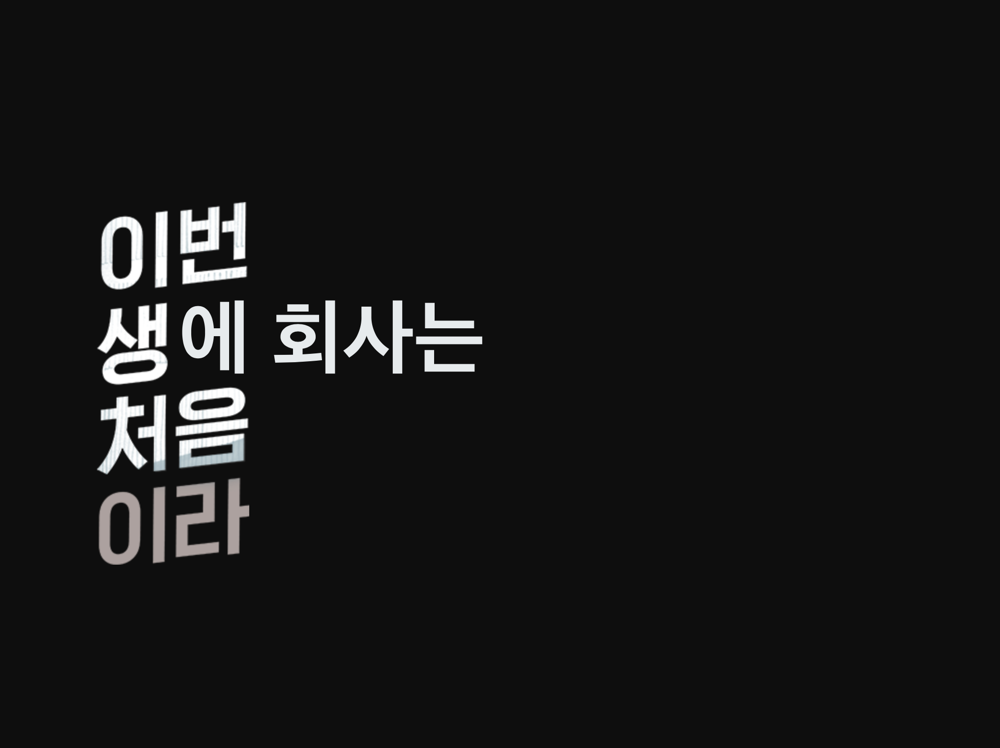
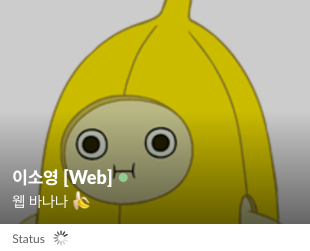
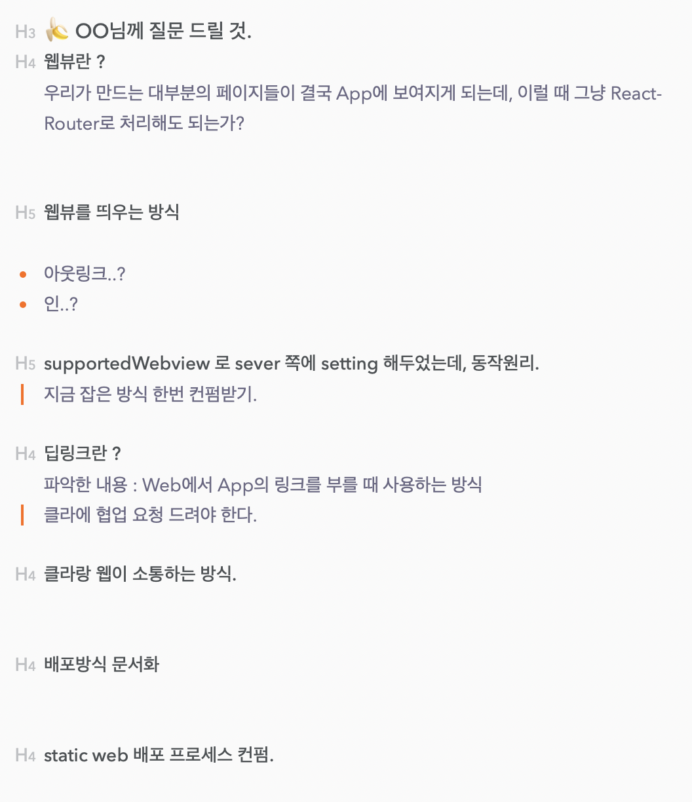
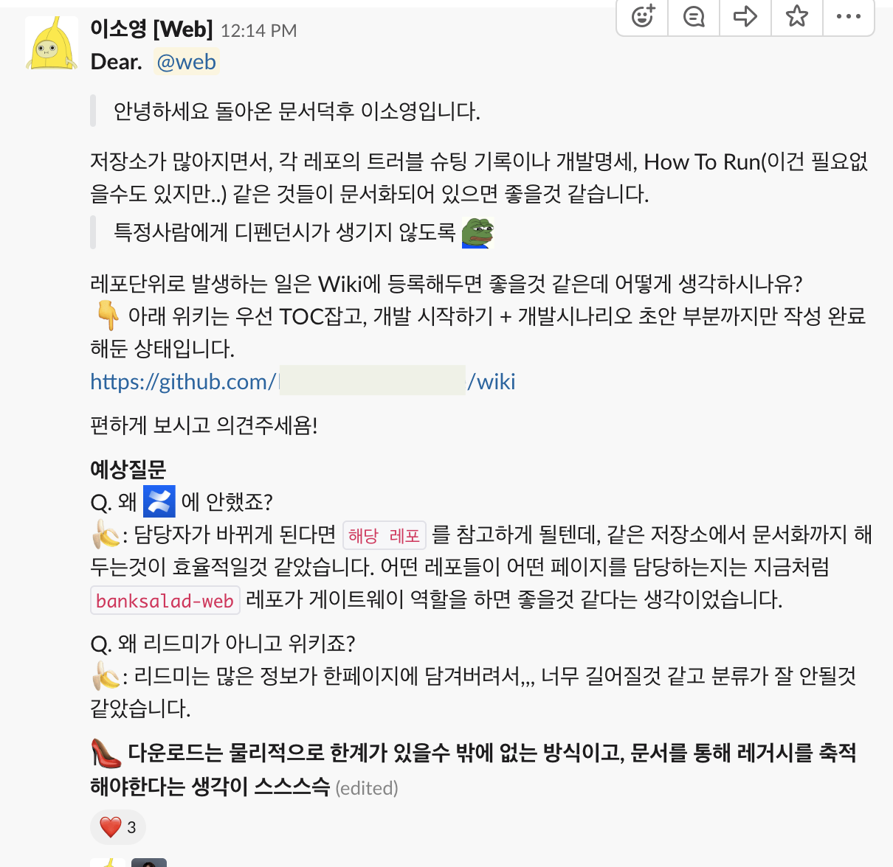
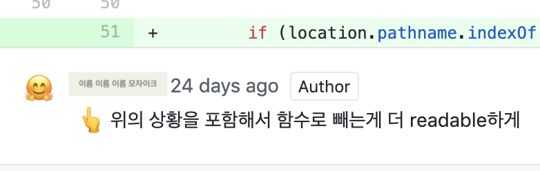
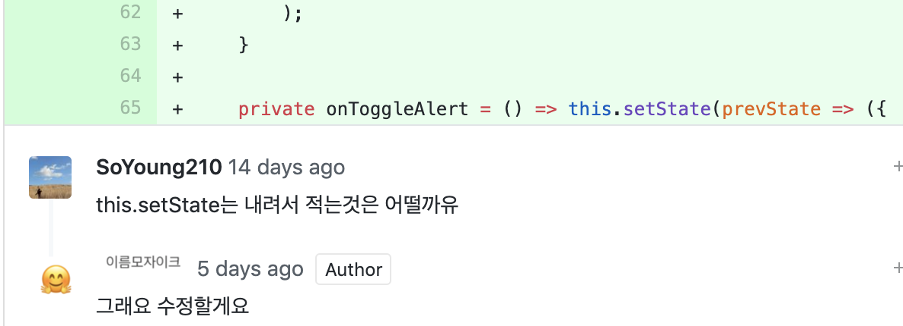
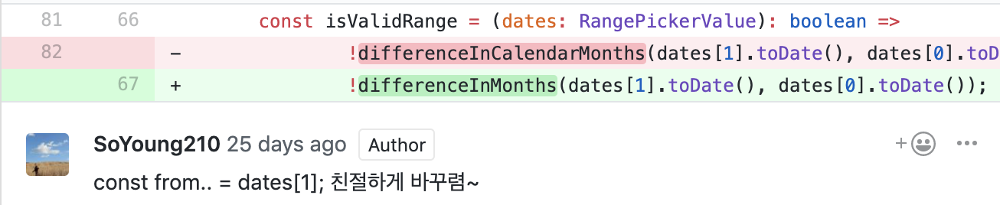
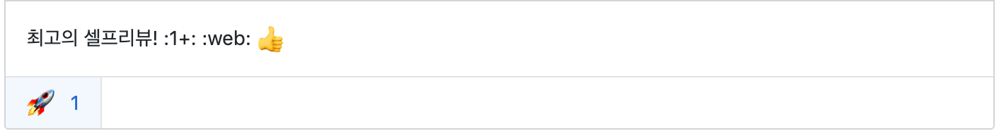

2018년 7월 17일 React 온라인 강의를 시작으로 FrontEnd에 첫 발을 떼고, 2018년 12월 26일 인턴 입사 후 150일 간의 기록을 정리했습니다.

지금은 회사에서 Web팀원으로 함께 일하고 있으며 그간의 여정을 회고하고 FrontEnd 개발자로 한걸음 더 나아가려 합니다.

## 1부 - Communication & Thinking

1. 협업에는 스킬이 필요하다.
2. 개발자는 Product를 만드는 사람이다.
3. 문서화는 선택이 아니다.
4. 나의 코드는 팀의 코드이다.
5. 늘 다른 시각이 필요하다. (feat. 관점 vs 관점으로 이야기하기.)

## 2부 - Tech

1. Clean Architecture
2. TypeScript
3. RxJS

이 글은 1부와 2부로 나누어 진행되며, 1부에서는 `Communication & Thinking` 부분에 대해 글을 적었습니다. 😀

## Communication & Thinking



회사에서 처음 일하면서, 정말 모든 것이 새로웠다.
30명이 넘는 기술부문, 5명의 웹팀을 만나면서 추상적으로 중요하다고 생각했던 **협업** 에 대해 많은 생각을 할 수 있었다.

<div>

</div>

### 🍌 협업에는 스킬이 필요하다.

하나의 Product를 만드는 데에는 많은 부문의 노력이 필요하다.  
view, api, infra등 실제 개발부터 배포까지 많은 사람들의 손길이 필요하다.

이 과정에서 제일 중요하다고 생각했던 포인트는 **'동료와 나의 시간은 모두 소중하다.'** 이다.  


주 5일, 하루 8시간을 회사에서 일한다고 가정했을 때 우리는 할 일이 참 많다.

1. 같은 프로젝트를 하는 사람들끼리의 계획 회의
2. 개발
3. 코드리뷰
4. Team(각 기술별) 회의

일을 잘하려면, 스킬이 필요하다고 생각했다.

#### `Skill 1. 준비된 질문`

개발을 하는 과정에서, 많은 질문이 필요할 수 있다.

> 🍌 : 엇, 이부분 OO님이 작업하셨던적이 있네! 물어봐야지  
> 🍌 : 이번엔 이렇게 이렇게 배포해야 하는데 이슈가 있군…  
> 🍌 : api response가… 잘 이해가 안되네!

나는 어떤 방법을 시도해보았고, 어떤 이유로 실패했는지 알고 있지만 동료는 그렇지 않다.  
내가 만난 문제 상황이 무엇인지, 내가 해결하고자 하는 상황이 무엇인지 다짜고짜 묻는 질문으로는 이해할 수 없다.  
**추상적 질문에는 추상적 답변만이 있다.**

질문할 때, 스스로 아래와 같은 가이드라인을 세우고 지키려 한다.

<div style="background-color: #f6ffed; padding-top: 10px; padding-bottom: 10px">

1. 질문은 두괄식으로.  
   👉 지금 구현하고 있는 부분, 구현하고자 하는 End Picture.

2. 구현하고 있는 과정에서 고려해야 하는 부분.  
   👉 외부 라이브러리, 종속성 등.

3. 문제 상황을 해결하기 위해 A라는 방법을 시도해보았고, A-1 이라는 오류를 만나게 됨.

4. 3번을 바탕으로 B방법을 추측하고 있고, 그 근거는 B-1임.

5. 이런 방향으로 가도 괜찮을지? 아니면 다른 방법을 고려해보아야 할지?

</div>

이런 질문을 한다면 상황은 명료해 진다.

😎 **My 동료 says**

1. 오! 좋아요! 저는 비슷한 상황을 만나보았는데, 같은 방법으로 접근했습니다.  
   과정중에 혹시 OOO 이슈가 있을 수 있으니 참고하실 만한 링크나 레포를 알려드릴게요!

2. 흐음 `B-1` 의 근거가 조금 잘못된것 같습니다. 새롭게 C 로 접근해야 할것 같아요.

내가 모르는 것과 아는 것을 명확히 했을 때, 비로소 ‘모르는 것’에 대한 배움을 빠르게 얻을 수 있다.

#### `Skill 2. 효율적인 회의`

Skill1에서 언급한 `한정된 시간` 과 같은 맥락으로, 회의에도 스킬이 필요하다.
내가 회의를 주최하는 상황, 회의에 참여하는 두 가지 상황으로 나누어서 정리해볼 수 있다.

#### 회의를 주최하는 상황.

제일 중요한 것은, 이번 회의를 통해 확정짓고 싶은 사항이 무엇인가 하는 것이다.  
이번 회의를 통해 어떤 부분들을 이야기할 것이고 이를 통해 어떤 점들을 확정짓고 싶은지에 대한 agenda가 준비되어야 한다.

새롭게 작업하는 부분에 대해서, 경험이 있던 동료분께 회의를 요청드렸고, 나는 아래와 같은 질문지를 준비했다.



회의는 OO님께서 질문에 답을 해주는 식으로 진행되었고, 위 회의를 통해 개발하는 과정에서 필요했던 회색영역을 지우는 목적을 달성했다.

> 질문지가 없었다면, “음.. 또 무엇을 모르실까요?” 등의 질문 발굴과정이 있었을 것이다.

#### 회의에 참여하는 상황.

회의가 열린 목적이 있을것이다. **동료의 시간은 소중하기 때문에** 회의에 참여하는 구성원으로서 미리 agenda에 대한 내 생각을 정리하자.

회의 시간이 되어서 생각하는 것은 깊이 생각하지 못할 가능성이 크고, 나의 의견이 번복되어야 하는 좋지 않은 상황으로 이어질 수 있다.

#### `Skill 3. 부드러운 언어.`

입사 전에도 중요하다고 생각했지만, 입사 후에 더 중요하다고 생각한 포인트이다. 회사에서는 주로 Slack으로 대화하고, GitHub을 통해 코드리뷰를 하고 있다. 사람들의 배경지식은 다양하고, 대화 과정에서(특히 text는 더더욱) 내 의도가 왜곡될 수 있다. 모든 대화는 불필요하게 감정의 영역으로 빠져서는 안된다.

1. 의견을 제안할때에는, '모든 것은 나의 생각이다. 나의 생각은 틀릴 수 있다.' 를 전제로 하자.  
   코드리뷰 과정이나 의견을 제시할때, 당연히 내 의견이 틀릴수도 있고, 더 좋은 의견이 있을 수 있다. 또, 동료가 그렇게 생각한데에는 충분히 그럴만한 이유가 있을 수 있음이 기본 전제가 되어야 한다.

> 🍌: 제가 생각하기에는 ~~ 이러할것 같은데, 😎님 생각은 어떠신가요?  
> 🍌: 앗! 저는 ~~ 이렇게 알고 있었는데 😎님이 이렇게 적으신 이유가 궁금합니다! 혹시 제가 잘못 알고 있다면 알려주시면 감사하겠습니다.

2. 그럼에도 불구하고, 명확하게.  
   텍스트건, 구두 설명이건, 장황한 흐름은 이해하기 힘들다. 읽는(듣는) 사람으로 하여금 피로감을 느끼게 할 수 있다. 강조하고 싶은 부분은 강조하고, 항상 TOC(Table Of Contents) 를 명확히 하려고 한다.

> `Example) 문자로 전달하는 상황`  
> **전달하고자 하는 내용1**  
> 전달하려는 내용에 대한 설명설명. 잘 읽히는 문장이 되도록  
> **전달하고자 하는 내용2**  
> 전달하려는 내용에 대한 설명설명. 잘 읽히는 문장이 되도록

> `Example) 대화하는 상황`  
> 음 우선, **1부분, 2부분, 3부분**에 대해서 말씀드리고 싶습니다. ~

협업의 가장 중요한 부분은 ‘상호 존중’ 이라고 생각한다.

### 🍌 개발자는 Product를 만드는 사람이다.

개발자는 단순히 코드를 짜는 사람이 아니라, Product를 만드는 데에 일조하는 사람이다. 라는 생각을 가졌다.

내가 코드로 만드는, 혹은 직접 만들지 않더라도 우리 팀이 만드는 제품에 대해 의견을 제시하고 사용자 관점에서 고민해야 한다.
이 제품은 고객이 사용하고, 나는 제품으로 고객들과 만난다.

실제 코드를 작성하기 전에, 많은 시간 고민해야 하는 질문은 이 질문이다.

**이 Product가 고객에게 어떤 임팩트를 줄 수 있을까?**

불편한 점은 없을지, 내가 만드는 제품이 어떤 모습으로 나아갈 지 적극적으로 의견을 제시하고 이해해야 한다.  
내가 만들면서 내가 이해하지 못하는 부분이 있다면, 얼마나 모순적일까?

### 문서화는 선택이 아니다.

회사에서 일하면서 많이 신경쓰고 있는 부분이다.



내가 마주했던 문제가 동료들에게 되풀이되는 상황이 일어나지 않도록 할 책임이 있다고 생각한다.  
회사에서 작성하는 코드는 우리 팀이 관리하게 될 코드이고, 내가 마주한 문제를 동료는 마주하지 않아야 한다.

> 🍌 : (특정 문제에 대해, 삽질은 한번이면 충분하지 않을까?)

모두 같은 프로젝트를 하는 것이 아니므로, 각자의 상황과 트러블 슈팅 기록을 공유함으로써 위의 문제를 많이 해결할 수 있다고 생각한다.

이 프로젝트를 이해하는데 필요한 요소는 무엇이고, 이 프로젝트에서 어떤 문제들을 만났고, 디펜던시는 어느 부분에 있는지 기록하는 것은 **팀의 코드** 측면에서 필수라고 생각한다.

### 🍌 나의 코드는 팀의 코드이다.

내가 작성하는 코드는 내가 작성은 하지만, 조금만 넓게 보면 결국 Web팀에서 관리하는 코드이다.  
우리는 개발자이기 때문에, 코드에서의 협업도 중요한 포인트이다.

#### 일관성

변수명, 구조, 컴포넌트 작성 등 모든 부분에서 일관성이 있어야 한다.  
일부분을 보고도 이 프로젝트가 가지고 있는 규칙을 바로 파악할 수 있도록 하나의 프로젝트에서는 위 부분들이 일관성있게 작성되어야 한다.

1. redux naming  
   PREFIX 활용, requestAAABBB 네이밍 컨벤션, 에러 핸들링 위치
2. view 구조  
   container와 presentation 분리.
3. 폴더 트리  
   api, entity…
4. lint
5. style sheet sort

#### 가독성

내가 작성한 코드가 팀의 코드가 되려면 결국 **일관성을 가지고 가독성 높게** 작성되어야 한다.

이는 코드리뷰 과정에서 많이 나왔던 이야기 이다.




이 외에도,

1. `const` 선언은 함수 상단에서.
2. `condition && <div />` 패턴으로 읽어야 하는 양 줄이기.
3. 조건 검사는 함수를 적극 활용 (조건이 길어지면 흐름을 따라가기 힘들다.)

```js
if(조건_검사_함수) {
    // 실제 로직
}

const 조건_검사_함수 => (
    조건1 || 조건2 || 조건3
)
```

4. 의미있는 naming





> 사실 셀프리뷰는 아니고, 팀원 두분과 함께 오프라인 리뷰하며 혼자 댓글달았다.ㅎㅎ

### 늘 다른 시각이 필요하다.

회사에서 배운 여러 관점들(아키텍처라던가, 코드 작성 스타일이라던가)은 사실 정답이 아니다.  
아니, 명확히 말하자면 **늘 정답은 없다**고 생각한다.

#### 관점 vs 관점

폴더 구조를 어떻게 가져갈 것인가, 코드 스타일을 어떻게 할 것인가 하는 문제는 생각보다 더 많이 중요하다.

이런 문제는 대부분 프로젝트 시작 전 셋업 과정 혹은 코드리뷰 과정에서 많이 대화를 나누게 되는 부분이다.
대화의 과정에서 필요한 부분은 **관점 vs 관점으로 대화하는 것이다.**

고집과는 다른 말이라고 생각하는데, 예를 들면 이런 상황이다.

> 🍌 : 제 생각에는, 이 버튼은 util로 분리해야 하지않을까요? 공통적으로 사용할 수 있을것 같아요.  
> 😎 : 흠… 매번 모든 컴포넌트를 ‘공통요소’ 인지 아닌지로 복잡하게 바라보는것은 … (이하생략)

관점 vs 관점으로 대화하다 보면, 내가 생각한 부분에서 부족한 부분은 무엇이었는지, 같은 문제를 어떻게 다른 식으로 바라볼 수 있을지에 대한 새로운 시각을 얻을 수 있다.

이러한 대화를 많이 나누다 보면, 나의 관점이 팀의 관점이 되기도 하고, 팀의 관점이 나의 관점이 되기도 한다.
**각 문제마다 나만의 생각이 생겼고, 이런 점들이 성장이 아니었을까?**

### 🍌 정리

150일이라는 시간동안 많은 것을 생각했고, 많은 것을 배웠다. 끊임없이 스스로 묻고 답을 내리는 과정을 통해 계속 성장하고 싶다.


> (...)

## Reference

[주니어 개발자의 성장에 대해서](https://speakerdeck.com/jaeyeophan/junieo-gaebaljayi-seongjange-daehaeseo)

[함께 일하고 싶은 개발자](https://speakerdeck.com/jaeyeophan/gdg-campus-2018-meetup-balpyojaryo-hamgge-ilhago-sipeun-gaebalja)

## 함께보기

[인턴상륙작전](https://speakerdeck.com/soyoung210/inteonsangryugjagjeon)
