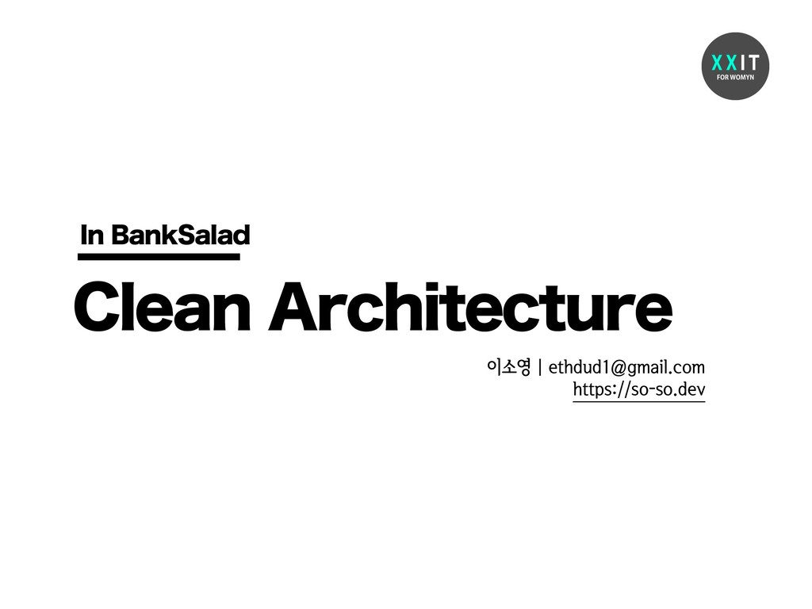

I gave 5 talks this year in total. From my early experience starting out as an intern developer to the story of growing into a junior developer, I look back on what I talked about in each one.

## Operation Internship Landing

> https://speakerdeck.com/soyoung210/inteonsangryugjagjeon

This is what I presented at the GDG Korea WebTech Lightning Talk.

The novelty of finally becoming "a developer working at a company" lasted only briefly, and this talk covers how I, an intern developer who couldn't do anything because I didn't know anything, found a way to overcome that.

As a strategy for learning the huge amount of things I picked up at the company, I chose **documentation I could explain**. I learned that sharing through documentation not only organizes what you've learned, but also lets you get more feedback on it.

Through this period, I discovered the learning method that suits me best, and how important sharing is.

> https://speakerdeck.com/soyoung210/susuggeggiro-sugseongdoen-banana

This is what I presented at Banksalad's tech conference, 'Consalad.'

Beyond landing as an intern, this was a process of working out answers to three questions I faced during my probation period.

1. What does a good question, and good collaboration, look like?
2. How are Project and Product different?
3. What is growth? How do you measure it?

### 1. What does a good question, and good collaboration, look like?

Starting from thinking about what good collaboration would look like, I turned that thought into "a good question," and I came to believe that **a good question is one that's considerate of the person answering it.**

I chose to ask questions leading with the conclusion first, laying out the other context that matters (the dev environment, domain, etc.), the approaches I'd tried, and the error logs I'd run into.

Beyond this, I also shared my thoughts on well-prepared meetings and communication.

### 2. What does a good question, and good collaboration, look like?

This covers what I thought about **how I should treat a Product**, as a Product developer moving beyond just working on a Project.

A Product isn't built by me, but by our team, and I laid out the elements needed for sustainable development, such as documentation.

### 3. What does a good question, and good collaboration, look like?

I wanted to become a 'developer who grows,' but I felt the word 'growth' was vague, so I shared my thinking on **when exactly you've grown**.

The sentence about growth that resonated with me the most at the time came from Banksalad backend developer Sunghyun Hwang.
_Growth is building your own perspective on each subject, and continually running into things head-on to complete that perspective._

## Clean Architecture in Banksalad

> https://speakerdeck.com/soyoung210/clean-architecture-in-banksalad

This is what I presented at the XXIT TECH TALK.

It covers my interpretation of Clean Architecture, along with how I implemented it in a web project.

This structure was the first approach we chose for managing a variety of financial services. Now each service is managed in its own separate repository, and since the structure from that time relied on deep dependency injection that made debugging difficult, we're now building projects with a different structure.

## Old House for New House: Restructuring a React Project

> https://speakerdeck.com/soyoung210/heonjibjulge-saejibdao-riaegteu-peurojegteu-gujojojeong

This is what I presented at FEConf 2019.

It covers the process of overhauling the structure we'd been using, and introduces the newly reorganized structure.

Here's what felt uncomfortable about the existing structure:

- unnecessary interface definitions
- dependency injection that didn't feel easy to modify
- View and Data weren't separated, making things hard to manage

### First round of improvements

To address these pain points, we first introduced a new structure in `CMS`. In this first round of improvements, we improved the following:

- removed unnecessary interfaces
- flattened the structure more than before, so a change would touch fewer places when it occurred
- introduced Redux to manage Data separately
  - asynchronous handling was moved into redux-middleware

### Second round of improvements

The second round of improvements addressed what we'd missed in the first round.

- where the store and component connect
- defined actions and middleware as utils to reduce repeated boilerplate code
- listed out what the project actually needed, and organized the folder structure to match that purpose

### ing...

As I mentioned toward the end of the talk, thinking about a good structure is still an ongoing process.
We're building out the structure while considering things like reviewing whether to adopt the recently released [redux-toolkit](https://redux-toolkit.js.org/), a better separation between business logic and components, test code, and more.

We manage the content around structure in a `scaffolding Repository`, and continue to discuss it with teammates.

## Despair-Driven Growth: Becoming a Developer People Want to Work With

> https://speakerdeck.com/soyoung210/jeolmang-deuribeun-seongjang-hamgge-ilhago-sipeun-gaebaljaga-doegiggaji

This is what I presented at 'Hanbit Dev Ground Junior.'

I shared the 4 moments of despair I've faced since starting as an intern, and the growth I got out of each one.

### First

**Despair**: On my first side project, I got so absorbed in the fun of building screens that I ended up with code that made collaboration impossible.
**Growth**: From now on, every piece of code I write needs a reason behind it.

### Second

**Despair**: I couldn't understand anything, and it felt like I couldn't write a single line.
**Hope**: I defined what 'understanding' actually means. "Understanding means being able to explain it to someone else."

### Third

**Despair**: What do I need to do to keep growing?
**Hope**: After 'understanding,' comes 'critique.'
Everything can potentially be done in a better way, and it's on me to find that way.

> This is drawn from [Simple Software Chapter 2, The Right Posture](https://so-so.dev/essay/simple-software/#chapter-2-올바른-자세).

### Fourth

**Despair**: You can gain knowledge just by putting in the time, but how do you gain the ability to write good code?
**Hope**: Stick to two principles.

1. Review my own PRs myself — looking again reveals things to improve.
2. Do code review diligently — it exposes you to different perspectives on solving problems. There's a lot to learn from a colleague's code.

## Wrapping up

This year, thanks to some great opportunities, I gave 5 talks. In the process of learning new things, I was able to organize what I'd learned and share it with a lot of people.
Every time I prepared a talk there was a lot of anxiety and nervousness, but looking back after the fact, all that's left is a sense of pride. 😇
I'm glad to be part of a culture of sharing experience, and next year I'd like to share even more, and more varied, stories.
