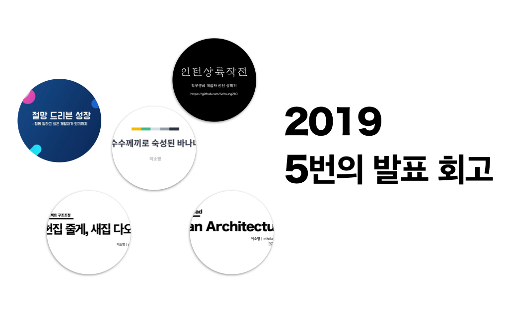
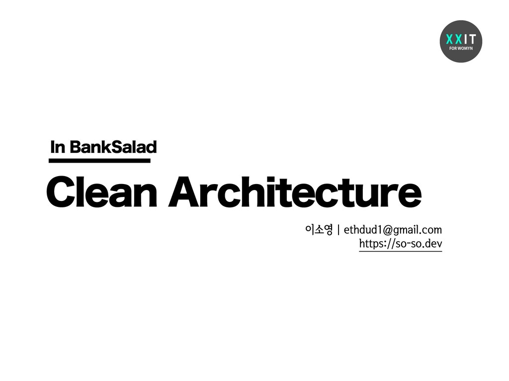
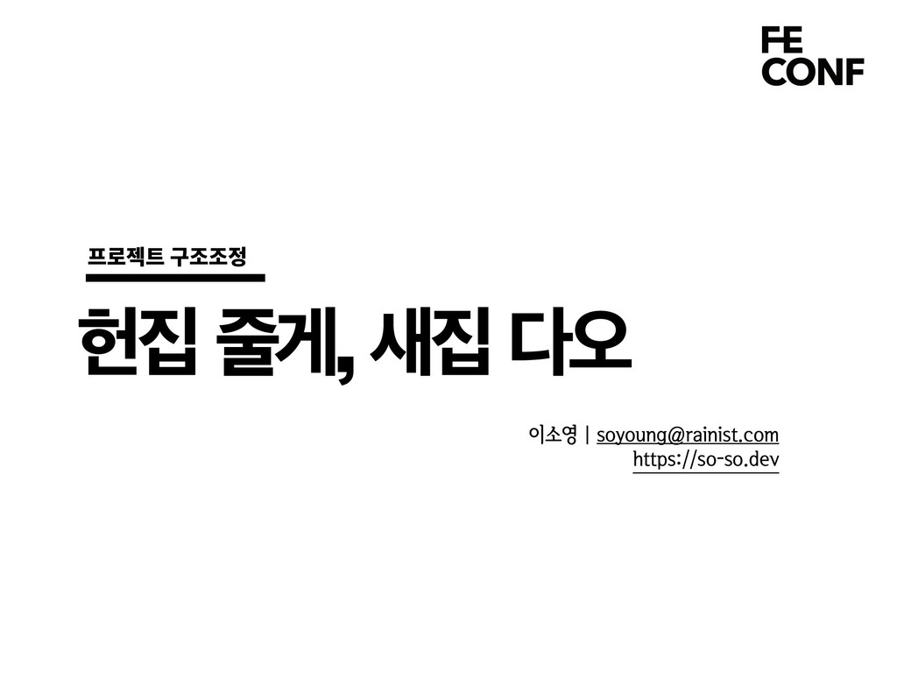

올해 총 5번의 발표를 했습니다. 처음 인턴으로 개발자를 시작했던 경험부터, 주니어 개발자로의 성장에 대한 이야기까지, 어떤 내용을 전달하였는지 돌아봅니다.

## 인턴상륙작전

> https://speakerdeck.com/soyoung210/inteonsangryugjagjeon

GDG Korea WebTech Lightning Talk에서 발표한 내용입니다.

처음으로 '회사에서 일하는 개발자'가 되어서 마냥 신기했던 것도 잠시, 아무것도 몰라서 아무것도 할 수 없었던 인턴 개발자가 어떤 방법을 통해 극복했는지에 대한 내용입니다.  
회사에서 알게 된 수많은 내용들을 학습하기 위한 전략으로 **설명할 수 있는 문서화**를 선택했습니다. 문서화를 통한 공유는 내용에 대한 정리와 함께 알게 된 내용에 대해 더 많은 피드백을 얻을 수 있는 것임을 배웠습니다.

이 시기를 통해, 저에게 가장 잘 맞는 학습법과 공유의 중요함을 알게됐습니다.

> https://speakerdeck.com/soyoung210/susuggeggiro-sugseongdoen-banana

뱅크샐러드 기술컨퍼런스 '콘샐러드'에서 발표한 내용입니다.

인턴으로서의 상륙을 넘어서 수습기간때 마주했던 세 가지 질문에 답을 내려가는 과정이었습니다.

1. 좋은 질문, 협업이란 어떤 것일까?
2. Project와 Product는 어떻게 다를까?
3. 성장이란 무엇일까? 어떻게 측정할까?

### 1. 좋은 질문, 협업이란 어떤 것일까?

좋은 협업이란 무엇일지에 대한 고민에서 출발하여, 이 고민을 '좋은 질문'으로 구체화 시켰고 **좋은 질문이란 답변자를 배려하는 것**이라고 생각했습니다.  
질문은 두괄식으로, 고려해야 하는 다른 Context(개발환경, 도메인 등), 시도했던 방법, 마주했던 오류 로그 등을 정리하여 질문하는 방법을 선택했습니다.

이 외에도, 준비된 회의와 커뮤니케이션에 대해 고민한 내용을 공유하였습니다.

### 2. 좋은 질문, 협업이란 어떤 것일까?

Project를 넘어 Product개발자로서 **Product를 어떻게 대해야 할까**에 대해 고민한 내용입니다.  
Product는 내가 아닌 우리 팀이 만드는 것이고, 지속 가능한 개발을 위해 문서화 등 필요한 요소에 대해 정리했습니다.

### 3. 좋은 질문, 협업이란 어떤 것일까?

'성장하는 개발자'가 되고 싶다고 생각했지만, 이 성장이란 단허가 모호하다고 생각되어 **언제 성장한 것일까**에 대해 고민한 내용을 공유했습니다.  
이 때 성장에 대해 가장 많이 와닿았던 문장은 뱅크샐러드 서버 개발자이신 황성현님의 말씀이었습니다.  
_성장이란, 각 주제에 대해 나만의 관점을 가져가는것, 그리고 계속 부딪히며 관점을 완성해나가는 것_

## Clean Architecture-in Banksalad

> https://speakerdeck.com/soyoung210/clean-architecture-in-banksalad

XXIT TECH TALK에서 발표한 내용입니다.

Clean Architecture에 대한 해석과 함께, 이를 웹 프로젝트에서 어떻게 구현했는지에 대한 내용을 담고 있습니다.

이 구조는 다양한 금융 서비스를 관리하기 위해 선택했던 첫 번째 방법이었습니다. 지금은 각 서비스별로 별도의 저장소에서 관리하고 있고, 이 때의 구조가 깊은 의존성 주입으로 이루어져 있어 디버깅이 어렵다고 생각되어 현재는 다른 구조로 프로젝트를 만들어가고 있습니다.

## 헌집줄게, 새집다오: 리액트 프로젝트 구조조정

> https://speakerdeck.com/soyoung210/heonjibjulge-saejibdao-riaegteu-peurojegteu-gujojojeong

FEConf2019에서 발표한 내용입니다.

기존에 사용하던 구조를 개편하는 과정과, 새롭게 개편한 구조에 대한 소개를 담고 있습니다.

기존 구조에서 느꼈던 불편함은 다음과 같습니다.

- 불필요한 interface정의
- 수정에 용이하지 않다고 생각되었던 의존성 주입
- View와 Data가 분리되지 않아 관리가 어려움

### 첫 번째 개선

이 불편함을 개선하기 위해 `CMS`에서 첫 번째로 새로운 구조를 도입하였습니다. 첫 번째 개선에서는 다음과 같은 부분을 개선했습니다.

- 불필요한 interface제거
- 수정상황 발생 시 변경부분이 적도록 이전보다 구조를 평탄하게 가져가도록
- Data를 별도로 관리하기 위해 Redux도입
  - 비동기 처리는 redux-middleware에서 처리

### 두 번째 개선

두 번째 개선에서는 첫 번째 개선에서 놓쳤던 부분을 개선하였습니다.

- store와 component connect위치
- 반복되는 행사코드를 줄이기 위해 action과 middleware를 util로 정의
- 프로젝트에 필요한 요소를 리스트업 하고, 목적에 맞게 폴더구조 잡기

### ing...

발표 말미에도 표현되어 있지만, 좋은 구조에 대한 고민은 현재 진행형입니다.  
최근 나온[redux-toolkit](https://redux-toolkit.js.org/)도입에 대한 검토, 비즈니스 로직과 component의 더 나은 분리, TestCode 등에 대한 내용 등을 고민하며 구조를 만들어가고 있습니다.

구조에 대한 내용은 `scaffolding Repository`에서 관리하며 지속적으로 팀원들과 논의하고 있는 중입니다.

## 절망 드리븐 성장: 함께 일하고 싶은 개발자가 되기까지

> https://speakerdeck.com/soyoung210/jeolmang-deuribeun-seongjang-hamgge-ilhago-sipeun-gaebaljaga-doegiggaji

'한빛 데브그라운드 주니어'에서 발표한 내용입니다.

인턴 시작 후, 지금까지 만났던 4번의 절망과 이 절망에서 얻었던 성장을 공유했습니다.

### 첫 번째

**절망**: 첫 Side Project에서 화면이 만들어지는 재미에 심취해서 협업이 불가능한 코드를 만들었다.  
**성장**: 앞으로 나의 모든 코드에는 이유가 있어야 한다.

### 두 번째

**절망**: 아무것도 이해할 수 없어서 한 줄도 못짤것 같다.  
**희망**: '이해'란 무엇인지 정의하였다. "이해란, 남에게 설명할 수 있는 수준이어야 한다."

### 세 번째

**절망**: 계속 성장하기 위해서는 어떻게 해야할까?  
**희망**: '이해'다음 '비판'하자.  
모든 것에는 더 나은 방법이 있을 수 있고, 나는 그 방법을 찾아야 한다.

> 이 내용은 [심플소프트웨어 Chapter 2 올바른 자세](https://so-so.dev/essay/simple-software/#chapter-2-올바른-자세)의 내용입니다.

### 네 번째

**절망**: 지식은 시간을 들이면 얻을 수 있으나, 좋은 코드를 짜는 능력은 어떻게 얻어야 할까?  
**희망**: 두 가지 원칙을 지켜보자.

1. 내 PR은 내가 다시보자, 다시 보면 개선할 부분이 보인다.
2. 코드리뷰를 열심히 하자, 문제를 해결하는 다양한 관점을 얻을 수 있다. 동료의 코드는 배울점이 많다.

## 마무리

올해, 좋은 기회로 5번의 발표를 했습니다. 새로운 것들을 배워나가는 과정에서 배운것들을 정리해서 많은 분들께 공유할 수 있었습니다.  
발표를 준비할 때마다 많은 고민과 떨림이 있었지만, 지나고 나서 돌아보니 뿌듯했던 기억만 남습니다. 😇

경험을 공유하는 문화에 함께 하게 되어 기쁘고, 내년에는 더 다양한 이야기를 많이 나누고 싶습니다.
