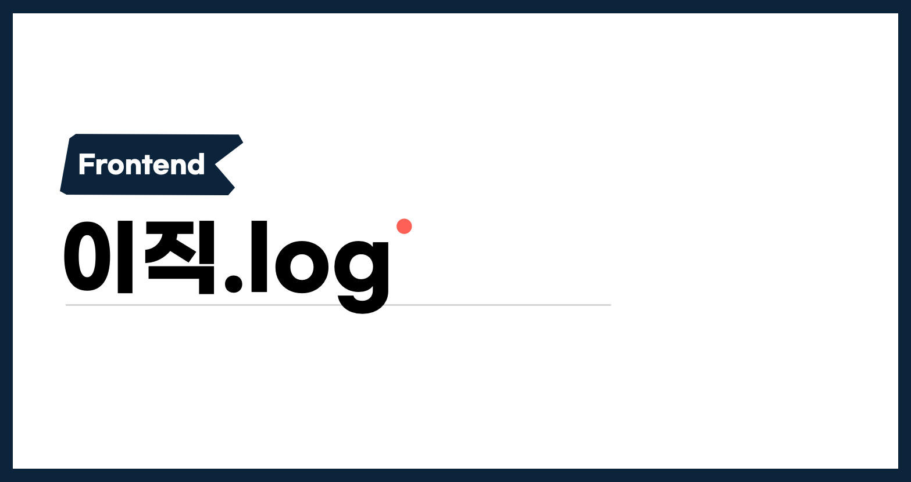

Now that my job search has wrapped up, I want to put together everything I prepared for and experienced along the way. Personally, I want to look back on this roughly two-month journey, and I'm writing this hoping it can be a useful account for anyone who's considering, or currently going through, a job change.

## Why change jobs?

Before starting the job-search journey, finding an answer to this question matters a lot.

The answer confirms how satisfying working at the new team is likely to be, and it becomes the fuel that gets you through a job search that takes a lot of time and effort.

Changing jobs means joining a new organization, but it also means saying goodbye to the one you're currently part of. If your reason for leaving is really a craving for something your current organization could provide, it's worth having a thorough conversation about it first. Every team has its own strengths and weaknesses, so it's not too late to start the job search after taking some time to reflect on whether you might just be running away prematurely.

After weighing a lot of factors, I decided a change was necessary, and I started preparing in earnest starting in November.

## Which companies should I apply to?

The kind of company you want depends on why you're changing jobs. Since this is a team I might be with for n+ years, it's worth gathering as much information as possible through every channel available.

The first thing I looked at was whether a company's vision and culture aligned with the direction I wanted to go. At this stage, I relied on public material — the company's product, job descriptions, culture write-ups, and so on. I figured there was no way to know for certain without actually working there, and that I could resolve anything uncertain, or anything I was more curious about, well enough through interviews or by requesting a coffee chat.

I wanted to join **"a team that was solving the problems I personally felt mattered, with an organizational culture built around autonomy and responsibility."**

## Keeping records

How long a job search takes varies from person to person, but it usually runs more than two to three months, and carving out separate time for it while still doing your current job isn't easy — which is why **scheduling and keeping records** matters so much.

I managed everything in Notion, from interview prep to a timeline for each company I applied to, and it turned out to be the single most reliable asset throughout the whole process, start to finish. Even at the final offer-decision stage, I was able to think it through carefully by going back over notes on the questions I'd been asked and how each interview had felt.

In particular, while putting my resume together, the process of listing out questions I might get asked and drafting answers for them was extremely useful. Even for things I already knew well, hearing the question live in an interview can make the answer come out unstructured, so I tried to think of as many questions as possible and prepare answers ahead of time. **Almost everything I'd be curious about if I were the interviewer ended up actually getting asked by real companies.**

## Resume

I leaned heavily on Jbee's [Turnover journal 2: Resume](https://jbee.io/career/2020-turnover-2/) while preparing mine. I built on what that post described, summarized the content from [my public resume](https://so-so.dev/about), and wrote it up on the Wanted resume platform.

## Technical interviews

After the resume screening, some companies move on to a take-home assignment or a live coding test. Others went straight to an in-person interview.

Among the companies I applied to, two ran a live coding test and two ran a take-home assignment. The rest skipped this stage entirely and went straight into the in-person interview process.

### Take-home assignment

Personally, the interview process at the companies that used a take-home assignment was enjoyable and even gave me a bit of growth. The deadlines were seven days and three days respectively, and neither spec was unreasonable for the timeline.

**While working on the assignment, I rethought everything from scratch, and made sure every part of the code had a reason behind it.** If I'd just carried over a function I'd written in the "past" as-is, both the interviewer looking at that code "now," and I myself, could end up questioning it.

I'd already worked on plenty of projects at my job, but I rethought things like building highly extensible components, how to handle business logic, layers of responsibility, and folder structure — and as a result, I think I grew a little through doing the assignment.

> Maybe it was thanks to all that rethinking, but I ended up with a good outcome at both companies.

After implementing all the requirements, I went through two or three rounds of self code review. Looking at it again, I ended up refactoring a lot — everything from function naming to the underlying logic.

### Live coding test

One company ran an algorithm test, and another had me implement a simple set of requirements in [CodeSandbox](https://codesandbox.io/). This probably varies by person, but both formats were pretty tough for me.

Personally, I think that unless algorithms are core to the product's actual domain, they're not a great way to fully assess a candidate's practical ability. With that mindset, I hadn't set aside dedicated time to study algorithms since my very first job search, and the whole live session was rough because of it.

The CodeSandbox live coding spec was small, but doing it live meant things that normally work just didn't (tunnel vision, basically), and I made a bunch of mistakes I normally wouldn't. The pressure of a tight one-hour window turned out to be pretty significant.

I did get a good outcome from this format too, but I wasn't satisfied with how I performed during it. Looking back, it might have been better to lean toward applying to companies whose process **lets you show your full self.**

### In-person interview

I started preparing for in-person interviews pretty much as soon as I started the job search overall. Some questions were pure knowledge checks, and others asked about experiences based on my resume. The split felt roughly 50/50, so I prepared along those same two tracks.

**Resume-based**

I looked at my own resume with an interviewer's mindset and worked out questions from it. For example, if I used redux-saga on Project A and then swr on Project B, **of course the interviewer would want to know why the stack changed.**

Beyond that, they'd probably ask about the pros and cons of redux-saga versus swr, and might also be curious how each approach would play out on a much larger or much smaller project.

> Even if it wasn't a decision you made yourself, I think it's a fine answer to say, honestly, "this is why it ended up being chosen, and as the project went on, XYZ turned out to be really good (or disappointing)."

Starting from the keywords in my resume's experience section, I kept chaining follow-up questions and organizing my answers until I genuinely understood them myself.

This was something I started purely for interview prep, but it ended up surfacing gaps in the technical decisions I'd made up to that point, and the process of filling those gaps in felt worthwhile regardless of whether I was ever actually asked about them.

**Knowledge-based**

I guess the interviews were exhausting enough (...) that I never got around to writing these questions down properly, but knowledge-based questions were mostly short back-and-forth checks, and here are the ones that stuck with me:

- What are the `async` and `defer` keywords on a script tag?
- What are the different modes of DOM event propagation? What happens when you call a given event method?
- Explain the differences between var, let, and const.
- Explain the iterable and iterator protocols. (I think this came up because my experience section mentioned working with redux-saga.)
- Explain reflow, repaint, and layout thrashing.

### Reverse Interview

Every interview ended with "do you have any questions for us?" Back when I was interviewing as a new grad, I agonized over asking "good questions," but this time around I went in believing an interview isn't just a venue for getting "accepted," so I asked about things I was genuinely curious about, or things that would help me gauge the company's culture.

I could never fully understand a team's situation from the outside, but these conversations at least let me get a partial read on where my own direction overlapped with theirs, and where it diverged.

### Culture interview

I got asked a lot about why I wanted to change jobs, and why I'd applied to this particular team. For culture-interview prep, I leaned a lot on Jbee's [Turnover journal 5: Culture Interview](https://jbee.io/career/2020-turnover-5/).

Since I'm currently on a leave of absence from school, I got asked a lot about my plans around that too. I completely understood the curiosity, but a few interviewers stated a different opinion (that I should finish school as fast as possible) as if it were simply the correct answer, and it was pretty disappointing to feel like I was being pushed to accept the interviewer's opinion as gospel.

The culture interview also ended with a chance to ask my own questions, and among the several I asked, there was one whose answer really stuck with me.

**"If the organization starts growing really fast, alignment could start to weaken — how do you think about that?"**

I was already thinking a lot about organizational culture at the time, so the answer gave me a lot of insight. Beyond that, I also asked several questions about the product vision and the kind of team they wanted to build going forward.

## Compensation negotiation

Thankfully, I got good news from several of the companies I'd applied to, and moved on to compensation negotiations. Unlike interview prep, this wasn't something I could really prepare for ahead of time, and it ended up being the hardest part of the whole process.

Every single company asked for my **desired salary** first, and since I didn't know much about their internal situation, I didn't share a number at first. But since the negotiation itself couldn't move forward without one, I thought it over and eventually gave them a figure.

After spending the whole interview process talking about the company's vision and culture, suddenly having to talk money made it hard to organize my thoughts. Whatever number I landed on, I couldn't shake the worry of "is it okay to ask for this much?"

Looking back now, I think I spent way too long agonizing over it alone. Wanting a billion won doesn't mean the company is obligated to just hand it over, and stating a billion won as my desired salary doesn't mean everything I demonstrated throughout the interview process just vanishes and only the number "a billion" remains.

> Granted, based on my actual experience, if I really did ask for a billion won, there's probably a version of events where everything I showed during the interviews does get overshadowed. The "billion won" in this post is just an example figure. 😉

There's no need to always aim high, and no need to lowball yourself out of over-thinking it either. Salary is obviously a pretty important factor in any job search. I'd recommend laying out a bunch of scenarios and thinking through them — how much you'd want if you did move, whether you'd rather just stay at a company you're already well-adjusted to if the gap isn't big enough, and so on. Working through enough scenarios will gradually narrow the number down.

I'm honestly not sure that thinking about it longer gets you a better answer. So I generally mulled it over for about a day and then replied. I figured that moving the process forward meant getting back to the HR contact quickly to keep the conversation going, rather than sitting alone with the question for too long.

### When having the conversation

⚠️ This isn't know-how for "negotiating" the offer itself. Since an offer negotiation is really just another kind of work conversation, this is closer to how I think that conversation can be carried out a little more efficiently.

- If you feel pressured, or find yourself struggling with an answer, **just honestly ask for time to think it over.** Changing jobs is not a small decision, and it's even less of one to rush. If a company can't even spare you a single day, doesn't that say something about how little slack they have? 🤔
- Most offer letters are meant to stay confidential in principle, so it's fine to only share whatever's necessary during the negotiation.
- Think through **the basis for your desired salary** ahead of time. It could be another company's offer letter, or it could be that you have exactly the experience this company needs. Handing over your reasoning along with your desired terms can make the conversation go a lot more smoothly.

### Stock options

If you're joining a startup, stock options can come up as well, and it's worth thinking in advance about the split between cash compensation and stock options. Whether you weight things more toward stock options or more toward cash is a personal choice — there's no objectively better option or correct answer.

### Other Story

At one company, my offer got rescinded right after I stated my desired salary, and it left me pretty confused. I never expected stating a desired salary to end up being the "final interview," but that's basically how it played out, which was disappointing. I get that this can happen when the gap between two sides' expectations is too wide, but it was jarring that things went so differently from how it started — right after the final offer, they'd told me, at the very first stage of the negotiation, "let's keep talking this through together."

I'm sharing this story to say that it's okay not to be too shaken even if something like this happens to you. You'll have no regrets if you speak according to your own convictions. Everyone has their own convictions, and I don't think any of them are "wrong."

## Rest plans

After leaving my job, I ended up with a fairly long stretch of time off. With COVID making it impossible to meet people or travel, I've been thinking about how to make the most of a break like this that I probably won't get again. There's no "right" way to rest, but I still want to fill it with things that feel meaningful to me.

I made a list of things I've wanted to do and things I think I need, and sketched out a rough daily routine ahead of time.

I've been getting my flipped sleep schedule back on track, and reading the books people gave me through "Chaek-Santa" — a Secret-Santa-style book gift exchange — when I left the company. There's a nagging worry that stepping away from development for too long isn't great, so I'm also chipping away at the side projects I'd kept putting off, trying not to lose my feel(?) for coding.

Looking back at these roughly two months of job searching, I remember it as a period that had plenty of hard moments, but also taught me a lot in many different ways. I'm grateful to everyone who shared so much with me along the way.

The job search wrapped up well. I hope to write this next chapter of my career into just as good a story.
