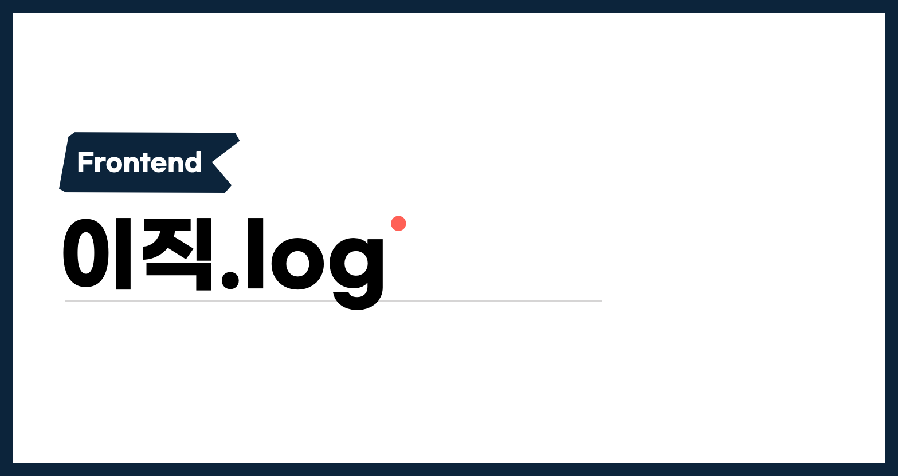
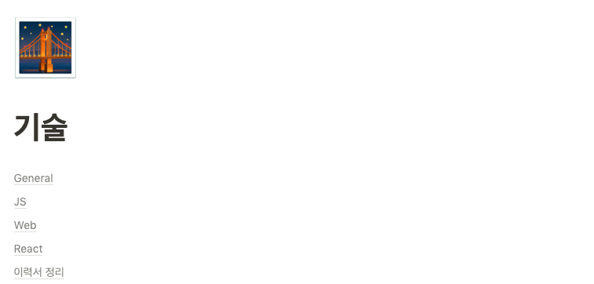
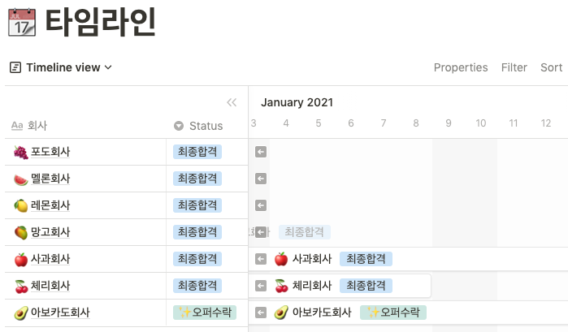

이직 여정을 마무리하며 준비하고, 경험했던 것들에 대해 정리해보려고 합니다. 개인적으로는 약 두 달간의 여정을 되돌아보고자 하고, 이직을 고민하시거나 진행중이신 분들에게는 하나의 경험공유가 되었으면 하는 바람으로 글을 적어봅니다.

## 왜 이직을 하는가?

이직 여정을 시작하기에 앞서, 이 질문에 답을 찾는 것은 매우 중요하다.

이 질문에 대한 답은 옮기게 될 팀에서 얼마나 만족도 높게 일할 수 있는지에 대한 확인과 많은 시간과 노력이 드는 이직 여정을 감내할 수 있는 원동력이 된다.

이직은 새로운 조직으로의 합류를 의미하지만 동시에 현재 속한 조직과의 이별을 의미하기도 한다. 이직의 이유가 현재 조직에서 얻을 수 있는 부분에 대한 갈증이라면 충분한 대화를 진행해보는 것도 좋다. 속해 있는 팀은 저마다의 장단점이 있을텐데, 섣부른 회피는 아닐 지 돌아보는 시간을 가진 후 이직 여정을 시작해도 늦지 않다.

## 어떤 회사에 지원할 것인가?

이직의 이유에 따라 원하는 회사는 달라진다. 내가 n년이상 다니게 될 팀이니 가능한 많은 정보를 가능한 모든 루트에서 얻는 것이 좋다.

나는 회사가 추구하는 비전과 문화가 내가 추구하는 방향과 결이 맞는지를 가장 먼저 살펴봤다. 이 단계에서는 그 회사의 프로덕트, JD와 회사 문화소개 등 공개된 자료들을 통해 파악했다. 어차피 그 회사에서 일해보지 않는 한 100% 알 수 없는 부분이라고 생각했고, 불확실한 부분이나 더 궁금한 점은 인터뷰나 티미팅 요청을 통해 충분히 해결할 수 있다고 생각했다.

 **"내가 문제라고 느낀 것들을 해결하고 있고, 자율과 책임을 추구하는 조직문화를 가진 팀"**에 가고 싶었다.

## 기록하기

이직 여정에 소요되는 시간은 사람마다 다르지만 대부분 2-3개월 이상 소요되고, 재직중인 회사의 업무를 진행 하면서 이직 준비를 위해 따로 시간 내는 것은 쉽지 않기 때문에 **일정관리와 기록**이 중요하다.

인터뷰 준비부터 지원한 회사별 타임라인까지 모두 노션으로 관리했는데, 처음부터 끝까지 가장 든든했던 자산이 되었다.최종 오퍼 결정단계에서도 인터뷰 과정 중 받았던 질문, 느낌 등에 대한 기록을 살펴보면서 신중하게 고민할 수 있었다.

특히 이력서 내용을 정리하면서 스스로 만날 수 있는 질문들을 정리 해보고 답변을 정리하는 과정은 매우 유익했다. 알고 있는 내용이라도 인터뷰 자리에서 듣게되면 정리되지 않은 말이 나올 수 있기 때문에 가능한 많은 질문들을 생각하고 답변을 미리 정리했다. **내가 면접관이어도 궁금할 것 같은 내용은 대부분 회사에서 실제로 질문 받았다.**

## 이력서

이력서 준비는 Jbee님의 [이직기록 2.이력서](https://jbee.io/career/2020-turnover-2/)를 많이 참고했다. 글의 내용을 바탕으로 준비했고, [공개 된 이력서](https://so-so.dev/about)의 내용을 요약하여 wanted이력서 플랫폼을 통해 작성했다.

## 기술 인터뷰

서류 전형의 다음 과정으로 과제를 진행하거나 라이브 코딩 테스트를 진행하기도 한다. 혹은 바로 대면 인터뷰를 진행하는 곳도 있었다.

지원한 회사 중 라이브 코딩 테스트를 진행한 회사가 2곳, 과제 전형을 진행한 곳이 2곳이었다. 나머지는 이 단계 없이 대면 면접 프로세스를 진행했다.

### 과제

개인적으로 과제 전형으로 진행된 회사와의 인터뷰 프로세스는 작은 성장도 있었고 즐거웠다. 마감 기한은 각각 7일과 3일이었는데, 모두 일정 대비 무리한 스펙은 아니었다.

**과제를 하면서 바닥부터 새롭게 고민했고, 코드의 모든 부분에 이유를 담았다.** '과거'에 내가 작성했던 함수를 그대로 옮겨오다 보면, 그 코드를 '현재'에 보는 면접관이나 나 자신도 의문점이 생길 수 있다.

회사에서도 여러 프로젝트를 했지만 확장성 높은 컴포넌트, 비즈니스 로직 다루는 법, 책임 계층, 폴더링 등을 새로 고민했고, 그 결과 과제를 진행하고 나서 작은 성장이 있었다고 생각한다.

- 이 고민 덕분인지는 몰라도, 두 곳 모두 좋은 결과를 받을 수 있었다.

요구사항을 모두 구현한 뒤에 스스로 두 세번의 코드리뷰를 거쳤다. 다시 보는 과정에서 함수 네이밍부터 로직까지 많은 부분을 리팩토링 했다.

### 라이브 코딩 테스트

알고리즘 테스트를 진행한 곳도 있었고, 간단한 요구사항을 [CodeSandbox](https://codesandbox.io/) 에서 구현한 경우도 있었다. 사람마다 다르겠지만, 두 가지 전형 모두 꽤 힘들었다.

개인적으로 알고리즘 자체가 프로덕트에서 중요한 도메인이 아니라면 지원자의 실무 능력을 온전히 평가하기에는 어려운 점이 많다고 생각한다. 이런 맥락에서 처음 취업준비를 할 때 이후로 알고리즘을 시간내서 공부하지 않았고 라이브로 진행하는 내내 힘들었다.

CodeSandbox 라이브코딩은 스펙은 작지만 라이브 코딩에서는 되던 것도 안되고(시야가 좁아짐), 평소라면 안할것 같은 실수도 많이 했다. 1시간이라는 짧은 시간 압박이 꽤 상당했던 것 같다.

이 전형에서도 좋은 결과가 있었지만 과정 속에서의 내 모습은 만족스럽지 않았다. 돌아보니, **자신을 온전히 보여줄 수 있는 전형으로 진행되는 회사**에 지원하는 방향으로 진행했어도 좋았을 것 같다.

### 대면 인터뷰

대면 인터뷰 준비는 거의 이직 준비와 동시에 시작했다. 단순 지식 질문도 있었고, 이력서 기반의 경험들을 물어보는 질문도 있었다. 비중은 5:5 정도로 비슷했던 것 같고, 나도 2가지 부분으로 나누어서 준비했다.

**이력서 기반**

스스로 내 이력서를 보고 면접관 마인드로 질문을 정리했다. 예를 들어, A프로젝트에서 redux-saga를 사용하다가 B프로젝트에서 swr을 사용했다면 **당연히 왜 기술 스택에 변경이 있었는지 궁금할 것이다.**

그리고 더 나아가 redux-saga와 swr의 장단점에 대해 질문할 것이고, 규모가 크거나 작은 프로젝트에서 두 가지 방식을 적용했을 때 상상되는 모습등에 대해 궁금할수도 있다.

- 만약 스스로 선택한 결론이 아니라고 하더라도, 솔직하게 어떤 이유로 선택하게 되었는데 프로젝트를 진행하면서  OO부분이 많이 좋았다.(혹은 아쉬웠다)라는 답변도 좋을것 같다.

이력서 경험의 키워드들을 통해 파생될 수 있는 질문들을 끊임없이 꼬리 물면서 스스로 이해될때까지 정리하는 방식으로 준비했다.

이직 준비를 하면서 시작한 정리였지만, 지금까지 했던 기술적 선택들의 빈 부분이 보였고 그 부분을 매우는 과정이었다고 생각해서 실제 질문을 받았는지 여부와 관계없이 유의미했다.

**지식 기반**

인터뷰가 끝나고 힘들었는지(...) 질문 내용을 정리하지 못했는데, 지식 기반 질문은 내용을 짧게 확인하는 방식으로 질답이 오고갔고, 기억에 남는 질문들은 다음과 같다.

- script tag의 async, defer키워드가 무엇인지?
- DOM이벤트 전파에는 어떤 방식이 있는지? event method를 호출하면 어떤 일이 일어나는지?
- var, let, const차이에 대해 설명해주세요
- 이터러블과 이터레이터 프로콜에 대해 설명해주세요 (아마 경험중에 'redux-saga'를 다룬 내용이 있어 나온 질문인 것 같다.)
- reflow, repaint, layout thrashing에 대해 설명해주세요

### 역질문(Reverse Interview)

모든 면접에서 '혹시 궁금하신 점 있으신가요?'라는 질문을 받았다. 신입 면접때는 이 때도 '좋은 질문'을 하려고 많이 고민했는데, 이번 여정을 시작할 때 면접은 단순히 '합격'하기 위한 자리가 아니라고 생각했기 때문에 정말 궁금한 점이나 회사 조직문화를 확인할 수 있는 부분들을 질문했다.

팀의 상황을 100% 파악할 수는 없어도, 나의 지향점과 어떤 부분이 같고 어떤 부분이 다른 지 대화를 통해 조금이나마 파악할 수 있었던 시간이었다.

### 컬쳐 인터뷰

왜 이직하려고 하는지, 왜 우리 팀에 지원하게 되었는지를 많이 질문 받았다. 컬쳐 인터뷰에 대한 준비는 Jbee님의 [이직기록 5. 컬쳐 인터뷰](https://jbee.io/career/2020-turnover-5/)를 많이 참고했다.

현재 휴학 상태이다보니 이 부분에 대한 계획도 많이 질문 받았다. 계획이 궁금한 것은 충분히 이해 되었지만, 간혹 다른 의견(학업은 최대한 빨리 끝마치는 것이 좋다)을 정답처럼 말씀하신 분도 계셨는데, 면접관의 의견이 정답임을 강요받는 것 같아 많이 아쉬웠다.

컬쳐 인터뷰도 종료 후에 궁금한 점을 질문할 기회가 있었는데, 여러 질문을 했지만 기억에 남는 답변을 들었던 질문이 있었다.

**"조직이 커지는 속도가 급격하게 빨라지면 Alignment가 약화될 수 있을 것 같은데, 이 부분에 대해서는 어떻게 생각하시나요?"**

개인적으로 조직문화 관련되어 고민이 많던 시점에 많은 인사이트를 얻을 수 있었다. 이 외에도 프로덕트 비전, 앞으로 그려나가고 싶은 팀에 대해 여러 질문을 했다.

## 처우협의

감사하게도 지원했던 여러 회사에서 좋은 소식이 있었고, 이후 처우 협의를 진행했다. 인터뷰 준비와 다르게 미리 대비할 수 있었던 부분이 아니어서 그런지 가장 어려웠다.

모든 곳에서 **희망 연봉**을 먼저 물어봤는데, 지원한 회사의 상황을 잘 모르기 때문에 처음엔 공개하지 않았다. 하지만 희망 연봉을 공개하지 않으면 협상 자체가 진행이 안되었기 때문에 고민하고 말씀 드렸다.

인터뷰 과정동안 회사의 비전과 문화에 관해 이야기를 나누다가 갑자기 돈이야기를 하려니 생각이 쉽게 정리되지 않았다. 어떤 금액을 잡아도 '이 정도를 말해도 될까?'하는 고민이 떠나지 않았다.

지금 생각해보면 너무 긴 시간 혼자 고민했던 것 같다. 어차피 내가 10억을 희망한다고 해서 10억을 무조건 주는 것은 아니며, 10억을 희망연봉으로 제시한다고 해서 내가 인터뷰 과정 중 보여준 모습들은 사라지고 '10억'만 남는 것은 아니다.

> 물론 현재 내 경험에서 실제로 10억을 부르면 '내가 인터뷰 과정 중 보여준 모습이 사라지는 경우'가 있을것 같다. 이 글에서의 '10억'은 그저 예시 금액이다. 😉

무조건 높게 이야기할 필요도 없고, 이것 저것 고민하느라 낮게 이야기 할 필요도 없다. 이직 여정에서 연봉은 당연히 꽤 중요한 요소다. 이직한다면 얼마 정도를 받고 싶은 지, 어느 정도 차이 나지 않는다면 이미 잘 적응한 회사에 남을 것 같은지 등 여러가지 상황을 펼쳐두고 고민하는 것을 추천한다. 이런 여러 상황들에서 고민하다보면 숫자가 조금씩 좁혀질 것이다.

고민을 오래한다고 더 나은 답이 나올 수 있을까?는 잘 모르겠다. 그래서 나는 대개 하루 정도 고민하고 회신했다. 이 고민을 혼자 오래 하는 것보다 인사 담당자와 빠르게 이후 논의를 이어가는 것이 프로세스를 진행할 수 있는 방향이라고 생각했다.

### 이야기를 나눌 때

⚠️ 연봉협상에서 오퍼를 '조율하는'노하우가 아니다. 오퍼 협상도 일종의 업무대화이기 때문에 내가 생각하는 오퍼 협상업무를 좀더 효율적으로 진행할 수 있는 방법에 가깝다.

- 압박 된다는 느낌을 받거나 대답에 고민이 된다면 **"고민할 시간이 필요하다"라고 솔직하게 요청**하자. 이직은 작은 일이 아니고, 성급하게 결정할 일은 더더욱 아니다. 나에게 하루의 시간도 내어줄 수 없는 회사라면 많이 여유가 없는 것 아닐까 🤔
- 대부분의 오퍼레터는 비공개를 원칙으로 하기 때문에, 조율과정에서 필요한 부분만 공유해도 괜찮다.
- **희망 연봉 산정 근거**를 미리 고민해보자. 타사 오퍼레터일 수도 있고, 회사에서 필요한 경험을 내가 가지고 있을 수도 있다. 희망하는 처우에 근거를 같이 전달하면 대화가 좀더 수월할 수 있다.

### 스톡옵션

스타트업에 입사할 경우 스톡옵션에 대해서도 이야기 해볼 수 있는데, 현금 보상과 스톡옵션 비중에 대해서도 미리 고민해보면 좋다. 스톡옵션 비중을 높일 지, 현금 보상 옵션을 높일 지는 개인의 선택이고 더 나은 선택지나 정답은 없다.

### Other Story

희망연봉 제시 후에 합격을 취소당한 곳이 있었는데, 이 일로 다소 혼란스러웠다. 희망연봉 제시가 '마지막 면접'이 될것이라고 생각하지는 않았는데, 그렇게 진행된 것 같아 아쉬웠다. 서로 생각하는 간극이 너무 크면 그럴 수도 있겠구나 싶지만, 최종 합격 후에 처우 협의 처음 단계에서 "대화를 통해 계속 이야기 해보자"라고 말한것과 다르게 진행되어 당황스러웠다.

이 사례를 적는 이유는, 이런 일이 있어도 너무 흔들리지 않아도 괜찮다는 의미로 공유한다. 내가 생각한 소신대로 대화를 나눠야 후회가 없다. 저마다의 소신이 있을 뿐 잘못된 소신은 없다고 생각한다.

## 휴식 계획

퇴사 후 꽤 긴 시간 휴식기를 갖게 됐다. 코로나로 사람들을 만나거나 여행이 불가능한 상황에서 다시 없을 휴식기를 어떻게 하면 잘 보낼 수 있을까 고민하고 있다. 휴식에 '잘'은 없지만, 그래도 내 나름 의미있는 활동들로 채워보고 싶다.

해보고 싶었던 것들, 필요하다고 생각하는 것들을 정리했고, 대략적인 하루 일과도 미리 그려봤다.

바뀐 낮과 밤을 정리하고, 퇴사하면서 책 산타분들이 선물해준 책도 읽고 있다. 개발을 오래 놓으면 안될것 같은 불안감이 있어서 조금씩 미뤄놨던 사이드 프로젝트도 하면서 개발 감(?)을 잃지 않으려고 한다.

약 2달간의 이직과정을 돌아보니 힘든 점도 많았고 여러 방면으로 많이 배울 수 있었던 기간으로 기억된다. 이 과정에서 많은 이야기를 들려주신 모든 분들께 감사하다.

이직 여정이 잘 마무리 되었다. 커리어의 새 단락도 멋진 이야기로 써보고 싶다.
