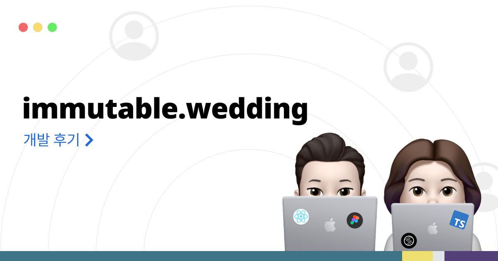
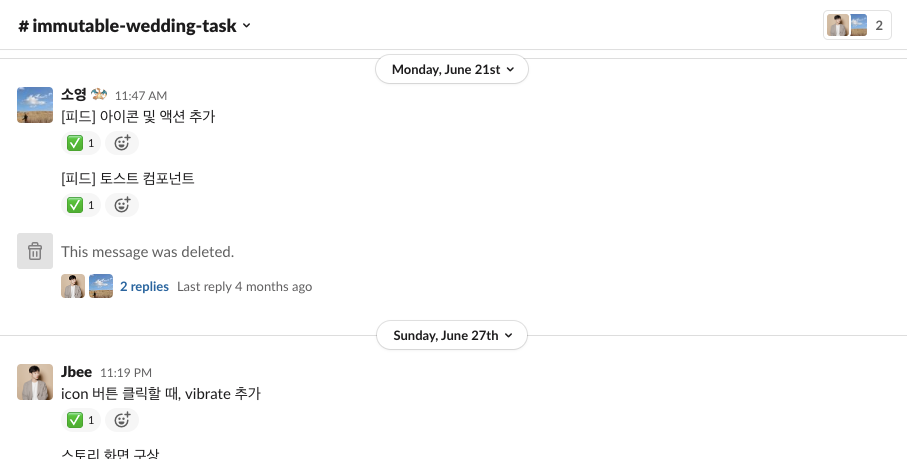
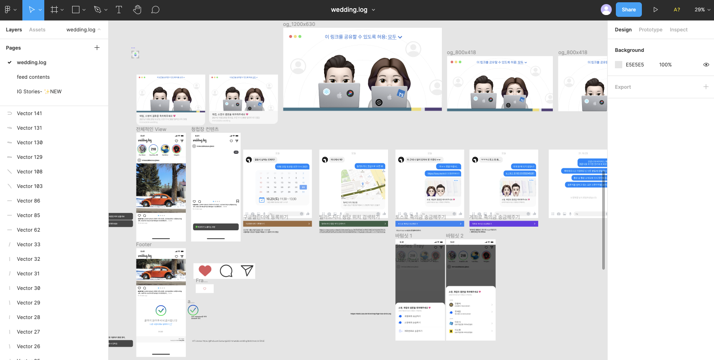
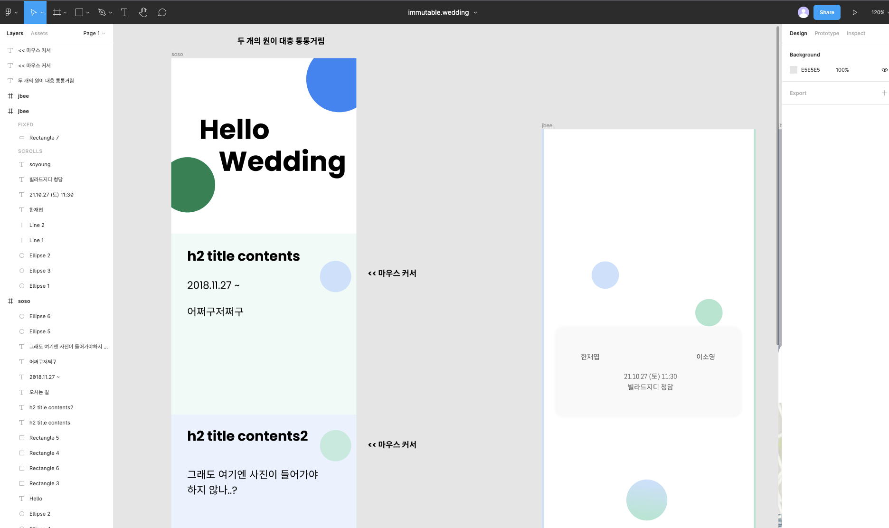
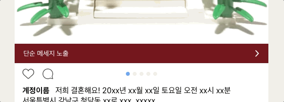
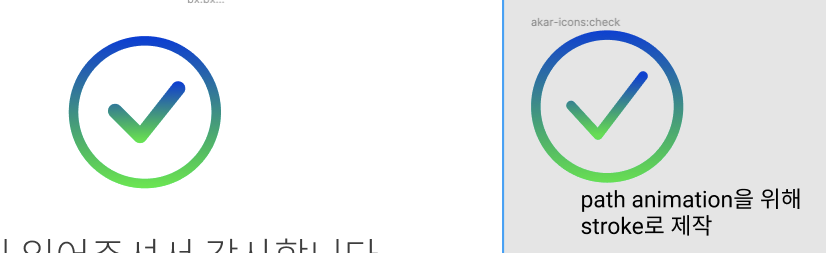
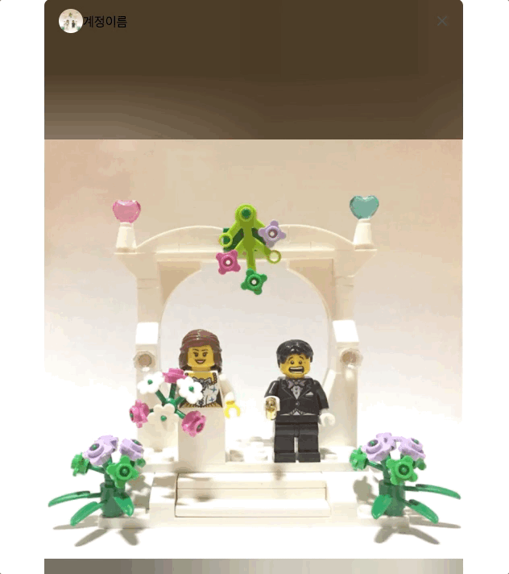

Ahead of my wedding on October 23rd, 2021, I built a mobile wedding invitation for personal use, along with a mobile wedding invitation template called [immutable.wedding](http://immutable.wedding). The COVID-19 situation got worse and the wedding ended up being canceled, but I'm writing up this development retrospective to ease the disappointment a little.

- [🔗 GitHub Repository](https://github.com/soyoung210/immutable.wedding)
- [🐝 My immutable.wedding](https://immutable-wedding-git-js-weddinglog-soso02.vercel.app/)

## How We Worked

We managed issues in a very simple way: posting things that needed to be done as messages in a shared Slack channel, and attaching a ✅ emoji once they were done.

### Division of Roles

It was a small project, but since we needed to move densely within a limited timeline, a clear division of roles was necessary. (tmi: both of us are actually FE developers by day job.)

My partner on this took on the role of PO (Project Owner), handling design, schedule management, and content planning, while I took on the maker role, contributing opinions and focusing on development.

Up until the midpoint of the project, we each focused on our own areas, but in the second half we crossed into each other's territory and focused on finishing things up together.

### What We Considered, and What We Didn't

As you can tell from the design board, the overall concept is Instagram.

We tried designing from a blank slate several times too, but no matter how much we sketched, nothing that felt like a real design came out. 🥲

Judging that it would be difficult to nail down a design from scratch within our limited timeframe, we decided to use a design template, and after mulling over a design that could **"show off our story well,"** we ended up borrowing the Instagram design.

That said, since it was a side project, we also took the chance to try areas we'd normally wanted to challenge ourselves in. We tried out some new technologies within a tolerable range of unfamiliarity, and attempted various things with animation. (More on that in the 'Implementation Story' section below..)

## Implementation Story

For CSS libraries, we tried out [framer-motion](https://www.framer.com/motion/) and [stitches.js](https://stitches.dev/), which I'd had my eye on for a while. And by referencing the internal implementations of several open-source design systems, we implemented as many features as we could ourselves. Just using a well-built open-source library would've been a fine choice too, but we chose this approach so we could learn about structure and API design by looking under the hood.

At first we used [tailwindcss](https://tailwindcss.com/) and [twin.macro](https://github.com/ben-rogerson/twin.macro), but since it was a combination I'd already used on an earlier project, we [migrated to stitches.js partway through](https://github.com/SoYoung210/immutable.wedding/pull/10). (See also: [my tailwind + twin.macro blog post](https://so-so.dev/web/tailwindcss-w-twin-macro-emotion/))

### Things We Tried

[useNotificationState](https://github.com/SoYoung210/immutable.wedding/blob/456d9ab020/src/components/notification/useNotificationState.ts), which is used to show the bottom Toast, was implemented by referencing [mantine's notification library](https://mantine.dev/others/notifications/). While porting the code over, I found a few points I wasn't fully happy with, but since I can't remember them at the time of writing this, they probably weren't a big deal.

On top of this, in components like [Image](https://github.com/SoYoung210/immutable.wedding/blob/456d9ab020/src/components/image/index.tsx) and [ListItem](https://github.com/SoYoung210/immutable.wedding/blob/456d9ab020/src/components/list/ListItem.tsx), we intentionally tried out prop designs we hadn't used much before. Overall my impression was that they were convenient, but since this project wasn't the kind that evolves by absorbing a wide variety of requirements, it's hard to make a firm judgment call here. 😅

### The Animations

This is an animation where pressing the heart button triggers a size change along with sparkles appearing around it. It's a short animation, but I think I spent roughly a full day on it.

Between figuring out the animation sequence, the sparkles' range of effect, and the timing, this ended up being the second most labor-intensive part of the project. We used stitches.js throughout overall, but for this part it was hard to nail down the detailed animation, so we used [sass](https://sass-lang.com/documentation) instead.

[🔗 LikeIcon Component](https://github.com/SoYoung210/immutable.wedding/blob/456d9ab020/src/pages/feeds/components/feed/icon/LikeIcon.tsx)

This is an animation where a circle is drawn and then a check icon is drawn in the middle. This part took even more time than the animation above; the icon provided by the Instagram design template wasn't in a shape suited to the animation we wanted, so we went through several rounds of trial and error, including making the icon ourselves from scratch.

Beyond the icon resource issue, not being very skilled with svg animation itself was also a big factor. This became the reason I studied svg's components and how it works, going through docs and books after the project wrapped up.

This is an animation where swiping horizontally transitions between pages. Out of the whole project, this part took the most time. (Yet the bug is still there..)

I looked through a lot of the framer-motion API and examples, trying hard to get the feel of content sliding by right, but between mobile scrolling and position control being difficult, I couldn't implement it to a polished level. If I ever use this mobile wedding invitation again someday, this'll probably be the first thing I fix. (PRs welcome too.. 🙌)

[🔗 highlight page](https://github.com/SoYoung210/immutable.wedding/blob/main/pages/highlights/%5Bid%5D.tsx)

### A Few Other Things

Since it was a "side project," we deliberately created unfamiliar territory for ourselves and even strapped on some sandbags, which let us take on things we couldn't easily try at work.

Since we worked within a limited amount of time, there are things I'm not fully satisfied with, both in the detailed UX and the bigger picture, but like any project, I think it can gradually get better with small fixes. (I imagine I'll open it back up once the COVID-19 situation is over 🥲)

You can check out a demo of this project [here](https://immutable-wedding-git-js-weddinglog-soso02.vercel.app/).

## Closing

I want to send my thanks and love to [Jbee](https://jbee.io/) — the other star of this project, who also contributed to the design, content planning, and even the development, and who is my forever partner and best friend.
