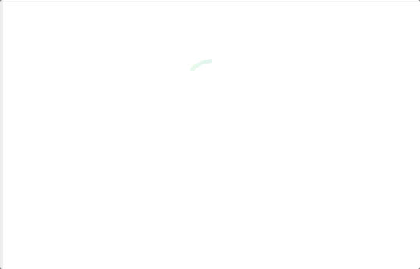

2021년 10월 23일 결혼을 앞두고 개인적으로 사용할 모바일 청첩장과 함께 [immutable.wedding](http://immutable.wedding)이라는 모바일 청첩장 템플릿을 만들었습니다. COVID-19상황이 악화되면서 결혼식은 취소했지만, 청첩장 개발 후기를 적으며 아쉬운 마음을 달래봅니다.

- [🔗 GitHub Repository](https://github.com/soyoung210/immutable.wedding)
- [🐝 나의 immutable.wedding](https://immutable-wedding-git-js-weddinglog-soso02.vercel.app/)

## 진행방식

같이 사용하는 슬랙에서 해야할 일들을 메세지로 올리고 완료 시 ✅ 이모지를 다는, 아주 간단한 방식으로 이슈를 관리했습니다.

### 역할분담

작은 프로젝트였지만 한정된 일정 내에서 밀도있는 진행이 필요했기 때문에, 명확한 역할분담이 필요했습니다.(tmi: 사실 두 명 모두 본업은 FE개발자.)

함께하는 동료가 PO(Project Owner)로서 디자인 및 일정 관리 및 컨텐츠 기획을 담당했고 저는 메이커로서 의견 내기 및 집중개발을 담당했습니다.

프로젝트 중반까지 각자의 영역에 집중하는 방식으로 진행하다가, 후반부에서는 서로의 영역을 넘나들며 마무리에 집중했습니다.

### 고려한 것, 고려하지 않은 것

디자인 Board에서 알 수 있듯, 전체 컨셉은 인스타그램입니다.

백지부터 디자인 하는 것도 여러 번 시도해봤는데, 아무리 그려봐도 이렇다 할 디자인이 나오지 않았습니다. 🥲

한정된 기간 내에서 바닥부터 디자인을 잡기는 어렵다는 판단하에, 디자인 템플릿을 사용하기로 했고 **"우리의 이야기를 잘 보여줄 수 있는 컨셉"**의 디자인을 고민하다가 인스타그램 디자인을 차용하게 되었습니다.

그래도 사이드 프로젝트인 만큼 평소에 도전해보고 싶었던 영역에 대한 도전도 있었습니다. 수용 가능한 이질감 범위 내의 새로운 기술들도 사용해보고, 애니메이션에 대한 여러 가지 도전을 해봤습니다. (더 자세한 이야기는 '구현 이야기' 편에서..)

## 구현 이야기

CSS 라이브러리는 예전부터 눈여겨보고 있던 [framer-motion](https://www.framer.com/motion/)과 [stitches.js](https://stitches.dev/)를 사용해봤습니다. 그리고 여러 오픈소스 디자인 시스템의 내부 구현을 참고해서 가능한 많은 기능들을 직접 구현했습니다. 잘 만들어진오픈소스를 그냥 사용하는 것도 좋은 선택이었겠지만, 내부를 보며 구조나 api디자인에 대해 학습하기위해 선택했던 방법입니다.

처음엔 [tailwindcss](https://tailwindcss.com/)와 [twin.macro](https://github.com/ben-rogerson/twin.macro)를 사용했었는데, 예전 프로젝트에서 이미 사용해본 조합이었기 때문에 [중간에 stitches.js로 migration](https://github.com/SoYoung210/immutable.wedding/pull/10)했습니다. (참고: [tailwind + twin.macro 블로그 글](https://so-so.dev/web/tailwindcss-w-twin-macro-emotion/))

### 시도해 본 것들

하단 Toast를 띄우는 데에 사용되는 [useNotificationState](https://github.com/SoYoung210/immutable.wedding/blob/456d9ab020/src/components/notification/useNotificationState.ts)는 [mantine의 notification 라이브러리](https://mantine.dev/others/notifications/)를 참고해서 구현했습니다. 코드를 옮기는 과정에서 아쉬운 포인트도 몇 개 찾았는데, 이 글을 쓰는 시점에 기억나지 않는 것을 보면 중요한 문제는 아니었나봅니다.

이 밖에도 [Image](https://github.com/SoYoung210/immutable.wedding/blob/456d9ab020/src/components/image/index.tsx)나 [ListItem](https://github.com/SoYoung210/immutable.wedding/blob/456d9ab020/src/components/list/ListItem.tsx)컴포넌트등에서 의도적으로 잘 사용하지 않았던 prop design을 사용해봤습니다. 대체로 다 편리하다는 감상이었지만, 프로젝트의 특성상 다양한 요구사항을 수용하며 발전되는 형태가 아니었기 때문에 확실한 판단은 어려울 것 같네요. 😅

### 애니메이션들

하트버튼을 누르면 크기변화와 함께 주위에 스파클이 나타나는 애니메이션입니다. 짧은 애니메이션이지만, 이 애니메이션에 대략 하루 정도의 시간을 사용했던 것 같습니다.

애니메이션 sequence, 스파클의 적용 범위, 타이밍 등의 요소를 고민하느라 이 프로젝트에서 두 번째로 손이 많이갔던 부분입니다. 전체적으로 stitches.js를 사용했지만, 이 부분은 디테일한 애니메이션 잡기가 어려워 [sass](https://sass-lang.com/documentation)를 사용했습니다. 

[🔗 LikeIcon Component](https://github.com/SoYoung210/immutable.wedding/blob/456d9ab020/src/pages/feeds/components/feed/icon/LikeIcon.tsx)

원이 그려지고 가운데 체크 아이콘이 그려지는 애니메이션입니다. 이 부분은 위쪽의 애니메이션보다 더 많은 시간이 소요됐는데, 인스타그램 디자인 템플릿에서 제공된 아이콘이 원하는 애니메이션에 적합한 형태가 아니었기 때문에 직접 제작까지 하는 등 시행착오가 여럿 있었습니다.

아이콘 리소스문제 외에도 svg애니메이션 자체에 능숙하지 않았던 점도 컸습니다. 프로젝트 이후에 svg구성 요소와 동작 방식에 대해 문서와 책을 살펴보며 공부하게 된 계기가 되었습니다.

가로 축 방향으로 swipe하면 페이지가 전환되는 애니메이션입니다. 전체 프로젝트에서 이 부분에 가장 많은 시간이 소요됐습니다. (그러나 아직도 존재하는 버그..)

framer-motion api와 예제들을 많이 찾아보면서 컨텐츠 넘기는 느낌을 내려고 많이 노력했는데, 모바일 스크롤이나 포지션 컨트롤이 어려워서 완성도 있게 구현하지는 못했습니다. 언젠가 이 모바일 청첩장을 다시 사용하게 된다면 제일 먼저 손볼 부분이 될 것 같습니다. (PR도 환영.. 🙌)

[🔗 highlight page](https://github.com/SoYoung210/immutable.wedding/blob/main/pages/highlights/%5Bid%5D.tsx)

### 그 밖의 이야기

'사이드 프로젝트'인 만큼 일부러 낯선 영역을 만들기도하고 모래주머니를 차기도 하면서 회사 업무에서는 쉽게 시도해보지 못했던 부분들에 대해 도전할 수 있었습니다.

한정된 시간 내에서 진행하다 보니 세부적인 ux나 큰 맥락의 부분은 아쉬운 점들이 있지만, 모든 프로젝트가 그렇듯 조금씩 보완하며 더 좋은 모습이 될 수 있을거라 생각합니다. (COVID-19사태가 끝나는 시점에 다시 열어볼 것 같네요🥲)

이 프로젝트의 데모는 [여기](https://immutable-wedding-git-js-weddinglog-soso02.vercel.app/)서 확인하실 수 있습니다.

## 맺으며

이 프로젝트의 또 다른 주인공이자 디자인과 컨텐츠 기획, 개발에도 기여해준 저의 영원한 동료이자 가장 친한 친구인 [Jbee](https://jbee.io/)님께 고마움과 사랑을 전합니다.
