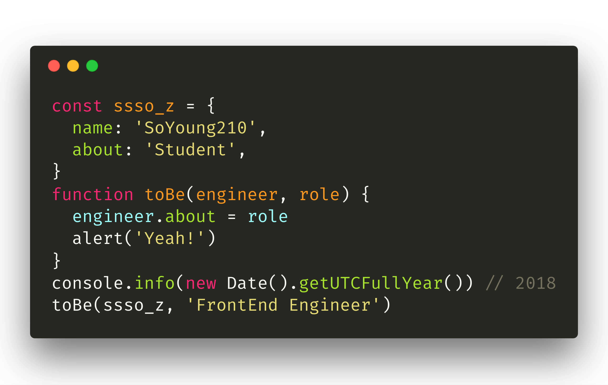
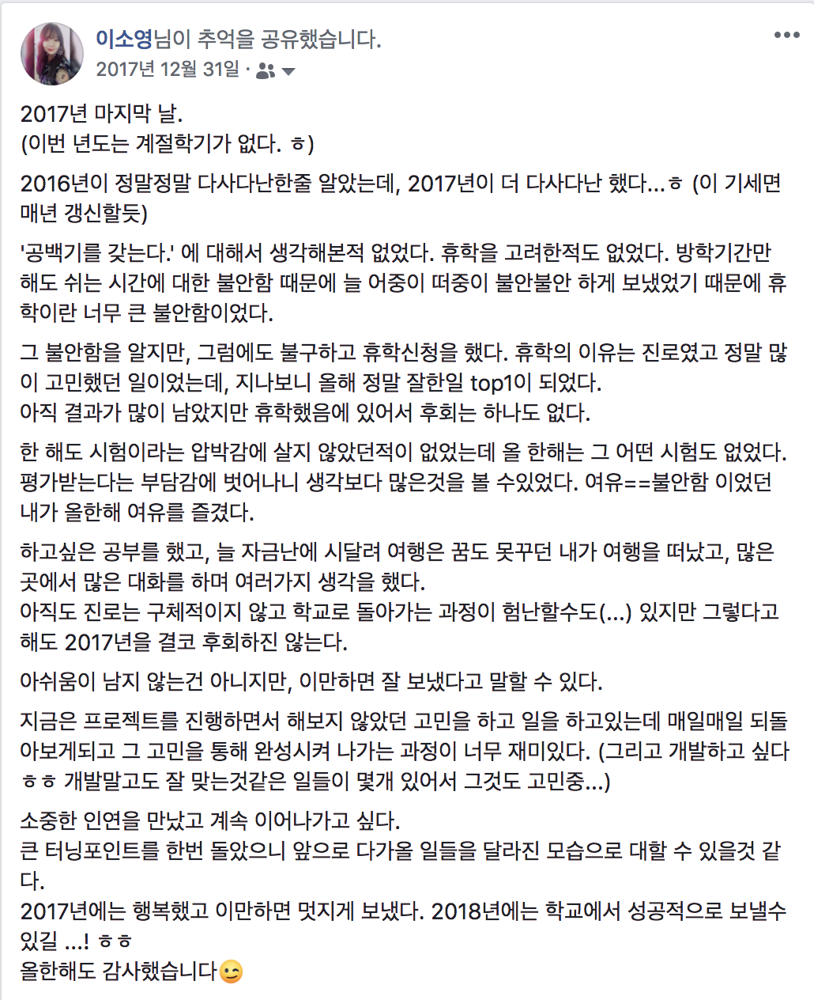
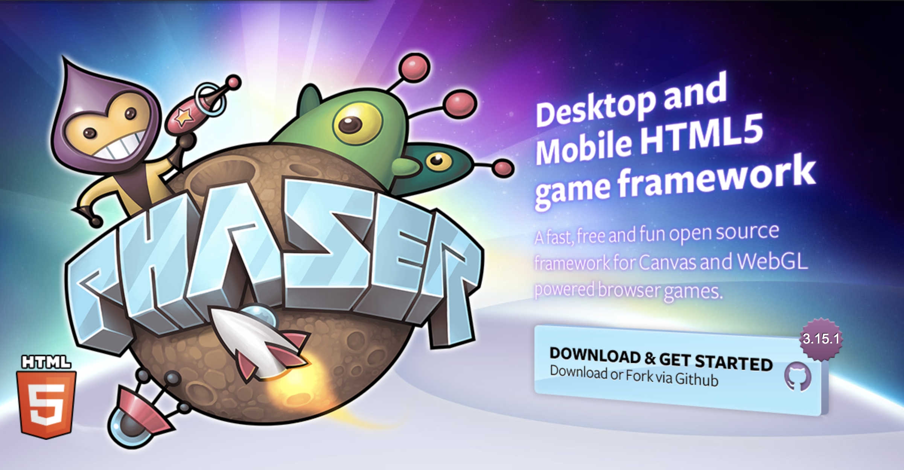
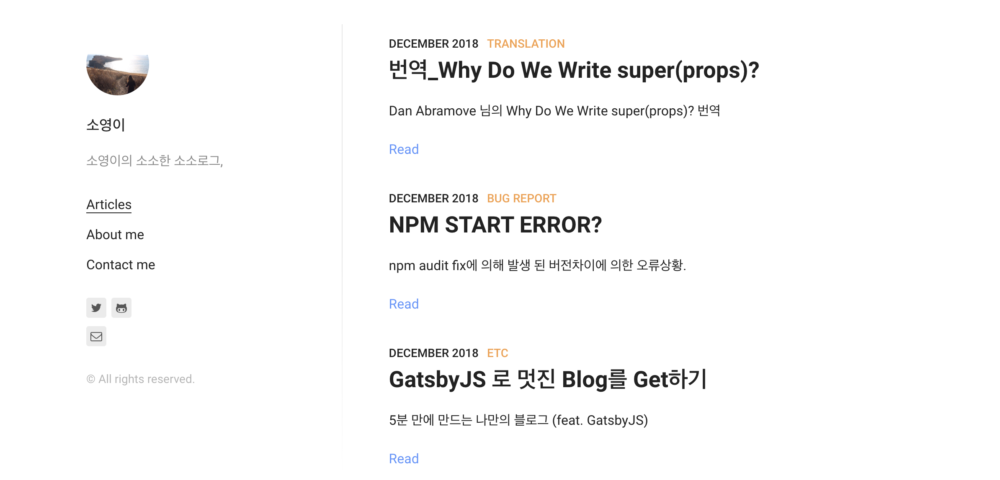
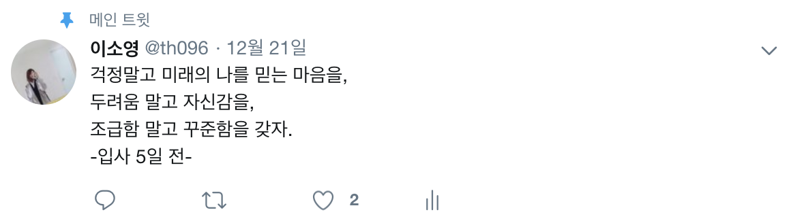

2018 is done, so it's time to write my **deploy** post.

> I almost called it a "retrospective," but I dug up some developer humor and went with Deploy instead ..



Before writing this year's retrospective, I went back and read my 2017 one. Sure enough, 2018 turned out even more eventful than 2017, and I'm closing it out having somehow taken my first steps as a developer.

Here's 2018, in headlines only.

1. A project I worked on somewhere between planner and developer never shipped
2. Failed a department transfer (a real crisis)
3. Wrapped up the required CS courses in one semester
4. Rejected from developer internships, back to being a planner (ugh, I want to be a developer!)
5. Second semester from hell (about my fit for this...)
6. I'm getting a job. Suddenly, but for real this time, started job hunting.
7. First time as a PM, on the YAPP project
8. I need to work harder.
9. In 2019 I want to accomplish OOO and figure out an answer to OOO.

Going into the year, the plan was **finish third year strong, then really push in fourth year!** In the end, I only finished third year and took another leave of absence.

## Planning with Phaser.js (With a Dash of Dev)

### 2017.11~2018.02 / 2018.07~2018.08



At work, my job was planning text-coding educational content built around `Phaser`.

The idea was to wrap Phaser's functions so people could get fun results out of simple code, but my JS knowledge wasn't there yet, so I couldn't actually build it myself.

That's when I started seriously dreaming of becoming a developer, driven by one thought: **I want to build the things I imagine, myself!** I kept cornering the developer I worked with to ask "how did you build this?" and wanted, badly, to learn JS.

> Back then, this service's code felt like Everest itself. Looking back, I think what I really wanted, by the end of the year, was to become someone who could understand that code.

It's confidential, so I can't go into detail, but this service never actually launched. What I took away was a goal: I want to put something I've thought up, and built, in front of real users.

## Failed the Department Transfer.

### 2018.02

The transfer to Computer Science, the whole reason I'd taken a leave in the first place, didn't happen. My GPA was lower than the other applicants'. I blamed my past self hard, thought about transferring schools entirely, but since I hadn't built a Plan B early enough, I had no choice but to go straight back. I wanted that transfer badly, half out of fear of physics and half out of real enjoyment of CS, and it fell through anyway.

> This is hindsight talking, but failing that transfer is exactly what made second semester so brutal, and that's what ended up pushing me, hard, toward the company I work at now.

## Failed the Developer Internships, Back to My Old Company.

### 2018.06~2018.08

With the vague thought of **a developer, this summer!** I applied to internships at a few big-name companies. The tests were mostly algorithms, I hadn't prepared nearly enough, and I struck out across the board, so I went back to the company I'd worked at earlier in the year.

That failure only made me want to become a developer even more.
My actual time at the company went into finishing up planner documentation, not into handling issues on the project I was building alongside the developers, and I found the whole thing unbearably dull. I wanted to be the one reporting bugs and working through how to fix them.

_"At this rate, I'm never going to become a developer."_ That fear is what got me started on React through an online course. I used lunch breaks, mornings, and weekends to watch the lessons and type along, and got as far as _oh, so this is what React is._

And with that, I said a real goodbye to that company.

## The Semester From Hell, and the YAPP Project

### 2018.09 ~ 2018.11 (1)

First semester was survivable since it was mostly programming classes. I even thought, "hey, I can actually do this diligent-student thing!" But to graduate, I still had to grind through a stack of physics credits.

Around then I joined a cross-university student club called YAPP as a front-end developer. [Still going.](https://github.com/YAPP13-4)

I'd picked up bits and pieces from studying on and off, and I wanted an actual chance to put them to use collaborating with other people. Somewhere along the way, I ended up taking on the Manager role too.

It was my first time managing anything, so I was clumsy from day one, and I'm still working toward an answer for **what good managing even looks like.**

> Around the midpoint of the project I wrote a [mid-project retrospective](https://github.com/SoYoung210/Study_note/blob/master/Project/React/retrospect.md), and used it as the basis for a short talk at GDG Campus Korea's Lightning Talk.


It was my first real project with React after only ever learning it from video courses, and putting those early lessons to work on something real taught me a ton. It also made me rethink how I approach learning in general.

Thanks to great teammates, we walked away with 2nd place at the closing ceremony, and we're still building it out and getting ready to ship it!

> The YAPP team is honestly the best team I've been part of. I still feel bad that my managing wasn't up to par, but they always say, "Soyoung, we're in this together, right~" and we keep growing together.

The project was this much fun, and school was this hard, and I didn't have the confidence to keep enduring that combination another year. **Suddenly, but for real this time,** I decided I wanted to live as a developer starting next year, and started preparing for it.

### 2018.09 ~ 2018.11 (2)

Around October, schoolwork got unbearable.

```
Why do I even have to study this? I like studying development.. no matter how hard I try, physics just doesn't interest me...it's not that I hate studying.....
```

With thoughts like that running on loop, every day at school felt pointless, and I poured almost all my time into YAPP instead. (Something like 5 hours a day, 5 to 6 days a week, I think.)

Objectively, I knew what I was supposed to be doing was schoolwork. I'm a student, studying is just the job, right? Thoughts like that.

But by dropping the task I was actually supposed to do in favor of studying development, I had no way to point to any real result. I could finish the sentence `If I study, I get good grades,` but I couldn't finish `If I study development, ___` the same way. (Because I was still a student, after all.)

**I wavered.** My confidence dropped a little more every day, and the question "can I actually become a developer?" kept creeping back in. I wanted an answer to _I'm pouring most of the week into this... so what am I actually going to have to show for it?_

Wanting to turn that final `?` in **"can I become a developer?"** into a `.`, I started job hunting early.

## Job Hunting

### 2018.11

Since growth was the whole point, I focused my search on startups and started getting ready.

I'd naively assumed job prep just meant `algorithms`, and once I realized how much **writing about myself well** actually mattered, I put real effort into my cover letter and project write-ups.

I got a huge amount of help from a lot of people through this. I honestly can't say for sure I'd be at the company I'm at now without it.

> Probably **not,** if I'm being realistic.

It was a stretch where just writing up things I'd been using on autopilot taught me a surprising amount of the theory behind them. It's what finally let me say I **knew at least a little of what I was doing** with JS, React, and everything else.

Around the same time, some people who were switching jobs asked if I could share the notes I'd organized in markdown.

Knowing my notes could help even a little made me proud, and grateful.

It also gave me an answer to something I'd always wondered about.

```
Q. I've gotten help from so many people.. how do I pay it back?
```

Here's the answer I landed on.

```
A. When someone asks for help the way I once did, I'll help them with everything I've got.
```

That's the conclusion I reached, and step one was deciding to start running a [blog](https://sosolog.netlify.com/).



There's not much on it yet, but I'm hoping to share a lot more in 2019.

## Got the Job!

### 2018.12.26 ~ ing



Right at the tail end of 2018, I started at a company as a developer.

I was pretty scared, wondering `what does it even feel like to actually work as a developer?` But now I want to hold onto that same nervous energy and just run at it, full speed, no regrets.

**Now that I've finally started the thing I wanted so badly, I want to make 2019 a year I can look back on with real pride.**

## TMI

A few smaller things happened too, ones that don't fit neatly anywhere else.

1. Exercise (💪 the gym) and diet
   I finally took dieting seriously after only ever doing it half-heartedly before. Minus the busiest stretches of job hunting and settling into work, I kept up a steady diet and hit the gym 4-5 times a week for about 10 months. Lost around 6kg, and being completely obsessed with working out was a lot of fun. Building up my body was satisfying, and I loved that in the moment of exercising, my head was clear and fully on myself, nothing else. Highly recommend the gym!
2. Seminars and communities
   In the second half of the year I went to a lot of developer events, starting with Deview, then FEConf2018, DevFest, and more. Developer events are always a great source of motivation. I picked up a new goal along the way: standing on that stage as a speaker myself someday.

## What About 2019?

I'll close this out thinking about who I want to be in 2019, ~~though setting a goal doesn't mean it actually happens~~.

### Growing at the Company

I want to understand my current company's codebase well enough to add my own code and ship features. My goal is to contribute, **as a developer,** to a service that a huge number of users actually rely on.

Rather than just saying "I'll try hard," it seemed better to lay out something concrete, so here's a quick sketch.

- Log anything I'm unsure about in the team agenda, then write it up in markdown.
- Whenever something needs deeper study, write it up and publish it, both to the internal Confluence and to the blog (minus anything confidential).
- No pretending to know things. Ask boldly about what I don't, and share it with everyone.
- Bring it on: Clean Architecture, Python, GraphQL.

### A New Community

Becoming a developer was full of hard stretches, and along the way I ran into a ton of information I wish someone had shared with me earlier. I think students, especially non-CS-major developers, rarely get an easy chance to come across that kind of information.
(You can find it if you dig hard enough, but still..)

So I started [a new community, For.D](https://www.facebook.com/ForDeveloperKorea/).

I hope next year is the year I grow this community while giving back at least a little of the help I got.

### I Want to Give a Talk.

Going to all these developer events left me with a vague but persistent thought: someday I want to be up on that stage myself, sharing something worthwhile.

Encouraged by the post [Let's Try Speaking at a Conference](https://medium.com/@Jbee_/%EC%BB%A8%ED%8D%BC%EB%9F%B0%EC%8A%A4%EC%97%90%EC%84%9C-%EB%B0%9C%ED%91%9C%EB%A5%BC-%ED%95%B4%EB%B3%B4%EC%9E%90-2ed22eb59f7f), I want to make my speaking debut, built on everything I've carefully written up from what I've learned.

## Wrapping Up

I kept telling myself I'd write this bit by bit, ahead of time. I put it off instead, and ended up scrambling to finish it on the 31st.

This might get revised later, but for now, this is how I'm closing out 2018.

**I ran into so much this year. I did well. Next year, let's grow past who I was this year.**

Everything in this retrospective was only possible because of everyone I met along the way, the people I learned from and grew with.

Thank you. Looking forward to 2019 too.
