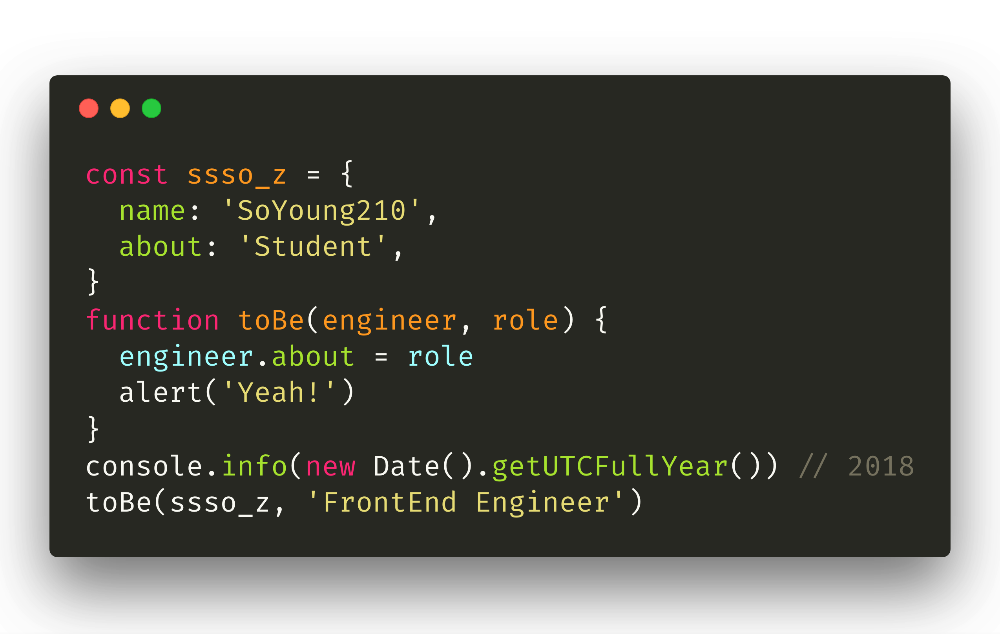
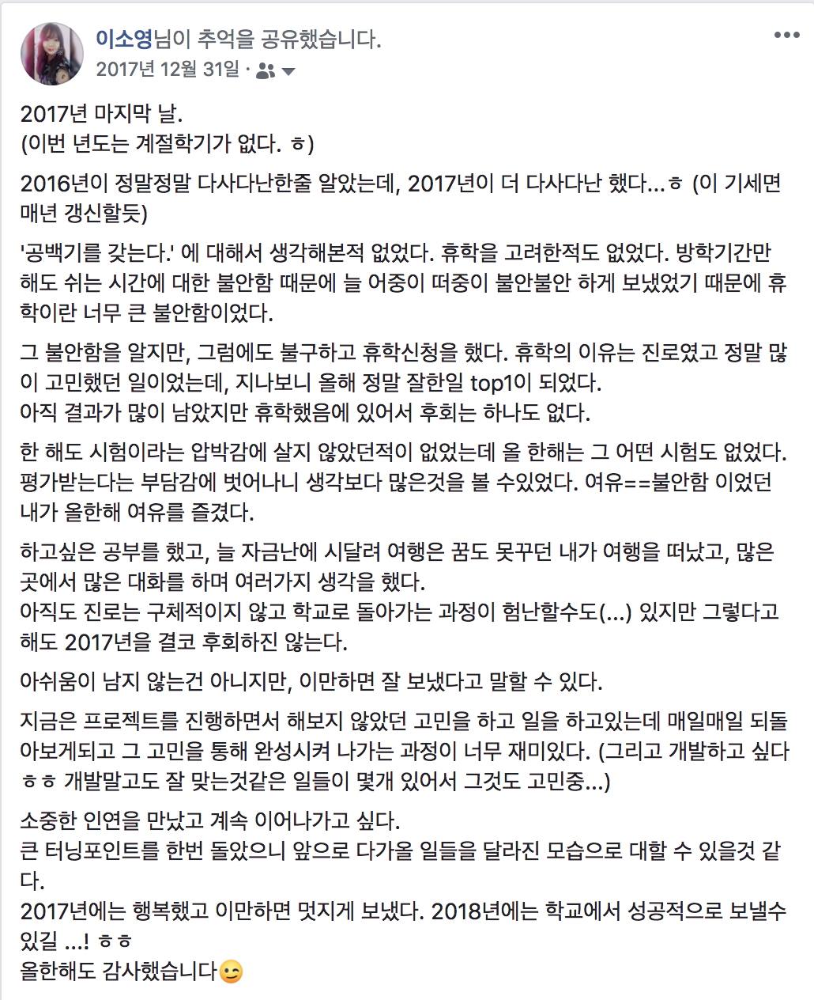
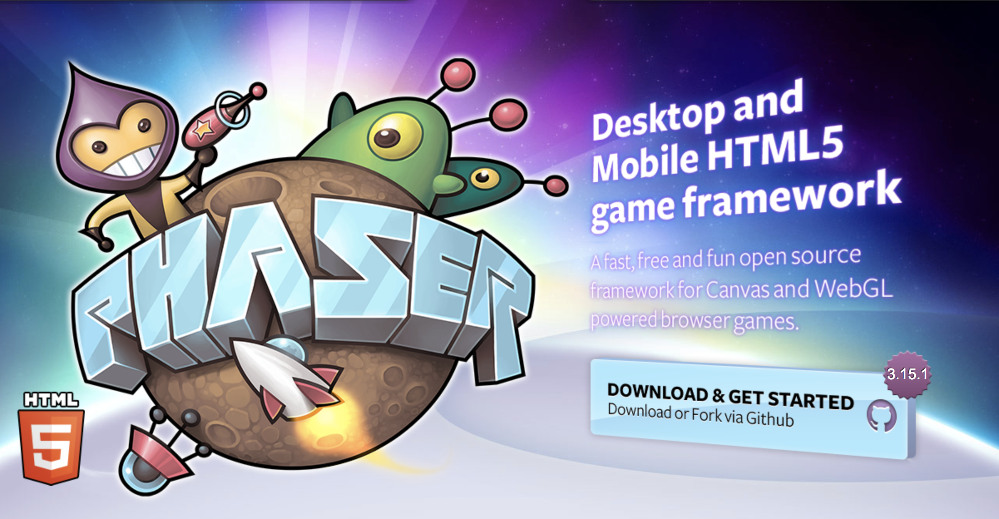
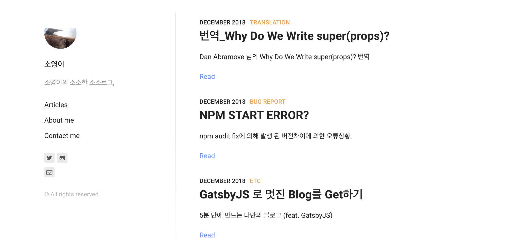
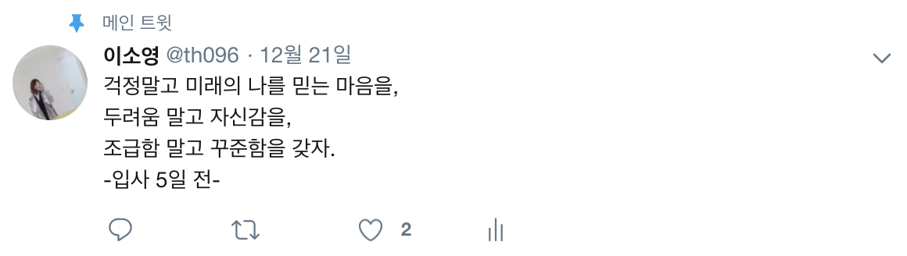

2018년이 마무리 되었으니, 이제 **배포** 를 위한 글을 작성한다.

> '회고' 라고 쓸까하다가 개발자적인 위트 끌어모아서 Deploy ..



2018 회고에 앞서 2017년 회고글을 다시 보았다. 역시 2017년 보다 2018년이 다사다난 했고, 개발자로 어찌저찌 첫 발을 떼면서 2018년을마무리 하게 되었다.

2018년도에 있었던 일들을 Header만 정리해보았다.

1. 기획자와 개발자 그 중간쯤 어딘가로 진행했던 프로젝트 배포 실패
2. 전과 떨어짐 (큰 위기)
3. 1학기로, 컴퓨터공학과 필수수업을 마무리 함.
4. 개발자 인턴 떨어지고 다시 기획자로 복귀(아, 나 개발자 하고싶어!)
5. 지옥의 2학기 (내 적성...)
6. 회사에 갈거야. 갑자기, 그러나 확고하게 취업준비.
7. 첫 PM, YAPP 프로젝트
8. 나, 좀 더 열심히 해야돼.
9. 2019년에는 OOO 를 이루고 OOO에 대한 답을 찾고싶어.

올 해를 처음 시작할 때에는, **3학년을 잘 마무리하고 4학년때 열심히 달려보자!** 였는데, 결론적으로는 3학년만 마치고 다시 휴학에 들어간다.

## Phaser.js로 기획 (개발 한 스푼)

### 2017.11~2018.02 / 2018.07~2018.08



회사에서 `Phaser` 를 활용한 text coding 교육 컨텐츠를 기획하는 역할로 일하게 되었다.

Phaser 함수들을 적절히 wrapping 해서 쉬운 코드로 재미있는 결과물을 만들어 내는 것이 목표인 서비스 였는데, JS에 대한 지식 부족으로 직접 개발하지는 못했다.

이 때부터, **내가 생각한 것을 직접 만들어 보고 싶다!** 라는 마음에 개발자를 본격적으로 꿈꾸게 되었다. 같이 일하던 개발자에게 '이거 어떻게 만드신거에요?' 물어보기도 하고, JS가 정말 **강렬하게** 배우고 싶었다.

> 이 땐 이 서비스의 코드가 정말 에베레스트의 산처럼 느껴졌다. 돌아보니, 올해를 마무리 할때에는 이 서비스의 코드를 이해할 수 있는 사람이 되고 싶었던것 같다.

대외비라서 자세히 적지는 못했지만, 이 서비스는 결국 배포되지는 못했다. 내가 생각한(만든) 결과물로 사용자들과 만나고 싶다는 목표를 가지게 되었다.

## 전과 실패.

### 2018.02

휴학의 이유였던 컴퓨터공학과로의 전과가 실패했다. 이유는 다른 경쟁자에 비해서 낮은 학점이었다. 과거의 나를 참 많이 원망했고, 편입 등도 생각해 보았지만 PlanB를 일찍 준비하지 못한 탓에 그대로 학교로 복귀해야 했다. 물리학과 공부에 대한 두려움과 컴퓨터공학과 공부에 대한 재미로 전과를 강렬히 원했는데 실패했다.

> 결과론적인 이야기 이지만 생각해보면 전과실패로 2학기때 너무 힘들었고 이런 이유로 지금 다니는 회사로 가고싶다는 강력한 계기로 작용했다.

## 개발자 인턴 실패, 원래 회사로 돌아감.

### 2018.06~2018.08

막연히 **이번 여름엔 개발자로!** 라는 생각으로 굵직한 대기업에서 모집하는 인턴채용에 응시했다. 알고리즘 위주의 시험이었는데, 준비가 부족했던 탓으로 모두 좋지 못한 결과를 받았고 연초에 일했던 회사에 복귀했다.

이 포인트가 한번 더 강렬하게 개발자로 살고 싶었던 계기가 되었다.
회사에서 내 시간은, 개발자와 같이 만들던 프로젝트의 이슈 대응이 아니라 기획자로서 마무리 문서 작업이었고 이 과정들이 나에게는 너무 지루했다. 개발자로서 bug 리포팅하고, 그 bug를 해결하는과정을 함께 하고 싶었다.

_''나, 이렇게 가다가는 개발자 못할것 같아.''_ 라는 불안감에 강의를 통해 React를 시작했다. 점심시간과 아침시간 그리고 주말 시간을 활용해 강의를 듣고 따라 치면서 _아 React 이런거구나._. 정도로 배웠다.

그리고 다니던 회사와는 완전한 안녕을 고했다.

## 지옥의 2학기 그리고 YAPP 프로젝트

### 2018.09 ~ 2018.11 (1)

1학기때에는 프로그래밍 위주의 수업이라서 들을만 했다. '아, 학교 수업 열심히 듣는 삶 잘 살 수 있겠다!' 라고 생각했고, 이제 졸업을 위해서는 물리과 학점을 쭉 채워나가야 했다.

그리고 YAPP이라는 대학생 연합 동아리에서 Frone-End 개발자로 참여하게 되었다. [진행중.](https://github.com/YAPP13-4)

개발 공부를 드문 드문 진행하면서 이것저것 주워들은게 좀 있어서 그런 부분들을 다른사람과의 협업에서 실제로 얹어 보고 싶었고, 그러다 보니 자연스럽게 Manager의 역할도 같이 하게 되었다.

Manager의 역할은 처음이라 처음부터 서툴었고 지금도 **좋은 Managing이란 무엇일까** 에 대한 답은 찾아가려고 노력하는 중이다.

> 프로젝트 중간 쯤에 [중간회고글](https://github.com/SoYoung210/Study_note/blob/master/Project/React/retrospect.md) 을 작성했고, 이 내용으로 GDG Campus Korea LightningTalk 에서 짧게 발표를 진행했다.


강의로만 들었던 React를 이용한 첫 프로젝트였고, 초반에 배운 내용을 활용한 실제 프로젝트를 진행하면서 많이 배울 수 있었다. 학습방법에 대해 새롭게 생각해 볼 수 있었다.

좋은 팀원들을 만난덕에 마지막 시상식에서 2등이라는 좋은 결과도 낼 수 있었고, 지금도 계속 발전시켜 나가며 배포를 준비중이다.!

> YAPP 팀은 정말 최고의 팀이다. 부족한 나의 Managing이 너무 미안하지만, 늘 '소영님! 같이 하는거죠~ '라며 같이 성장해 나가고 있다.

이렇게 프로젝트는 너무 재미있고 학교에서의 생활은 너무 힘들어서 내년에는 더 견딜 자신이 없었다. **갑자기, 하지만 확고하게** 내년엔 개발자로 살고 싶다는 생각을 했고 그 준비를 하게 된다.

### 2018.09 ~ 2018.11 (2)

10월쯤 들어가면서 학교 공부가 너무 힘들어졌다.

```
내가 이 공부를 왜 해야하지? 나는 개발공부가 재미있어.. 물리공부에 아무리 해도 흥미가 없어...공부가 싫은건 아닌데.....
```

이런 생각으로, 학교에 가는 하루 하루가 무의미해졌고 거의 대부분의 시간을 YAPP 개발에 투자했다. (대략 하루에 5시간, 일주일에 5-6일 한것 같다. )

내가 생각하기엔, 객관적으로 내가 해야 하는 일은 학교 공부 였다. 학생신분이니 공부는 당연한것 아닌가. 하는 그런 생각들.

하지만 객관적인 Task를 버려두고 택한 개발공부로 그 어떤 지표도 낼 수 없었다. `공부를 하면 좋은 학점을 받는다.` 와 비슷한 느낌으로 `개발 공부를 하면,` 의 문장을 완성할 수 없었다. (학생이어서.)

**흔들렸다.** 매일 매일 자존감이 떨어지다보니 '나 개발자 할 수 있다?' 에 대한 의문이 자꾸 들었다. _이렇게 일주일의 대부분을 개발공부하는데... 무엇을 이룰 수 있나._ 에 대한 답이 찾고 싶었다.

**나 개발자 할 수 있다?'**의 마지막 `?` 을 `.` 으로 바꾸어 보고자 이른 취업 준비를 하게 된다.

## 취업준비

### 2018.11

성장이 목적이었기 때문에, 스타트업위주로 직장을 알아보게 되었고 이를 위한 준비를 시작했다.

취업준비란 막연하게 `알고리즘` 정도라고 생각했던 안일함을 반성하며 **나를 좋은 글로 표현하는 것** 의 중요성에 대해 인지하고 열심히 자기소개서와 프로젝트를 정리했다.

이 과정에서 정말 많은 분들의 도움을 받았다. 다른 분들의 도움이 아니었다면, 현재 다니는 회사에 다닐 수 있었을까 에 대해 정확히 답할 수 없다.

> 아마 **아니다.** 일 확률이 높다.

그저 당연히 쓰기만 하던 것들을 정리하며 이론적인 부분을 많이 학습할 수 있던 시기였다. JS와 React 그리고 기타 내가 사용하던 것들에 대해 **조금은 알고 쓸 수 있던** 계기가 되었다.

그리고, 내가 취업을 준비하던 시기에 이직을 준비하던 분들이 계셨는데, 내가 markdown 으로 정리한 자료를 공유해달라고 부탁하셨다.

내 자료가 조금이나마 도움이 될 수 있다는 사실이 뿌듯하고 감사했다.

그리고 늘 고민하던 한 가지 문제에 대해 답을 찾을 수 있었다.

```
Q. 나, 이렇게나 많은 분들께 도움 받았는데.. 어떻게 보답하지?
```

이 질문에 대한 스스로의 답은 아래와 같다.

```
A. 누군가 나처럼 '도움이 필요하다고 요청할때' 나도 마음을 다해 도와드리자.
```

이렇게 결론내렸고, 그 시작으로 [블로그](https://sosolog.netlify.com/)를 운영하기로 마음먹었다.



아직 글이 많이 없지만, 2019년에는 많은 글들을 공유해보고자 한다.

## 취직!

### 2018.12.26 ~ ing



2018년도의 끝자락에 개발자로서 회사에 입사하게 되었다.

`도대체 개발자로 회사에 다닌다는 것은 어떤 느낌일까?` 에 대한 두려움이 컸는데, 이제는 저 마음 그대로 열심히 후회없이 달려보고자 한다.

**그렇게 원했고 바라던 일을 시작하게 되었으니 2019년에 멋지게 돌아볼 수 있는 여정을 만들어보고 싶다.**

## TMI

따로 분류하기는 어렵지만, 자잘한 일들도 있었다.

1. 운동(💪 헬스)과 식단
   늘 드문드문 하던 다이어트를 본격적으로 했다. 취준과 회사 적응으로 바쁜 시기를 제외하면 10개월 정도 꾸준히 식단과 주 4-5회 운동을 했다. 약 6kg정도 감량했는데, 운동에 빠져살때 정말 재미있었다. 몸을 만들어 가는게 재미있었고 운동하는 그 순간은 다른 생각없이 온전히 나에 집중할 수 있다는 느낌이 좋다. 헬스추천!
2. 세미나 및 커뮤니티
   하반기에 Deview를 시작으로 Feconf2018, DevFest 등 개발자 행사를 많이 다녔다. 개발자 행사는 늘 좋은 동기부여가 된다. 언젠가 이런 행사의 발표자로 서보고 싶다는 목표가 생겼다.

## 2019년에는 ?

2019년에는 어떤 사람으로 살아갈지 ~~목표를 세운다고 다 이루어지는 것은 아니지만~~ 생각해보며 회고글을 마무리 한다.

### 회사에서 성장하기

지금 다니는 회사의 코드를 이해하고 거기에 내 코드를 더해 feature를 배포해보고 싶다. 수많은 User들이 사용하는 서비스에 **개발** 로서 기여해 보고 싶다는 목표가 있다.

단순히 열심히 하겠다, 보다는 구체적인 방법을 세우는 것이 좋은것 같아 간략히 생각해 보았다.

- 의문이 드는것은 Agenda에 기록 후, markdown 문서화.
- 깊게 공부해보아야 할 내용이 있다면 정리 후 사내 컨플루언스와 블로그에 배포 (대외비 내용빼고.)
- '아는 척' 하지 말고 모르는 것은 담대하게 질문하고 다같이 공유하기.
- 와라! Clean Architecture, Python, GraphQL

### 새로운 커뮤니티

개발자를 준비하며 힘든 과정들이 많았고, 일찍이 다른 사람들과 공유하면 좋았을 것 같은 내용들을 정말 많이 접했다. 그렇게 접할 수 있는 기회를 학생들에게는, 특히 비전공자들에게는 만나기 어렵다고 생각했다.
(열심히 찾는다면 가능은 하지만..)

그래서 [새로운 커뮤니티 For.D](https://www.facebook.com/ForDeveloperKorea/)를 만들었다.

내년에는 이 커뮤니티를 발전시켜가며 받은 도움을 조금이나마 나눌 수 있는 한해가 되길 바란다.

### 발표가 하고싶다.

개발자 행사를 다니면서, 언젠가 나도 저 연단위에서 사람들에게 멋진 내용을 공유해보고 싶다 라는 막연한 생각이 들었다.

[컨퍼런스에서 발표를 해보자](https://medium.com/@Jbee_/%EC%BB%A8%ED%8D%BC%EB%9F%B0%EC%8A%A4%EC%97%90%EC%84%9C-%EB%B0%9C%ED%91%9C%EB%A5%BC-%ED%95%B4%EB%B3%B4%EC%9E%90-2ed22eb59f7f) 라는 글에 용기를 얻어, 배운 내용을 열심히 정리한 내용을 바탕으로 발표자로 데뷔하고 싶다.

## 마무리

차근 차근 미리 정리할걸, 했지만 미루다보니 31일에 급박하게 작성했다.

계속 수정될 수도 있지만 우선 2018년을 이렇게 마무리해보고자 한다.

**정말 많은 것들을 만났고, 수고했고 내년에는 올해의 나보다 성장하자.**

회고록에 적은 모든 내용은 제가 만났던 모든 분들덕에 배웠고 성장했기에 가능했던 내용들이었습니다.

감사합니다. 그리고 2019년에도 잘부탁드립니다.
