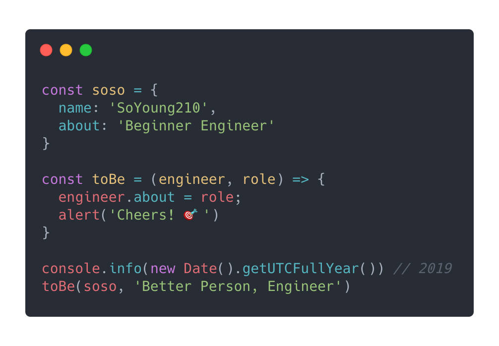
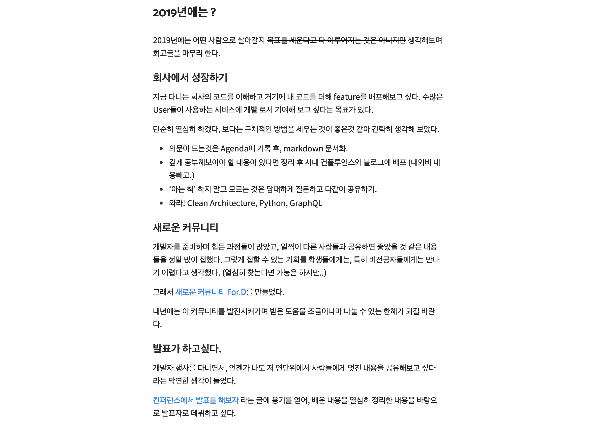
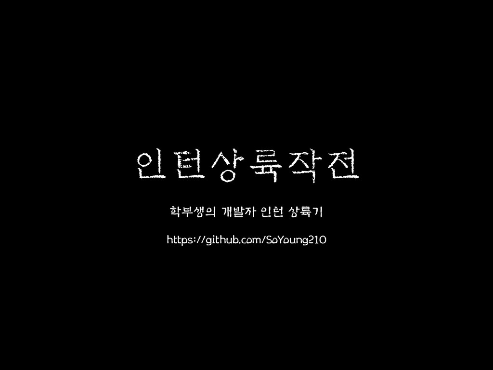
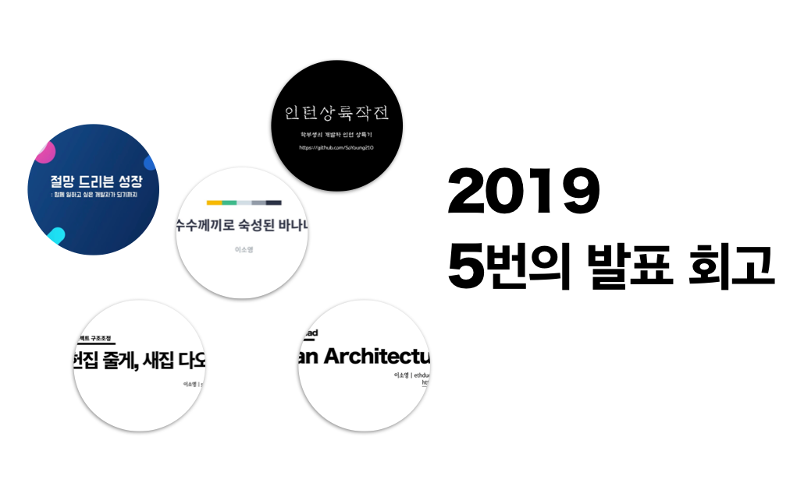
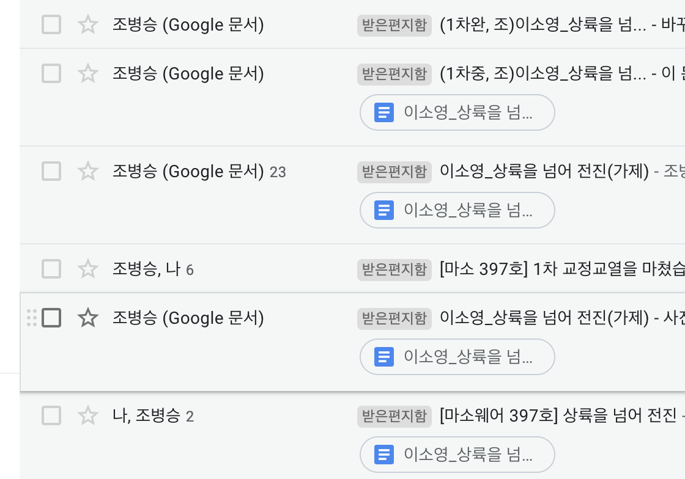
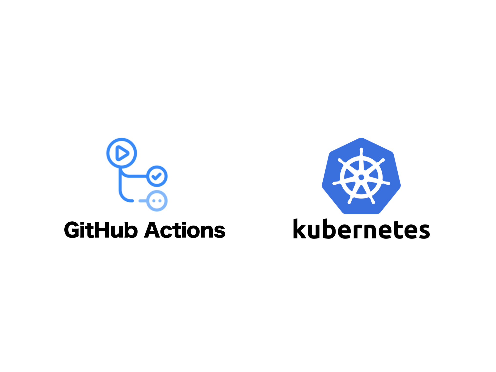

It's really the end of the year. And once again, a lot of people's retrospective posts are going up.
When I mentioned I was about to write mine, someone said this to me:
**"Looking back just makes me feel like I'm scolding myself, and planning for next year feels like a burden, so I've stopped writing them."**

I get that. My retrospectives aren't about "reflecting on my faults" — they're about "looking back" and "keeping a record."
So how was my 2019?

- A good outcome from an internship that was both an adventure and a challenge.
- 1.5 main projects.
- Infrastructure and documentation.
- 5 talks, 1 article, and a blog.
- Running the For.D community.
- You don't have to try so hard. No — you shouldn't try so hard.

For the first time in my life, I chose my profession, and I spent my first year on that path.

During the internship, "survival" was unavoidably the most important factor, and once that faded into the background, the things that actually mattered started coming into view.

## What I planned last year

Of the modest wishes I laid out in [last year's retrospective](https://so-so.dev/essay/retro2018/), I achieved most of them, save for a couple.

> I never got around to Python or GraphQL, but I plan to study them whenever I feel I need to.

I stood on a speaker's stage, something that had once felt so far away, and I got to contribute to production through code reviews and development.
It was my first full year as a developer.

A year passed with things I regret, things that made me feel for myself, and things I'm proud of.

## A good outcome from an internship that was both an adventure and a challenge

### 2018.12.26 ~ 2019.03.26

I spent three months on an internship that felt like three years. Since I'd burned my bridges (school) to choose this path, I desperately wanted a good outcome. Even if the result wasn't good, I wanted to be able to say to myself, "I couldn't have tried any harder than this" — so, with a bit of exaggeration, I planned and studied around the clock, without weekends.

Looking back now, honestly, that overexertion feels a little (a lot) sad.

I worked on two projects total during that time, and the second one was really hard.

There were plenty of things I should have discussed with my project teammates from different angles, and I stayed silent about them instead.

Even now, thinking it over again, I don't think I could have made a different decision back then. Rather than wanting to undo the past, looking back on it now, this is how I'd sum it up:

"There can be a better way to do anything. And I need to find that way."

For me, in the middle of my first project, the result of staying silent weighed pretty heavily.

> This line is from [Simple Software](https://so-so.dev/essay/simple-software/), and it's my favorite line of all.

I gained two big things.

- Feedback on my code: my code was rushed.
  - I had a compulsion that I had to "write it fast."
- I started wondering how I could do good work.
  - I still haven't landed on a clear answer.

I want to thank the teammates who have been with me from the internship until now.

## 1.5 main projects

### 2019.03 ~ 2019.09

Including the internship, I worked on 1.5 projects (one is pending).

The project I started after the internship was the first time I got to work through a [structural improvement](https://speakerdeck.com/soyoung210/heonjibjulge-saejibdao-riaegteu-peurojegteu-gujojojeong), and it was **a project where I collaborated a lot with designers and planners.**

The product's complexity was, as always, high, and to deal with it, some of the code I wrote got rationalized away with "there's no other way." Of course, looking back now, there's plenty of room for improvement.

> There's no such thing as "no other way." 😅

Working on a highly complex service alongside people in other roles made me realize that communicating through documentation, for the sake of archiving, was essential. I recalibrated how important documentation work was, from "if I have time left over" to "make time for it" (?), and now that the project has wrapped up, I'm honestly relieved that I did.

> My past self is a stranger to me (...)

I wanted to bring every dream and ideal our designer envisioned to life, but I felt pretty bad about my own lack of ability. In particular, I still regret that "I wish I'd been a little better with SVG…" Both the designer and I talked about things from the angle of how we could make the UX even better, but in the middle of that, having to bring up "technical limitations" stung a bit.

We set up our own design QA process and worked through this together, trying to find answers to how we could pull it off — it was genuinely enjoyable time. Design QA really is the more the merrier. Sitting down with the designer to look at screens with animation layered on and adjusting things along the way let us respond flexibly whenever we needed to, and it felt like a beacon that kept the project from losing its overall direction.

## 5 talks, 1 article, and a blog

### 2019.02 ~ 2019.12

This year I gave 5 talks in total, contributed one article to Microsoftware, and did a very small amount of blogging (...).

I wrote a separate retrospective on my talks [in this post](https://so-so.dev/essay/2019%EC%9D%98-%EB%B0%9C%ED%91%9C%EB%93%A4-%ED%9A%8C%EA%B3%A0/). This year I gave a lot of talks under the keyword "growth," but next year I'd like to give talks centered a bit more on technical content.

Thinking about why my blog went quiet, I think the compulsion that "it has to be perfect" weighed on me. I'm not a graceful writer, and the process of "write it once, then keep polishing... keep fixing..." scared me enough that I avoided it.

Next year, I want to let go of that mindset a bit and fill the blog with posts on all kinds of topics, without feeling so burdened.

Right now I'm planning to write about several translated posts on k8s along with the trial and error that came with it, and about the web project structure and various useful tools needed for production development.

I contributed to 'Microsoftware Issue 387: Learning Curve.' I'd known about Microsoftware magazine for a long time, but I never had the courage to apply to contribute — and while I was hesitating, an email came from the editor-in-chief.

Editor-in-chief: "Hey, would you be interested in contributing an article?"

> A lot of dramatization went into that line. 😅 (In reality, he asked very gently.)

I put together, across about 10 pages, the story from the moment I first decided to become a developer up through my internship.

I want to once again thank Editor-in-chief Byungseung Cho, who must have had a rough time dealing with my clumsy writing.
It was a meaningful opportunity to get to complete my own story alongside a professional editor, and to anyone who, like me, hesitates to contribute out of unfounded fear, I'd really recommend working up the courage to give it a try.

## Infrastructure and documentation

### 2019.10 ~ ongoing

I was a total blank slate on the environment where web services get deployed and on CI/CD, so I studied this area for the first time and wrote it up as documentation to share.

Honestly, up until now I thought of this as "outside my territory," but now I think that the initial deploy setup for a web service I've developed, and even direct monitoring of the operating environment, ultimately falls on the web developer too. Or, without putting it so grandly, what I really needed was "the minimum understanding required to collaborate."

> I didn't have the faintest idea how things were being operated, or what I needed to ask the DevOps team for when it came to deploy setup.

For the first time, I started studying a field outside of Front, and my goal is "being able to talk with the DevOps team without friction." 😁

## Running the For.D community

### 2019.04 ~ ???

I served on the organizing team of [For.D](https://www.facebook.com/ForDeveloperKorea/), a community for junior developers.
I started this community work because I'd received so much and wanted to give back, but **it was genuinely hard.**

Making sure attendees benefit from an event and putting together an event with nothing missing takes a lot of time from the organizers.
There's no compensation for that time. That was the hard part for me, and it's the part that gave me a lot to think about.

After running three events, doing For.D work on top of my actual job started to feel like a burden, and since everyone else has their own work too, I currently think of this as being in an indefinite hiatus, rather than anything more.

> I still haven't landed on any conclusion.

Still, my biggest regret from this year is that I don't think I wisely shared this burden with the other organizers — I feel like I mostly just left them carrying the weight.

## You don't have to try so hard.   No — you shouldn't try so hard

I'm not saying you should coast and collect a paycheck for nothing.

Starting from the internship, working late out of anxiety became a habit. Even after leaving the office, all I did was company work(!), and when estimating schedules, I naturally factored in and shared an `over run` estimate as well.

A runaway train with no brakes is bound to derail. My stamina was visibly dropping, and because all I did was run without ever stopping to organize my thoughts, I never had time to think about the direction of my career.

**It was a genuinely dangerous state to be in.**

I couldn't gauge "how much work I could do in how much time." And I realized I hadn't been looking at this as a career over the long term.
I stopped working late without exception. I started thinking about how to get the various experiences I need to grow as a developer, and while I still do work-related development after hours sometimes, I also started carving out time for myself — my blog, personal projects, and so on.

I'm working on taking the long view as a developer. I want to keep walking this path, and I think of it not as a sprint but as a marathon. 🏃‍♀️

## What about 2020?

Just like last year's retrospective, I'll close this one out with a modest set of plans.

### Finish the side project

I've set a goal of finishing, by April, the side project I just started at the end of this year.
I've made all kinds of excuses and haven't even merged the first PR yet, but for the first half of the year, I've decided to focus every bit of time outside work and exercise on this project.

### Back to exercise, again

Before I joined the company, I exercised consistently for over 10 months, and then took a full year off. My stamina has really dropped a lot.
This time, I'm going to learn tennis or squash and try to keep at it.

## Wrapping Up

I met so many things, worked hard, and next year let's grow past who I was this year.

This line also appeared in last year's retrospective, and it's the same this year. Except last year, that sentence was full of impatience, whereas this year I want to set aside the urge to "hurry up" and move forward thinking hard about `direction` instead.

Finally, everything written in this retrospective was only possible because of everyone I've met — I learned and grew because of them.

Thank you. And I look forward to 2020 as well.
