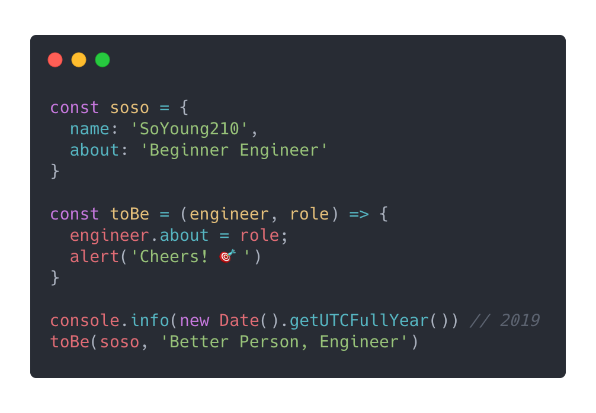
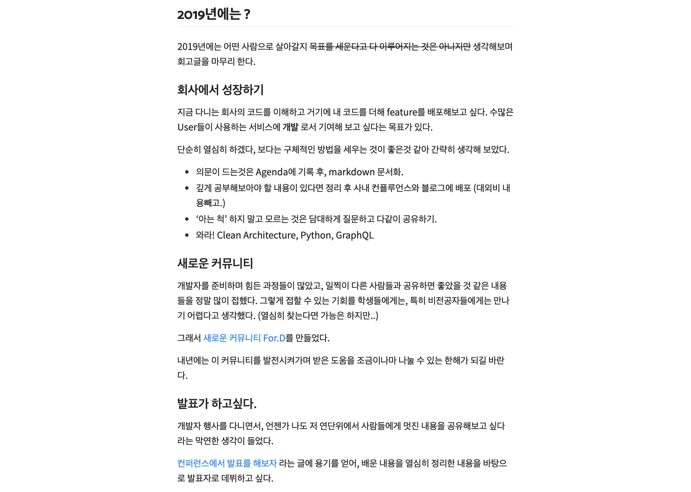
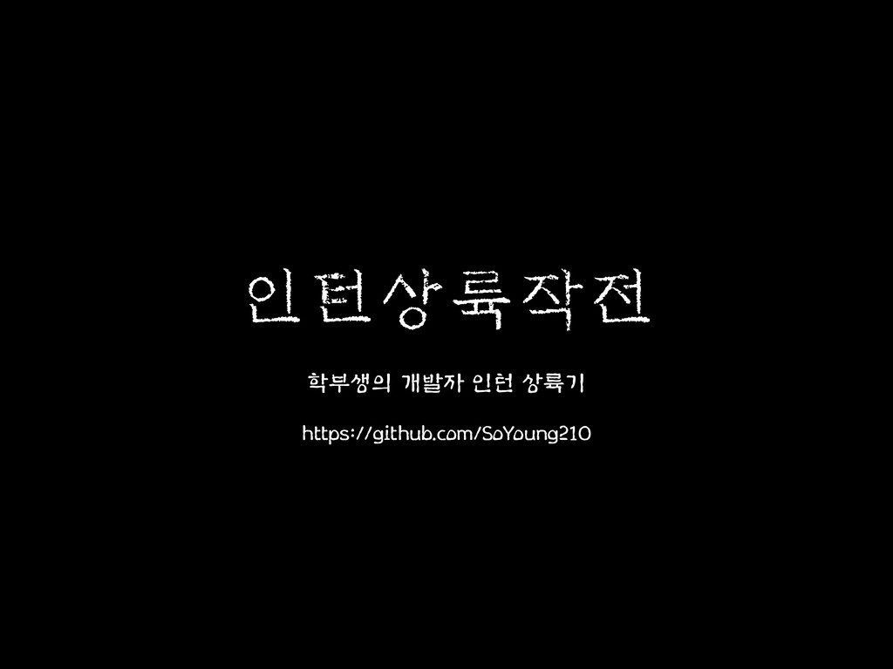
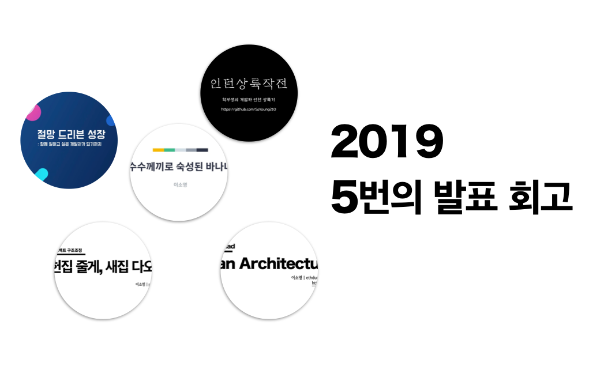
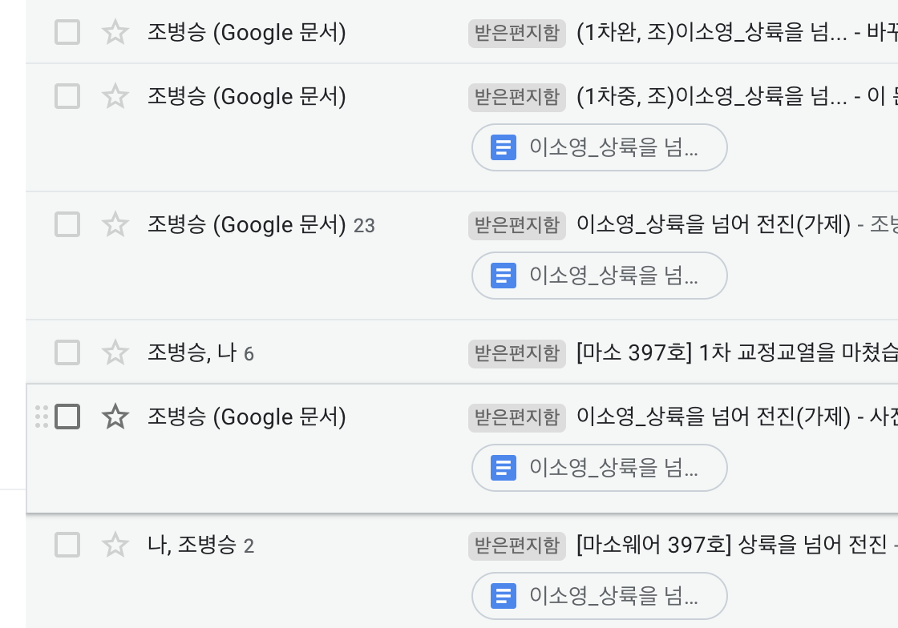
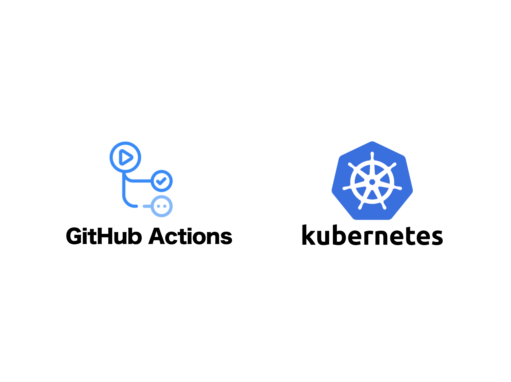
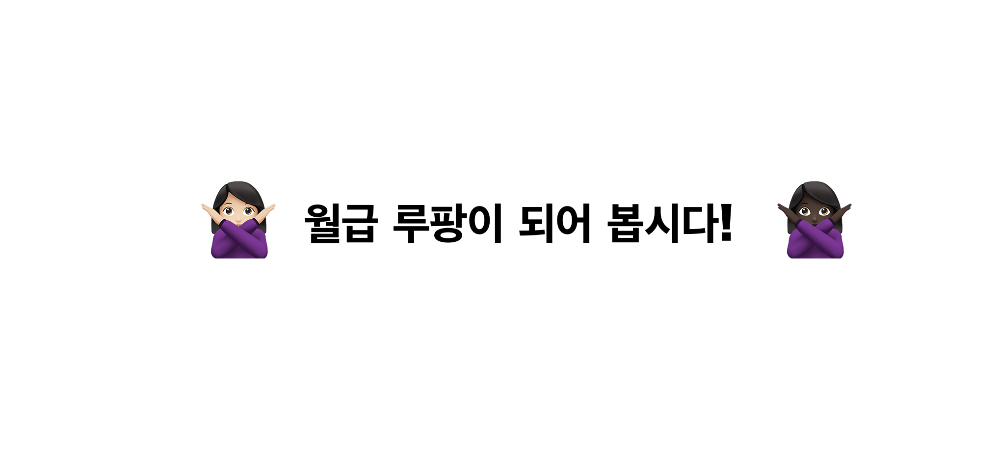

진정한 연말이다. 그리고 올해도 어김없이 많은 분들의 회고글이 올라오고 있다.  
곧 회고글을 쓴다고 하니, 이런 말을 들었다.
**"회고하면 반성만 하게 되고, 내년의 계획은 부담이 되는것 같아서 안쓰게 되더라구요.**

동감한다. 나의 회고글은 작년도, 올해도 '반성'이 아닌 '되돌아봄', '기록'을 목적으로 작성한다.  
나의 2019년은 어땠을까?

- 모험이자 도전이었던 인턴기간에서 좋은 결과.
- 1.5개의 메인 프로젝트
- 인프라와 문서화
- 5번의 발표, 1번의 기고, 그리고 블로그
- For.D 커뮤니티 운영
- 너무 열심히 애쓰지 않아도 된다. 아니, 너무 열심히 애쓰지 않아야 한다.

난생 처음 내 직업을 정했고, 그 길에서 첫 해를 보냈다.

인턴기간때 까지는 어쩔 수 없이 '생존'이 가장 중요한 요소였는데,
이 요소에 가려져 있던 진짜 중요한 것들이 보이기 시작했다.

## 작년에 계획했던 것

[작년 회고](https://so-so.dev/essay/retro2018/)에서 계획했던 소박한 소망들은 몇몇개를 제외하고 이뤘다.

> Python과 GraphQL은 다루지 못했지만 필요하다고 생각되는 순간 공부하려 한다.

멋진 내용은 아니지만, 멀게만 느껴졌던 발표자 단상에도 서보았고 코드 리뷰와 개발로서 production에 기여할 수 있었다.  
온전하게 개발자로서 보낸 첫 해였다.

후회되는 점도, 스스로 안쓰러웠던 점도, 뿌듯한 점도 있었던 한 해가 갔다.

## 모험이자 도전이었던 인턴기간에서 좋은 결과

### 2018.12.26 ~ 2019.03.26

3년같이 느껴졌던 3개월간의 인턴기간을 보냈다. 나름의 배수의 진(학교)을 치고 선택했던 길이었기 때문에, 간절하게 좋은 결과가 있길 바랬다. 결과가 좋지 않더라도 스스로 '이것보다 더 노력할 수는 없었다.'라고 말하기 위해 살짝 과장을 보태서 밤낮없이, 주말없이 계획하고 공부했던 것 같다.

사실 이렇게 오버 페이스로 했었던 것이 지금 생각하면 살짝(많이) 짠하다.

이 때 총 2개의 프로젝트를 했었는데, 두 번째 프로젝트때 많이 힘들었다.
여러가지 방면에서 같은 프로젝트 팀원분들과 논의했으면 더 좋았을 부분에 대해 침묵했다.

사실, 다시 생각해봐도 그 당시의 내가 다른 결정을 할 수 있을것 같지는 않다.
과거의 일을 되돌리고 싶다기 보다는, 지나고 나서 이 일을 돌이켜 보니 이렇게 정리할 수 있을 것 같다.

"모든 것에는 더 나은 방법이 있을 수 있다. 그리고 나는 그 방법을 찾아야 한다."

당시 첫 프로젝트를 진행하던 나에게 침묵의 결과는 꽤나 무거웠다.

> 이 말은 [심플소프트웨어](https://so-so.dev/essay/[%EC%84%9C%ED%8F%89]-%EC%8B%AC%ED%94%8C-%EC%86%8C%ED%94%84%ED%8A%B8%EC%9B%A8%EC%96%B4/)에 나온, 내가 가장 좋아하는 말이다.

크게 두 가지를 얻었다.

- 코드에 대한 피드백: 코드가 조급하다
  - '빠르게 짜야한다.'라는 강박관념이 있었다.
- 어떻게 하면 일을 잘 할수 있을까 라는 고민을 시작했다.
  - 아직 명확한 답을 내리지 못했다.

인턴 기간부터 지금까지 함께 하고 있는 지금의 팀원들에게 고마움을 전하고 싶다.

## 1.5개의 메인 프로젝트

### 2019.03 ~ 2019.09

인턴기간을 포함해서 1.5개(하나는 pending)의 프로젝트를 진행하였다.

인턴 기간 이후에 시작한 프로젝트는 처음으로 [구조 개선](https://speakerdeck.com/soyoung210/heonjibjulge-saejibdao-riaegteu-peurojegteu-gujojojeong)도 진행하고, **디자이너, 기획자와 많이 협업할 수 있던 프로젝트**였다.

프로덕트는 역시 복잡도가 높았고, 이를 해결하기 위해 대응 했던 코드는 그 당시에는 '깔끔하다.' 혹은 '어쩔 수 없다.'로 합리화 하며 달려나간 부분이 있다. 물론, 지금 보면 개선할 수 있는 부분이 넘쳐난다.

> 어쩔 수 없는것은 없다. 😅

복잡도가 높은 서비스를 다른 직군 분들과 협업하며 진행하다보니, 아카이빙을 위한 문서를 통한 커뮤니케이션이 필수적이라고 생각되었다. 문서화에 대한 일의 중요도를 `시간이 남으면`에서 `시간내서`로 고쳐잡았고(?) 프로젝트가 중단된 지금, 참 다행이다.. 라는 생각이 든다.

> 과거의 나는 타인이다(...)

디자이너님이 그리시는 꿈과 이상을 모두 실현시키고 싶었지만 능력이 부족해서 많이 속상했다. 특히 'svg를 조금만 더 잘다뤘더라면...'하는 아쉬움이 남는다. 나와 디자이너님 모두 어떻게 하면 UX를 좀더 좋게 할 수 있을까 라는 관점으로 대화했지만, 그 와중에 '기술적 한계'에 대해 말하는 것이 나름 속상했다.

자체적으로 디자인 QA도 잡고, 이 부분을 어떻게 풀어낼 수 있을까 같이 고민하며 답을 찾아나갔던 정말 즐거운 시간이었다.  
디자인 QA는 정말 다다익QA다. 애니메이션까지 얹어진 화면을 디자이너님과 함께보며 중간중간 맞춰나가다 보니, 그때 그때 유연하게 대응할 수 있었고, 프로젝트의 전체 방향을 잃지 않도록 해주는 등불같이 느껴졌다.

## 5번의 발표, 1번의 기고, 그리고 블로그

### 2019.02 ~ 2019.12

올해 총 5번의 발표를 했고, 마이크로소프트웨어에 한번의 기고를 했다. 그리고 아주 약간의 블로그(...)를 했다.

발표 회고는 따로 [이 글에서](https://so-so.dev/essay/2019%EC%9D%98-%EB%B0%9C%ED%91%9C%EB%93%A4-%ED%9A%8C%EA%B3%A0/) 적었다. 올 해는 '성장'이라는 키워드로 많이 발표했었는데 내년에는 조금 더 기술적인 내용을 중심으로 발표를 해보고 싶다.

블로그가 뜸했던 이유를 생각해보니, `완벽해야 한다`라는 강박관념이 부담되었던것 같다.
나는 글을 유려하게 쓰지 못하는데, '한번 작성하면 계속 다듬고.. 고치고..'하는 과정들이 두려워서 외면했다.

내년에는 이런 생각을 좀 내려놓고 부담없이 여러가지 주제로 블로그에 글을 채워보고 싶다.

지금 계획하고 있는 주제는 k8s에 대한 여러가지 번역글과 삽질기, 웹 프로젝트 구조와 Production 개발에 필요한 여러가지 유용한 도구에 대한 이야기를 쓰고 싶다.

'마이크로소프트웨어 387호: 러닝커브'에 기고했다. 마이크로소프트웨어는 예전부터 알고 있었던 잡지였는데 차마 기고 신청할 용기가 없어서 망설이고 있던 차에 편집장님께 메일이 왔다.

편집장님: "자네, 혹시 기고해볼 생각 없나?"

> 매우 많은 각색이 들어갔습니다. 😅 (실제로는 매우 젠틀하게 물어봐주셨습니다.)

이렇게 기회가 되어서 처음 개발자를 해야겠다고 다짐한 순간부터 인턴까지의 이야기를 사진포함 10page분량으로 정리했다.

못난 글로 많이 고생하셨을 조병승 편집장님께 다시한번 감사의 인사를 전하고 싶다.  
나의 이야기를 프로 편집장님과 함께 완성할 수 있어서 의미있던 기회였고, 나처럼 지레 겁먹어서 기고를 망설이는 분께는 꼭 한번 용기내서 도전하시는 것을 추천하고 싶다.

## 인프라와 문서화

### 2019.10 ~ ing

웹 서비스가 배포되는 환경과 CI/CD환경에 대해 백지의 무지 상태였는데, 이 부분에 대해 처음으로 공부했고 이를 정리해서 가이드 문서 형태로 공유했다.

사실, 이전까지는 '내 영역 밖의 일'이라고 생각했었는데, 지금은 결국 내가 개발한 웹 서비스의 첫 배포 셋팅이나 운영환경에 대한 직접적 모니터링까지 웹 개발자의 몫이라고 생각한다. 아니, 사실 이렇게 거창한 말을 붙이지 않더라도 '협업하기 위한 최소한의 이해'가 간절했다.

> 어떤 원리로 운영되고 있고, 배포 셋팅을 위해 devOps팀에게 무엇을 요청해야 하는지 하나도 몰랐었다.

Front외에 처음으로 다른 분야에 대한 공부를 시작했고, 'devOps팀과의 무리없는 대화'가 목표이다.😁

## For.D 커뮤니티 운영

### 2019. 04 ~ ???

주니어 개발자를 위한 커뮤니티인 [For.D](https://www.facebook.com/ForDeveloperKorea/)운영진으로 활동했다.  
받은 것이 정말 많아서 돌려주기 위해 시작했던 커뮤니티 활동이었는데, **정말 어려웠다.**

행사에 참가하시는 분들에게 도움이 되고, 부족함 없는 행사를 준비하기 위해서는 운영진들의 많은 시간이 소요된다.  
그 시간에는 어떠한 보상도 없다. 이 점이 나에게는 어려운 부분이었고, 많은 고민을 하게 했던 부분이다.

3번의 행사를 진행하면서 나의 본업인 일도 하면서 For.D의 일을 한다는 것이 부담되기 시작했고, 모두 이렇게 각자의 일이 있다보니 현재는 잠정적 휴식기가 아닌가.. 라고 생각하고 있다.

아직은 그 어떤 결론도 내리지 못했다.

다만, 이런 부담을 다른 운영진 분들과 지혜롭게 나누지 않고, 짐만 지워드렸던것 같아 올해의 큰 아쉬움으로 남는다.

## 너무 열심히 애쓰지 않아도 된다.   아니, 너무 열심히 애쓰지 않아야 한다

절대 월급 루팡이 되어야 한다는 것은 아니다.

인턴 기간때부터 초조함에서 오는 야근이 습관이 되었었다. 퇴근 시간 이후에도 회사 업무만(!) 했고, 일정을 추산할 때도 자연스럽게 `over run`까지 추정해서 공유했다.

브레이크 없는 폭주기관차는 탈선하기 마련이다. 정말, 체력이 눈에 띄게 떨어지는것이 느껴졌고, 정리 없이 달리기만 하다 보니 내 커리어 방향에 대해 고민하는 시간이 없었다.

**매우 위험한 상태였다.**

'내가 얼마만의 시간동안 어느정도의 일을 할 수 있는 사람'인지 가늠할 수 없었다. 그리고, 직업으로서 길게보지 못했다는 생각이 들었다.  
예외 없이 하던 야근을 멈추었다. 개발자로 일하면서 성장하기 위해 필요한 여러가지 경험을 어떻게 할 것인가에 대한 고민을 시작했고, 퇴근 후 시간에 업무 개발을 할때도 있지만, 내 시간(블로그와 개인 프로젝트 등)도 가지기 시작했다.

개발자로서 길게 보기 위해 노력중이다. 계속해서 이 길을 가고 싶고 이 길은 전력질주가 아닌 마라톤이라고 생각한다. 🏃‍♀️

## 2020년에는?

작년 회고에도 그랬듯, 소박한 계획을 세우며 회고글을 마무리 한다.

### 사이드 프로젝트 완성

올해 연말 새로 시작한 사이드 프로젝트를 4월에 완성하는 것으로 목표를 잡았다.  
이런 저런 핑계를 대며 아직 첫 번째 PR도 merge하지 못했지만, 상반기에는 업무 와 운동 외 시간은 이 프로젝트에만 집중해보기로 했다.

### 다시, 운동

회사 다니기 전 10개월 넘게 했던 운동을 1년동안 쉬었다. 체력이 정말 많이 떨어졌다.  
이번에는 테니스나 스쿼시를 배워서 꾸준히 해보려 한다.

## 마무리

정말 많은 것들을 만났고, 수고했고 내년에는 올해의 나보다 성장하자.

작년 회고 글에도 있던 내용인데, 올해도 동일하다. 다만, 작년에는 조급한 마음이 가득 담겨있던 문장인데, 올해는 '빨라야 한다.'라는 조급함은 내려놓고 `방향`에 대해 많이 고민하며 나아가고 싶다.

끝으로, 회고록에 적은 모든 내용은 제가 만났던 모든 분들덕에 배웠고 성장했기에 가능했던 내용들이었습니다.

감사합니다. 그리고 2020년에도 잘부탁드립니다.
