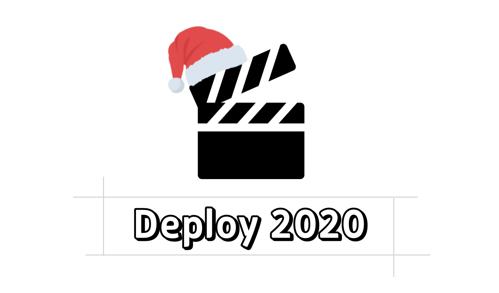

Retro season is back again, like clockwork. I remember thinking last year too that time flies, but this year it feels even more true.

I write these to look back, put things on record, and give some future version of me a chance to revisit this exact moment.

So, how was 2020 for me?

- I found out there's a lot more I don't know than I thought.
- Running [Banksalad Product Language](https://blog.banksalad.com/tech/banksalad-product-language-ios/) (BPL from here on, the design system we use at Banksalad) taught me a lot and gave me plenty to worry about.
- I spent a lot of time wondering what my role as a developer even is.
- I helped run a conference as part of the FEConf organizing team.

I started my career in December 2018, so I'm three years in now. 'Years of experience' can only ever capture a sliver of what someone's actually been through, but the number still piles up in a way that scares me a little each year. The number is visible; how fast I've actually grown isn't, and I think that gap is exactly where the fear comes from, wondering whether my skills actually match a '3rd-year developer.'

Back when I was a student, I vaguely pictured myself as a 3rd-year developer being some kind of superhuman who could build anything, fast. This year, instead of chasing that fuzzy ideal, I want to actually sit down each year and decide what kind of developer I want to be.

## There's More I Don't Know Than I Thought

This time last year, I'd just started out and felt proud just watching my experience add up through everything new I was running into. I was learning as I went, sure, but I was mostly just knocking down whatever problem was directly in front of me, so I never really had a clear sense of what I didn't know.

Things I used to think were 'good enough' started looking different, and I realized the standards I'd set back then were built on a lot of stuff I just didn't know yet.

Makes sense, really, since I've studied and lived through a lot more since setting those standards. Still, back then I'd never seen my own standards shift, so I was way too confident in my own opinions, and looking back, that's a little embarrassing.

Next year, here's what I want to dig into more:

- Good components and design
- Form Control
- Accessibility
- Animation
- Infra Structure
- GraphQL (w. Relay)

## BPL

I run Banksalad Product Language (BPL). Out of every project I touched this year, it's the one that taught me the most, the one I regret the most, and, somehow, the one I love the most.

The 'regret' part is really just wanting to have done better. My team and I have been building out this design system through plenty of trial and error, and one shaky decision early on means we're still migrating away from old rules today. Getting it right from day one was probably never realistic, but looking back, I still wish a lot of it had gone differently.

**'Worse than a bad decision is a slow one. Worse than a slow decision is one you keep reversing.'**

We managed to make all three kinds. I'll save the details for a post of their own if I ever get around to it, but the short version: for a long stretch, we just weren't paying attention to what actually matters once something starts to scale.

I can't get every single decision right, but I want every one I make to come from really sitting with 'how much weight this package carries for everyone using it' and 'what this looks like years from now.' I'm lucky, and really grateful, to have teammates who sit with that too.

Beyond the technical calls, I felt firsthand just how much the small, careful stuff matters when you're maintaining a library. Asking whether the teammate next to me, or my whole team, would actually be happy using this tool demanded a completely different kind of thinking than my usual day-to-day. Breaking releases, backward compatibility, keeping the environment friendly for contributors, DX (Developer Experience): this was the first time I'd really sat with any of it.

On the technical side, working through the rules a package-level component has to follow, designing global components, and building out interactions all stretched my range a bit further as a frontend developer.

## Figuring Out My Role

Last year, most of my energy went into how do I get better at this. This year, I spent a lot more time asking what should I even be doing. Not tasks exactly, more like: out of everything my team actually needs, which piece am I the right person for? Alongside taking on new work, I also spent time looking back at what I'd already done.

I want to be **the person who speaks up: keep doing what's good, drop what's bad, without hesitation.** And I don't want that just for myself, I want to share that habit with my teammates too. Next year, I'd like a lot more tea-time chats and mutual feedback sessions with the team.

Code review is a good example of this year's Good and Bad. I'd get caught up chasing different angles during review, which sometimes slowed down the back-and-forth, and made some of my reviews a bit too philosophical for their own good. I put real effort into those reviews, so hearing 'we don't have time for that' stung more than once, and those moments added up into pressure.

Looking back now, that 'pressure' was a monster I built myself for no reason, and all those reviews were actually growth. Here's the Good and Bad I'd pull out of code review this year.

- Good: Not holding back on an opinion just because it comes from a different angle. If it turns out I just didn't know something, that's a chance to learn; if not, it's a reason for all of us to think a bit harder. Looking at a problem from another angle almost always turns something up.
- Bad: Getting hurt 'because I put in the work.' Borrowing a line from [Leadership and Self-Deception](http://www.yes24.com/Product/Goods/11520753) (published in Korean as The Person Outside the Box), I think I was living inside the box. Even doing the exact same thing, I want to stop doing it from inside the box, meaning, centered on myself.

## FEConf2020 at Home

I've picked up so much knowledge and help from how freely this developer community shares, that I've wanted to give something back, in whatever shape that takes, since 2018, when I first got involved with FEConf. First as a volunteer, then giving a talk, and this year, on the organizing team.

Getting [FEConf2020](https://2020.feconf.kr/) ready was a lot of fun, working alongside people who brought such good energy, and it also showed me firsthand how much work runs a community, which left me grateful realizing just how much more effort people were pouring into this ecosystem than I'd ever guessed. My deepest thanks to the fellow organizers, the speakers who put together great talks, and everyone who showed up curious about the event.

Next year, I really hope the pandemic's over enough that we can finally do this in person again.

## Who Do I Want to Be in 2021?

I want to be a good colleague to whoever's sitting next to me. To me, that means being someone trusted to build the product and make it better, someone whose technical knowledge and experience actually solves a teammate's problem when it counts, and someone people can bring their worries to.

I've got a handful of goals, but the one worth writing down here is studying infrastructure. I want to actually understand, and be able to dig into, everything that happens between shipping a web service I built and it reaching a real user. I think I made this same promise to myself last year, and so far I've only really gotten to 'I roughly understand the shape of it.'

> Even getting to write 'I understand it,' as little as that is, took a lot of help from [@JungWinter](https://github.com/JungWinter). Thank you.

I'm curious what story ends up in next year's retrospective. I'm the one writing it as I go, so I want it to be one I don't regret.
