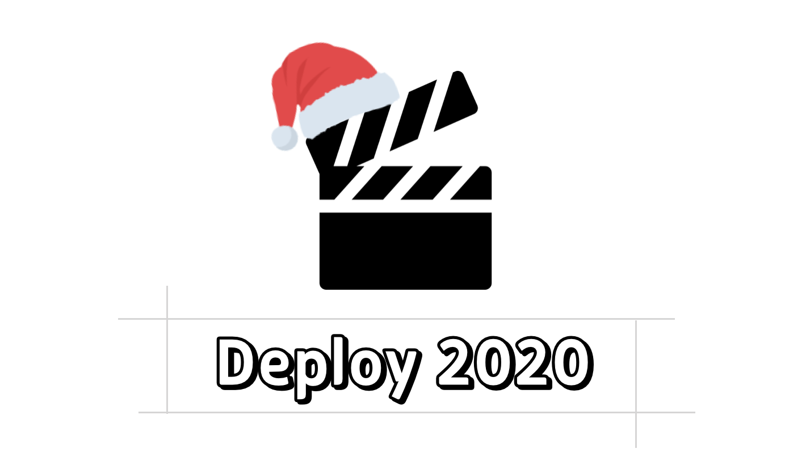

어김없이 회고 시즌이 돌아왔다. 작년에도 '시간이 참 빠르게 지나갔구나'라고 생각한 것 같은데, 올해가 더 그런 것 같다.

되돌아보고, 기록하고, 언젠가 이맘때의 나를 다시 보기 위해 회고 글을 작성한다.

나의 2020년은 어땠을까?

- 아는 것보다 모르는 것이 많아졌다.
- [Banksalad Product Language](https://blog.banksalad.com/tech/banksalad-product-language-ios/)(이하 BPL, 설명: Banksalad에서 사용하는 Design System)을 운영하며 많은 경험을 했고, 고민도 생겼다.
- 개발자로서 내 역할에 대한 고민이 많았다.
- FEConf 운영진으로 컨퍼런스를 개최했다.

2018년 12월, 처음 커리어를 시작해 이제 3년 차 개발자다. 어떤 사람의 경험을 나타내는 데에 있어 '연차'라는 지표는 극히 일부분만을 표현할 수 있지만, 그럼에도 매년 쌓여 가는 연차가 두렵다. 숫자는 눈에 보이지만 성장 속도는 눈에 보이지 않으니 내가 '3년 차 개발자'에 맞는 실력을 갖추고 있는지에 대한 두려움이 생기는 것 같다.

학생 때를 되돌아보면 3년차 개발자가 되었을 시점에는 막연하게 '무엇이든 빠르게 만들 수 있는 슈퍼 개발자'가 될 것 같다고 생각한 것 같다. 이제는 이런 추상적인 목표 말고, 매년 어떤 개발자가 되고 싶은지 다시 생각 해보려 한다.

## 모르는 것이 많아졌다.

작년 이맘때를 생각해보면, 이제 막 개발자로 시작해서 다양한 경험을 하며 경험이 늘어난다는 것에 뿌듯했던 것 같다. 내 앞의 모르는 것들을 배워 나가고 있었지만, 그때는 당장 마주해야 하는 문제들 위주로 격파해나가고 있었기 때문에 '내가 모르는 것'이 무엇인지 잘 몰랐다.

과거에 '이 정도면 괜찮지' 했던 것들이 다르게 보이기 시작했고, 과거에 생각했던 기준들은 많은 무지에서 세워졌음을 깨달았다.

'그 기준'을 세울 때보다 많은 것들을 공부했고 경험했으니 어찌 보면 당연한 일이다. 다만, 그때는 기준이 바뀔 수 있다는 것을 경험해본 적이 없어서 내 의견에 너무 자신만만했던 것 같아 조금 부끄럽다.

내년에는 이런 키워드들에 대해 더 공부해보고 싶다.

- 좋은 컴포넌트와 설계
- Form Control
- 접근성
- Animation
- Infra Structure
- GraphQL(w. Relay)

## BPL

Banksalad Product Language(이하 BPL)을 운영하고 있다. 올 해 진행했던 프로젝트 중 가장 많이 배웠고, 가장 많이 후회하며 가장 사랑하는 프로젝트이다.

가장 많이 후회한다고 적은 이유는, 좀 더 잘하고 싶어서다. 팀원들과 여러 좌충우돌을 겪으며 디자인 시스템을 만들어나가고 있는데, 처음에 했던 아쉬운 결정으로 아직도 예전 규칙에 대한 마이그레이션을 진행 중이다. 처음부터 잘하는 것은 힘들었겠지만, 돌이켜 생각해보면 많은 아쉬움이 남는다.

**'좋지 않은 결정보다 나쁜 것은 느린 결정이고 느린 결정보다 나쁜 것은 번복되는 결정이다'**

세 가지 결정을 모두 내렸다. 구체적인 내용은 기회가 된다면 별도의 글에서 다룰 예정이라 간단하게만 말하자면, '규모가 커질 때 중요하게 여겨질 것들'에 대해 간과하고 있었던 기간이 길었다.

매 순간 좋은 결정을 내리기는 어렵겠지만, 어떤 결정을 내릴 때는 '모두가 사용하는 패키지의 중요성'과 '장기적인 모습'을 생각하며 밀도 높은 고민을 하려고 한다. 이런 고민을 함께해줄 동료들이 있어 다행이고, 감사하다.

기술적인 결정들 외에도, 라이브러리 운영에서 세심하게 신경 써야 하는 부분들의 중요성에 대해 몸소 느낄 수 있었다. 내 옆자리 동료, 우리 팀이 이 도구로 행복할까를 고민하는 일은 평소 하던 개발과 다른 차원의 시야를 요구했다. Breaking Release, 하위 호환성, Contributor에게 친절한 환경, DX(Developer Experience, 개발자 경험) 등의 키워드에 대해 처음 고민해 봤다.

기술적으로는 패키지 레벨의 컴포넌트가 지켜야 하는 규칙, 전역 컴포넌트 설계, 인터랙션 등을 경험 해보면서 프론트엔드 개발자로서 폭을 약간 넓힐 수 있었던 것 같다.

## 내 역할에 대한 고민

작년에는 어떻게 하면 내가 더 잘할 수 있을까에 대해 주로 고민했었다. 올해는 많은 시간 내가 무엇을 해야 할까 고민했다. 단순히 task가 아니라, 현재 있는 팀에서 필요한 일이나 역할 중 내가 잘 할 수 있는 부분이 무엇일까에 가깝다. 새로운 일과 더불어 내가 했던 일에 대해서도 다시 생각해보는 시간을 가졌었다.

**"좋은 것(Good)은 지속하고, 나쁜 것(Bad) 것은 주저 없이 멈추는 것을 제안하는 역할"을 하고** 싶다. 여기서 적은 좋은 것은 지속하고 나쁜 것을 멈추는 것을 나 뿐만 아니라 팀원들과도 공유하고 싶다. 내년에는 팀원들과 티타임이나 상호 피드백을 주고받는 시간을 많이 가져 보고 싶다.

올해의 Good, Bad는 코드 리뷰를 예로 들 수 있겠다. 나는 코드 리뷰 과정에서 다른 관점으로 이리저리 생각하느라 리뷰 핑퐁이 늦어지거나 다소 철학적인 리뷰도 했었던 것 같다. 내 나름 리뷰에 많은 공을 들이다 보니 '일정 상 어렵다'라는 얘기가 서운했던 적도 있었고 그 순간들이 모여 부담이 됐다.

지금 생각해보니 '부담'은 불필요하게 스스로 만든 괴물이었고, '많은 리뷰'는 성장이었다. 코드리뷰에서 Good과 Bad를 뽑아보자면 이렇게 정리할 수 있을 것 같다.

- Good: 다른 관점에서의 의견을 말하는 것에 주저하지 않기. 그 의견이 나의 무지 때문이었다면 배울 수 있는 기회가 될 것이고 아니라면 우리 모두에게 한번 더 고민하는 시간이 될것이다. 문제를 다른 시각으로 바라봤을 때 얻을 수 있는 것들이 있다고 생각한다.
- Bad: '내가 공들였기 때문에' 속상해하기. [상자 밖에 있는 사람](http://www.yes24.com/Product/Goods/11520753)의 문장을 빌리자면, 나는 상자 안에 있었던 것 같다. 같은 행동을 하더라도, 상자 안에서('나'를 중심으로 생각하는 것) 하는 것을 멈추려 한다.

## FEConf2020 at Home

개발 커뮤니티가 실천하는 공유로 많은 지식과 도움을 받았기 때문에 어떤 형태로든 커뮤니티의 발전과 운영에 도움이 되고 싶어 2018년부터 FEConf에 참여하고 있다. 처음엔 자원 봉사자로, 그 다음은 발표자료, 올 해는 운영진으로 참여했다.

[FEConf2020](https://2020.feconf.kr/)을 준비하면서, 긍정적인 에너지를 가진 분들과 함께 해서 즐거웠고 커뮤니티 운영의 고충도 느끼면서 많은 사람이 개발 생태계를 위해 내가 생각한 것보다 더 많이 노력하고 있다는 생각에 감사한 마음도 들었다. 함께 해주신 운영진분들과 좋은 발표를 준비해주신 연사자분들, 그리고 행사에 관심가져 주신 모든 참가자분들께 진심으로 감사드린다.

내년에는 꼭 코로나 종식으로 오프라인 행사가 가능해졌으면 좋겠다.

## 2021년의 나는 어떤 사람이 되고 싶은가?

옆자리 좋은 동료가 되고 싶다. 내가 지향하는 '좋은 동료'의 모습에는 서비스를 만들어가는 사람으로서 신뢰받으며 더 나은 서비스에 기여하고, 많은 기술적인 지식과 경험으로 동료들의 문제를 직접 해결해 줄 수 있는 모습, 그리고 서로의 고민을 나눌 수 있는 모습들이 포함된다.

여러 가지 목표가 있지만, 그중에서 적고 싶은 것은 Infra에 관한 공부이다. 내가 만든 웹 서비스가 배포되어 유저에게 전달되기 까지 필요한 요소들을 이해하고 직접 들여다볼 수 있는 개발자가 되고 싶다. 작년에도 비슷한 다짐을 한 것 같은데, 아직은 대략적인 흐름을 조금 이해했다 정도인 것 같다.

> 회고 글에 짧게나마 '이해했다'라고 적기까지 [@JungWinter](https://github.com/JungWinter) 님께 많은 도움을 받았습니다. 감사합니다.

2021년의 회고를 쓸 때 담길 이야기가 궁금하다. 그 이야기를 만들어 가는 것은 나 자신이니 후회 없는 이야기를 쓰고 싶다.

## Thanks To,

끝으로 언제나 옆에서 좋은 동료, 친구가 되어주는 [Jbee](http://github.com/JaeYeopHan) 님께 감사드립니다.
