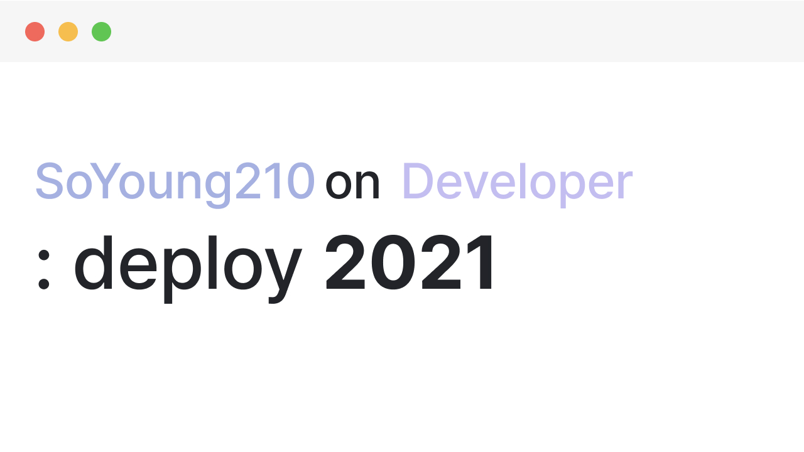
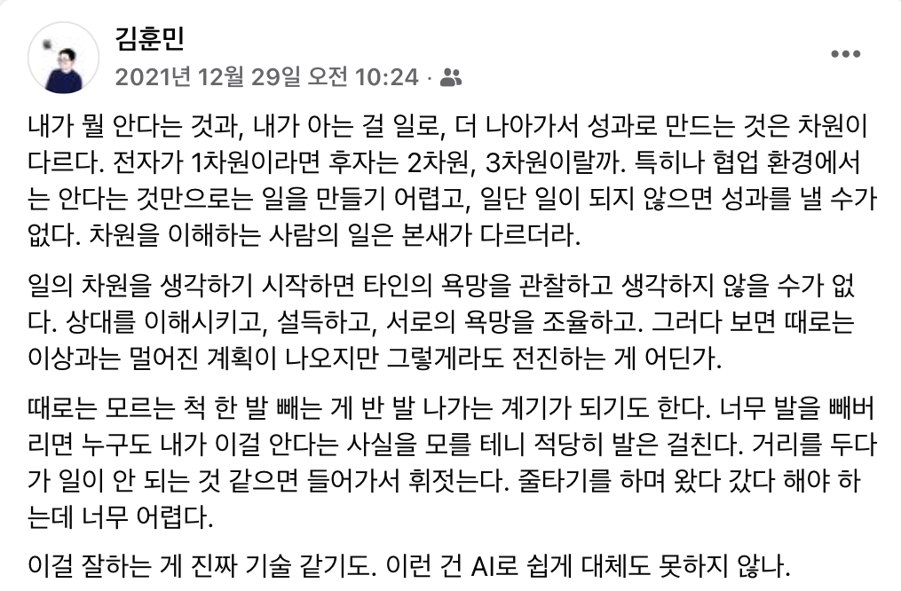
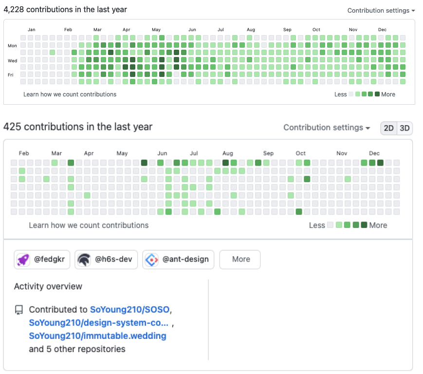

## The story I wrote last year

Looking back on this year, I ended up walking in a fairly different direction from what I had in mind when I wrote [last year's retrospective](https://so-so.dev/essay/retro2020/#2021%EB%85%84%EC%9D%98-%EB%82%98%EB%8A%94-%EC%96%B4%EB%96%A4-%EC%82%AC%EB%9E%8C%EC%9D%B4-%EB%90%98%EA%B3%A0-%EC%8B%B6%EC%9D%80%EA%B0%80).

One of the big goals I had last year was studying infrastructure. But I switched to a new company this year and things got hectic, and the fact that this word only crossed my mind again while writing this retrospective probably means I let it sit near the bottom of my priorities for a long time.

The new place obviously runs on different systems, and if I'd had a solid enough grasp of the knowledge that cuts across systems, I could have poked around anyway — but that wasn't the case, so I didn't dive in aggressively.

So, to sum it up, I had fewer occasions to directly look into infrastructure than before, and other things took priority, so last year's hope didn't pan out.

## The story I wrote this year

I started my career on December 26, 2018, and I've just passed the three-year mark. When I wrote my retrospectives the year before last and last year, I was at the stage of drawing a new picture on a blank canvas, so I felt proud of how much I'd accomplished and learned. This year, I don't think I painted as many different pictures as back then.

Until now, I had a strong urge to grow more as a "good engineer" than as a "good teammate." I wanted to develop hard skills more than soft skills.

This year, I paid a lot of attention to growing as a "good teammate." I wanted to be remembered by the PMs, designers, and engineers I work with as someone they'd want to keep working with. I thought that would require focusing on impact, the ability to estimate schedules well, and a shared language and set of skills for understanding each other's situations even across different backgrounds. And I spent a lot of time busy thinking about what I needed to do to build that kind of ability and skill. (I still have the same goal, and I still think the same way.)

That's not to say I completely ignored the "good engineer" side of things (just relatively less so). While building a product whose requirements kept changing, every time I ran into a moment where I felt something was "inconvenient" — which patterns made it easy to reflect requirements, which parts acted as hurdles when modifying a feature designed with pattern A — I thought about whether there might be a better solution.

The thinking and the outcomes around which layers to separate and how to abstract them sometimes confirmed that my earlier thinking was right, and sometimes told me it was wrong.

I believe growth starts with "reflection," and I think this year, too, was a year where I became a bit sturdier than last year through a lot of that reflection.

## Switching jobs

I switched to a new place this past February.

Looking back, I struggled quite a bit to adjust at first. I lacked a sense of stability in the unfamiliar environment and pushed myself hard to adapt quickly. Thinking about it now, I didn't need to push myself that hard — I just had a strong desire to quickly become a teammate the new place could trust.

The unfamiliar environment made for some tough times, but it also let me broaden the direction of my experience, and I grew along the way. Solving complex problems at a place building a new product, I —

- came to feel strongly how important a design that's both flexible and solid (a.k.a. flashy yet simple) is.
- kept thinking (and still need to keep thinking) about which modules should depend on which, and what the right scope of dependency is for each module (at the larger scale, services; at the smaller scale, package pieces).
- have been thinking about what should be shared versus managed individually, and at what point to generalize (abstract) something, trying out various approaches while I search for good patterns.
- learned a lot technically while solving, or watching others solve, problems common across the chapter.
    - [A shared way of declaring remote resources, the resulting improvements to how we use react-query, and the process of integrating an OpenAPI Generator (https://openapi-generator.tech/)](https://twitter.com/heejongahn/status/1426420910563631105)
    - approaches to i18n
    - and more...

The product is growing fast, and naturally there are plenty of problems left to solve. I'm looking forward to the process of solving the problems I'm facing now, and the ones I'll face going forward.

## Thinking about 'efficiency'

One shortcoming I recognized in myself early in my career is that "I'm not fast."

- I spend a lot of time thinking about "good code." Because I consider a lot of different situations, my design and implementation tend to take a while every time.
- I always have the urge to solve problems well. This is probably obvious for everyone, but if I sensed the seed of a problem or inefficiency, I had a strong urge to root it out the moment I spotted it.

I figured speed is one of the genuinely important factors at a startup, and I tried out and executed on various action items to improve my speed in a way that fit me.

The most important premise throughout this process was **"clearly distinguishing between problems that need to be solved well right now and ones that don't."**

For example, when building some component, it's difficult to consider every use case from the very start, and it's not an efficient approach to design around use cases that don't even exist. Of course, considering flexibility and extensibility within a reasonable scope is something you obviously have to do — but it doesn't mean you need to keep agonizing over imagining cases that don't exist.

The design and structure at the big-picture level falls into the category of problems that need to be solved well right now, but I think the detailed rules within that structure are something that can be improved gradually.

The same logic applies to process and automation. An immature process naturally gets feedback from the people involved, and I think improving it at that point can develop it in a direction that easily satisfies many people's needs. It would obviously be great if it were built to satisfy everyone from the start, but it can be hard to find the silver bullet in one shot, and there may not be enough resources (time, people) to invest at that point.

Conversely, there are also problems that need to be solved well from the very beginning. You need to make sure that the way you solve something adequately for now doesn't become technical debt down the road and turn into a blocker right when you actually want to solve the problem well. This seems to happen more often the more something is shared by everyone, rather than confined to a single application level.

By thinking about what's important and what isn't right now, how much resource to bet on solving the problem currently at hand, and what fallback to choose if the approach I'm trying fails, I'm gradually finding ways to raise **'efficiency.'**

  Shoutout to <a href="https://blog.naver.com/jukrang" target="_blank">KimCoding</a>

Honestly, this thinking about efficiency started from wanting to do my job better. There will be moments where my own preferences matter more. But that's not always true, so I need to move forward while understanding the situation of my teammates and the organization.

## Wrapping up

  Looking back at my 2021 commits [(top): work account / (bottom): personal account]

When I think about how much I grew personally this year, honestly, I don't feel like I grew all that much.

Actually, it's gotten harder to answer the question "what is growth?" more clearly than I could before. In [a post about growth](https://so-so.dev/essay/no-silver-bullet/#%EC%A0%95%EC%9D%98), I defined it as 'broadening the range of perspectives you can take.' But given that the range of perspectives I've gained has widened compared to last year, and I still feel like my growth was minimal, that premise doesn't seem sufficient.

My thinking about the definition of growth has changed. Now I think growth is about defining which areas I consider myself to have expertise in, what I need to fill in to build that expertise, and then actually acquiring what's needed. (I might look back on this premise next year and decide it isn't sufficient either.)

This year, I kept asking myself, "what kind of developer do I want to be?" Where before I could only see a single straight road with no forks, now I can gradually see a variety of paths. First, before thinking about direction, I think I need a bit more time to build meta-awareness of what kind of person I am. This direction could change too, but around the middle of this year I started thinking I'd like to build for Players (people involved in advancing the product).

## The story I want to write next year

Less goals, more things I'm interested in...

- **Tooling:** I think one of the biggest changes in the JS ecosystem this year has been bundlers like [swc](https://swc.rs/) and [esbuild](https://esbuild.github.io/). The material used to build tools is shifting away from JS, toward [Rust](https://www.rust-lang.org/)/[Go](https://go.dev/). I've heard from people around me that Go is a bit harsh, so if I try this out, I'll probably end up building some kind of productivity tool in Rust.
- **Drawing:** I want to try my hand at visual expression, things like 3D or SVG. Personally, courses don't suit me that well, but I'm considering taking [threejs-journey](https://threejs-journey.com/).
- **Open source:** I have a few things I want to build, and I'd like to build them and keep maintaining them. Things like a resource automation tool built on the [Figma API](https://www.figma.com/developers/api), a Blog Management System, helping my spouse with their open source, and so on.

Lastly, next year I want to become a bit sturdier person than I was this year. 🌈
