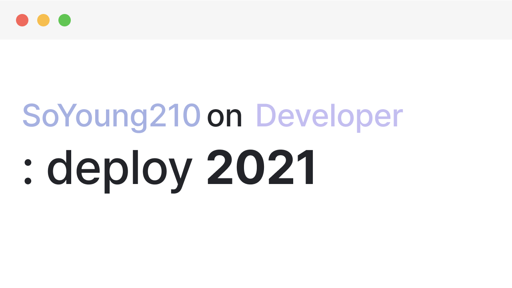
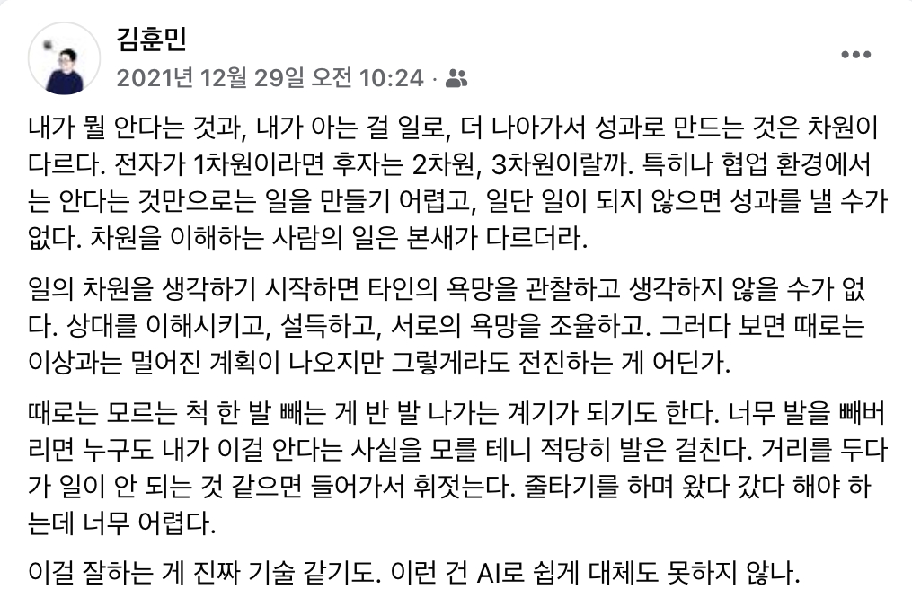
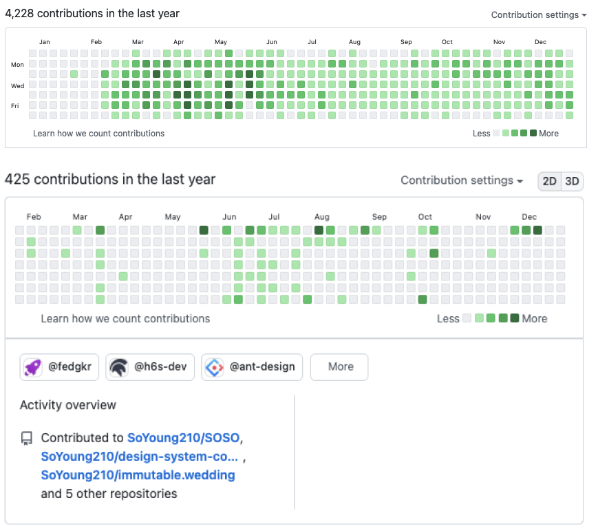

## 작년에 썼던 이야기

올해를 돌아보니 [작년 회고를 쓸 때 생각했던 방향](https://so-so.dev/essay/retro2020/#2021%EB%85%84%EC%9D%98-%EB%82%98%EB%8A%94-%EC%96%B4%EB%96%A4-%EC%82%AC%EB%9E%8C%EC%9D%B4-%EB%90%98%EA%B3%A0-%EC%8B%B6%EC%9D%80%EA%B0%80)과는 꽤 다른 방향으로 걸었다.

작년에 생각했던 큰 목표 중 하나는 Infra관련 공부였는데 올해 새로운 곳으로 이직하고 정신없이 보내다 보니 회고를 쓸 즘에야 이 단어를 다시 떠올리는 걸 보면 여러 가지 우선순위 뒤쪽에서 오래 방치해뒀다는 뜻이겠다.

새로운 곳은 당연히 시스템이 다르고, 시스템이 다르더라도 관통하는 지식이 탄탄하면 무언가 기웃거릴 수 있었겠지만 그건 아니었기 때문에 적극적으로 뛰어들지 않았다.

그래서 요약하자면 전보다 Infra를 직접 들여다볼 일이 없었기도 하고, 다른 일들이 중요했기 때문에 작년의 희망은 이루지 못했다.

## 올해 쓴 이야기

2018년 12월 26일 커리어를 시작하고 이제 막 3년을 넘어섰다. 작년, 재작년 회고를 쓸 때는 도화지에 새로운 그림을 그려가는 단계였으니 이룬 것도 많고 배운 것도 많은 것 같아 뿌듯했는데 올해는 그때만큼 다양한 그림을 그리지는 못한 것 같다.

그동안은 ‘좋은 동료’보다는 ‘좋은 엔지니어’ 측면을 발전시키고 싶다는 생각이 강했다. 소프트스킬보다는 하드스킬을 발전시키고 싶은 욕심이 컸다.

올해는 ‘좋은 동료’로서 발전하려고 많이 신경 썼다. 같이 일하는 PM, Designer, Engineer에게 계속 같이 일하고 싶은 동료로 기억되고 싶었다. 그러기 위해서는 Focus On Impact도 필요하고, 일정을 잘 산정하는 능력도 중요하고, 배경이 달라도 서로의 상황을 이해할 수 있는 언어와 스킬이 필요하다고 생각했다. 그리고 그런 능력과 스킬을 가지려면 무엇을 해야 할지 고민하면서 바삐 보냈다. (여전히 같은 목표를 가지고 있고, 같은 생각을 하고 있다.)

뭐 그렇다고 ‘좋은 엔지니어’ 측면을 아예 신경 쓰지 않은 것은 아니다. (상대적으로 덜할 뿐) 요구사항이 계속해서 변화하는 제품을 만들면서 어떤 패턴이 요구사항을 반영하기 쉬운지, A패턴으로 설계한 기능을 수정하는 데에 ‘불편하다’라고 느꼈다면 어떤 부분이 그런 허들로 작용했는지, 더 나은 해결법은 없을지 맞닥뜨리는 순간마다 고민했다.

어떤 계층을 분리할지, 어떻게 추상화할지에 대한 고민과 결과는 그 이전의 생각이 맞다고 뒷받침하기도 하고 때로는 틀렸다고 말해주기도 한다. 

성장은 ‘고민’에서 시작된다고 생각하는데, 올 해도 많은 고민들을 하며 작년보다 단단해진 한해였던 것 같다.

## 이직

올해 2월 새로운 곳으로 이직했다. 

돌이켜 보면 처음에 적응하는 데에 꽤 애를 먹었다. 낯선 환경에서 안정감이 부족했고 아등바등 빠르게 적응하기 위해 부단히 애썼다. 지금 생각해보니 그렇게까지 애쓸 필요는 없었는데 새로운 곳에서 빠르게 신뢰할 수 있을 만한 동료가 되고 싶다는 욕심이 컸다.

낯설었던 환경으로 힘든 시기를 보내기도 했지만, 새로운 환경에서 경험의 방향을 넓힐 수 있었고 성장도 있었다.  새로운 제품을 만드는 곳에서 복잡한 문제들을 해결하면서,

- 보다 유연하면서 단단한(a.k.a 화려하지만 심플한) 설계의 중요성을 크게 느꼈다.
- 어떤 모듈이 어떤 모듈과 의존성을 가질 것인가, 각 모듈(큰 단위로는 서비스, 작은 단위로는 패키지 조각)이 가져야 할 의존성의 범위는 어느 정도가 적당한지 끊임없이 고민했다. (해야한다.)
- 공유해야 하는 것과 개별적으로 관리해야 하는 것, 어느 시점에 공통화(추상화)를 할 것인가에 대해 생각하고 여러 방법을 시도해보면서 좋은 패턴을 찾아가고 있다.
- 챕터 공통의 문제를 해결해나가면서, 혹은 해결하는 과정을 지켜보면서 기술적으로 많은 배움이 있었다.
    - [공통화된 리모트 리소스 선언방식, 이를 사용한 react-query 사용법 개선과 OpenAPI Generator(https://openapi-generator.tech/) 연동 과정](https://twitter.com/heejongahn/status/1426420910563631105)
    - 다국어 처리 방법
    - 등등..

제품은 빠르게 성장하고 있고 당연히 풀어야 할 문제도 많다. 지금 마주하고 있는, 앞으로 마주하게 될 문제들을 해결하는 과정들도 기대된다.

## ‘효율’에 대한 고민

커리어를 시작하면서 스스로 인지한 단점 중 하나는 ‘속도가 빠르지 않다.’라는 점이다.

- ‘좋은 코드’에 대한 고민에 시간을 많이 쓴다. 다양한 상황을 고려하다 보니 매번 설계와 구현에 오래 걸리는 편이다.
- 항상 문제를 잘 풀고 싶은 욕심이 있다. 이건 모두에게 당연한 말이겠지만, 문제가 되거나 비효율이 보일 것 같은 싹이 있다면 보이는 순간 뿌리 뽑고 싶다는 욕심이 컸다.

속도는 스타트업에서 크게 중요한 요소 중 하나라고 생각했고, 나에게 맞는 방식으로 속도를 개선하기 위해 여러 가지 액션아이템을 만들어보고 실행해봤다. 

이 과정에서 가장 중요했던 전제는 **“지금 당장 잘 풀어야 하는 문제와 그렇지 않은 문제를 명확히 하는 것”**이었다.

예를 들어 어떤 컴포넌트를 만든다고 할 때 처음부터 이 컴포넌트의 모든 use case를 고려하는 것은 어려운 일이고 없는 use case를 가정하고 설계하는 것은 효율적인 방법이 아니다. 물론 기본적인 범위에서 유연성과 확장성을 고려하는 것은 당연히 해야 할 일이지만 없는 케이스까지 상상하느라 계속 고민만 할 필요는 없다는 뜻이다.

큰 맥락에서의 설계와 구조는 지금 당장 잘 풀어야 하는 문제에 속하지만, 그 구조 안에서의 세부적인 규칙은 차차 개선할 수 있는 부분이라고 생각한다.

프로세스나 자동화의 영역도 비슷한 맥락이다. 설익은 프로세스는 당연히 구성원의 피드백을 받게 되고, 그때 개선하면 쉽게 많은 사람의 니즈를 충족시키는 방향으로 발전시킬 수 있다고 생각한다. 당연히 처음부터 모두가 만족하는 방향으로 만들어지면 좋겠지만, 한 번에 은 탄환을 찾기가 어려울 수도 있고 그 시점에 투자할 충분한 리소스(시간, 사람)가 없을 수도 있다.

반대로 처음부터 잘 풀어야 하는 문제도 있다. 지금 적당히 해결한 방식이 추후 기술부채가 되어서 문제를 잘 해결하고 싶은 시점에 blocker가 될만한 지점이 생기지 않도록 만들어 둬야한다. 각 어플리케이션 레벨이 아니라 모두가 공유하는 영역일수록 이런 경우가 많은 것 같다.

지금 중요한 것과 중요하지 않은 것을 명확히 하는 것, 지금 풀고 있는 문제를 해결하는 데에 어느 정도의 리소스를 베팅할 것인지, 시도하던 방법이 실패할 경우 어떤 fallback을 선택할 것인지 등을 고민하면서 **‘효율’**을 높이는 방법을 조금씩 찾아가고 있다.

  Shoutout to <a href="https://blog.naver.com/jukrang" target="_blank">KimCoding</a>

사실 효율에 대한 고민은 일을 더 잘하고 싶다는 생각에서 시작됐다. 내 욕심이 더 중요한 순간도 있으리라. 하지만 언제나 참인 명제는 아니기 때문에 동료와 조직의 상황을 이해하며 전진해야 한다.

## 마무리하며

  2021년 커밋 돌아보기 [(위): 회사계정 / (아래): 개인계정]

올해 개인적으로 얼만큼 성장했나?를 생각해보면 솔직히 크게 성장한 것 같지 않다.

사실 “성장이 무엇이냐?”라는 질문에 예전보다 명확하게 답을 내리기가 어렵다. [성장에 관한 글](https://so-so.dev/essay/no-silver-bullet/#%EC%A0%95%EC%9D%98)에서는 ‘관점을 가지는 범위가 넓어지는 것’이라고 정의했었는데, 관점을 가지게 된 범위는 작년보다 넓어졌음에도 성장이 미미하다고 느끼는 것을 보니 충분하지 않은 전제인 것 같다.

성장에 대한 정의에 대해 생각이 바뀌었다. 이제는 내가 어떤 부분에 전문성이 있다고 생각하는지, 그 전문성을 갖추기 위해 어떤 부분을 더 채워야 하는지 등을 정의하고 필요한 것들을 갖춰나가는 것이 성장이라고 생각한다. (이 전제도 내년에 보면 충분하지 않다고 생각할 수도 있겠다)

올해는 계속 “어떤 개발자가 되고 싶은가?”라는 물음을 던졌다. 이전에는 갈림길 없는 직선 길밖에 안보였다면 이제는 조금씩 다양한 길이 보인다. 우선, 방향에 대해 생각해보기 전에 내가 어떤 특성을 가진 사람인지 메타인지하는 시간이 좀 더 필요할 것 같다. 이 방향도 바뀔 수도 있지만, 올해 중간 즈음엔 Player(제품을 발전시키는 데에 관여하는 사람들)을 위한 개발을 해보고 싶다고 생각했다.

## 내년에 쓰고 싶은 이야기

목표라기보다는 관심 두고 있는 것들... 정도다.

- **Tooling:** 올해 JS생태계에 큰 변화 중 하나는 [swc](https://swc.rs/), [esbuild](https://esbuild.github.io/) 같은 번들러가 아닐까 싶다. 도구를 만들기 위한 재료는 JS에서 [Rust](https://www.rust-lang.org/)/[Go](https://go.dev/)로 패러다임이 변화하고 있다. Go는 좀 harsh하다는 주변 지인의 이야기를 들어서 아마 시도해본다면 Rust로 생산성 도구 같은 걸 만들어보지 않을까 싶다.
- **Drawing:** 3D나 svg처럼 시각적인 표현에 관한 부분을 시도해보고 싶다. 개인적으로 강의가 잘 안맞긴 하지만, [threejs-journey](https://threejs-journey.com/)는 들어볼까 고민 중이다.
- **Opensource:** 만들어보고 싶은 것들이 몇 가지 있는데 만들어서 꾸준히 운영해보고 싶다. [figma api](https://www.figma.com/developers/api)를 활용한 리소스 자동화 도구, Blog Management System, 배우자의 오픈소스 도와주기 등등..

마지막으로, 내년에는 올해보다 좀 더 단단한 사람이 되고 싶다. 🌈
