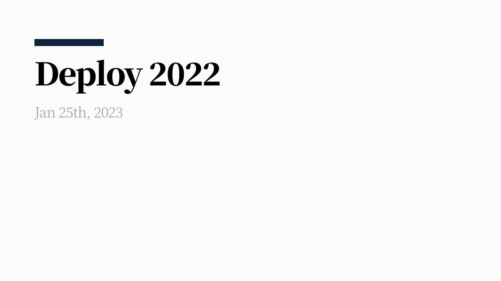

It feels like every year's retrospective says "this year was special," but this year that's especially true. There were changes big and small in work, career, and personal life. I wrote this retrospective around a few keywords that stuck with me among all those changes.

## flex 2.0 and thinking about collaboration

The flex product today is different from when I joined the team. Starting in August 2021, we ran a full product overhaul under the name '2.0 project,' and it only fully wrapped up in February 2022.

While improving the product across the board and delivering new features within a promised timeline, everyone ran flat out, weekdays and nights, to build things faster and better together.

During this period I thought a lot about priorities, time, and collaboration. I thought about what kind of teammate I needed to be in order to give trust to, and receive trust from, the people I worked with.

At a coffee chat with [Heejong](https://ahnheejong.name/), who was the frontend chapter lead at the time, I got some great advice, and it let me think from several angles about what would build trust with colleagues in each discipline I worked closely with.

- What kind of teammate do I want to work with?
- What kind of engineer would my teammates want to work with?

It was a process of trying to find answers to these questions.

## Design Platform team

From March to October, I worked as a design engineer on the Design Platform team.

> A bridge between designers and engineers. Building a design system as a shared language, and helping things connect well from design into engineering.

I added my own personal take on top of what the team and I thought together about the definition of a design engineer. This role let me sharpen my career direction and learn a lot while contributing to the team.

The design system the Design Platform team built is a project I thought about a lot and threw myself into wholeheartedly. Even before the team existed, I'd wanted to build it properly, given that a design system is the raw material for so many services.

We thought together about a lot of things — how to define and build each component, how it should be delivered, and more. I remember this as a time of working intensely toward a single focal point, the design system, without boundaries between disciplines. As an aside, this was the closest I've ever worked with designers in my career, and along with the motivation of wanting to exceed what the designers had in mind (…), I also wanted to gain a designer's eye (?) myself, so I'd occasionally ask the designer sitting next to me all sorts of open-ended questions — what makes good design, what matters when designing, that kind of thing. I'm grateful to the designer colleagues who never seemed bothered and pulled all sorts of things out of their bag of gifts to teach me.

My own drive combined with the desire to turn what the team and I discussed into the best possible result, so during this period — with only a little exaggeration — I spent every waking moment besides sleep thinking about how to design and implement components.

Working on this team, we almost never had everyone agree at once. But going through that process of clashing made the product we built sturdier, and I also got to learn how to sync up with teammates. In a Design Platform team made up of three designers and one engineer, we discussed all kinds of problems every single day, and got to know each other's tendencies, ways of working, and priorities. (I never explicitly confirmed everyone felt the same way, but that's how I felt through the process.)

I was happy to be part of the process of building, applying, and spreading the system as it found its footing. But running at that pace for so long, at some point I burned out. Around September, I hit a state of 'clearly doing something fun, yet exhausted.' 'Hit' might not be quite the right word — 'created' is probably more accurate.

> The first version of the design system, which you could call a 'draft,' came together pretty quickly. Since then, it's been going through iteration as various organizations apply it to their products. That iteration includes new components, features people feel are needed for existing components, and bug fixes. But this is where things started creaking.
> I wasn't coordinating the scope of the iteration work well. Between building new components and handling operational support for existing ones, it felt like one engineer's hands weren't enough. Even so, I didn't want to admit I couldn't handle it, and because I cared so much about the design system and what the Design Platform team was producing, I think I worked hard to hide how I was actually doing.
(…) I think it came from a sense of responsibility and the desire to keep doing well. That desire was fuel for growth, but sometimes it's also the thing that wears me down. I didn't want to admit to any version of myself other than the one doing well.
My work is my responsibility, that's true, but it doesn't have to be something I do entirely alone. It took me quite a while to accept that fact.

That's what I wrote on my personal page looking back on that period. Fortunately, I was able to get through it thanks to a colleague who checked in on me first during that time. They were a colleague I'm grateful for in many ways. And with some time having passed, I was able to sit down and work out why I'd felt so worn out, and what I'd do if a period like that came around again.

Looking back on the time I spent wrapping up with the team, there are things I'm personally left feeling sorry about. Still, whatever the case, it was a team where I learned a lot both as an engineer and as a teammate, so I wanted to record it in fairly great detail.

## Switching jobs

As I write this retrospective, I've already left flex. Working under the title of design engineer for about six months, I wanted to experience more of what a design engineer's role should be and build up that capability further.

If I'd talked about this with the team earlier and found a direction we could pursue together, I might still be there. Things might have turned out differently if I'd had that conversation sooner, but I can't shake the feeling that this is a bit of hindsight bias.

Every organization has different values and problems it considers important. For my next step, I want to go somewhere where the work I want to do can also be seen as important from the team's perspective. I'm looking forward to the story I'll fill in with new experiences on a new team.

I have no regrets about the choice. It was a decision I made after real thought, and isn't it enough to just make the choice the best one it can be, going forward?

## The gap period

When I left the team, my next destination wasn't decided yet. Naturally, I ended up with a gap period.

I had no particular goal for how to spend the gap period. While working, I'd thought a lot about what I'm good at and how I should approach things, and I didn't want to spend time thinking about how to do even resting "well." I figured it was fine even if the time wasn't spent in some especially productive way.

I went to see exhibitions, took some one-day classes, coded the things I wanted to code, wrote, worked out, and cooked. In that unhurried time, I did a lot of thinking for myself.

There was some anxiety about the next step too, but since I knew that anxiety would disappear once things were decided, I didn't try to force it away. And sure enough, once things got decided, it disappeared.

## Words that stuck with me

Some things I heard from people around me, or thought myself, that stuck with me.

- Don't fret over guessing negatively at what someone else's expression (words, actions, or anything else) means or how to take it — either check directly, or if you don't want to check, just take it at face value.
- Don't try to create everything from scratch. There are already plenty of right answers out there. Reading and searching widely matters.
- Don't try to predict change — build things so they're easy to respond to instead.
- Imagineering (Imagine + Engineering)
- If it's a problem you can't solve, you need to hand off who's responsible for thinking about it.
- A job you hold in society is like a coin: on one side is making a living and surviving, and on the other is deciding "how I want to contribute to the world" and "what value I have to offer society." And the rim connecting the two faces of the coin is roughly "what I want to do."

## Things I want to keep on record

- [I gave a talk on design systems at FEConf 2022.](https://www.youtube.com/watch?v=21eiJc90ggo)
- I've been swimming consistently since August. I'm still working on butterfly, but maybe by next year's retrospective I'll have enough of a swimming record to write a few lines about.
- I started a side project with the goal of 'thin and long.' I make and post things I want to try at the scale of a single component or a single page.

## Wrapping up

Every year in my retrospective I tend to write out, in pretty fine detail, the story I want to write next year — but for 2023 I'll leave behind an abstract goal instead: **"I hope to walk in a more concrete direction and grow through plenty of chance encounters along the way."**

A new environment, and the countless choices that environment requires, can't be predicted in advance. I just think the process of turning every choice into the best one it can be is what will end up meaningful.
