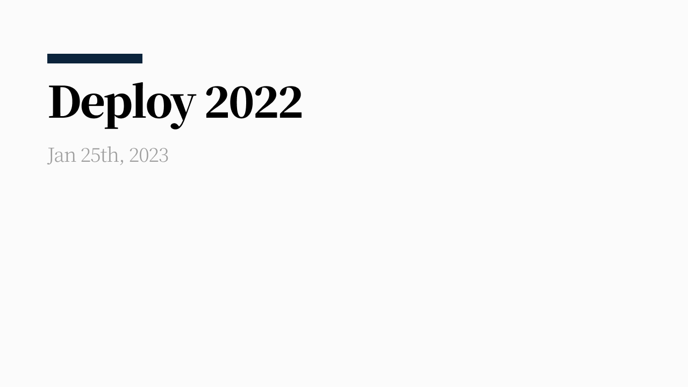

매년 회고 글에서 ‘올해는 특별했다.’라고 적는 것 같지만, 이번 해는 좀 더 그렇다. 일(work)과 커리어, 개인의 삶에서 크고 작은 변화가 있었다. 여러 가지 변화 중 기억에 남는 몇 가지 키워드들로 회고를 작성했다.

## flex 2.0과 협업에 대한 고민

현재 flex 제품은 팀에 합류했던 시점과 다르다. 2021년 8월부터 ‘2.0 프로젝트’라는 이름으로 전체 제품 개편을 진행했고 2022년 2월이 되어서야 완전한 막을 내렸다.

제품의 전반적인 부분을 개선하면서  새롤운 기능을 약속된 시간 내에 전달하기 위해 모두가 더 빠르게 잘 만들기 위해 평일, 밤낮없이 달렸다.

이 시기에 우선순위와 시간, 그리고 협업에 대해 많이 고민하게 됐다. 함께하는 동료들에게 신뢰를 주기 위해, 받기 위해 어떤 모습의 동료가 되어야 할까 생각했다.

그때 당시 프론트엔드 챕터 리드이셨던 [희종](https://ahnheejong.name/)님과의 커피챗에서 좋은 조언을 들었고, 밀접하게 일했던 각 직군의 동료들에게 어떤 모습이 신뢰를 줄 수 있을지 여러 각도로 생각해볼 수 있었다.

- 나는 어떤 동료와 같이 일하고 싶은가?
- 동료들은 어떤 엔지니어와 같이 일하고 싶을까?

이 질문에 답을 찾아가는 과정이었다.

## 디자인 플랫폼 팀

3월부터 10월까지 디자인 플랫폼 팀에서 디자인 엔지니어로 일했다.

> 디자이너와 엔지니어 간 다리 역할. 공통 언어인 디자인 시스템을 만들기도 하고, 디자인에서 엔지니어링으로 잘 연결될 수 있도록 지원한다.

디자인 엔지니어의 정의에 대해 팀과 같이 고민했던 내용에 개인적인 견해를 덧붙였다. 이 역할로 커리어를 좀 더 뾰족하게 정의하고, 팀에 기여하면서 많은 것들을 배울 수 있었다.

디자인 플랫폼 팀에서 진행한 디자인 시스템은 많이 고민하고, 열심히 참여한 프로젝트다. 팀이 생기기 이전에도 디자인 시스템은 많은 서비스의 재료라는 점에서 제대로 만들어보고 싶다는 욕심이 있었다.

어떤 컴포넌트를 어떻게 정의하고 만들어야 하는지, 어떤 방식으로 전달해야 하는지 등 많은 부분에 대해 같이 고민했다. 분야에 대한 경계 없이 디자인 시스템이라는 하나의 구심점으로 열띠게 일했던 시간으로 기억한다. 여담이지만, 지금까지 커리어 중 디자이너와 가장 가깝게 일하면서 디자이너가 생각하는 그 이상을 해내고 싶다는 동기부여와(…) 나도 디자이너의 눈(?)을 갖고 싶다는 생각에 옆자리 디자이너에게 가끔 이것저것(뭐가 좋은 디자인인가요, 디자인 할 때 중요한 것이 뭔가요 하는 밑도 끝도 없는 부류의 질문들) 물어봤던 것 같다. 귀찮아하지 않고 선물 보따리에서 이것저것 꺼내서 알려준 디자이너 동료들이 고맙다.

개인적인 욕심과 팀에서 같이 고민했던 내용을 최고의 결과로 만들고 싶다는 마음이 더해져서 이 시기는 과장 조금 보태서 잘 때 빼고 컴포넌트를 어떻게 구상/구현할지 찾아보고 고민했던 것 같다.

이 팀에서 일하면서 한 번에 모두의 의견이 일치한 적이 거의 없었다. 그렇게 충돌하는 과정에서 만드는 제품도 탄탄해졌고, 팀원들과 합을 맞춰가는 방법도 배울 수 있었다. 세 명의 디자이너와 한명의 엔지니어로 구성된 디자인 플랫폼 팀에서 매일매일 여러가지 문제를 논의하면서 서로의 성향, 일하는 방식, 중요하게 생각하는 것 등을 알아갔다. (모두가 그랬다고 명확히 얘기해 본 적은 없지만, 나는 과정 중에 그렇게 느꼈다.)

만들고, 적용하고, 전파하며 시스템이 자리 잡아 가는 과정에 함께 할 수 있어 행복했다. 그렇게 달리다 보니 어느 순간 방전이 찾아왔다. 9월쯤 ‘분명 재미있는 것을 하고 있는데 지친 상태’가 찾아왔다. ‘찾아왔다.’라는 표현보다는 ‘만들었다.’라는 표현이 좀 더 정확하겠다.

> ‘초안'이라고 부를 수 있는 디자인 시스템의 첫 버전은 꽤 빠르게 나왔다. 이후 여러 조직에서 제품에 적용하면서 이터레이션을 겪고 있는 단계이다. 이터레이션에는 새로운 컴포넌트와 기존 컴포넌트에 필요하다고 생각되는 기능, 그리고 버그픽스가 포함된다. 그런데 여기서 삐걱거림이 생기기 시작했다.
> 이터레이션 범위의 일들을 잘 조율하지 못했다. 신규 컴포넌트 제작과 기존 컴포넌트에 대한 운영 대응까지 같이 하다 보니 엔지니어 한 명의 손으로는 부족했던 것 같다. 그럼에도 내가 감당할 수 없다는 사실을 인정하고 싶지 않았고, 디자인 시스템과 디자인 플랫폼팀의 결과물에 애정이 컸기 때문에 내 상태를 감추기 위해 부던히 애썼던 것 같다.
(…) 책임감과 계속 잘하고싶다는 욕심 때문이었던 것 같다. 욕심은 발전의 원동력이 되었지만 때로는 이렇게 나를 힘들게 하는 요소이기도 하다. 잘하는 모습이 아닌 다른 모습을 인정하고 싶지 않았다.
내 일은 내 책임이 맞지만, 반드시 나 혼자 해야 하는 일은 아니다. 이 사실을 받아들이기까지 꽤 오래걸린것 같다.

그 시기를 돌아보며 개인 페이지에 적었던 글이다. 다행히도 저 시기에 먼저 물어봐준 동료 덕에 이겨낼 수 있었다. 여러모로 고마운 동료였다. 그리고 시간이 흐른 후에 왜 힘들다고 느꼈는지, 다시 그런 시기가 온다면 어떻게 할지 정리해볼 수 있었다.

팀을 마무리하던 시간을 돌이켜보면 스스로 아쉬운 점이 남는다. 다만, 어찌 되었든 엔지니어로서도 팀원으로서도 많이 배울 수 있었던 팀이었기 때문에 꽤 상세하게 기록해두고 싶었다.

## 이직

회고를 쓰는 지금은 flex를 떠난 상태다. 약 6개월간 디자인 엔지니어라는 이름으로 일하면서 디자인 엔지니어가 해야 하는 역할을 좀 더 경험하고 역량을 키우고 싶었다.

이런 생각을 일찍부터 팀과 이야기하고, 같이 갈 수 있는 방향을 찾았다면 아직 다니고 있을지도 모르겠다. 대화를 일찍 했더라면 달라질 수도 있었겠지만, 다소 결과론적이라는 생각은 지울 수 없다.

조직마다 중요하다고 생각하는 가치, 문제는 같을 수 없다. 다음 스텝은 하고 싶은 일이 팀의 관점에서도 중요하게 생각될 수 있는 곳으로 가려고 한다. 새로운 팀에서 새로운 경험으로 채워나갈 이야기가 기대된다.

선택에 대한 후회는 없다. 고민해서 내린 결정이었고, 선택을 최선으로 만들어 나가면 되지 않을까?

## 공백 기간

팀을 떠날 때는 다음 행선지가 정해지지 않은 상태였다. 자연스럽게 공백 기간을 갖게 되었다.

공백 기간을 어떻게 보내야겠다는 목표는 없었다. 일하는 동안 잘하는 것은 무엇일까, 어떻게 해야 할까를 많이 고민했는데 휴식까지 어떻게 잘할지를 고민하고 싶지 않았다. 딱히 알차게 보내는 시간이 아니어도 괜찮다고 생각했다.

전시를 보러 다니기도 하고, 원데이 클래스를 수강하기도 하고, 하고 싶은 코딩을 하고, 글도 쓰고, 운동하고 요리하면서 보냈다. 여유로운 시간 속에서 나를 위한 생각을 많이 했다.

다음 스텝에 대한 불안감도 있었지만, 정해져야 사라지는 불안감인 것을 알았기 때문에 억지로 없애려 하지 않았다. 역시, 정해지니 사라졌다.

## 기억에 남는 말

주위 사람에게 들었거나, 내가 생각한 말들 중 기억에 남는 것들이다.

- 다른 사람의 표현(말이나 행동 기타 여러 가지 것들)이 무슨 의미이고 어떻게 받아들여야 할지 부정적으로 추측하며 전전긍긍하지 말고, 직접 확인하거나 확인하고 싶지 않다면 그저 있는 그대로만 해석하자.
- 모든것을 창조하려고 하지 말자. 이미 정답은 많다. 많이 읽고, 찾아보는 것이 중요하다.
- 변경을 예측하지 말고 쉽게 대응가능하도록 구성하자.
- Imagineering (Imagine + Engineering)
- 내가 풀 수 없는 문제라면 고민의 주체를 넘겨야 한다.
- 사회에서 가지는 직업이라는 건 동전처럼 한쪽엔 생계와 생존을 위해, 반대편에는 ‘내가 세상에 어떻게 기여할지’, ‘내가 사회에 제공할 가치가 무엇’인지 정하는 것이다. 그리고 앞면과 뒷면을 연결하는 동전의 띠 정도가 ‘내가 하고 싶은 것’이다.

## 기록해 두고 싶은 것들

- [FEConf2022에서 디자인 시스템을 주제로 발표했다.](https://www.youtube.com/watch?v=21eiJc90ggo)
- 8월부터 지금까지 수영을 꾸준히 배우고 있다. 아직 접영을 배우는 중이지만, 내년 회고에는 수영 기록을 몇자 남길정도가 될 수 있지 않을까
- ‘가늘고 길게’를 목표로 사이드 프로젝트를 시작했다. 컴포넌트나 단일 페이지 단위의 작업해보고 싶은것들을 만들고 올려둔다.

## 마무리

매년 회고에서 내년에 쓰고 싶은 이야기를 꽤나 상세하게 적어두곤 했는데, 2023년은 **“구체화된 방향으로 걸으면서 많은 우연을 통해 성장할 수 있으면 좋겠다.”**는 추상적인 목표를 적어둔다.

새로운 환경과 그 환경에서 필요한 수 많은 선택은 사전에 예측할 수 없고, 다만 매 선택을 최선으로 만들어 가는 과정이 의미있을것이라 생각한다.
