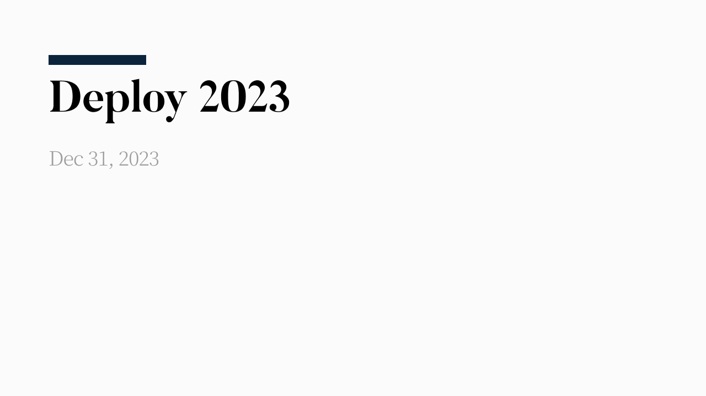
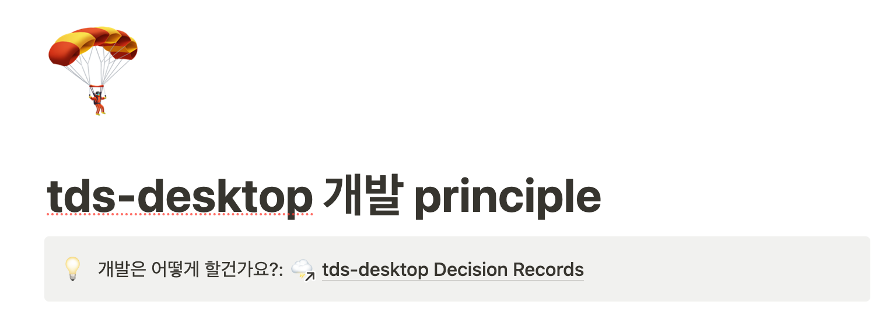
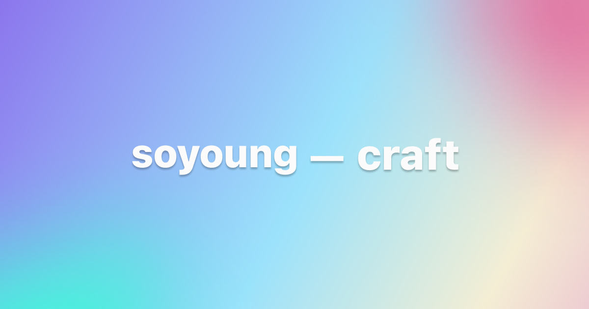
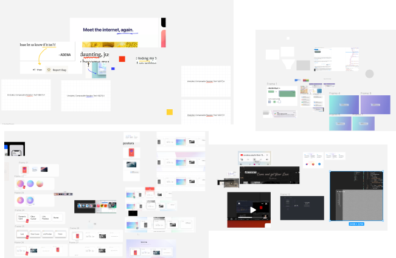
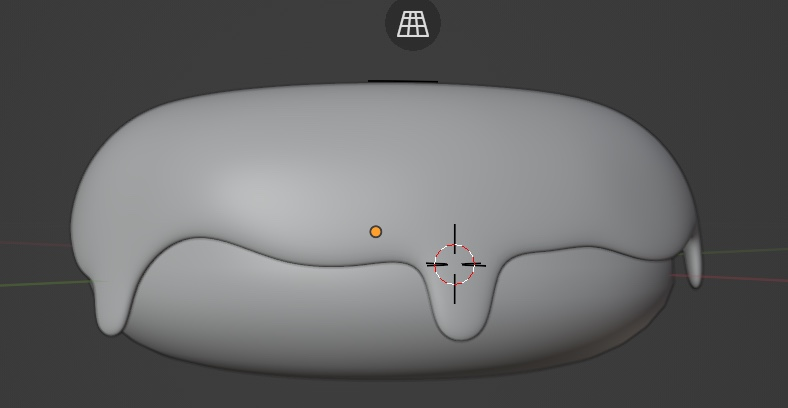

It's December, retrospective season again. This year stretched me wider, both personally and at work.

Here's a look back built around the experiences that stuck with me most.

## A New Team, A New Design System

This March I joined Toss's PC Design Platform Team. You might be thinking, "Wait, does Toss even have PC products?" But across the Toss community (our affiliates), there are actually quite a few — everything from customer-facing products to internal admin tools.

When I joined, the PC design system (tds-pc) had been thrown together quickly to meet an urgent need, and hadn't really moved forward since. There was a real gap between what the system offered and what products needed, and something built that fast wasn't going to hold up under continued growth. I went back and forth between patching it up gradually and rebuilding it, and eventually concluded that without rebuilding from the ground up, we'd never fix the actual problem. So I proposed a rebuild.

A rebuild isn't a magic fix. If anything, it's the easier road to reach for compared to gradual improvement, and it's expensive. I hadn't built up any credibility on the team yet, so pitching this scared me, but I figured putting it on the table would get us to a better answer eventually, so I proposed it anyway.

I collected everything that had been hard about understanding the existing system, plus the calls I'd learned to trust from experience, and turned them into a set of principles and technical decisions for the new one. No code lives forever, but given how much we were paying for this rebuild, I wanted it to last, and to have a clear sense of purpose. Even after the people involved moved on, I wanted the reasoning behind our decisions and our goals to stick around.

> A design system is the raw material behind many services

That's a line from last year's retrospective. This time, it scaled up from "services" to the whole "company." And there was already a system in place that had carried the products for a long while.

Even calling it a rebuild, I didn't think a full teardown was worth its cost, so I limited Breaking Changes to mostly the design system's core. My thinking was simple: if the total cost of switching to the new system got too high, nobody would be willing to make the jump.

One of the biggest factors in a rebuild is time. Legacy code's real strength is behavior that's proven reliable simply by having survived this long. No matter how carefully you study the spec, replicate it, and write tests, you can't match the stability of something that's already been battle-tested across countless environments. That's why you need to find early adopters fast, and have everything ready so they can try the new system out right away.

I tried to strip out every inefficiency I could in advance. I set clear rules — what counts as spec ambiguity, what qualifies as a Breaking Change — and wrote everything down, so nobody would have to dig through memory later to find something we'd already discussed.

Rebuilt code is bound to be shaky. Unless you paste in the exact same lines, there's always some risk of a hidden bug. Hitting the goal — better UX and DX, rebuilt to actually scale — needs at least one safety net: test code. I put off plenty of decisions to save time, but tests were never one of them.

The rebuild is still going, and there have been rough patches, but none of it has felt like a grind. I credit the team for that — they bought into the direction and have been running alongside me the whole way. (Honestly, maybe the most important part of a design system isn't the code or the design at all, but building the team.) We're still shaping the results, but this is a project I'm more excited to see next year than almost anything else.

### Not Deciding

This project called for a lot of deliberation and a lot of decisions. Whenever a decision was expensive to agonize over but cheap to put off, I put it off.

A decision being expensive to think through usually just means I'm actually torn — keep at it long enough and I'll land on an answer, but there's no guarantee it's the right one, and since rolling back a library decision is hard, getting it wrong would only cost more.

Spending that deliberation budget only on the problems that mattered, and skipping it on the ones that didn't, saved me a huge amount of time.

### Expanding My Role

Where I used to focus on the "code" side of development, this year I spent a lot of time thinking about everything around it instead.

- Whether what's happening right now is actually a "problem," and if so, whether it needs fixing now or can wait
- Goals and philosophy
- Root causes
- UI/UX for components and how they get used
- Tending to the library's ecosystem
- Giving good feedback, working as a team

Spending less time thinking about code left me with a nagging, hard-to-place anxiety, but I came around to believing that code is just one small means to an end, and that defining the problem and speaking up matters more.

"Is it really okay for me to spend time on this instead of development?" crossed my mind more than once. But I didn't think what the team expected of me was "just a developer who codes well," so I kept spending the time and the mental energy anyway.

I can't decide alone what role the team expects of me, so I said what I honestly thought and asked for feedback. (I heard back that people appreciated me thinking this broadly.) Next year, I'll probably keep thinking about how the team can do well, and act on whatever that calls for.

## [craft](https://craft.so-so.dev/)

> I build the things I feel like trying, and post them here.

That's how I described this project in last year's retrospective. It's basically a sandbox for hunting down slick UI/UX and building it myself. Working under the title UX Engineer, when I ask myself what actually matters in this job, it comes down to two things.

1. Being able to design modules that deliver the same user experience at a lower cost
2. Visual Engineering

This project exists to practice #2. Counting only what's published, I made 9 pieces this year. Taking things apart and rebuilding them from scratch taught me why I find certain things "polished" in the first place, and what kind of work goes into making something feel that way.

Same as with the blog, I sometimes want to redo the craft platform itself more than I want to make new content on it, but for now I'm going to keep my head down and just make what's on my list.

### Design

Nothing on craft was built completely from scratch, but almost everything got tweaked in some way. Finding the right version of that "small" tweak, trying this, trying that, was the hard part. I could always tell something was off, but figuring out how to fix it was a different story.

It took a lot of looking, screenshotting, analyzing, and sketching before I got to something I'd call good enough. I don't have any formal training in this, but I've been writing up notes as I stumble through this inefficient process... no idea when I'll actually publish it, though.

## 3D and Blender

I wanted to explore 3D as part of Visual Engineering. Along the way it became clear that understanding 3D models would open up a lot more possibilities, so I've been picking up [blender](https://www.blender.org/).

This is the first model I ever made, following along with a [tutorial video](https://www.youtube.com/watch?v=nIoXOplUvAw). At work, a few of us started a little club that meets over lunch on Tuesdays, Wednesdays, and Thursdays to work for an hour and share what we made. Checking my records, I made this donut on June 22nd.

<video controls style="width: 100%;" src="/media/essay/images/2023_retro/blender-room-720.mov" type="video/quicktime" poster="/media/essay/images/2023_retro/blender-room-720.png">
   Sorry, your browser doesn't support embedded videos,
</video>

After the donut, I started building a little studio scene in July. All that's left is putting it on the web... except getting it onto the web has turned out to be way less straightforward than I expected.

At first I'd search YouTube for the same object and copy along step by step, but once I got comfortable enough, I started being able to figure out how to build certain objects on my own. Working through Blender reminded me of something I already knew but kept forgetting: nothing beats just showing up consistently, and the fastest way to learn anything is to actually use it.

The hardest part of craft was knowing something looked off without being able to tell how to fix it. Blender was different: having a real-world object as a clear target made every improvement feel like an actual win.

My original goal was to get the studio scene online before the year ended, so I modeled like crazy, only to realize that finishing the model was really just the starting line. Maybe I can wrap it up in the first half of next year.

## Scuba Diving

I picked up scuba diving this August and logged around 40 dives. I've already mapped out my diving schedule all the way through next year's Chuseok.

For someone whose hobby used to be her actual job, programming, and who spent free time on a laptop doing more of the same, falling this hard for something else entirely feels like a pretty big deal.

People around me often ask, "What's so great about diving?" Everyone probably has their own reasons, but for me it comes down to

- That feeling, the moment you go under, of dropping into a whole new world
- Getting to see other creatures living their lives
- Being completely focused on your own movement and breath

roughly these three things. Wanting to get better at it, I kept buying bits of personal gear here and there, and before I knew it I owned a full set.

## 2024 Goals

This was a year that widened me, as a developer and as a person. Next year I want to aim for steady, even if slow, and focus on filling in everything I've stretched into.

- Next year's goals
  - Being the kind of teammate who sees the whole forest
  - Building real strength in the new areas (3D, design)

This year marks five full years since I became a developer. Looking at how much more this retrospective holds compared to my very first one, it seems like I really am filling each year with new experience. Here's hoping next year brings plenty more of it, more decisions to make, and new stories to fill in.
