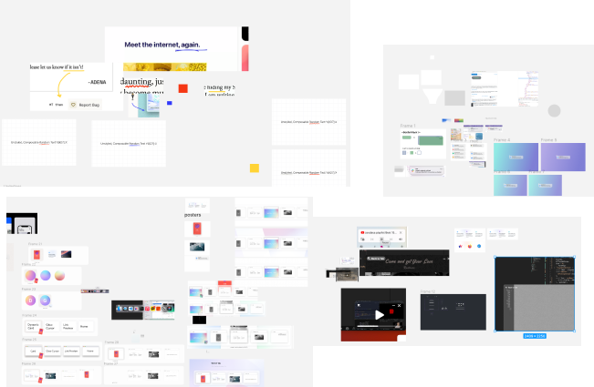

12월 회고 시즌이다. 올 해는 개인적으로도, 일적으로도 수평적으로 넓어진 한 해였다.

기억에 남는 경험을 중심으로 회고를 작성했다.

## 새로운 팀, 새로운 디자인 시스템

올 해 3월 토스의 PC Design Platform Team에 합류했다. ‘토스에 PC제품이 있어?’라고 생각할 수 있지만 토스 커뮤니티(계열사)에는 대고객 제품부터 어드민까지 PC제품이 꽤나 많다.

합류했을 당시 PC디자인 시스템(tds-pc)은 니즈에 의해 빠르게 개발 된 이후 지속적으로 발전은 하지 못한 상황이었다. 시스템과 제품 니즈의 간극이 컸고, 빠르게 만들어진 시스템은 지속적인 확장에는 어려움이 있어보였다. 점진적 개선과 재개발에 대해 고민하다가, 가장 근간이 되는 부분부터 쌓아 올리지 않으면 문제를 근본적으로 해결할 수 없다고 생각하여 재개발을 제안했다.

재개발이 능사는 아니다. 재개발은 점진적 개선보다 쉽고, 비용이 큰 작업이다. 가진 신뢰자산이 없는 상태에서 제안을 하는 것이 두려웠지만, 논의를 꺼내면 더 나은 답을 찾을 수 있을거라는 생각으로 재개발을 제안했다.

기존 시스템을 파악하면서 어려웠던 점, 경험적으로 더 나은 결정이라 생각했던 것 들을 모아 시스템에 필요한 원칙과 기술적인 결정들을 정리했다. 평생 가는 코드는 없겠지만, 재개발이라는 큰 비용을 내는 만큼 그래도 오래가는 시스템, 목표가 명확한 시스템이 되길 바랐다. 사람이 바뀌더라도 의사결정 배경과 목표는 남길 바랐다.

> 디자인 시스템은 많은 서비스의 재료라는 점

작년 회고글에 있던 내용인데, 이번에는 ‘서비스’가 아니라 ‘회사’로 확장되었다. 그리고 꽤 오랜시간 제품을 지탱한 기존 시스템도 존재했다.

재개발이라고 하지만 전면 재개발은 가치보다 비용이 더 크다고 생각해서 디자인 시스템의 코어한 부분을 중심으로 Breaking Change를 제한했다. 새로운 시스템을 적용하는데에 드는 비용의 총합이 너무 크다면 누구도 선뜻 변화를 감당할 수 없을거라는 생각이었다.

재개발의 핵심 중 하나는 시간이다. 레거시의 강력한 힘은 ‘이미 오랜기간 사용됨으로써 보장되는 동작’이다. 아무리 스펙을 파악해서 똑같이 구현하고 테스트 코드를 쓴다고 하더라도 다양한 환경에서 사용되던 레거시보다 안정적일 수는 없다. 그래서 빠르게 얼리어답터를 구하고 얼리어답터가 새로운 시스템을 빠르게 적용해볼 수 있도록 준비하고 지원해주어야 한다.

사전에 없앨 수 있는 비효율은 최대한 없앴다. 스펙에 대한 모호함, Breaking Change에 대한 기준 등의 규칙을 만들고 논의가 필요한 내용은 기억에 의존해 찾지 않도록 무조건 문서로 남겼다.

재개발되는 코드는 불안정할 수 밖에 없다. 코드를 똑같이 붙여넣지 않는 한 잠재적 버그 위험이 존재하기 때문이다. ‘UX와 DX개선, 확장 가능한 형태로의 재개발’ 이라는 목표는 최소한 테스트 코드라는 신뢰장치가 있어야만 달성할 수 있다. 시간을 효율적으로 사용하기 위해 미룬 선택들이 많았지만 테스트 코드는 미루지 않았다.

재개발은 여전히 진행중이고 과정중에 어려운 순간들도 있었지만 힘들지는 않다. 방향성에 공감해주고 같이 달려나가고 있는 팀 덕분이라고 생각한다. (사실 디자인 시스템에서 가장 중요한 것은 코드나 디자인보다 팀빌딩이 아닐까) 아직 결과를 만들어 나가고 있는 단계이지만 내년의 모습이 더 기대되는 프로젝트다.

### 결정하지 않기

이 프로젝트를 진행하면서 많은 고민과 결정이 필요했는데, 고민의 비용이 큰데 반해 결정을 미뤘을 때 비용이 커지지 않는다면 미뤘다.

고민의 비용이 크다는 것은 헷갈린다는 것인데, 계속 고민한다면 답을 내릴 수는 있겠지만 무조건 맞는 답이라는 보장도 없고 라이브러리 특성상 롤백이 어렵기 때문에 잘못된 결정은 오히려 비용을 늘린다고 생각했다.

중요한 문제에만 고민비용을 투자하고, 덜 중요한 문제에는 비용을 투자하지 않는 결정이 시간을 많이 아껴주었다.

### 역할의 확장

이전에는 개발 영역중 ‘코드’에 집중했다면 올해는 코드 이외의 아래 영역들을 많이 고민했다.

- 현재 발생하고 있는 현상이 ‘문제’일지, 문제라면 지금 해결해야할 문제인지 미뤄도 되는 문제인지
- 목표와 철학
- 근본적인 원인
- 컴포넌트와 사용례에 대한 UI/UX
- 라이브러리 생태계 가꾸기
- 좋은 피드백, 팀으로 일하기

코드에 대해 고민하는 시간이 줄어든 것에 대해 알 수 없는 불안감이 있었지만, 코드는 목표를 이루기 위한 작은 수단일 뿐이고 문제를 정의하고 의견을 내는 것이 더 중요하다고 생각했다.

‘내가 개발 말고 이런 고민에 시간을 써도 되나’하는 생각이 들기도 했지만 팀에서 나에게 기대하는 점이 ‘그냥 코딩 잘하는 개발자’가 아니라고 생각했기 때문에 시간을 쓰고, 고민 비용을 투자했다.

나에게 기대하는 역할에 대해서는 혼자 답을 내릴 수 없기 때문에 솔직하게 생각하는 바를 말하고, 피드백을 구했다. (넓은 고민을 해주어서 고맙다는 피드백을 들었다.) 내년에도 팀이 잘하는 방법에 대해서 고민하고 필요한 액션을 실행할것 같다.

## [craft](https://craft.so-so.dev/)

> 작업해보고 싶은것들을 만들고 올려둔다.

작년 회고에 적어둔 이 프로젝트에 대한 소개 내용이다. 슬릭한 UI/UX를 찾고 그걸 만들어보는 일종의 연습장이다. UX Engineer라는 이름으로 일하면서 이 직업에서 중요한 것이 무엇일까 생각해 봤을 때 크게 두 가지였다.

1. 낮은 비용으로 동일한 사용자 경험을 전달할 수 있는 모듈 설계 능력
2. Visual Engineering

이 프로젝트는 2번을 연습하기 위한 프로젝트이다. 배포된 컨텐츠 기준 올해 9개를 만들었다. 만들기 위해 뜯어보고 돌려보고 하다보니 내가 어떤 것을 보고 ‘유려하다’라고 생각하는 이유와 유려함을 만들기 위해 어떤 노력들이 있을 지 파악해볼 수 있었다.

블로그와 마찬가지로 가끔 컨텐츠보다 craft라는 플랫폼을 개편하고 싶다는 생각이 들기도 하지만, 당분간은 쌓아둔 컨텐츠를 만드는 것에 집중해볼 예정이다.

### 디자인

craft내의 모든 컨텐츠는 백지부터 만든 것은 없지만 대부분 약간의 변형을 했다. 그 ‘약간의’ 변형을 위해 이것저것 얹어보고 정답을 찾아가는 과정이 어려웠다. 뭔가 이상한건 알겠는데, 어떻게 해야 좋아질지 감을 잡기 쉽지 않았다.

더 많이 보고, 캡쳐하고 분석하고 그려보면서 내 기준 괜찮다는 기준에 도달하기까지 꽤 시간이 많이걸렸다. 전문지식은 없지만 이 비효율적인 과정을 겪으면서 정리하고 있는 글이 있는데... 언제 퍼블리시할 수 있을지는 모르겠다.

## 3D와 Blender

Visual Engineering의 영역으로 3D를 공부 해보고 싶었다. 하다 보니 3D 모델에 대한 이해가 있으면 더 많은 것을 해볼 수 있을것 같아 [blender](https://www.blender.org/)라는 도구를 익히고 있다.

[튜토리얼 강의](https://www.youtube.com/watch?v=nIoXOplUvAw)를 보며 처음으로 만들어본 모델이다. 회사에서 화수목 점심 한 시간마다 작업하고 결과물을 공유하는 소모임을 만들어 해보고 있는데, 기록을 살펴보니 이 도넛을 만든것이 6월 22일이다.

<video controls style="width: 100%;" src="./images/2023_retro/blender-room-720.mov" type="video/mp4" poster="./images/2023_retro/blender-room-720.png">
   Sorry, your browser doesn't support embedded videos,
</video>

도넛 이후 7월부터 작업실을 만들기 시작했다. 이제 웹에만 올리면 되는데... 생각보다 웹에 올리기 위한 과정이 순탄하지 않다.

처음엔 유투브에 같은 물체를 검색해서 그대로 따라하면서 익히다가 어느정도 익숙해지니 어느정도 물체는 만드는 방법을 스스로 생각해낼 수 있게 됐다. 블렌더를 하면서 ‘꾸준하게 하는 것에 장사없다. 가장 빠른 배움은 실전적용이다.’ 하는 것들을 다시금 상기할 수 있었다.

craft를 진행하면서 가장 어려웠던 점은 디자인할 때 뭔가 틀린 것 같긴한데 개선 방향에 대해 감을 잡기 어렵다는 것이었는데, 블렌더는 실제 사물이라는 명확한 목표가 있으니 더 성취감이 있었다.

원래 목표는 작업실 프로젝트를 올 해가 가기전에 웹에 올리는 것이어서 열심히 모델링 했는데, 알고보니 모델링이 끝난 순간부터 시작이었다. 내년 상반기에는 마무리해볼 수 있지 않을까.

## 스쿠버 다이빙

<iframe width="560" height="315" src="https://www.youtube.com/embed/oHbgjCmFQA4?si=RRIllRDrOumQXfrD" title="YouTube video player" frameborder="0" allow="accelerometer; autoplay; clipboard-write; encrypted-media; gyroscope; picture-in-picture; web-share" allowfullscreen></iframe>

<iframe width="560" height="315" src="https://www.youtube.com/embed/UkqCklQbIb4?si=3ol_NtnVz7rSpe6w" title="YouTube video player" frameborder="0" allow="accelerometer; autoplay; clipboard-write; encrypted-media; gyroscope; picture-in-picture; web-share" allowfullscreen></iframe>

<iframe width="560" height="315" src="https://www.youtube.com/embed/gL0DU29CCGs?si=LwpBrPKM7pM4oBrU" title="YouTube video player" frameborder="0" allow="accelerometer; autoplay; clipboard-write; encrypted-media; gyroscope; picture-in-picture; web-share" allowfullscreen></iframe>

올 해 8월 스쿠버 다이빙에 도전했고 올 해 40번정도의 다이빙을 했다. 사실 내년 계획도 미리 세웠다.

직업인 프로그래밍이 취미였고, 남는 시간에도 노트북으로 뭔갈 하던 나에게 이렇게 깊이 빠진 취미가 생겼다는 것은 꽤 고무적인 사건이다.

주위에서 “다이빙이 왜 좋아요?”라는 질문을 종종 듣는다. 사람마다 좋아하는 이유는 다르겠지만 나는

- 입수하는 순간 새로운 세계로 뛰어드는 기분
- 다른 생물체를 본다는 것
- 나의 움직임과 숨소리에 집중되는 점.

크게 이렇게 세 가지 이유인것 같다. 좀 더 잘 하고 싶어서 개인장비를 이것저것 사다보니 어느새 기본장비를 다 맞췄다.

## 2024 목표

개발자로서도, 개인으로서도 넓어진 한해였다. 느리더라도 꾸준함을 지향하며 내년에는 넓어진 영역을 채워나가는 것에 집중해보려 한다.

- 내년 목표
  - 숲을 보는 동료
  - 새로운 영역에 대한 강점 강화 (3D, 디자인)

올 해 개발자가 된지 만 5년이 되었다. 처음 회고를 쓸 때보다 많은 내용을 담고 있는 것을 보면 매 년 새로운 경험을 채워가고 있는 것 같다. 내년에도 많은 경험을 하고 결정을 내리면서 새로운 이야기를 채워볼 수 있길 바라본다.
