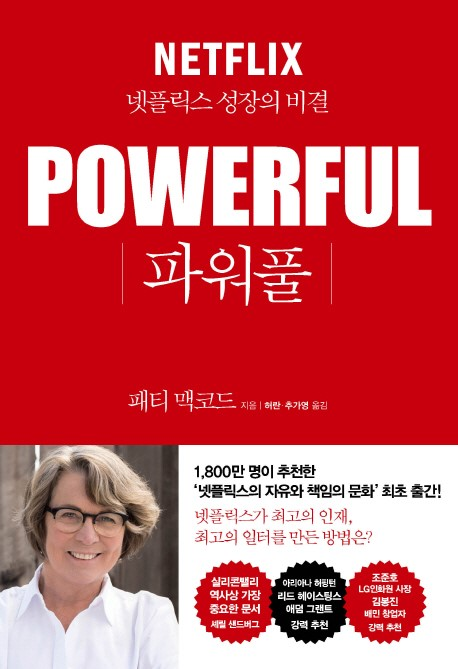

I never had a real answer for what "freedom and responsibility" actually does to a company's culture, or what makes a culture good in the first place. Netflix treats those two words as sacred, so I was curious enough to crack the book open on the first day of the holidays, and I finished it in one sitting.

The second I closed it, all I could think was: wow. I wanted to know even more about the trial and error behind the scenes, but what made it into the book was already plenty to sit with.

"Company policy is built on a **mistaken assumption** about people: that you have to dangle incentives to get employees to commit to their work, and spell out exactly what each person should be doing."

The whole book starts by tearing that assumption apart. It walks through what a company needs to get right for employees to do their most powerful work, and beyond that, what strategy Netflix actually took on hiring, the one problem every company wrestles with.

If you're on the fence about reading it, read it. Better yet, bring it to your team and argue about it. Even if you never adopt a single thing the book describes, just taking the time to look at your own culture and think about where it's headed feels worth it.

Here's my review: a handful of passages that stuck with me, plus my own two cents on each.

## Chapter 1: Treat People Like Adults

"Nothing motivates people more than contributing to something that succeeds. Treat employees like adults and they act like adults. **They don't abuse their freedom.**"

Show up, lock in with a team of people you trust and respect, and do work you're proud of. That's the culture Netflix is chasing.

That won't fit every company right away. No matter the size of an organization, control and rules are the lower-risk way to run things. Stack up enough rules and make everyone follow them, and it can work, to a point.

But if the goal is really a team of people you trust and respect, locked in and doing great work together, it's worth asking whether all those rules we take for granted are actually just getting in the way.

"Strip away policies and procedures one at a time, and employees move faster and get more done."

Treat employees like adults, and they act like adults. If there's a chain of distrust somewhere, arguing over who should break it first doesn't really matter.

"If you're a leader, hire the people you need, hand them the tools and information they need, and they'll happily do 'brilliant work.'"

## Chapter 2: Keep the Challenges Out in the Open

"Every employee, at every level, was given permission to demand an explanation, whether it was about their own work or a decision from leadership. That's how employees ended up with more information, and how a culture of curiosity spread through the whole company."

Being challenged all the time on revenue or business direction sounds great in theory, but I imagine it's a lot to stomach if you're the one actually running the place.

There's the fear that decisions will slow down, or that some information just isn't something employees need. But even when sharing it feels risky, doesn't going fully transparent surface blind spots you'd never have caught otherwise, and give people a reason to show up as a 'colleague' instead of just an 'employee'?

## Chapter 3: Be Radically Honest

The book argues you need the nerve to deliver feedback face to face, even the negative kind. Doing that well takes real self-awareness, watching your own tone and body language, and thinking hard about what 'good feedback' even looks like.

"The most important rule of feedback: talk about the behavior. (...) It has to be actionable, and **the person on the receiving end needs to walk away knowing exactly what change is being asked of them.**"

Delivering hard feedback face to face is never easy, but honest feedback between colleagues is fertile ground for growth. I'd argue that owning a mistake and not repeating it is already growth in itself.

> Netflix built this into an official 'annual feedback' day, and the key detail, I think, is that it's kept separate from salary reviews. Tie feedback to evaluation and how honest can it really stay?

## Chapter 5: Build the Future You Want, Starting Now

This chapter is about figuring out what team you actually need, and it's a much bigger question than headcount. You have to work out what kind of team you want to be six months from now, and 'how' you need to work to become it.

"You have to recognize the problems your team doesn't know how to solve, or just isn't good at yet. (...) Training people well and spotting their growth potential is one of the most important skills a team lead can have. That kind of potential often stays hidden, sometimes even from the person who has it."

One more key idea shows up here: hiring. Netflix's 'rule of thumb' goes like this.
> Technically this is about promotion, but I'd say it's part of the same thread.

- Work that demands deep expertise: if better expertise exists outside the company, go hire it.
- Work where we're already leading the way: if we're confident we're already the best at it, promote from within.

Of the 'questions every leader should ask' at the end of the chapter, this is the one that stopped me.

"How much time do you spend developing your team's skills? How fast do they reach the speed you expect of them? And how satisfied are you with that?"

If you're leading a team, revisiting that question on a regular cadence, and using it to diagnose where things stand and what's missing, seems like a habit worth building.

## Chapter 6: Put the Right Person in Every Seat

This chapter gets into salary for experienced hires, and it circles back to [Chapter 1, Treat People Like Adults](https://so-so.dev/essay/the-secret-to-netflix-growth/#chapter-1-%EC%96%B4%EB%A5%B8%EC%9C%BC%EB%A1%9C-%EB%8C%80%EC%A0%91%ED%95%98%EB%9D%BC).

"If your employees are 'adults' who put the company first and handle their own work, a year-end bonus isn't going to make them work harder or smarter. (...) We never wanted stock options to be 'golden handcuffs' keeping people around for some fixed stretch, so we didn't attach a vesting period to them either."

Its conclusion: the biggest driver of good work was never a bonus tied to hitting a target. It's **great colleagues and hard problems worth solving.** I've never actually had to pick between a bonus and the best colleagues, but if that day comes, my answer is already decided: the colleagues, every time.

Thinking it through this way, I could finally get a rough sense of why the culture and values Netflix pushes for actually worked.

Two lines at the end of this chapter made me take a hard look at myself as an interviewer.

- Scouting talent takes real creativity. Dig past the résumé. Focus on how the person actually solves problems at the root.
- By the time the process wraps up, make sure every single person you interviewed still wants the job.

## Chapter 7: Pay People What They're Worth

The book's case: a performance review can never capture someone's full worth, so evaluation and pay need to stay separate. To kill the system where your most valuable people have to leave just to get paid what they're worth, Netflix threw out fixed salary bands and average-salary benchmarks entirely. They even push employees to go interview elsewhere on a regular basis, just to check whether Netflix's pay is actually still competitive.

Netflix doesn't just pay top-of-market, it pays 'the best there is.' It reads like a promise: bring in the best people, and pay them like it.

Not every company can afford this play, but I'd guess Netflix's success really does trace back to that ambition, hiring the best, and a pay structure bold enough to actually back it up. Reading it, I pictured the atmosphere inside Netflix: the best people in the room, working flat out together. Isn't that the picture a lot of us have in mind when we imagine the ideal company?

## Wrapping Up

A culture where 'radical honesty, full freedom and responsibility, and open debate about everything' is just the norm, the way Netflix runs it, is a real challenge to pull off. But I think it's clearly worth it. Any organization that hasn't had this culture before will hit trial and error trying to introduce it, and people who can't adjust might push back, or just leave.

Is it worth all of that? Honestly, I still don't know. Behind the glossy upsides in the book, there could be failures and hardship too painful to make it onto the page.

Still, just like a product, culture is something you can keep leveling up, and Netflix's story is a solid reference point for where to take it.

If you're struggling to picture what 'an organization built on freedom and responsibility' even looks like, this book is a good excuse to sit with the question for a while.
