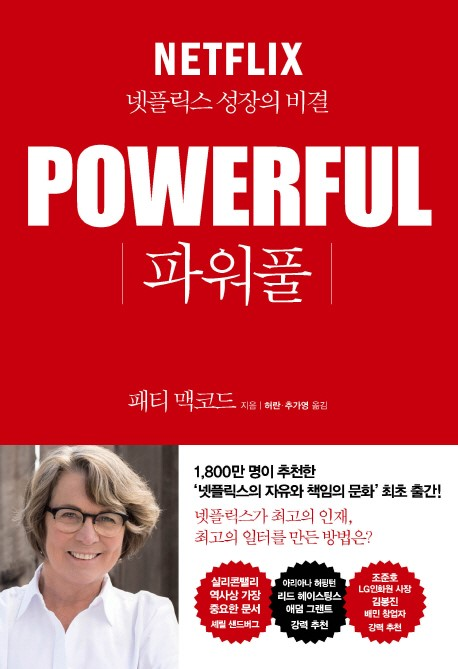

'자율과 책임'이라는 단어는 간결하지만 이를 어떻게 달성할 것인가에 대해서는 나만의 대답이 없었다. 이 두 가지 단어를 가장 중요하게 여긴다는 넷플릭스의 이야기가 궁금했고, 연휴 첫 날 첫 장을 펴서 단숨에 다 읽었다.

책을 덮는 순간 나의 첫 반응은 '대단하다'였다. 넷플릭스의 더 깊은 고민과 시행착오들이 궁금해졌지만, 책에 담긴 내용 만으로도 울림을 주기에는 충분했다.

"(...)정책들은 인간에 대한 잘못된 가정에 기초하여 만들어졌다. 직원이 일에 몰두하게 하려면 인센티브를 주어야 하며, 각자가 해야 할일을 정확하게 알려 주어야 한다"

이 책은 위 전제를 완벽히 부정하는 것에서 출발한다. 직원들이 회사에서 가장 파워풀하게 일하기 위해서는 어떤 부분을 고민해야 하는지, 더 나아가 모든 기업의 숙명인 '채용'에서 넷플릭스는 어떤 전략을 취했는지 소개한다.

이 책을 읽을 지 고민이 된다면, 읽기를 강력 추천하고 나아가 이 내용을 팀에 공유하고 다양한 주제로 토론 해보면 좋을 것 같다. 책에서 소개하는 문화를 따라가지 않더라도, 우리의 현재 문화를 돌아보고 앞으로의 방향을 고민하는 시간 자체가 가치 있다고 생각한다.

몇 가지 인상적인 챕터의 내용들을 발췌하고 내 생각을 덧붙이는 것으로 이 책의 서평을 적어본다.

## Chapter 1. 어른으로 대접하라

"성공에 기여하게 하는 것이 가장 강력한 동기 부여다. 회사가 직원들을 어른으로 대할 때, 직원들도 어른으로서 행동한다. **직원들은 자유를 남용하지 않는다**"

이 챕터는 위 문장에 대한 넷플릭스의 관점과 사례를 소개한다. 자율적인 환경에서 더 높은 성과를 달성할 수 있다고 믿고, 그렇기 때문에 문제 해결에 흥미를 느끼는 사람들을 채용한다.

궁극적으로, 출근을 해서 자신이 믿고 존경하는 동료들로 이뤄진 팀과 함께 미친 듯이 집중해 멋진 일을 해내는 것. 그것이 넷플릭스가 추구하는 문화이다.

이런 문화가 모든 회사에 당장 적합하지는 않을 수 있다. 통제와 규율은 비교적 리스크가 적은 방법이다. 모두가 지켜야 하는 규칙을 많이 세우고 그 안에서 일하는 것이 어느정도는 효과적일 수 있다.

그러나 너무 '지켜야할 것'이 많은 문화에서는 회사의 비전을 함께하고 있는 동료라는 사실보다는 '직원'이라는 인식이 더 클 수 밖에 없다고 생각한다.

 자유의 남용이 두렵다면, 아직 서로 간의 신뢰에 대해 생각해보지 못했거나 실제로 신뢰가 결여된 상황일 수 있다. 하나 둘 우리가 세운 규칙에 대해 돌아보며 가장 효과적으로 나아갈 수 있는 방법은 무엇일까 고민 해보는 시간을 가진다면 좋을 것 같다.

"당신이 리더라면 필요한 인재를 채용하고, 그들에게 필요한 도구와 정보를 제공하라. 그러면 그들은 기꺼이 '빛나는 일'을 해낼것이다.

## Chapter 2. 도전에 대해 끊임없이 소통하라

"모든 직급의 직원들이 자신의 당면 과제나 경영진이 내리는 결정에 대해 설명을 요구할 수 있는 허가권이 부여된 것이고, 이렇게 하면서 직원들은 더 많은 정보를 얻었고 호기심 문화가 회사 전체에 스며들었다."

회사의 중요한 지표들, 예를 들면 매출이나 사업 방향성 혹은 나아가고자 하는 방향에 대해 언제나 도전받고 같이 더 나은 방향을 고민하는 것은 매우 좋은 방향이지만 회사를 운영하는 입장에서 생각 해본다면 쉽지 않은 방향일 것 같다.

- 회사를 운영해본 경험은 없지만, 서평을 써내려갈 때 잠시 상상해봤다.

의사 결정이 더뎌질 수 있다는 것에 대해 불안감이 들 수도 있고, '몰라도 되는'정보라고 생각할 수도 있다. 이런 정보를 공유하는 것이 처음에는 어렵고 혹은 두려울지라도, 투명하게 공유함으로써 방향에 대해 인사이트를 얻을 수도 있고 '직원'이 아닌 '동료'로서 일할 수 있는 동기를 줄 수 있지 않을까?

## Chapter 3. 극도로 솔직해져라

부정적인 피드백 일지라도, 직접 대면하여 피드백을 줄 수 있는 용기를 가져야 한다고 말하고 있다. 이 피드백을 잘 전달하기 위해 나의 언어적, 비 언어적 표현에 대해 돌아보고 '좋은 피드백'은 무엇일까에 대해서도 많은 고민이 필요하다.

"피드백을 줄 때 가장 중요한 것은 행동에 대해 말해야 한다. (...) 실행 가능해야 하며, 피드백을 받는 사람이 자신에게 어떤 행동 변화가 요구 되는지 이해할 수 있어야 한다."

부정적인 피드백을 직접 전달하는 것은  쉽지 않은 일이지만, 동료 간에 솔직한 피드백은 분명 성장의 밑거름이 될것이다. 실수는 솔직히 인정하고 반복하지 않는 것만으로도 성장이라 할수 있다고 생각한다.

- 넷플릭스는 이를 위한 '연례 피드백'데이를 제도화 하였는데, 이 피드백 제도가 연봉 평가와 이어지지 않게 해야한다는 점이 중요하다고 생각한다. 평가와 이어지는 피드백 제도는 솔직한 피드백이 되기 어렵지 않을까?

## Chapter 5. 원하는 미래를 '지금' 만들어라

우리에게 '필요한 팀'이 어떤 팀인지에 대해 고민해야 한다는 내용이다. 단순히 우리는 '몇 명'의 팀이 되어야 하는 가보다 넓은 의미인데, 6개월 후 어떤 팀이 되었으면 좋겠는지를 그리고 '어떻게' 일해야 하는지에 대한 답을 찾아가야 한다는 것이다.

"지금 팀이 어떻게 해야 할지 모르는 문제, 또는 잘 하지 못하는 문제를 인식해야 한다 (중략...) 팀원을 잘 훈련시키고 성장 잠재력을 발견하는 것은 팀장에게 중요한 기술이다. 그런 재능은 때때로 잘 드러나지 않고 자신들도 모르는 경우가 많다."

이 챕터에서 중요한 키워드가 하나 더 등장했는데, 바로 '채용'이다. 좀 더 정확히는 '승진'이지만, 이어지는 맥락이라고 생각한다. 넷플릭스의 '경험에 근거한 규칙'은 다음과 같다.

- 전문성을 요구하는 일: 외부에 더 나은 전문 기술이 있다면, 그 기술을 가진 사람을 채용한다.
- 우리 스스로가 혁신의 선두에 있는 영역의 일: 해당 분야에서 우리가 이미 최고로 잘하고 있다는 확신이 있다면, 내부의 인재를 승진시킨다.

챕터의 마지막 부분인 '리더에게 필요한 질문'중 가장 눈이 갔던 질문은 이 질문이었다.

"팀의 기술을 개발하는 데 얼마나 많은 시간을 쓰고 있는가? 당신이 요구하는 속도에 팀원들이 얼마나 빨리 도달하는가? 이에 대해 얼마나 만족하고 있는가?" 

팀을 리드한다면 이 질문에 대해 짧은 주기로 답을 정리하며 현재 상황과 팀에 부족한 부분을 진단하며 나아갈 수 있을 것 같다.

## Chapter 6. 모든 포지션에 최적의 인재를 앉혀라

이 챕터에서는 경력직 채용에서 '연봉'에 대한 이야기를 다루는데, Chapter 1에서 언급했던 '어른으로 대하는 문화'와 이어지는 부분이 있다.

"당신의 직원들이 회사를 우선순위에 놓고 자기 일을 알아서 하는 '어른'이라면 연말 보너스가 그들을 더 열심히, 더 스마트하게 일하도록 만들진 않는다. (중략...) 일정기간 회사에 붙들어두는 '황금 수갑'으로 이용할 생각이 없었기에 스톡 옵션 행사 기간도 부과하지 않았다."

일을 하는 데 가장 큰 원동력이 성과 달성에 대한 보너스가 아니라, 훌륭한 동료와 어려운 도전 과제라는 결론을 소개한다. 두 가지 선택지(보너스와 최고의 동료)에서 결정을 내려본 적은 없지만, 둘 중 하나를 선택해야 하는 순간이 온다면 내 대답은 단언컨대 '최고의 동료'이다. 

이렇게 생각해보니, 넷플릭스가 추구하는 문화와 중요하게 여기는 가치가 어떻게 효과적이었는지 어렴풋하게나마 이해할 수 있었다.

이 챕터의 마지막에는 면접관으로서의 내 모습을 돌아보게 되었던 두 가지 문장이 소개되었다. 

- 인재를 발굴할 때는 정말로 창의적이 돼야 한다. 경험 목록 그 이상을 파고들어라. 그 사람의 근원적인 문제 해결 능력에 집중해라.
- 채용 과정이 끝났을 때 당신이 인터뷰한 모든 사람이 회사에 들어오고 싶어 하도록 만들어라.

## Chapter 7. 직원의 가치만큼 보상하라

인사 고과는 사람들의 온전한 가치를 모두 대변할 수 없기 때문에, 인사 고과와 보상을 분리해야 한다고 말하고 있다. 희소 가치를 창출한 직원이 본인의 가치를 더 높이기 위해 떠나야만 하는 시스템을 없애기 위해 정해진 테이블과 평균 연봉 등의 개념을 과감히 없앴다. 심지어 정기적으로 타사의 면접을 볼것을 권유한다. 넷플릭스의 대가가 얼마나 경쟁력 있는 지 확인하는 것이다.

넷플릭스는 단순히 업계 상위 수준이 아니라 '최고 수준'의 연봉을 지급한다. 최고의 동료를 데려오고 그에 맞는 대우를 주겠다는 것으로 생각되었다.

어느 조직이나 이 전략을 선택할 수 있는 것은 아니지만, 어떻게 보면 넷플릭스의 성공 원인이 '최고의 동료를 데려온다'라는 열망과 이 목표를 실현하기 위한 과감한 보상체계가 아니었을까 짐작 해본다. 책을 읽으며 넷플릭스의 분위기를 상상했을 때, 최고의 사람들이 모여 뜨겁게 일하는 모습이 그려졌고 이는 많은 사람들이 이상적으로 그리는 회사의 모습이 아닐까?

## 마무리

극도의 솔직함, 완벽한 자율과 책임, 모든 것에 대한 토론은 어렵지만 분명 가치 있다고 생각한다. 이런 문화가 없던 조직에서는 도입하는 과정에서 시행착오도 있을 것이고 변화에 적응하기 어려운 구성원은 다른 목소리를 내거나 팀을 이탈할 수도 있을것 같다.

그 모든 것을 감내하고 도입해야 하는 조직문화일까에 대한 물음에 나의 대답은 '아직 모르겠다'이다. 책 속의 화려해보이는 장점 그 이면에는 감당하기 어려운 실패와 고난이 숨어있을 지도 모른다. 그래도 분명한 것은, 서비스 고도화 처럼 조직문화 또한 고도화의 대상이며 그 방향에 있어 넷플릭스에서 추구하는 조직문화가 하나의 선택지가 될 수 있다는 것이다.

'자율과 책임이 주어지는 조직'에 대해 정의 내리기 어렵다면 이 책을 읽어보고 고민 해보는 시간을 가지는 것도 좋을 것 같다.
