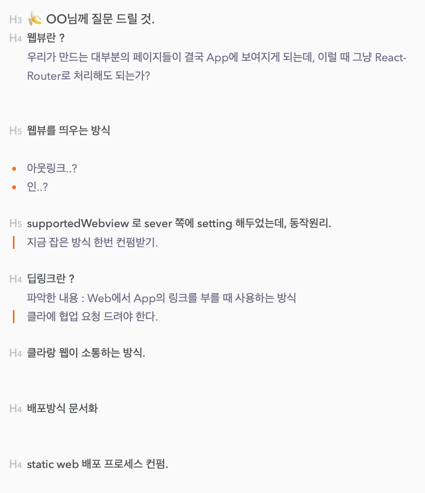
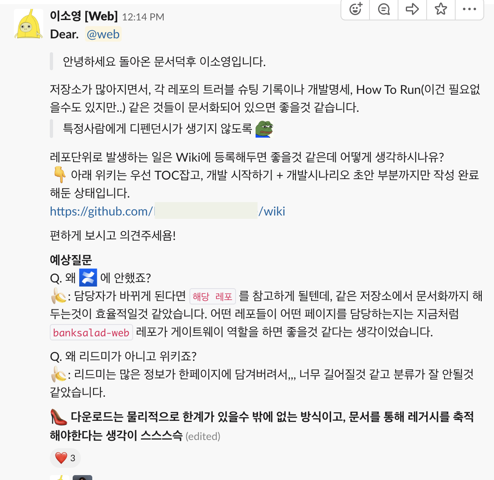
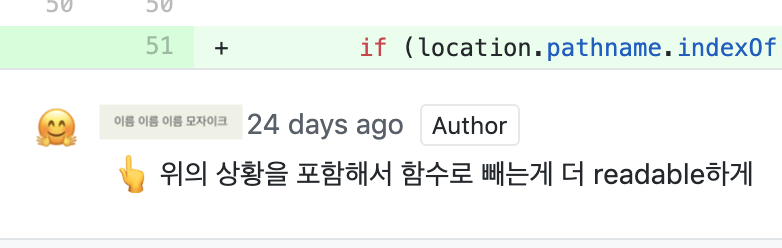
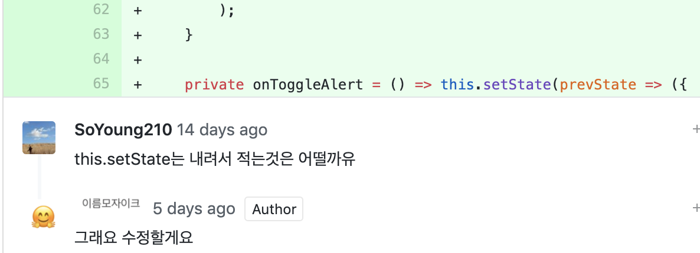
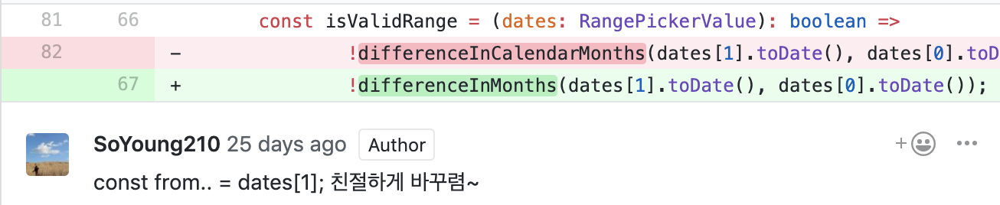

Starting with a React online course on July 17, 2018, I took my first step into frontend, and after joining as an intern on December 26, 2018, I put together a record of the 150 days since.

I'm now working as a member of the Web team at the company, and I want to look back on that journey and take one more step forward as a frontend developer.

## Part 1 - Communication & Thinking

1. Collaboration requires skill.
2. A developer is someone who builds the product.
3. Documentation isn't optional.
4. My code is the team's code.
5. You always need another perspective. (feat. talking perspective vs. perspective.)

## Part 2 - Tech

1. Clean Architecture
2. TypeScript
3. RxJS

This post is split into Part 1 and Part 2. Part 1 covers the `Communication & Thinking` half. 😀

## Communication & Thinking


Working at a company for the first time, absolutely everything was new.
Meeting a tech org of more than 30 people and a 5-person Web team gave me a lot to think about when it came to **collaboration** — something I'd only abstractly thought of as important before.

<div>

</div>

### 🍌 Collaboration requires skill.

Building a single product takes effort across a lot of different areas.  
From actual development — view, API, infra — all the way through deployment, it takes a lot of people's hands.

The point I thought mattered most in this process is that **"my colleagues' time and my own time are both precious."**  


Assuming we work five days a week, eight hours a day, there's genuinely a lot to get done.

1. Planning meetings with the other people on the same project
2. Development
3. Code review
4. Team meetings (per discipline)

To do the work well, I felt you need skill.

#### `Skill 1. Prepared questions`

In the course of developing something, you may need to ask a lot of questions.

> 🍌 : Oh, so-and-so worked on this part before! I should go ask them.  
> 🍌 : This time I need to deploy it this way, and there's an issue with that…  
> 🍌 : This API response… I don't quite get it!

I know what I tried and why it failed, but my colleague doesn't.  
A question that just blurts out, with no context about what problem I ran into or what I'm actually trying to solve, can't really be understood.  
**Vague questions only get vague answers.**

When asking a question, I try to set and follow guidelines like these:

<div style="background-color: #f6ffed; padding-top: 10px; padding-bottom: 10px">

1. Lead with the conclusion.  
   👉 What I'm implementing right now, and the end picture I'm aiming for.

2. Things to consider while implementing it.  
   👉 External libraries, dependencies, etc.

3. Tried approach A to solve the problem, and ran into error A-1.

4. Based on #3, I'm guessing approach B might work, and the reasoning is B-1.

5. Is it okay to go in this direction? Or should I consider a different approach?

</div>

Asking a question this way makes the situation clear.

😎 **My colleague says**

1. Oh, nice! I've run into a similar situation before, and took the same approach.  
   Along the way there might be an XYZ issue, so let me send you a link or repo worth referencing!

2. Hmm, the reasoning behind `B-1` seems a bit off. I think you should try a new approach, C.

Only once I've clearly separated what I know from what I don't do I actually get to learn the "don't know" part quickly.

#### `Skill 2. Efficient meetings`

In the same vein as the `limited time` I mentioned in Skill 1, meetings need skill too.
I can break this down into two situations: hosting a meeting, and attending one.

#### When hosting a meeting

The most important thing is knowing what you want to nail down through this particular meeting.  
You need an agenda ready that lays out what you'll discuss and what you want to walk away having decided.

For a new piece of work, I asked a colleague with relevant experience for a meeting, and prepared the question list below.



The meeting ran with that colleague answering my questions, and it accomplished exactly what I needed: clearing up the gray areas that were slowing down development.

> Without a prepared question list, there would have been an extra round of "hmm... what else might they not know?" just to dig up the questions.

#### When attending a meeting

Every meeting has a reason it was called. **Because a colleague's time is precious,** as a participant I try to organize my own thoughts on the agenda ahead of time.

Waiting until the meeting itself to start thinking makes it much less likely you'll think it through deeply, and can lead to the bad situation of having to walk back your own opinion.

#### `Skill 3. Gentle language.`

I thought this mattered even before joining, but it's felt even more important since. At work we mostly talk over Slack and do code review through GitHub. People's backgrounds vary widely, and during a conversation — especially over text — my intent can easily get distorted. No conversation should needlessly slide into the emotional realm.

1. When proposing an opinion, start from the premise that "everything here is just my own thinking, and my thinking could be wrong."  
   In code review, or whenever I share an opinion, my opinion could obviously be wrong, and there could be a better one out there. It should also be a basic premise that a colleague probably has a good reason for thinking the way they do.

> 🍌: I think it might be ~~ like this — what do you think, 😎?  
> 🍌: Oh! I understood it as ~~, so I'm curious why you wrote it this way, 😎! If I've got it wrong, I'd really appreciate you letting me know.

2. That said, still be clear.  
   Whether it's text or a spoken explanation, a rambling flow is hard to follow. It can wear out whoever's reading or listening. I emphasize whatever I want to emphasize, and I always try to make the TOC (Table of Contents) of what I'm saying clear.

> `Example) Communicating in writing`  
> **Point 1 I want to convey**  
> An explanation of that point, written so it reads well  
> **Point 2 I want to convey**  
> An explanation of that point, written so it reads well

> `Example) Having a conversation`  
> Well first, I'd like to talk about **part 1, part 2, and part 3.** ~

I think the single most important part of collaboration is mutual respect.

### 🍌 A developer is someone who builds the product.

I came to believe that a developer isn't just someone who writes code — they're someone who helps build the product.

Whether it's something I built in code myself, or something my team built without my direct hand in it, I need to voice opinions about the product and think about it from the user's perspective.  
Customers use this product, and the product is how I meet them.

Before actually writing any code, this is the question worth spending a lot of time on:

**What impact can this product have on our customers?**

I need to actively offer opinions and build understanding around whether something's inconvenient, and what direction the product I'm building should head in.  
How contradictory would it be if there were parts of what I'm building that I myself didn't understand?

### Documentation isn't optional.

This is something I pay a lot of attention to at work.



I believe I have a responsibility to keep the problems I've run into from repeating themselves for my colleagues.  
The code I write at work is code our team will maintain, and my colleagues shouldn't have to face the same problem I already did.

> 🍌 : (For any given problem, shouldn't flailing around once be enough?)

Since we're not all working on the same project, I think sharing each person's situation and troubleshooting notes solves a lot of this problem.

Recording what's needed to understand a project, what problems came up in it, and where its dependencies live is, I think, essential from a **team's code** perspective.

### 🍌 My code is the team's code.

I'm the one who writes my code, but zoom out even a little and it's ultimately code the Web team manages.  
Since we're developers, collaboration through code itself is an important point too.

#### Consistency

Everything — variable names, structure, how components are written — needs to be consistent.  
Within a single project, all of this should be written consistently enough that you can look at just a small part and immediately grasp the project's rules.

1. redux naming  
   Using a PREFIX, the requestAAABBB naming convention, where error handling lives
2. view structure  
   Separating container and presentation.
3. Folder tree  
   api, entity, …
4. lint
5. style sheet sort

#### Readability

For my code to actually become the team's code, it ultimately has to be written **consistently and with high readability.**

This came up a lot during code review.




Beyond that,

1. Declare `const`s at the top of the function.
2. Cut down how much there is to read using the `condition && <div />` pattern.
3. Lean on functions for condition checks (a long condition makes the flow hard to follow).

```js
if(conditionCheckFn) {
    // actual logic
}

const conditionCheckFn => (
    condition1 || condition2 || condition3
)
```

4. Meaningful naming




> Actually this wasn't a self-review — two teammates and I did an in-person review together, and I was just the one leaving all the comments. haha

### You always need another perspective.

Various perspectives I've picked up at work — things like architecture or coding style — aren't actually the correct answer.  
No, to put it more precisely, I think **there's never a single correct answer.**

#### Perspective vs. perspective

Questions like how to structure folders, or what code style to use, matter a lot more than you'd think.

These are mostly things we end up talking through a lot, either during setup before a project starts or during code review.
What matters in that conversation is **talking perspective versus perspective.**

I think this is different from just being stubborn — here's an example of what I mean.

> 🍌 : I think this button should probably be split out into a util? It seems like something we could reuse everywhere.  
> 😎 : Hmm… looking at every single component through the complicated lens of "is this a shared element or not" every time is … (rest omitted)

Talking it through as perspective versus perspective lets you see what was missing from your own thinking, and gain a fresh view on how the same problem can be looked at differently.

Having a lot of these conversations means my perspective sometimes becomes the team's, and the team's perspective sometimes becomes mine.  
**I ended up forming my own view on every single problem — and I think that, right there, might be what growth actually looks like.**

### 🍌 Wrapping up

Over these 150 days I thought about a lot, and learned a lot. I want to keep growing through the ongoing process of asking myself questions and working out my own answers.


> (...)

## Reference

[On the growth of junior developers](https://speakerdeck.com/jaeyeophan/junieo-gaebaljayi-seongjange-daehaeseo)

[The developer people want to work with](https://speakerdeck.com/jaeyeophan/gdg-campus-2018-meetup-balpyojaryo-hamgge-ilhago-sipeun-gaebalja)

## See also

[Operation Intern Landing](https://speakerdeck.com/soyoung210/inteonsangryugjagjeon)
