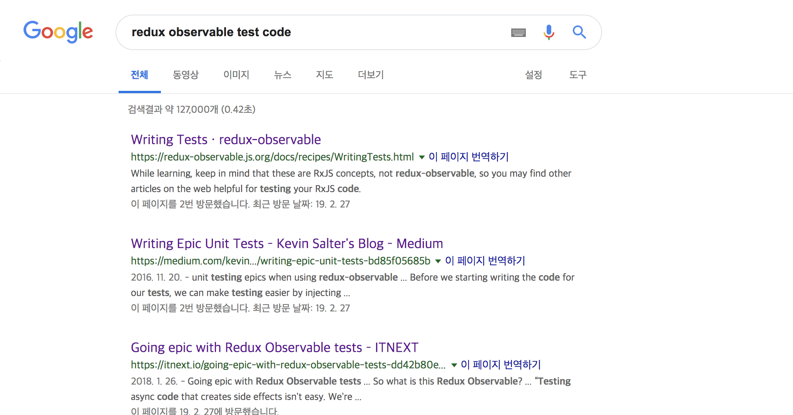
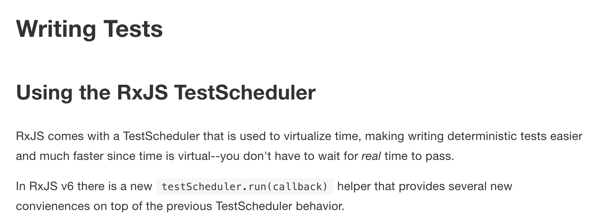
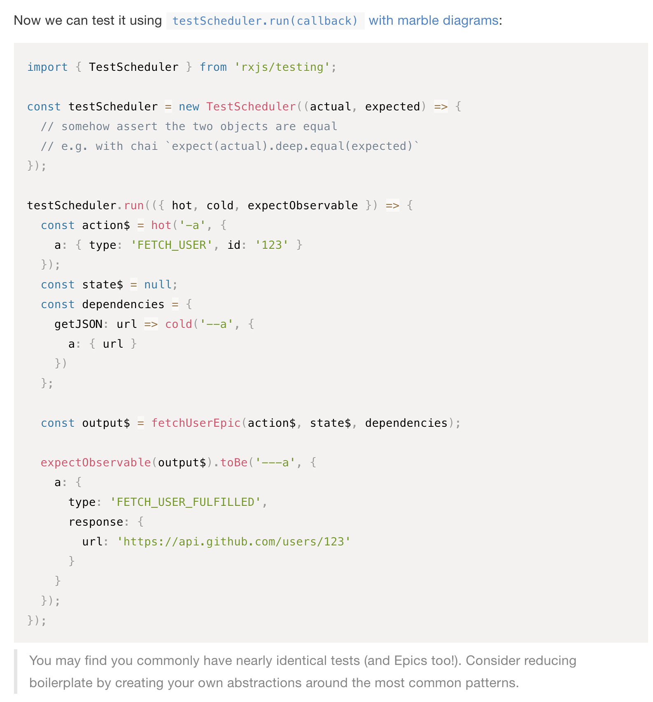
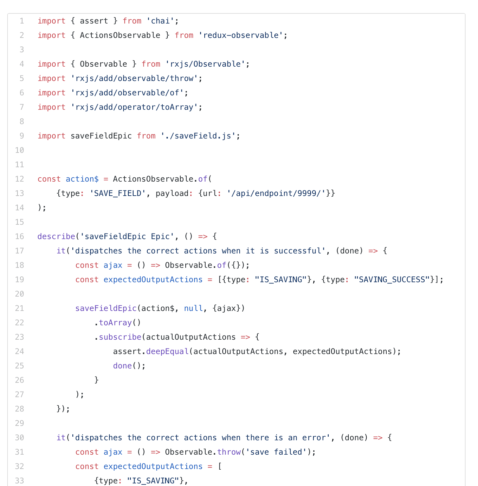
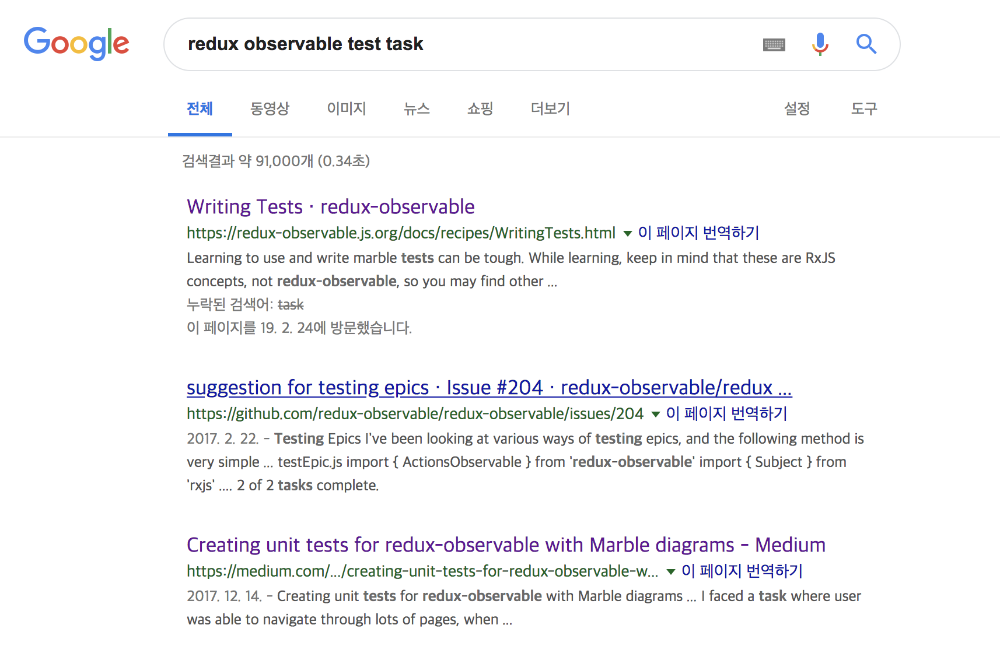
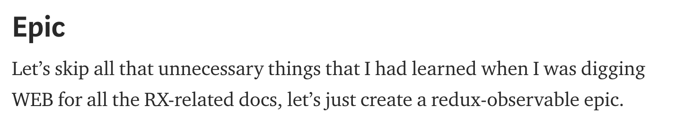
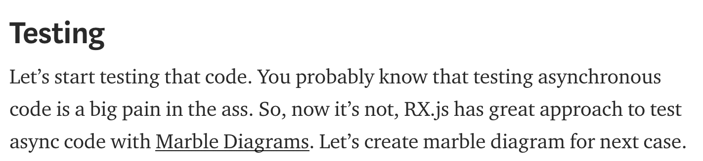
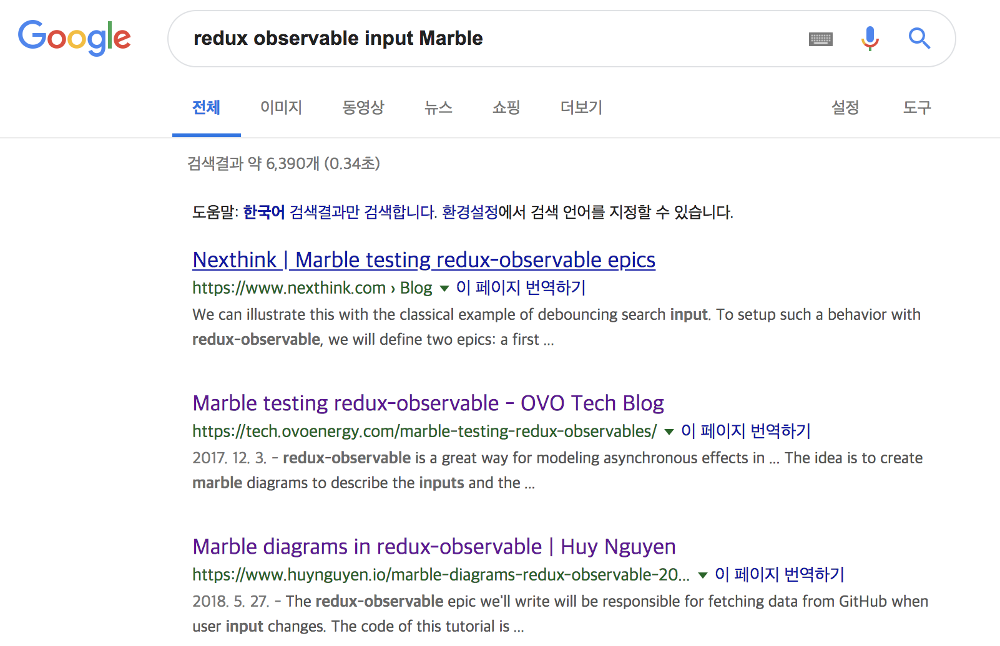
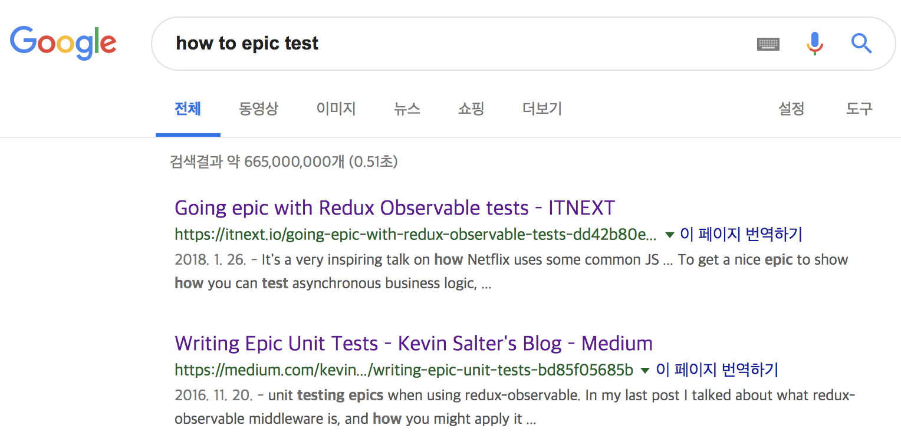
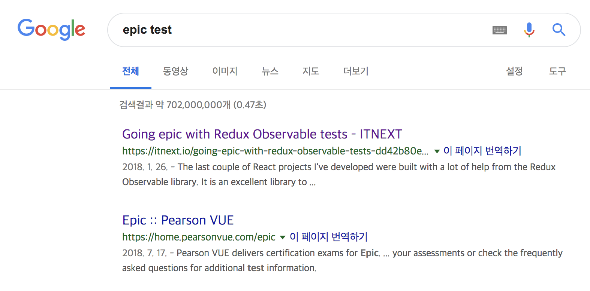

In the end, finding information means searching.
Wouldn't it be great if a single search turned up a silver-bullet article that solved the problem right away...

**`How do I search well?`**  
There's something that has to come before answering this question.

## What Don't I Know?

Searching happens to resolve **something you don't know.**
How can you accurately figure out what you know and what you don't?

Let's use the example of redux-observable testing, which I've been digging into hard recently.

Let's just try searching `redux observable test code`.



First, I figured the official docs were most likely to be the silver bullet.



`RxJS TestScheduler` comes up. Honestly, I didn't know the concept of TestScheduler, but I trusted the official docs and moved past it for the moment.



It was one vague concept after another — `hot`, `cold` — things I'd mistakenly thought I understood.
Writing test code was supposed to erase the anxiety and gray areas that come with code, but just copy-pasting code creates a whole new gray area.

**And so the first article from my Googling — the official docs — got closed with a Ctrl+W..**


I read the second result article.



Tracing through the flow of the code,

```
1. Create a fake action
2. Create a fake ajax(?) >> line 18
3. Define the expected action
4. Compare equality using assert.deepEqual (?)
```

Questions still remained.

1. Is this about defining a dependency and injecting it in as a mock?
2. What exactly does deepEqual.. do?
3. This is different from what the official docs said..?

After reading this article, my thought was: **okay, so how am I actually supposed to test an Epic..?**

### Why ?

Honestly, both articles contain great information.
Combine them the right way and you could probably put together a decent test.
But the reason I still felt lost after reading both is as follows.

1. I wanted to get complete information from one single article, but each of them fell a bit short.
2. The concepts each article conveys (though actually similar) are presented differently.
3. I was ignorant about testing middleware.
   > What needs to be mocked when testing a middleware, and how to test the part where the middleware dispatches a new action.

#### You Have to Break an Unfamiliar Concept Apart to Search It, and Learn the Pieces That Make It Up

What was it that I didn't know? Thinking back on it, I'd focused purely on **how** to test redux-middleware, not on **what** actually needed to be tested.

Let's go back and research what actually needs to be tested, first.

## What?



I changed my search query to `redux observable test task`.  
And this time, after the official docs, the article I picked was on **Medium**.

> 🎁: If I had to give a tip based on my personal feel and experience(?), after the official docs I've found the best articles on Medium and other blogs. (Statistically, more so than StackOverflow..?)

[Creating unit tests for redux-observable with Marble diagrams](https://medium.com/@dmitrymartynov_84736/creating-unit-tests-for-redux-observable-with-marble-diagrams-b1e1b34e5f44)  
 This is the article I ended up referencing.



Since learning about Epics is a prerequisite before you can run a test, a short passage about Epics comes up first.

And then,



It goes into the process of testing.

1. You need to create your own instance of the `$action`. To do that, you need to create a TestScheduler.

   > It clearly explains why you need the `TestScheduler` I'd seen earlier in the official docs.

2. It explains the flow where the Epic dispatches two actions.

What this article makes clear is **what mocking is needed, and what actually needs to be tested along the redux-observable flow.**

> Data like an inputMarble and a mocked ajax call were needed — the ajax call is created as a mock, and the response is mocked too.

From this article I only understood roughly that `inputMarble` is a kind of stream mocking, so to erase that gray area I went and googled that keyword again.



I searched with that keyword, and both of the two articles below gave me detailed information about input Marbles.

## Using Keywords Well

Once you've figured out what you don't know, spending time thinking through your `keywords` before searching is essential.  
I tried searching the example above with a few keywords removed.


Right off the bat, images with nothing to do with development show up.
**A term may be a development term to me, but it might not be one to someone else — or to Google.**

You have to make it explicitly clear that this is a development-related search, which is why the results you want only surface at the top once you add the keyword `redux-observable`.

### When You're Curious About the Method

When you're searching from the angle of `how do I do this?`, try adding the keyword `How to` first.

#### How to ~~



#### If You Search the Title Straight Off the Bat..



There's a high chance you won't get the result you want.

> 🔑 Okay! To remind myself again, what I was actually curious about was the **method (How To)** for testing an epic.

> If you want to know what the thing you're searching for even is, in itself, it's also good to try attaching a keyword like **What is**.

## Plus

In the situation of Googling to solve a problem, the following resources were helpful.

`1. Stackoverflow`

It's true that it helps. You might get a plausible-looking answer.
But, **you should never blindly trust it.** It might be legacy, or a solution built on an anti-pattern.

> Whatever the method, the key thing is ultimately to understand it before you use it.

`2. Repo issue ( open, close )`


Someone may have already opened an issue about your exact problem on the library's repository. It's worth checking closed issues too.

`3. Medium`


Medium has had a high hit rate for me over time. Pretty high 😄

`4. Diving In Yourself`


No issue on the repo, no article….
It's fine to raise the issue yourself. The maintainer will get a notification on their repo, and people from all over the world might help you out.

## Summary

I've gone on at some length here, but in the end there are just two keys to searching well.

1. Know what you don't know.
2. Break that "unknown" down into pieces and search each one specifically (by wrapping it in good keywords).

If you Google with these two things in mind, I think you can shave off at least some of the time you spend swimming through the sea of information.
