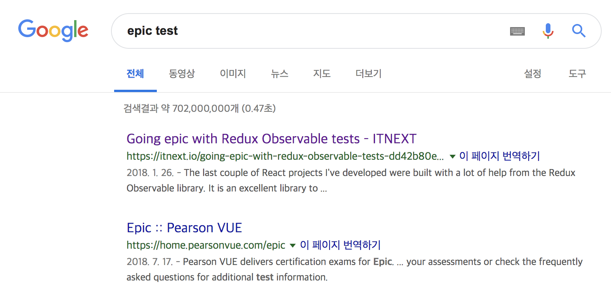

결국 정보를 찾는다는 것은 검색이다.
한번의 검색으로 silver bullet 같은 아티클을 읽어 문제를 해결할 수 있다면 얼마나 좋을까...

**`어떻게 해야 잘 검색할까?`**  
이 문제에 앞서 선행되어야 하는 부분이 있다.

## 무엇을 모르는가?

검색은 **모르는 것** 을 해결하기 위해 이루어 진다.
어떻게 내가 무엇을 모르고 무엇을 알고 있는 지 정확히 파악할 수 있을까?

이번에 열심히 자료를 찾아보고 있는 redux-observable test 의 예를 들어보자.

단순히 `redux observable test code` 라고 검색 해보자.


우선, 공식문서가 silver bullet일 확률이 높다고 생각했다.


`RxJS TestScheduler` 가 나온다. 사실 TestScheduler의 개념을 몰랐지만 공식문서를 믿으며 우선 넘어가봤다.


`hot` , `cold` 등 모호한, 안다고 착각했던 개념의 연속이었다.
테스트 코드를 작성한다라는 것은 코드로 발생하는 불안함과 회색영역을 지우기 위함이었는데, 코드를 복사 붙여넣기 하는 것은 새로운 회색영역을 만드는 일이다.

**이렇게 구글링 첫 번째 아티클인 공식문서는 Ctrl+W로 닫게 되었다..**


두 번째 결과 아티클을 읽어본다.


코드의 흐름을 파악해보면,

```
1. 가짜 액션 만들기
2. 가짜 ajax 만들기(?) >> 18 line
3. 기대되는 action 정의
4. assert.deepEqual 를 이용해서 같은지 비교 (?)
```

여전히 의문이 남았다.

1. 의존성을 정의해주고 mock 형태로 주입해주는 동작인가?
2. deepEqual은.. 어떤 동작을 할까?
3. 공식문서의 내용이랑은 다른데..?

이 문서를 읽고 든 생각은 **아, 그래서 Epic 은 어떻게 테스트해야하지..?**

### Why ?

사실 두 문서 모두 훌륭한 정보를 담고 있다.
각 문서를 적당히 조합하면 그럴싸한 테스트 코드를 작성할 수 있을지도 모른다.
하지만 이 두 가지 문서를 읽고도 막막했던 이유는 아래와 같다.

1. 한 문서에서 완벽한 정보를 얻고 싶었지만 모두 조금씩 부족함.
2. 두 문서에서 전달하는 개념이 (사실은 비슷하지만) 다르다.
3. 나는 Middleware 테스트에 대해 무지했다.
   > middleware를 테스트할 때 어떤 것을 mocking 해야 하는지, 미들웨어는 새로운 액션을 디스패치 하는데, 이 부분을 어떻게 테스트 해야 하는지.

#### 모르는 개념은 쪼개서 검색해야 하고, 각 개념을 구성하는 요소에 대해 학습해야 한다.

무엇을 몰랐을까? 다시 생각해보니, redux-middleware 에서 **무엇을** 테스트 해야하는지가 아니라 단순히 **어떻게** 에만 집중했다.

무엇을 테스트 해야하는지 부터 다시 리서치 해보자.

## 무엇을 ?


검색어를 `redux observable test task` 로 바꾸어 보았다.  
그리고, 공식문서 다음으로 선택한 article은 **Medium** 이었다.

> 🎁 : 개인적인 느낌과 경험(?) 에서 Tip을 적자면 공식문서 다음으로는 미디엄을 비롯한 블로그 등에서 좋은 아티클을 얻었습니다. (통계적으로 stackoverflow보다는..?)

[Creating unit tests for redux-observable with Marble diagrams](https://medium.com/@dmitrymartynov_84736/creating-unit-tests-for-redux-observable-with-marble-diagrams-b1e1b34e5f44)  
 이 글을 참고하게 되었다.


Test 를 수행하기 전에, Epic에 대해 학습하는 것은 필수이므로, Epic에 대해 짤막한 글이 나온다.

그리고,


Test 하는 과정에 대해 나온다.

1. \$ action에 대한 자체 인스턴스를 만들어야한다. 이를 위해 TestScheduler를 만들어야한다.

   > 앞서 공식문서에서 보았던 `TestScheduler` 의 필요성에 대해 명확히 언급되어 있다.

2. Epic 에서 두 가지 액션을 디스패치 하는데, 이 흐름에 대해 설명.

이 아티클에서 파악할 수 있는 부분은, **어떤 mocking 이 필요하고, redux-observable 흐름상 어떤 것들을 테스트 해야 하는지** 이다.

> inputMarble, mocking ajax 등의 데이터가 필요했고, ajax 는 mocking으로 만들고 응답도 mocking 합니다.

이 아티클에서는 `inputMarble` 이 대략적인 stream mocking 인 정도만 이해했으니, 이 부분에 대해 회색영역을 지우기 위해 이 키워드로 다시 구글링을 진행했다.


해당 키워드로 검색을 진행했고, 아래 두 가지 글에서 모두 input Marble에 대해 자세한 정보를 얻을 수 있었다.

## 키워드 잘 쓰기

무엇을 모르는지 파악했다면, 검색에 앞서 `키워드` 를 고민하는 시간이 필수적이다.  
위 예제에서 키워드를 몇 가지 빼고 검색 해보았다.


대뜸, 개발과 관련없는 이미지부터 노출된다.
**나에게는 개발용어 이지만, 누군가(혹은 구글) 에게는 개발용어가 아닐 수 있다.**

명확히 개발에 관련된 검색임을 명시해 주어야 하고, 그렇기 때문에 `redux-observable` 이라는 키워드를 추가해야만 원하는 결과가 상단에 노출된다.

### 방법이 궁금할 때

`이걸 어떻게 하지?` 라는 관점에서 검색을 진행할 때에는 우선적으로 `How to` 라는 키워드를 붙여본다.

#### How to ~~


#### 다짜고짜 제목부터 검색하면..



원하는 결과를 얻지 못할 확률이 높다.

> 🔑 자! 다시 상기해보면, 나는 epic 을 테스트 하는 **방법(How To)**이 궁금했던 것이다.

> 내가 검색하고자 하는것이 어떤것인가? 자체를 알고 싶다면, **What is** 등의 키워드를 붙여보는 것도 좋다.

## Plus

문제를 해결하기 위해 구글링 하는 상황에서 다음과 같은 자료들이 도움이 되었다.

`1. Stackoverflow`

도움이 되는건 사실이다. 그럴싸한 답을 얻을 수도 있다.
하지만, **절대 맹신해서는 안된다.** 레거시가 있을 수 있고 안티패턴으로 해결한 방법일 수 있다.

> 어떤 방법이던, 결국 이해하고 써야하는것이 핵심이다.

`2. Repo issue ( open, close )`


문제 상황에 대해 누군가 라이브러리의 repository에 이슈를 제기했을 수 있다. close 된 이슈도 살펴보는 것이 좋다.

`3. 미디엄`


그동안 미디엄은 적중확률이 높았다. 꽤나 😄

`4. 직접 부딪히기`


레포에 이슈도 없고, 아티클도 없고….
직접 이슈레이즈를 해도 된다. 메인테이너는 자신의 repo issue 알람을 받을 것이고, 전 세계 사람들이 도와줄수도 있다.

## 정리

어찌보면 길고 장황하게 설명했지만 결국 검색에서의 핵심은 두 가지 이다.

1. 내가 무엇을 모르는지 알기.
2. 쪼개진 `모르는 것` 에 대해 세분화 해서 검색하기 ( 키워드를 잘 포장해서 )

이 두 가지를 의식하며 구글링을 한다면, 정보의 바다에서 헤엄치는 시간을 조금 줄일 수 있지 않을까 라고 생각한다.
