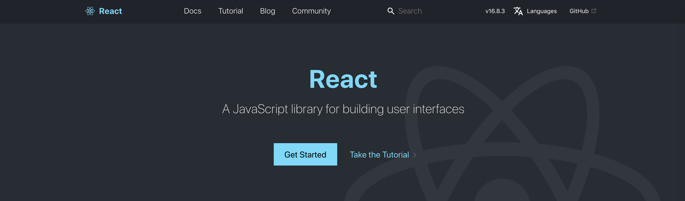
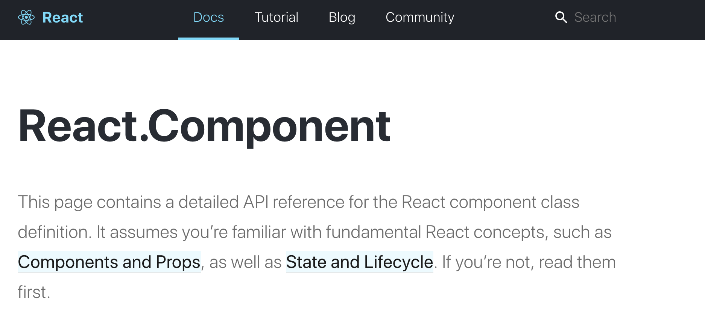
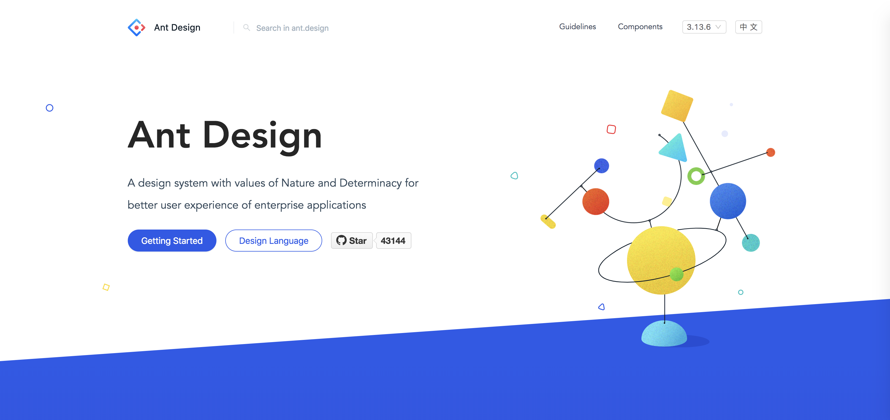
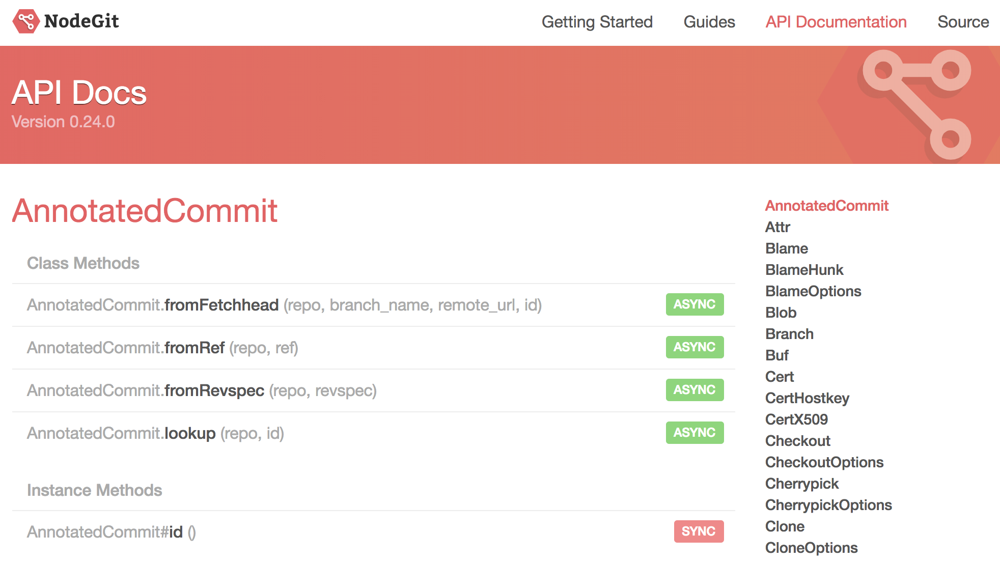

**Note: this isn't about blaming anyone for skipping the official docs. It's simply that the docs hold a lot more than you'd expect. (This is So Young's take on official documentation.)**

## Why?

Telling people to "go read the official docs carefully" can sound like a cliché straight out of a textbook.

> A quick Google search will have Stack Overflow handing you a tidy solution anyway...!  
> But whatever shape the docs are in, well organized or not, they all share one thing: they're the **fastest way to see what a library actually offers**.

- Figuring out which feature I actually need
- Learning how to put that feature into real code

## Let's Read!

Of the libraries I've used, some had docs that really came through for me, and some barely helped at all.

### React

[React – A JavaScript library for building user interfaces](https://reactjs.org/)  
React's official docs, for one, are just easy to read.  
They walk through the basic concepts and cover everything from beginner tutorials to advanced usage.

[State and Lifecycle – React](https://reactjs.org/docs/state-and-lifecycle.html)  
When I first learned React, lifecycle, state, and props confused me badly. Looking back, I think the point things finally clicked was right after I read the official docs. 🤔

Searching `리액트` (React) even turns up plenty of well-translated Korean docs, but those are still someone else's interpretation, filtered through their own edits.  
Wouldn't you rather hear straight from the people who built React what they wanted to emphasize, and where they expected users to trip up?  
**That's what the official docs give you.**

From the maintainers' side, a lot goes into it:

- how to bundle component LifeCycle and State together in a way that makes sense
- why you shouldn't mutate state directly
- what approach **the maintainers themselves** recommend
- what kind of tutorial gets people up to speed on the basics

All of that is baked into the docs at reactjs.org.

> Bottom line: React's official docs are, hands down, one of the best-organized sets of docs I've used.

### Ant Design

https://ant.design/  
Ant Design's docs are **incredibly thoughtful.**

> Honestly, whatever examples turn up from googling can't touch the cases already covered in the official docs.  
> The volume and quality are just on another level. 🤔

Say you're using the `Table` component (Ant Design's Table view) — it hands you actual example code!! for pretty much every design you could think of.

You just find an example close to what you're building and tweak it a little.  
And you get all of that just by reading the official docs.

### nodegit

[API Docs](https://www.nodegit.org/api/)
The two cases above are both cleanly put together, but the docs that gave me a hard time were `nodegit`'s.

> In the end there was a problem I couldn't work around no matter what I tried, so I filed an issue on the repo and switched to a different library.

#### What worked

This is probably true of any set of official docs, but the whole point of reading them is figuring out what's actually on offer.  
The first time I opened the API Docs, I noticed they even spelled out whether each API was `async` or `sync` — in that one respect, at least, they were pretty considerate.

#### What fell short

There's no usage guidance anywhere.

Take the checkout-branch API in [CloneOptions](https://www.nodegit.org/api/clone_options/#checkoutBranch): there's no actual usage code, so it feels abstract.  
You're left inferring how to use it from the parameter list alone, and getting that wrong along the way is a good way to introduce a bug.

And once that bug shows up, tracking it down takes a while too.

## 🚕 Wrapping up

Writing this, I can tell it drifted a bit into "here are the docs I personally like," but the point I actually wanted to make was this: **your basic understanding of any library should start with its official docs**.

Even if you end up solving your problem some other way, do that research after you've absorbed the basics the docs already give you.

> I'd bet that if you only ask about what the basics really couldn't cover, both how often you ask and how long it takes will drop sharply.
