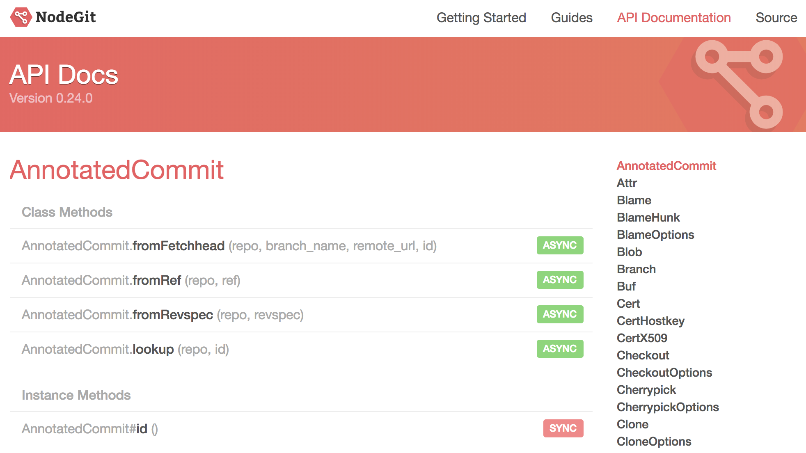

**주의 : 공식문서를 읽지 않았다는 Blame 취지가 아닌, 생각보다 공식문서에 많은것이 담겨있다 라는 취지의 글입니다. (이소영이 생각하는 공식문서에 대해 이야기합니다.)**

## Why ?

`공식문서` 를 잘 읽어보자 라는 말은 어쩌면 교과서 적이라고 할 수도 있다.

> 적당히 구글링하면 stackoverflow가 친절한 해결책을 알려주는데..!  
> 하지만, 우선 잘 정리된 공식문서던 아니던, 공통적으로 **어떤 기능을 제공하는지 가장 빠르게 파악** 할 수 있다.

- 나에게 필요한 기능 파악
- 이 기능을 실제 코드로 어떻게 구현하는가에 대한 학습

## Let’s Read!

지금까지 사용했던 라이브러리 중 공식문서 덕을 본 것도 있고, 썩 도움을 받지 못했던 것도 있다.

### React

[React – A JavaScript library for building user interfaces](https://reactjs.org/)  
우선, React 의 공식문서는 정말 읽기 편하다.  
기본적인 개념에 대해서 소개하고, 초보자를 위한 튜토리얼부터 Advanced 사용성까지 고려하여 문서에 담아냈다.

[State and Lifecycle – React](https://reactjs.org/docs/state-and-lifecycle.html)  
처음 React를 배울 때 LifeCycle과 state, props에 대해 정말 많이 헷갈렸는데, 결국 이해된다고 생각하기 시작한 시점은 공식문서를 읽고난 다음부터가 아니었나 라는 생각이 든다. 🤔

사실, `리액트` 라는 키워드로 검색했을 때도 잘 번역된 한글문서가 많지만, 결국 저자에 의해 재해석되어 편집된 글이다.  
리액트를 만든 사람이 어떤 것을 강조하고 싶었고, 사용자를 고려했을 때 어떤 오류가 있을 것 같다고 생각했는지 결국 직접 들어보고 싶지 않은가?  
**그렇다면 공식문서다.**

제작자 입장에서는 여러가지가 고려되어 있다.

- component LifeCycle 과 State를 어떻게 묶어서 설명하면 좋을지.
- 왜 state를 mutable하게 수정하는 것을 하면 안되는지
- **제작자가 제안하는** 방법은 무엇인지
- 기초를 익히기 위해서는 어떤 튜토리얼을 제공해야 하는지

등이 모두 고려된 문서가 reactjs.org 의 문서이다.

> 결론 : React 공식문서는 잘 정리된 공식문서라고 생각합니다.

### Ant Design

https://ant.design/  
앤트 디자인의 문서는 **정말 친절하다.**

> 사실, 구글링해서 나오는 Example이 공식문서에 있는 case를 따라가지 못한다.  
> 비교할 수 없는 양과 퀄리티. 🤔

예를 들어, `Table` 이라는 컴포넌트(앤트디자인에서 제공하는 Table View) 를 사용한다고 했을 때, 생각할 수 있는 여러가지 디자인에 대해서 무려 예제코드!! 를 제공한다.

구현하고자 하는 기능에 대해서 비슷한 디자인 example을 찾은 후 약간의 custom만 하면 되는 형태이다.
이런 점이 무려 공식문서만 보면 해결된다.

### nodegit

[API Docs](https://www.nodegit.org/api/)
앞선 두 가지 케이스는 정말 잘 정돈된 문서이고, 내 입장에서 좀 불친절했던 docs는 `nodegit` 이었다.

> 결국 이렇게 저렇게 해결할수 없는 문제가 있어, 해당 레포에 issue rasing 하고 다른 라이브러리를 택했다.

#### 좋았던 점

모든 공식문서가 그렇겠지만, 결국 공식문서를 본다 라는 것은 어떤 기능을 제공하는지 파악하기 위함이다.
API Docs를 처음 보았을 때, 이 api가 `async` 인지 `sync` 인지까지 명시한 이 문서는 어떤 면에서는 꽤 친절하다고도 할 수 있겠다.

#### 아쉬웠던 점.

usage에 대한 언급이 없다.

가령, [CloneOptions](https://www.nodegit.org/api/clone_options/#checkoutBranch) 에서 checkout-branch API 를 살펴본다고 했을 때, 실질적인 사용코드를 제공하지 않아서 추상적으로 느껴졌다.
들어가는 Parameters 만 보고 해당 사용을 유추해야 하고, 이 과정에서 잘못사용하면 버그가 발생할 확률이 높다.

그리고, 버그가 발생했을 때 해결하는 과정 또한 오래걸린다.

## 🚕 정리

작성하다보니 약간 `어떤 공식문서가 좋아요` 의 뉘앙스가 된것을 지울수는 없지만,
말하고자 했던 핵심은 **내가 쓰는 라이브러리에 대한 기본적 파악을 공식문서에서 부터 출발** 해야 한다는 것이었다.

다른 방법으로 문제를 해결하게 되더라도, 공식문서에서 제공하는 기본적인 내용을 숙지한 상태에서 리서치가 이루어져야 한다.

> 기본적이 정보로 해결할 수 없었던 부분에 대해 질문한다면, 질문하는 횟수나 시간이 현저하게 줄어들 것 같다고 생각한다.
