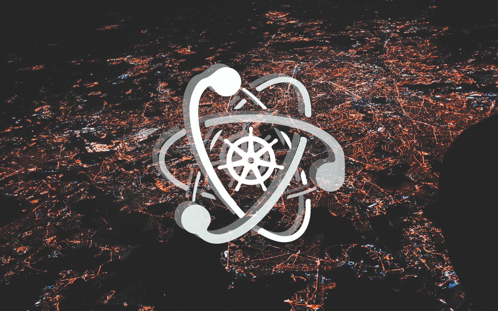
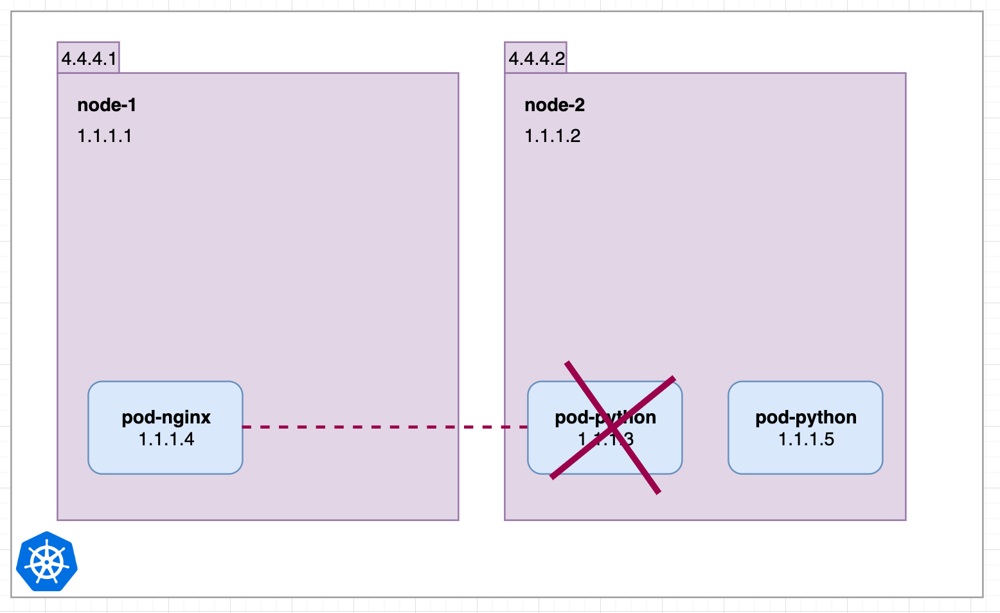
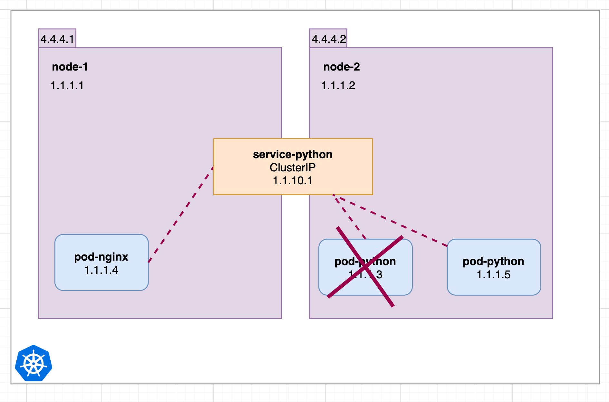
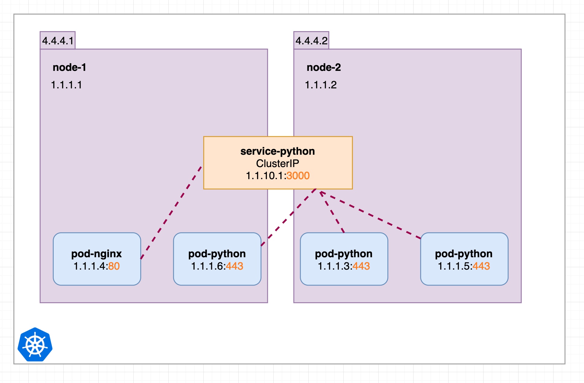
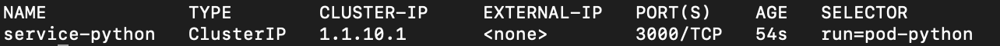

이 글은 원작자의 허락하에 [원문](https://medium.com/swlh/kubernetes-services-simply-visually-explained-2d84e58d70e5)을 번역한 글입니다.

## Parts

- Part 1: this article
- Part 2: [Kubernetes Ingress simply visually explained](https://medium.com/@wuestkamp/kubernetes-ingress-simply-visually-explained-d9cad44e4419?sk=e8ca596700f5b58c7ab0d85d4dab6386)

## TL;DR

FIXME
ClusterIP의 근간이 되는 4개의 서비스가 있습니다.


NodePort서비스를 생성하면 ClusterIP도 생성된다고 상상해봅시다. 그리고, LoadBalancer를 생성하면 NodePort가 생성되고 ClusterIP가 생성됩니다.

이렇게 하면, k8s는 쉬워집니다. 본 글에서는 위 문장에 대한 과정을 차례대로 소개합니다.

## Service and Pods

Service는 pod들을 가리킵니다. Service는 **developments나 레플리카셋을 가리키지 않습니다.**

Service는 labels를 이용해서 pod을 선택합니다. 이 방법은 매우 유연함을 가지는데, pod을 생성한 다른 요소에 의해 구애 받지 않기 때문입니다.

단계별로 각 Service 타입이 어떻게 구성되는지 예제로 살펴보겠습니다.

## No Services

우선, Service 없이 시작해보겠습니다.


두 개의 Node와 하나의 pod이 있습니다. 각 Node는 외부 주소(4.4.4.1, 4.4.4.2)와 내부 주소(1.1.1.1, 1.1.1.2)를 가집니다. `pod-python`pod은 하나의 내부주소만 가집니다.


// FIXME: 여기 첫 번째 문장 좀 많은 의역인것 같군.
`node-1`에 속하는 `pod-nginx`를 추가합니다. 이것은 연결(connectivity)에 아무 문제가 안됩니다. k8s에선 모든 pod들이 어떤 node에서 돌아가고 있는지 여부에 관계 없이 내부 ip주소로 서로 통신할 수 있습니다.

이것은 `pod-nginx`가 내부주소 `1.1.1.3`을 이용해서 `pod-python`에게 ping을 보내거나 다른 연결을 할 수 있다는 것을 의미합니다.



`pod-python`이 죽고나서 다시 생성된 상황을 생각해봅시다.

> 본 글에서는 pod이 어떻게 관리되는지에 대해서 다루지 않습니다.

`pod-nginx`는 더이상 1.1.1.3을 이용할 수 없습니다. 그리고 이 상황은 곧 장애로 이어지게 됩니다.  
이 상황을 방지하기 위해 첫 번째 service를 생성해봅시다!

## ClusterIP



이전과 같은 상황이지만, `Cluster IP`service가 생겼습니다. service는 pod처럼 특정 node에서 수행되지 않습니다.

> 본 글에서는 `service`란, 전체 cluster에서 접근 가능하다고 가정하겠습니다.

`pod-nginx`는 언제나 안전하게 1.1.10.1이나 `service-python`이라는 dns name에 연결할 수 있고 살아있는 python pod으로 redirect됩니다.



예제를 확장해서, 3개의 python pod을 추가하겠습니다.

cluster의 모든 pod들은 _http://1.1.10.1:3000_ 혹은 _1.1.10.1:3000_ 을 통해서 443port의 443port를 가진`python-pod`에 접근 가능합니다. Cluster IP(service-python)은 랜덤하게 혹은 round-robin규칙에 따라 요청을 분산시킵니다.

> 덧붙임: 이미지에는 표현되어 있지 않지만, ClusterIP service에서 `selector: pod-python`으로 설정되어 있기 때문에 pod-python에 접근할 수 있습니다.

이것이 Cluster IP가 하는 역할이며, 이름과 IP를 통해 cluster내부에서 pod을 사용할 수 있게 합니다.  
위 이미지의 `service-python`에 대한 `yaml`입니다.

```yaml
apiVersion: v1
kind: Service
metadata:
  name: service-python
spec:
  ports:
    - port: 3000
      protocol: TCP
      targetPort: 443
  selector:
    run: pod-python
  type: ClusterIP
```

`kubectl get svc`를 실행해 봅니다.



## NodePort

Now we would like to make the ClusterIP service available from the outside and for this we convert it into a NodePort one. In our example we convert the service-python with just two simple yaml changes:
