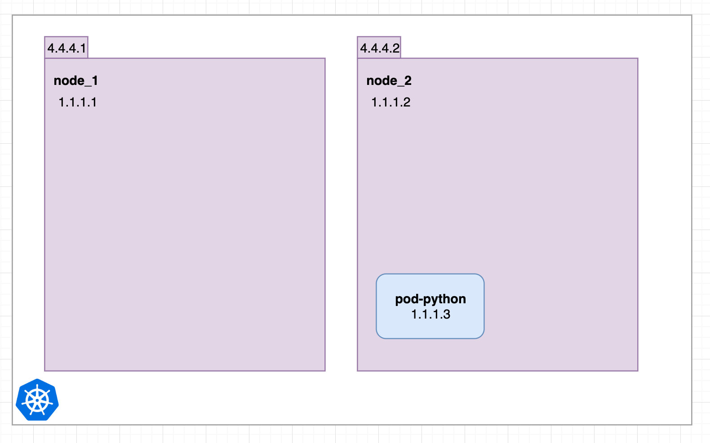
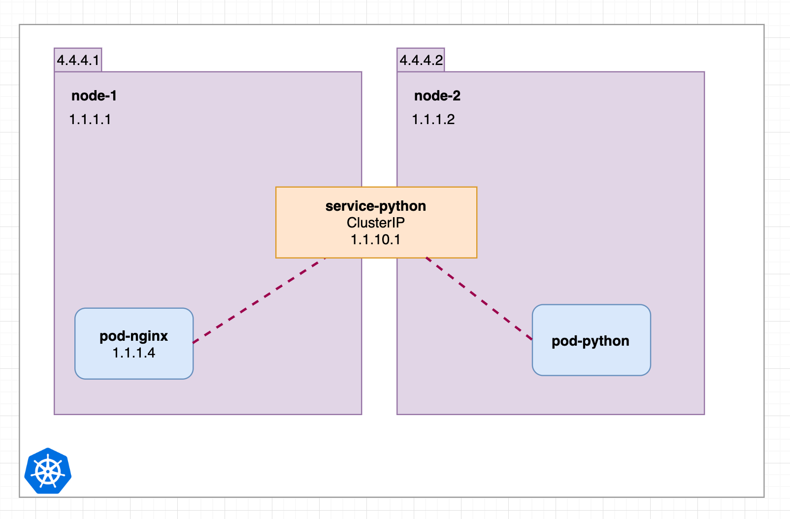

이 글은 원작자의 허락을 받고 [원문](https://medium.com/swlh/kubernetes-services-simply-visually-explained-2d84e58d70e5)을 번역한 글입니다.

## Parts

- Part 1: this article
- Part 2: [Kubernetes Ingress simply visually explained](https://medium.com/@wuestkamp/kubernetes-ingress-simply-visually-explained-d9cad44e4419?sk=e8ca596700f5b58c7ab0d85d4dab6386)

## TL;DR

ClusterIP의 근간이 되는 4개의 서비스가 있습니다.


NodePort서비스를 생성하면 ClusterIP도 생성된다고 상상해봅시다. 그리고, LoadBalancer를 생성하면 NodePort가 생성되고 ClusterIP가 생성됩니다.

이렇게 이해 하면, k8s는 쉬워집니다. 본 글에서는 위 문장에 대한 과정을 차례대로 소개합니다.

## Service and Pods

Service는 pod들을 가리킵니다. Service는 **developments나 레플리카셋을 가리키지 않습니다.**

Service는 labels를 이용해서 pod을 선택합니다. 이 방법은 매우 유연한 방법입니다. pod을 생성한 다른 요소에 의해 구애 받지 않기 때문입니다.

단계별로 각 Service 타입이 어떻게 구성되는지 예제로 살펴보겠습니다.

## No Services

우선, Service 없이 시작해보겠습니다.



두 개의 Node와 하나의 pod이 있습니다. 각 Node는 외부 주소(4.4.4.1, 4.4.4.2)와 내부 주소(1.1.1.1, 1.1.1.2)를 가집니다. `pod-python`pod은 하나의 내부주소만 가집니다.


`node-1`에 속하는 `pod-nginx`를 추가합니다. 이 과정은 연결(connectivity)에 아무 문제가 되지 않습니다. k8s에선 모든 pod들이 어떤 node에서 돌아가고 있는지 여부에 관계 없이 내부 ip주소로 서로 통신할 수 있습니다.

이 말은, `pod-nginx`가 내부주소 `1.1.1.3`을 이용해서 `pod-python`에게 ping을 보내거나 다른 연결을 할 수 있다는 것을 의미합니다.


`pod-python`이 죽고나서 다시 생성된 상황을 생각해봅시다.

> 본 글에서는 pod이 어떻게 관리되는지에 대해서 다루지 않습니다.

`pod-nginx`는 더이상 1.1.1.3을 이용할 수 없습니다. 그리고 이 상황은 곧 장애로 이어지게 됩니다.  
이 상황을 방지하기 위해 첫 번째 service를 생성해봅시다!

## ClusterIP


이전과 같은 상황이지만, `Cluster IP`service가 생겼습니다. service는 pod처럼 특정 node에서 수행되지 않습니다.

> 본 글에서는 `service`는 전체 cluster에서 접근 가능하다고 가정하겠습니다.

`pod-nginx`는 언제나 안전하게 1.1.10.1이나 `service-python`이라는 dns name에 연결할 수 있고, 살아있는 python pod으로 redirect됩니다.


예제를 확장해서, 3개의 python pod을 추가하겠습니다.

cluster의 모든 pod들은 `http://1.1.10.1:3000` 혹은 `http://service-python:3000`을 통해서 `python-pod`의 443port로 접근 가능합니다. Cluster IP(service-python)는 랜덤하게 혹은 round-robin규칙에 따라 요청을 분산시킵니다.

> 덧붙임: 이미지에는 표현되어 있지 않지만, ClusterIP service에서 `selector: pod-python`으로 설정되어 있기 때문에 pod-python에 접근할 수 있습니다.

이것이 Cluster IP가 하는 역할이며, 이름과 IP를 통해 cluster내부에서 pod을 사용할 수 있게 합니다.  
위 이미지의 `service-python`에 대한 `yaml`입니다.

```yaml
apiVersion: v1
kind: Service
metadata:
  name: service-python
spec:
  ports:
    - port: 3000
      protocol: TCP
      targetPort: 443
  selector:
    run: pod-python
  type: ClusterIP
```

`kubectl get svc`를 실행해 봅니다.


## NodePort

이제 ClusterIP service를 외부에서 사용가능 하게 하기 위해 NodePort로 변경할 것입니다. 이 예제에서는 yaml 파일에서 두 가지를 변경하여서 `service-python`을 변경해보겠습니다.

```yaml{10,13}
apiVersion: v1
kind: Service
metadata:
  name: service-python
spec:
  ports:
    - port: 3000
      protocol: TCP
      targetPort: 443
      nodePort: 30080
  selector:
    run: pod-python
  type: NodePort
```


모든 내부 node및 외부 IP 주소에서 30080 port를 통해 내부 서비스인 `service-python`에 접근 할 수 있습니다.


cluster내부의 pod또한 30080port를 통해 내부 node IP에 연결할 수 있습니다.


`kubectl get svc`를 실행하면 동일한 Cluster IP가 표시됩니다. `TYPE`이 NodePort로 변경되었고, `PORT`에 30080이 추가되었습니다.


내부적으로 NodePort service는 여전히 이전에 ClusterIP service 역할을 합니다. 추가 ClusterIP 객체가 없어도 NodePort service가 ClusterIP service를 생성한다고 이해하면 됩니다.

### 덧붙임

모든 Node는 30080port를 통해 `pod-python`에 접근할 수 있습니다.

NodePort의 port번호를 지정하지 않으면, 30000-32767 대역에서 적절하게 할당해줍니다.  
하지만 이렇게 관리하게 되면 어떤 **서비스가 어떤 Port에 할당되어 있는지 명시적이지 않습니다.** 또한, 보안상 취약한 부분이 존재하는 등 여러가지 측면에서 LoadBalancer Type을 사용하는 것이 좋기 때문에 LoadBalancer라는 개념이 존재하지 않는 on-premise 환경이 아닌 이상 굳이 사용하지 않는다고 합니다.

## LoadBalancer

모든 외부 Node IP에 요청을 분배하는(round robin같은 방법을 사용해서) 단일 IP를 원할 경우 LoadBalancer service를 사용합니다. 따라서 NodePort service 위에 구축됩니다.


LoadBalancer service가 ClusterIP service를 생성하는 NodePort service를 생성한다고 이해하시면 됩니다. 이 설정(ClusterIP → LoadBalancer)의 변경된 yaml은 다음과 같습니다.

```yaml{13}
apiVersion: v1
kind: Service
metadata:
  name: service-python
spec:
  ports:
    - port: 3000
      protocol: TCP
      targetPort: 443
      nodePort: 30080
  selector:
    run: pod-python
  type: LoadBalancer
```

LoadBalancer가 하는 일은 NodePort service를 만드는 것이 전부입니다. Kubernetes cluster를 hosting하는 `provider`에 모든 외부 node IP 및 특정 nodePort를 가리키는 LoadBalancer를 설정하도록 요청하는 메세지를 보냅니다.

> 덧붙임: LoadBalancer는 각 provider에 따라 세부 구현이 다릅니다.

> 💡 **Provider란?**  
> aws나 gcp같은 서비스를 말하며, aws에서 운영되는 k8s에 LoadBalancer타입 서비스를 생성하게 되면 aws ELB리소스가 생성됩니다.

만약 이 `provider`가 위와 같은 요청을 지원하지 않는다면, 아무 일도 일어나지 않을 것이며 LoadBalancer는 NodePort service의 역할과 같은 역할을 할것입니다.

`kubectl get svc`을 수행하면 `EXTERNAL-IP`가 다른 type으로 추가된 것을 볼 수 있습니다.


LoadBalancer service는 외부, 내부 node에 대해 30080 port를 엽니다. 그리고 여전히 ClusterIP service처럼 작동합니다.

## External Name

마지막으로 살펴볼 것은 ExternalName이라는 service인데, 이전에 살펴본 3개의 서비스와는 조금 다릅니다.
즉, 이 서비스는 endpoint가 DNS name을 가리키는 내부 서비스를 생성합니다.

앞선 예제에서 본것처럼, `pod-nginx`는 이미 새로운 Kubernetes cluster내부에 있습니다. 하지만 `python` api는 여전히 외부에 있습니다.


`pod-nginx`는 _http://remote.server.url.com_ 에 연결되어야 합니다. `python api`는 cluster내부에 통합되어야 하고, 그렇게 해야만 `ExternalName` service를 만들 수 있습니다.


위 상황은 yaml로 다음과 같이 표현됩니다.

```yaml
kind: Service
apiVersion: v1
metadata:
  name: service-python
spec:
  ports:
    - port: 3000
      protocol: TCP
      targetPort: 443
  type: ExternalName
  externalName: remote.server.url.com
```

이제 `pod-nginx`는 ClusterIP service처럼 쉽게 `http://service-python:3000`에 연결할 수 있습니다. python api를 Kubernetes cluster로 마이그레이션 하기로 결정한 경우, 올바른 label이 설정된 ClusterIP service로 변경하기만 하면 됩니다.



ExternalName service를 사용할 때 가장 큰 장점은 일부 서비스가 외부에 있더라도 k8s 인프라를 구축하고 service와 IP를 기반으로 규칙과 제한을 적용할 수 있다는 점입니다.

## Recap

> 마지막 문장은 원작자의 문장을 번역하지 않았습니다.

Today is not the day for much of a recap, I do fear so fellow reader.

## Thanks To

이 글은 번역과정에서 저의 질문에 답변해주신 [정겨울](https://github.com/JungWinter)님 덕분에 완성되었습니다.

감사 드립니다.
