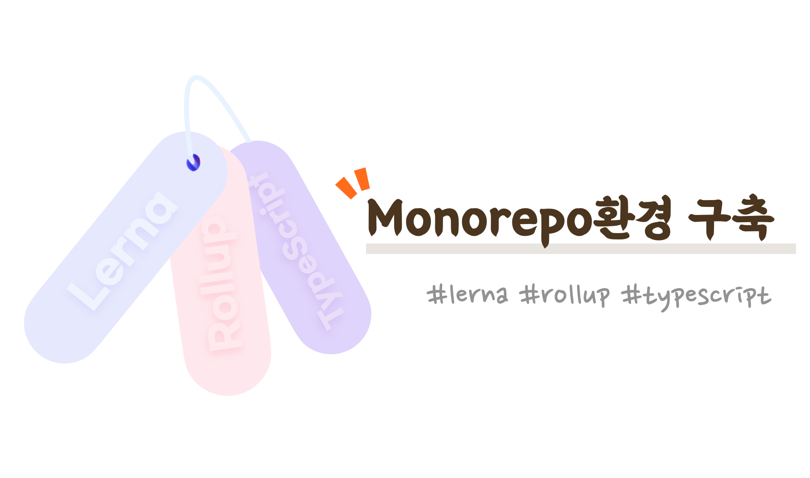
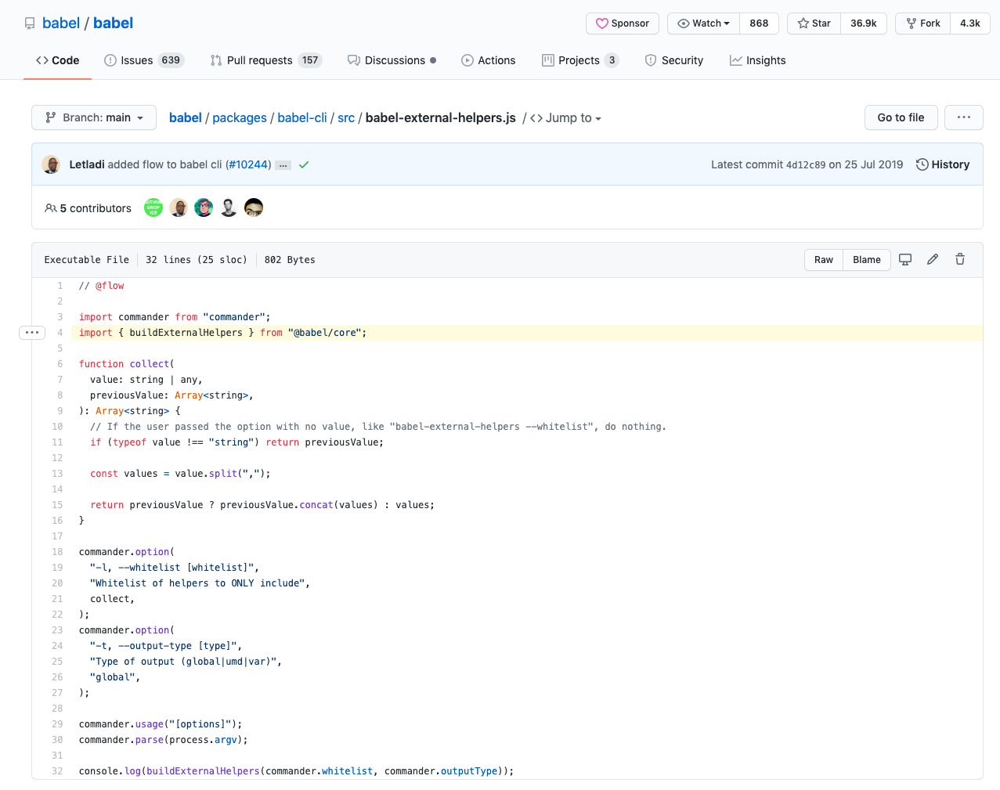
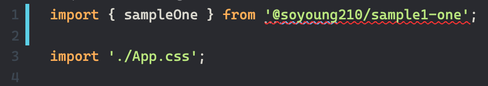
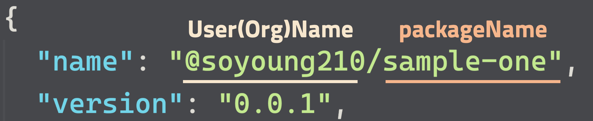
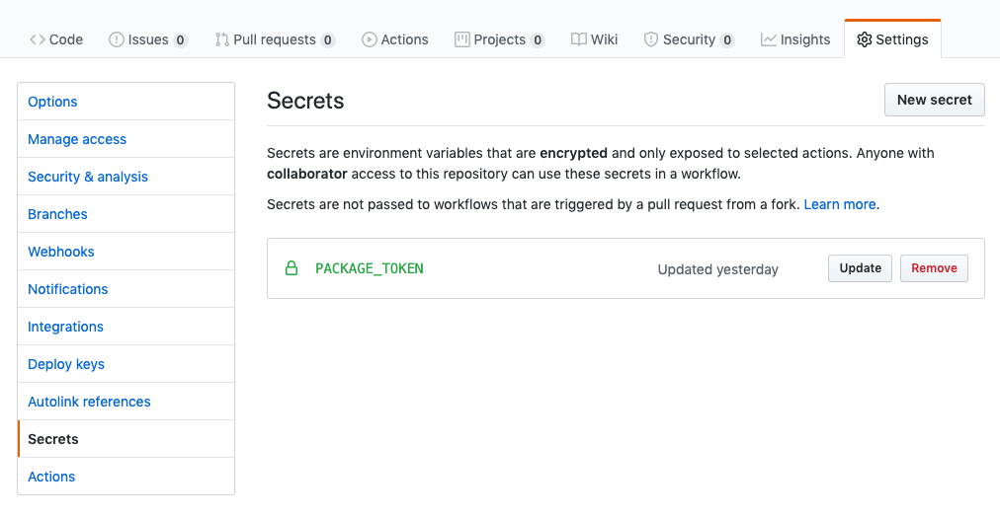

## Before We Begin

This post introduces how to set up a package environment in a Monorepo using Lerna. Before diving in, here's a quick word on the benefits of a Monorepo: you can share configuration that would otherwise be repeated per project, and modularized packages can reference each other.

If you look at [babel-external-helpers](https://github.com/babel/babel/blob/main/packages/babel-cli/src/babel-external-helpers.js), one of the packages in [babel](https://github.com/babel/babel) — a well-known project built as a Monorepo — you can see that it references and uses the `@babel/core` package as shown below.



You can easily set up a Monorepo repository with [Lerna](https://lerna.js.org/). It's a library that helps you manage multiple packages in a Monorepo, letting you build the whole project, run tests, and otherwise manage every package in the repo at once.

Rather than setting up config per package, I'll walk through, step by step, an approach where the config files live at the root and each package shares them.

You can find the full code used in this post [here](https://github.com/SoYoung210/lerna-rollup-github-package-example).

## What configuration do we want to share

The project covered in this post uses Rollup as its bundler and TypeScript, and supports both CJS and ESM output. So every package commonly needs the following config files.

- rollup.config.js
- tsconfig.json

Rather than creating these in every package, I'll write them so they live at the root and get shared from there.

## Step 0. Add config files at the root

First, add `rollup.config.js` and `tsconfig.json` at the project root, respectively.

```jsx
// rollup.config.js

export default [
  buildJS(input, pkg.main, 'cjs'),
  buildJS(input, 'dist/esm', 'es'),
];

function buildJS(input, output, format) {
  const defaultOutputConfig = {
    format, exports: 'named', sourcemap: true,
  };

  const esOutputConfig = {
    ...defaultOutputConfig,
    dir: output,
  };
  const cjsOutputConfig = {
    ...defaultOutputConfig,
    file: output,
  };

  const config = {
    input,
    // omitted - https://github.com/SoYoung210/lerna-rollup-github-package-example/blob/master/rollup.config.js
    preserveModules: format === 'es', // so it isn't bundled into a single file (Tree Shaking)
  };

  return config;
}
```

```json
// tsconfig.json
{
  "compilerOptions": {
    "module": "es6", // so only esm-style d.ts files are generated
    "target": "es6",
    "lib": ["es6", "dom", "es2016", "es2017"],
    "sourceMap": true,
    "moduleResolution": "node",
    "allowJs": true,
    "noImplicitAny": true,
    "strictNullChecks": true,
    "strict": true,
    "allowSyntheticDefaultImports": true,
    "esModuleInterop": true,
    "declaration": true,
    "emitDeclarationOnly": true,
  },
  "exclude": [
    "*.config.js", // exclude config files from type generation
    "packages/**/node_modules/*.d.ts",
    "node_modules/*.d.ts",
    "**/dist/**/*"
  ]
}
```

## Step 1. Add a lerna build

Add the following script to `package.json`.

```json
// root's package.json
"devDependencies": {
  "rollup": "2.16.1",
   // ...
},
"scripts": {
  "build": "lerna run build"
},
```

Running `npm run build` at the project root runs the `build` script declared in each package's package.json.

Add a `build` script to `packages/sample-one`.

```json
// packages/sample-one/package.json
"scripts": {
  "build": "NODE_ENV=production rollup -c ../../rollup.config.js"
}
```

We set it up to use the `rollup.config.js` at the root. To support both ESModule and CommonJS, also add `main` and `module` fields, along with something for `types`.

```json
// packages/sample-one/package.json
"main": "dist/cjs/index.js",
"module": "dist/esm/index.js",
"types": "dist/index.d.ts",
```

## Step 2. Reading each package's custom configuration

Config files are shared, but there are also parts each package wants to customize. For example, you might need different peerDependency settings, or need to separate out a different input file for rollup.

To connect the root config files with each package, we use an environment variable and [read-pkg-up](https://www.npmjs.com/package/read-pkg-up).

### Environment variable

Since the path to `rollup.config.js` differs from each package's own path, we pass the input file's path from each package's `package.json` as an environment variable.

> 👩🏻‍💻: You could also set the path directly in rollup.config.js itself, or use something like process.cwd, but I applied it this way to keep it simple. Feel free to use a better approach.

```diff
// packages/sample-one/package.json
"scripts": {
-  "build": "NODE_ENV=production rollup -c ../../rollup.config.js"
+  "build": "NODE_ENV=production INPUT_FILE=./index.ts rollup -c ../../rollup.config.js"
}
```

Update rollup.config.js to use this environment variable for the input path.

```jsx {1,18}
const input = process.env.INPUT_FILE;

function buildJS(input, output, format) {
  const defaultOutputConfig = {
    format, exports: 'named', sourcemap: true,
  };

  const esOutputConfig = {
    ...defaultOutputConfig,
    dir: output,
  };
  const cjsOutputConfig = {
    ...defaultOutputConfig,
    file: output,
  };

  const config = {
    input,
    // ...omitted
  }
}
```

### read-pkg-up

read-pkg-up is a library that reads the nearest `package.json`.

When you run `lerna ${command}` from the Monorepo root, it walks the paths listed in `lerna.json`'s `packages` and runs the script for each — this library made it easy to read each package's `package.json` along the way.

Below is example code that reads each package's `package.json` and customizes the `external` setting accordingly.

```js
// rollup.config.js
const fs = require('fs');
const readPkgUp = require('read-pkg-up');

const { packageJson: pkg } = readPkgUp.sync({
  cwd: fs.realpathSync(process.cwd()),
});

const pkgDependencies = Object.keys(pkg.dependencies || {});
const pkgPeerDependencies = Object.keys(pkg.peerDependencies || {});
const pkgOptionalDependencies = Object.keys(pkg.optionalDependencies || {});

const config = {
  input,
  external: pkgDependencies
        .concat(pkgPeerDependencies)
        .concat(pkgOptionalDependencies),
  plugins: [
    /* omitted */
  ]
}
```

## Step 3. Generating type declaration files

Looking back at the rollup.config.js we added in [Step 0](https://so-so.dev/pattern/mono-repo-config/#step-0-root%EC%97%90-config%ED%8C%8C%EC%9D%BC%EB%93%A4-%EC%B6%94%EA%B0%80), you can see it supports both the CommonJS and ES Module formats.

Running `lerna build` to build the project gives you a result like this:

```markdown {3,7}
packages/sample-one
+-- dist
|   +-- esm
|      +-- index.js
|      +-- index.js.map
|      +-- main.js.map
|   +-- cjs
|      +-- index.js
+--    +-- index.js.map
```

esm and cjs folders are created and kept separate. A type definition file supporting ES Modules needs to be added under the `dist/` path.

If an `index.d.ts` file isn't located under `dist/`, importing the module throws an error saying it can't be found, as shown below.



You could use [rollup-plugin-typescript2](https://www.npmjs.com/package/rollup-plugin-typescript2), but it has an issue where the d.ts doesn't get generated at the `dist/` location and instead ends up under the esm folder, so I had the type build run separately rather than through rollup.

`tsconfig.json` also has the problem that not every package can share the same type-definition settings.

```json {4}
// packages/sample-one/package.json
"scripts": {
  "build": "npm run build:typings && NODE_ENV=production INPUT_FILE=./index.ts rollup -c ../../rollup.config.js",
  "build:typings": "tsc -p ../../tsconfig.json --declarationDir dist"
}
```

If you use the root's tsconfig.json this way, a type build gets run for every package under `packages`, as shown below.

```markdown {10,13}
packages/sample-one
+-- dist
|   +-- esm
|      +-- index.js
|      +-- index.js.map
|      +-- main.js.map
|   +-- cjs
|      +-- index.js
+--    +-- index.js.map
|   +-- sample-one
|      +-- index.d.ts
|      +-- main.d.ts
|   +-- sample-two
|      +-- index.d.ts
+--    +-- main.d.ts
```

We need to put a `tsconfig.json` in each package so it includes information about that package's current path.

```json
// packages/sample-one/tsconfig.json
{
  "extends": "../../tsconfig.json"
}

// packages/sample-two/tsconfig.json
{
  "extends": "../../tsconfig.json"
}
```

Update the tsconfig.json path used in `build:typings`.

```diff
// packages/sample-one/package.json

"scripts": {
- "build:typings": "tsc -p ../../tsconfig.json --declarationDir dist"
+ "build:typings": "tsc -p ./tsconfig.json --declarationDir dist"
}
```

### Setting up absolute paths within a package

To reference things by absolute path inside a package — like `import { main } from '@sample-one/main'` — you need to add path-related settings to `tsconfig.json`. ([reference](https://medium.com/@joshuaavalon/webpack-alias-in-typescript-declarations-81d2b6c0dcd6))

```json
// tsconfig.json
{
  "compilerOptions": {
    "baseUrl": "./packages",
    "paths": {
      "@sample-one/*": ["sample-one/*"],
      "@sample-two/*": ["sample-two/*"],
    },
    "plugins": [
      { "transform": "typescript-transform-paths" },
      { "transform": "typescript-transform-paths", "afterDeclarations": true }
    ]
  }
}
```

> 🚨: If you don't add every package under `packages` to `paths`, you'll get an error during the type build.

### Fixing up package build:typings

There's an issue where d.ts files aren't generated correctly for modules referenced via absolute path, so we configure it to use [ttypescript](https://github.com/cevek/ttypescript/) and [typescript-transform-paths](https://github.com/LeDDGroup/typescript-transform-paths).

```bash
npm i -D ttypescript typescript-transform-paths
```

Update the `build:typings` we wrote earlier.
> If your project doesn't use absolute paths, plain tsc is enough.

```diff
// packages/sample-one/package.json
"scripts": {
- "build:typings": "tsc -p ./tsconfig.json --declarationDir dist",
+ "build:typings": "ttsc -p ./tsconfig.json --declarationDir dist"
},
```

## Step 4. Setting up GitHub Package deployment

Let's set this project up to deploy using the GitHub Package Registry.

Before applying the GitHub-related settings, we need to check the most important part of a Monorepo: the `name` field in `package.json`.



If it isn't written in the `@${userName}/${packageName}` format shown in the screenshot, you'll get an error like this:

```
lerna ERR! E400 scope 'test' in package name '@test/sample-two' does not match repo owner 'SoYoung210' in repository element in package.json
```

### Creating .npmrc

Create an `.npmrc` file at the project root and enter the following.

```powershell
@userName:registry=https://npm.pkg.github.com/userName
```

This setting means that for packages prefixed with @userName, like `@userName/sample-one`, in `package.json`, downloads come from the GitHub Package Registry (<https://npm.pkg.github.com/userName>) instead of the official npm registry (<https://registry/npmjs.org/>).

### Issuing a token

To deploy to the GitHub Package Registry from GitHub Actions, you need to issue a token with package permissions. Follow the [guide](https://help.github.com/en/github/authenticating-to-github/creating-a-personal-access-token-for-the-command-line) to issue a token with `write:packages` and `read:packages` permissions.

> Once you leave the token creation page, you can no longer see the token value, so make sure to note it down.

### Action

You can use GitHub Actions to deploy to the GitHub Package Registry whenever something is merged into master.

First, add the token you issued above as a Secret on the repo.



Then create a `release.yml` file under `.github/workflows`.

```yaml {6,19,29,30,31}
name: Release

on:
  push:
    branches:
      - master

jobs:
  deploy:
    runs-on: ubuntu-18.04
    steps:
    - name: checkout
      uses: actions/checkout@v2
      with:
        # pulls all commits (needed for lerna to correctly version)
        # see https://stackoverflow.com/a/60184319/9285308 & https://github.com/actions/checkout
        fetch-depth: "0"
    - name: Add GiHub Package Token
      run : echo "//npm.pkg.github.com/:_authToken=${{ secrets.PACKAGE_TOKEN }}" > ~/.npmrc
    - name: Setup Node.js
      uses: actions/setup-node@v1
      with:
        node-version: 12.18.0
    - name: Install Dependencies
      run: npm install
    - name: Deploy new Package
      run: npm run publish
      env:
        GH_TOKEN: ${{ secrets.GITHUB_TOKEN }}
        GITHUB_TOKEN: ${{ secrets.GITHUB_TOKEN }}
        NODE_AUTH_TOKEN: ${{ secrets.GITHUB_TOKEN }}
```

When something merges into the master branch, the Release Action runs, and the `PACKAGE_TOKEN` we added earlier gets written into `.npmrc`. This token lets the Action deploy a new GitHub Package.

Running `npm run publish` runs `lerna publish`, and only the packages whose version has changed get newly deployed.

## Wrapping Up

We took a quick look at how to set up a Monorepo environment. This was the first time I'd managed multiple packages in a Monorepo on a recent project, and I got to really feel a number of benefits — being able to consolidate config shared across packages, managing dependency modules more easily, and more.

## Ref

[Trying Out a Monorepo with Lerna (Korean)](https://medium.com/jung-han/lerna-%EB%A1%9C-%EB%AA%A8%EB%85%B8%EB%A0%88%ED%8F%AC-%ED%95%B4%EB%B3%B4%EB%9F%AC%EB%82%98-34c8e008106a)

[https://github.com/tdeekens/flopflip](https://github.com/tdeekens/flopflip/blob/master/rollup.config.js)

[https://github.com/azu/lerna-monorepo-github-actions-release](https://github.com/azu/lerna-monorepo-github-actions-release)

[https://kishu.github.io/2017/05/23/setting-up-multi-platform-npm-packages/](https://kishu.github.io/2017/05/23/setting-up-multi-platform-npm-packages/)

[https://medium.com/@joshuaavalon/webpack-alias-in-typescript-declarations-81d2b6c0dcd6](https://medium.com/@joshuaavalon/webpack-alias-in-typescript-declarations-81d2b6c0dcd6)
