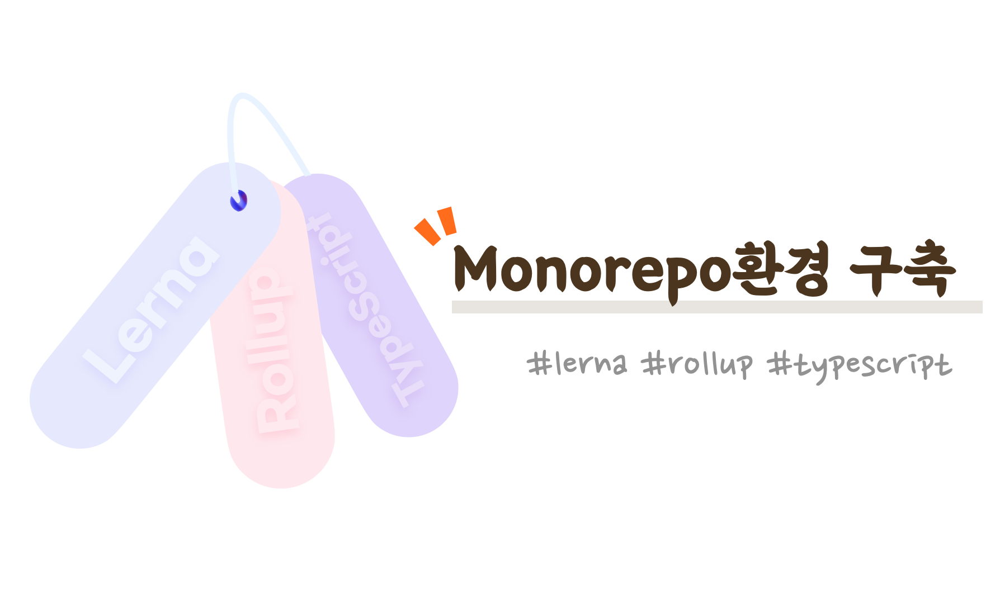
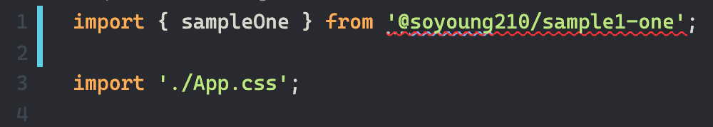
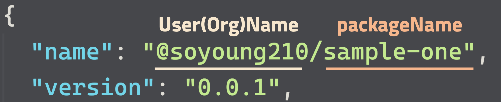
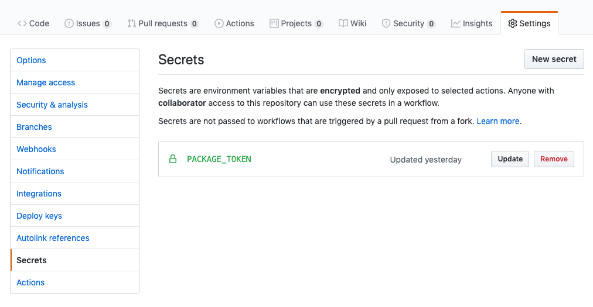

## 들어가기 전에

Lerna는 단일 저장소(Repository)에서 다양한 package를 관리할 수 있도록 도와주는 라이브러리입니다. 프로젝트 전체를 빌드하거나 테스트를 수행하는 등 저장소에서 관리하고 있는 pakcage들을 한번에 관리할 수 있도록 도와줍니다.

이 글은 lerna를 사용한 mono repo에서 package 환경 구축방법을 소개하는 글입니다.

전체 코드는 [여기](https://github.com/SoYoung210/lerna-rollup-github-package-example)에서 보실 수 있습니다.

## 어떤 설정들을 공유하고 싶은가

예시로 소개한 프로젝트는 Rollup을 번들러로 사용하고 있고,  TypeScript를 사용하며 각각 CJS와 ESM형태를 지원해야 합니다. 따라서, 모든 패키지에서 아래 설정 파일들이 필요합니다.

- rollup.config.js
- tsconfig.json

## Step0. root위치에 config파일들 추가

이 글에서는 각 package별로 config를 구성하는 것이 아니라, root에 위치시키고 이 설정파일을 package들이 공유하는 형태입니다.

프로젝트의 root에 각각 rollup.config.js, tsconfig.json를 추가합니다.

```jsx
// rollup.config.js

export default [
  buildJS(input, pkg.main, 'cjs'),
  buildJS(input, 'dist/esm', 'es'),
];

function buildJS(input, output, format) {
  const defaultOutputConfig = {
    format, exports: 'named', sourcemap: true,
  };

  const esOutputConfig = {
    ...defaultOutputConfig,
    dir: output,
  };
  const cjsOutputConfig = {
    ...defaultOutputConfig,
    file: output,
  };

  const config = {
    input,
    external: ['react'],
    // 생략 - https://github.com/SoYoung210/lerna-rollup-github-package-example/blob/master/rollup.config.js
    preserveModules: format === 'es', //esm형태로 번들되지 않도록 (Tree Shaking)
  };

  return config;
}
```

```json
// tsconfig.json
{
  "compilerOptions": {
    "module": "es6", // esm형태의 d.ts만 생성되도록 설정
    "target": "es6",
    "lib": ["es6", "dom", "es2016", "es2017"],
    "sourceMap": true,
    "moduleResolution": "node",
    "allowJs": true,
    "noImplicitAny": true,
    "strictNullChecks": true,
    "strict": true,
    "allowSyntheticDefaultImports": true,
    "esModuleInterop": true,
    "declaration": true,
    "emitDeclarationOnly": true,
  },
  "exclude": [
    "*.config.js", // config파일들을 type생성 대상에서 제외
    "packages/**/node_modules/*.d.ts",
    "node_modules/*.d.ts",
    "**/dist/**/*"
  ]
}
```

## Step 1. lerna build 추가

프로젝트의 root에 위치한 `package.json`에 아래 스크립트를 추가 합니다.

```json
// root의 package.json
"devDependencies": {
  "rollup": "2.16.1",
   // ...
},
"scripts": {
  "build": "lerna run build"
},
```

`npm run build`를 수행하면 각 package의  package.json에 명시된 `build` 스크립트를 수행합니다.

`packages/sample-one`에 `build`스크립트를 추가합니다.

```json
// packages/sample-one/package.json
"scripts": {
  "build": "NODE_ENV=production rollup -c ../../rollup.config.js"
}
```

root에 있는 rollup파일을 참조할것이기 때문에 상대경로로 참조해 주었습니다. ESModule과 CommonJS를 지원할 수 있도록 `main`과 `module`필드도 추가해 주고, type에 대한 내용도 추가합니다.

- 이 설정을 읽어 rollup.config.js에 적용합니다.

```json
// packages/sample-one/package.json
"main": "dist/cjs/index.js",
"module": "dist/esm/index.js",
"types": "dist/index.d.ts",
```

## Step2. package의 custom한 설정 읽어들이기

config파일은 공유하지만, 각 패키지별로 커스텀하게 설정하고 싶은 부분도 있습니다. 예를 들면, 각 패키지별로 peerDependency를 다르게 설정하거나 rollup에 필요한 input파일 자체를 다르게 분리해야 할 필요가 있을수도 있습니다.

root에 위치한 config파일과 각 패키지를 이어주기 위해 `환경변수`와 [read-pkg-up](https://www.npmjs.com/package/read-pkg-up)을 사용합니다.

### 환경변수

`rollup.config.js` 의 경로와 패키지의 경로가 상이하기 때문에, 패키지의 package.json에서 input file의 경로를 환경변수로 전달했습니다.

- 👩🏻‍💻: rollup.config.js자체에 경로를 설정하거나 process.cwd등을 활용할 수도 있지만, 간단하게 해결하고자 위와 같이 적용하였습니다. 더 나은 방법으로 적용하시면 됩니다.

🚨diff 로 할까 - git format

```json
// packages/sample-one/package.json
"scripts": {
  "build": "NODE_ENV=production INPUT_FILE=./index.ts rollup -c ../../rollup.config.js"
}
```

rollup.config.js에서 input의 경로를 환경변수로 사용하도록 변경합니다.

```jsx
const input = process.env.INPUT_FILE;

function buildJS(input, output, format) {
  const defaultOutputConfig = {
    format, exports: 'named', sourcemap: true,
  };

  const esOutputConfig = {
    ...defaultOutputConfig,
    dir: output,
  };
  const cjsOutputConfig = {
    ...defaultOutputConfig,
    file: output,
  };

  const config = {
    input,
    // ...생략
  }
}
```

### read-pkg-up

read-pkg-up은 가장 가까운 위치의 `package.json`을 읽어오는 라이브러리입니다.

mono repo의 root에서 `lerna build` 와 같은 명령어를 수행하면 `lerna.json`의 `packages`를 참고하여 전체 프로젝트를 빌드하게 되는데, 이 때 각 package의 설정을 쉽게 읽어올 수 있도록 하기 위해 사용하였습니다.

## Step3. Type 정의 파일 생성

Step0에서 추가한 rollup.config.js를 살펴보면, cjs 포맷과 esm 포맷을 지원하고 있습니다.

`lerna build`를 수행하여 프로젝트를 빌드하면 다음과 같은 결과를 확인할 수 있습니다.

```markdown
packages/sample-one
+-- dist
|   +-- esm
|      +-- index.js
|      +-- index.js.map
|      +-- main.js.map
|   +-- cjs
|      +-- index.js
+--    +-- index.js.map
```

esm과 cjs폴더를 만들어 분리해둔 형태입니다. esm을 지원하는 type definition파일이 추가되고 프로젝트의 root에 위치하도록 설정해야 합니다.

프로젝트의 root에 위치하지 않으면 아래와 같이 import했을 때 'type을 읽을 수 없다는 에러'가 발생합니다.



[rollup-plugin-typescript2](https://www.npmjs.com/package/rollup-plugin-typescript2)를 사용하는 방법도 있지만, dist의 root위치에 d.ts가 생성되지 않고 esm하위에 생성되는 이슈가 있어 별도로 생성해줍니다.

절대경로로 참조한 모듈에 대해 d.ts가 정상적으로 생성되지 않는 이슈가 있어, [ttypescript](https://github.com/cevek/ttypescript/)와 [typescript-transform-paths](https://github.com/LeDDGroup/typescript-transform-paths)를 사용하도록 설정해줍니다.

```powershell
npm i -D ttypescript typescript-transform-paths
```

### 패키지 내 절대경로 설정

`import sth from '@sample-one/main`과 같은 형태로 참조하기 위해서 `tsconfig.json`에 path관련 설정을 추가해 주어야 합니다. ([참고](https://medium.com/@joshuaavalon/webpack-alias-in-typescript-declarations-81d2b6c0dcd6))

```json
// tsconfig.json
{
  "compilerOptions": {
    "baseUrl": "./packages",
    "paths": {
      "@sample-one/*": ["sample-one/*"],
      "@sample-two/*": ["sample-two/*"],
    },
    "plugins": [
      { "transform": "typescript-transform-paths" },
      { "transform": "typescript-transform-paths", "afterDeclarations": true }
    ]
  }
}
```

- 🚨`packages`하위에 위치한 모든 패키지를 `paths`에 추가해주지 않으면 type build시 에러가 발생합니다.

### package build:typings 추가

```json
// packages/sample-one/package.json
"scripts": {
  "build": "rm -rf dist && npm run build:typings && cross-env NODE_ENV=production INPUT_FILE=./index.ts rollup -c ../../rollup.config.js",
  "build:typings": "ttsc -p ../../tsconfig.json --declarationDir dist"
},
```

각 패키지는 root의 `tsconfig.json` 을 사용하도록 했고, `--declarationDir` 옵션으로 경로를 따로 넘겨주는 방식으로 `sample-one/dist` 위치에 d.ts파일이 생성되도록 했습니다.

```json
packages/sample-one
+-- dist
|   +-- esm
|      +-- index.js
|      +-- index.js.map
|      +-- main.js.map
|   +-- cjs
|      +-- index.js
+--    +-- index.js.map
+-- index.d.ts
+-- main.d.ts
```

## Step 4. GitHub Package 배포 설정

이 프로젝트를 GitHub Package Registry를 사용하여 배포되도록 설정해보겠습니다.

GitHub 관련 설정을 적용하기 전, mono repo에서 가장 중요한 부분인 `package.json`의 name을 확인해야 합니다.



사진과 같이 `@${userName}/${packageName}` 형식으로 적어주어야 합니다.

올바른 형식으로 적어주지 않으면 다음과 같은 Error가 발생합니다.

```
lerna ERR! E400 scope 'test' in package name '@test/sample-two' does not match repo owner 'SoYoung210' in repository element in package.json
```

### .npmrc 생성

프로젝트 root위치에 .npmrc를 생성하고, 아래 내용을 입력해줍니다.

```powershell
echo "@userName:registry=https://npm.pkg.github.com/userName" >> ~/.npmrc
```

- `package.json`파일에서 `@userName/sample-one`과 같이 @userName이 prefix로 붙는

### Token 발급

GitHub Action에서 GitHub Package Registry에 배포하려면, package권한을 가진 토큰을 발급받아야 합니다. [가이드 문서](https://help.github.com/en/github/authenticating-to-github/creating-a-personal-access-token-for-the-command-line)를 참고하여 `write:packages` 와 `read:packages` 권한을 가진 토큰을 발급받습니다.

- 토큰 생성 페이지를 떠나면 더이상 토큰 값을 알 수 없으니 잘 메모 해두어야 합니다.

### Action

GitHub Actions를 사용해 master merge시 GitHub Package Registry로 배포되도록 설정할 수 있습니다.

우선 위에서 발급 받았던 토큰을 Repo의 Secret으로 추가해 줍니다.



프로젝트의 `.github/workflows`폴더에 `relese.yml`파일을 생성합니다.

```yaml
name: Release

on:
  push:
    branches:
      - master

jobs:
  deploy:
    runs-on: ubuntu-18.04
    steps:
    - name: checkout
      uses: actions/checkout@v2
      with:
        # pulls all commits (needed for lerna to correctly version)
        # see https://stackoverflow.com/a/60184319/9285308 & https://github.com/actions/checkout
        fetch-depth: "0"
    - name: Add GiHub Package Token
      run : echo "//npm.pkg.github.com/:_authToken=${{ secrets.PACKAGE_TOKEN }}" > ~/.npmrc
    - name: Setup Node.js
      uses: actions/setup-node@v1
      with:
        node-version: 12.18.0
    - name: Install Dependencies
      run: npm install
    - name: Deploy new Package
      run: npm run publish
      env:
        GH_TOKEN: ${{ secrets.GITHUB_TOKEN }}
        GITHUB_TOKEN: ${{ secrets.GITHUB_TOKEN }}
        NODE_AUTH_TOKEN: ${{ secrets.GITHUB_TOKEN }}
```

Release Action이 수행될 때, 아까 추가했던 `PACKAGE_TOKEN`이 `.npmrc`에 추가되도록 합니다. 이 Token을 사용해 Action상에서 새로운 GitHub Package를 배포할 수 있습니다.

`npm run publish`가 수행되면서 `lerna publish`가 수행되고, packages중 version변화가 있는 패키지만 새롭게 배포됩니다.

## 마무리

간단하게 mono repo에서 환경 설정하는 방법에 대해 살펴보았습니다. 최근 진행했던 프로젝트에서 Mono Repo에서 여러가지 패키지를 관리해 보았는데, 여러 장점을 실감할 수 있었습니다.

각 패키지에서 공통적으로 사용하는 config를 통합해서 관리할 수 있고, 각 패키지의 의존성 모듈도 쉽게 관리할 수 있다고 생각했습니다.

## Ref

[https://medium.com/jung-han/lerna-로-모노레포-해보러나-34c8e008106a](https://medium.com/jung-han/lerna-%EB%A1%9C-%EB%AA%A8%EB%85%B8%EB%A0%88%ED%8F%AC-%ED%95%B4%EB%B3%B4%EB%9F%AC%EB%82%98-34c8e008106a)

[https://github.com/tdeekens/flopflip](https://github.com/tdeekens/flopflip/blob/master/rollup.config.js)

[https://github.com/azu/lerna-monorepo-github-actions-release](https://github.com/azu/lerna-monorepo-github-actions-release)

[https://kishu.github.io/2017/05/23/setting-up-multi-platform-npm-packages/](https://kishu.github.io/2017/05/23/setting-up-multi-platform-npm-packages/)

[https://medium.com/@joshuaavalon/webpack-alias-in-typescript-declarations-81d2b6c0dcd6](https://medium.com/@joshuaavalon/webpack-alias-in-typescript-declarations-81d2b6c0dcd6)
