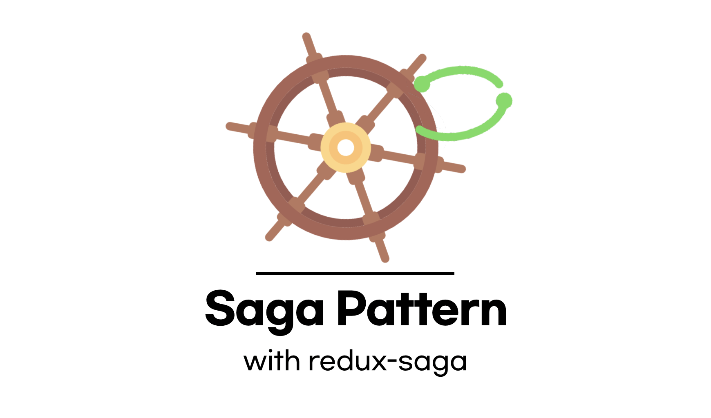
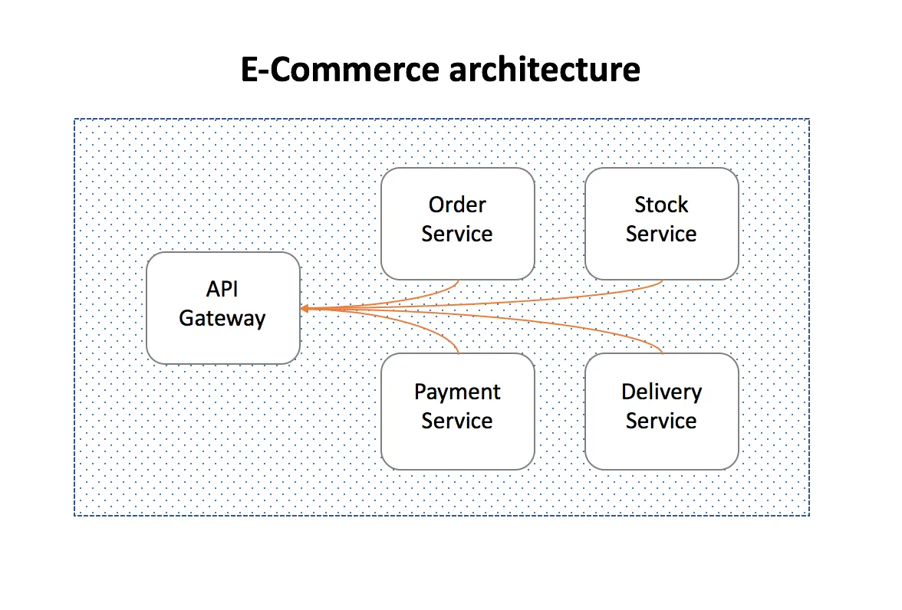
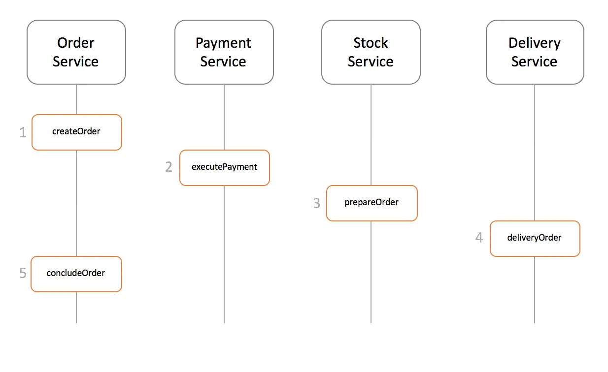
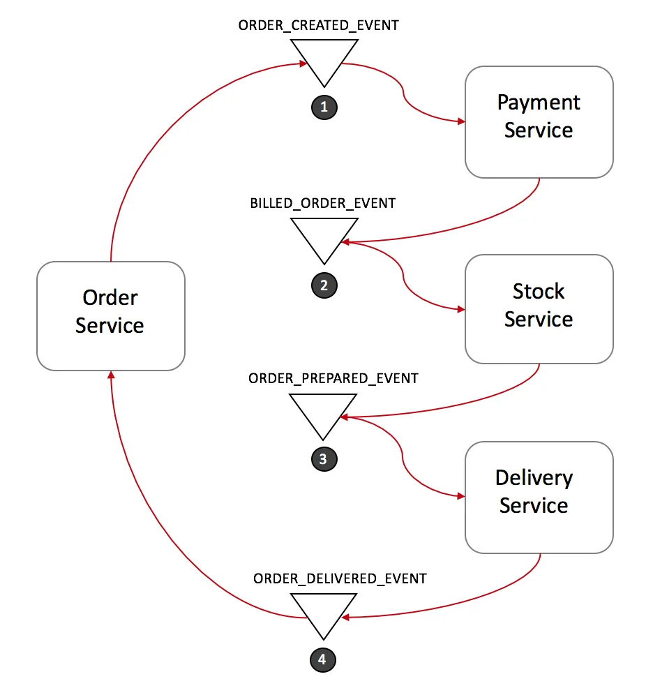
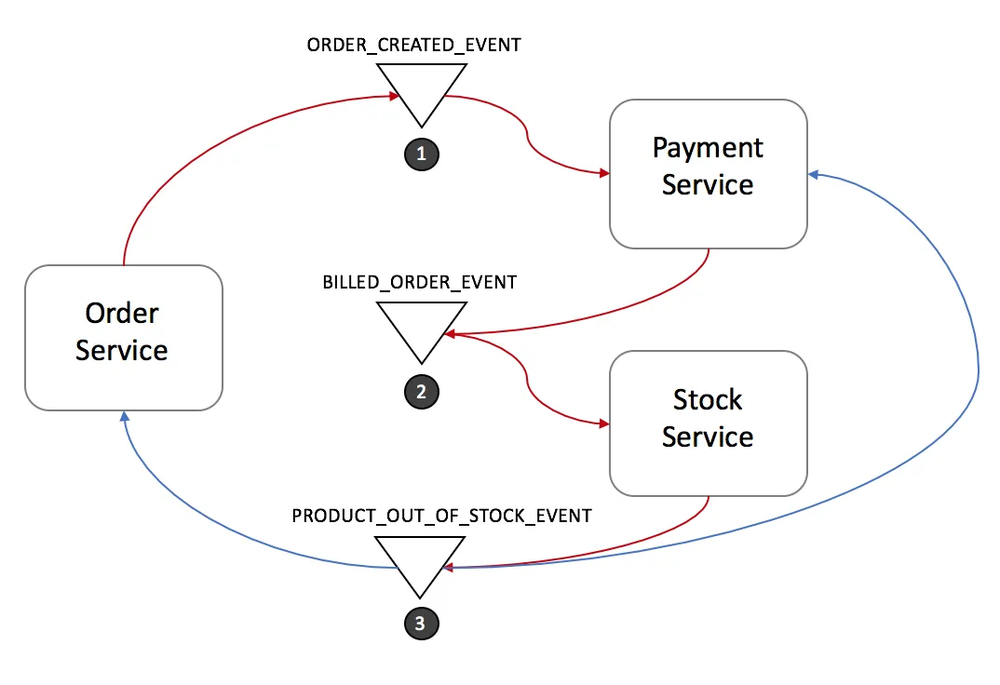
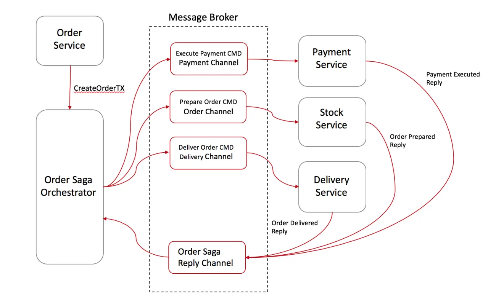
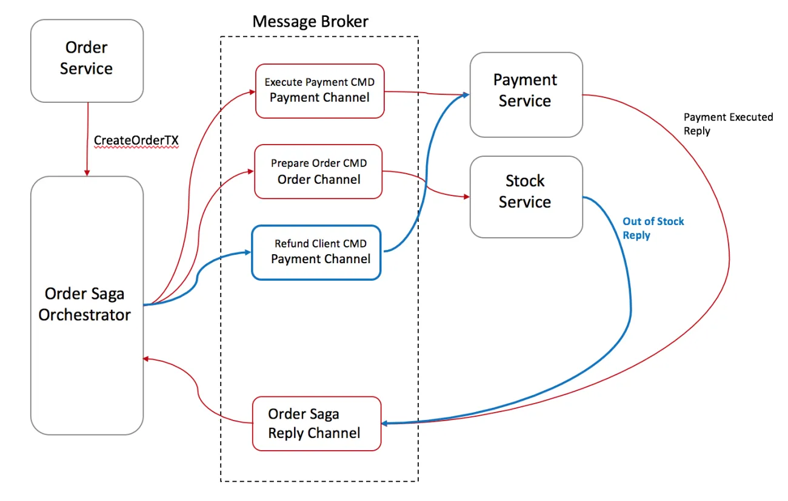
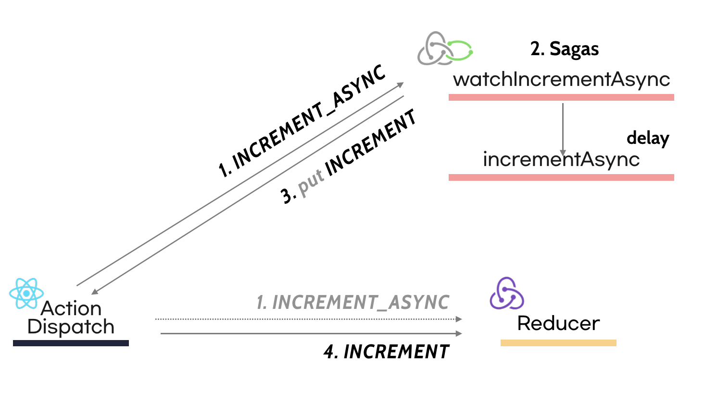

Have you ever reached for [redux-saga](https://redux-saga.js.org/) to handle async work in [redux](https://redux.js.org/)?

> "The mental model is that a saga is like a separate thread in your application that's solely responsible for side effects. redux-saga is a redux middleware, which means this thread can be started, paused and cancelled from the main application with normal redux actions, it has access to the full redux application state and it can dispatch redux actions as well."  
> _Source: [the redux-saga official docs](https://redux-saga.js.org/)_

Put simply, redux-saga's whole model comes down to this: a saga owns every effect. You can start, pause, or cancel work through ordinary Redux actions, it can read the state Redux manages, and it can dispatch actions of its own.

To really understand what that means, you first need to understand the [Saga Pattern](https://blog.couchbase.com/saga-pattern-implement-business-transactions-using-microservices-part/) itself.

## Saga

The Saga Pattern started getting attention alongside the rise of microservices. People read it a few different ways: [MSDN](https://docs.microsoft.com/en-us/previous-versions/msp-n-p/jj591569(v=pandp.10)?redirectedfrom=MSDN), for one, treats Saga as the Process Manager inside the [CQRS](https://justhackem.wordpress.com/2016/09/17/what-is-cqrs/) pattern. But the core idea is simple: eliminate the need for distributed transactions by giving every transaction its own [compensating transaction](https://en.wikipedia.org/wiki/Compensating_transaction).

> A compensating transaction is the transaction that runs whenever another transaction fails.

Say we have a service that looks like this.



It takes an order from a user, then handles payment, inventory, and delivery, each stage owned by its own service.



A `Saga` is just a chain of local transactions, each one updating data inside its own service. The first transaction fires from an outside request, and every transaction after that only starts once the one before it finishes.

There are two common ways to implement a Saga transaction.

- **Events/Choreography:** No manager governs the event flow. Each service creates and listens for events on its own, deciding for itself whether to act.
- **Command/Orchestration:** A manager governs the event flow, centralizing all the business logic in one place.

### Events/Choreography



In the example above, the events flow like this.

1. The Order Service takes the new order, sets its status to *pending*, and fires **ORDER\_CREATED\_EVENT**.
2. On **ORDER\_CREATED\_EVENT**, the Payment Service charges the customer and fires **BILLED\_ORDER\_EVENT**.
3. On **BILLED\_ORDER\_EVENT**, the Stock Service updates inventory, sets the ordered items aside, and fires **ORDER\_PREPARED\_EVENT**.
4. On **ORDER\_PREPARED\_EVENT**, the Delivery Service ships the product and fires **ORDER\_DELIVERED\_EVENT**.
5. Finally, on **ORDER\_DELIVERED\_EVENT**, the Order Service marks the order *concluded*.

### [Rollback] Events/Choreography



Here's how a rollback plays out under `Events/Choreography`.

1. The Stock Service fires **PRODUCT\_OUT\_OF\_STOCK\_EVENT**.
2. Both the Order Service and Payment Service react:
    - The Payment Service refunds the order that was in progress.
    - The Order Service marks the order as 'failed.'

> Note. Every transaction carries an id, so every listener can tell immediately which transaction just fired.

### Command/Orchestration

`Command/Orchestration` introduces a dedicated Orchestrator that decides when each service acts and what it does. The Saga Orchestrator talks to each service through a `command/reply` pattern, handing off the work.

Here's what that looks like.



1. The Order Service saves the order and asks the Order Saga Orchestrator (OSO from here on) to create the order's transaction.
2. The OSO sends an **Execute Payment** command to the Payment Service, which replies **Payment Executed**.
3. It sends a **Prepare Order** command to the Stock Service, which replies **Order Prepared**.
4. Finally, it sends a **Deliver Order** command to the Delivery Service, which replies **Order Delivered**.

The OSO **owns every transaction the order needs.** If something goes wrong, it sends commands out to each service telling them to roll back.

In practice, the Saga Orchestrator is built as a `State Machine` that tracks each command alongside the state it maps to.

### [Rollback] Command/Orchestration



1. The Stock Service replies to the OSO with **Out-Of-Stock**.
2. The OSO recognizes the transaction has failed and rolls it back.
     - Since one command (Payment Executed) already succeeded before the failure, it sends a **Refund Client** command to the Payment Service, then marks the state as 'failed.'

### Command/Orchestration, Summed Up

The Orchestration Saga has a few clear advantages.

- Only the Orchestrator Saga ever calls out to other services, a one-way structure, so you avoid creating dependencies between services.
- Because everything runs through command/reply, each service stays simpler.
  - Under Event/Choreography, every service has to work out and subscribe to whatever events it needs, which pushes complexity up.
- When multiple requests try to change the same value, the Orchestrator can decide which one takes priority.

It has downsides too.

- Too much logic ends up crammed into the Orchestrator, which can bloat it and make it hard to manage.
- Unlike the Event/Choreography model, you now have an extra Orchestrator service to run, which adds infrastructure complexity.

### Command/Orchestration VS Events/Choreography

`Command/Orchestration` works well when services share a lot of events or context, or when Event Routing gets complicated.

> **Event Routing** is just which service an event needs to reach, and which event should follow it.

`Events/Choreography` skips the overhead of managing an Orchestrator entirely, so it's the better pick when the overall service footprint is small and events don't depend heavily on each other.

## redux-saga

So how does the `Saga` we just covered connect to redux-saga? redux-saga is the **Orchestrator** sitting between the actions that fire and the state Redux manages.

```js {8,9}
function sagaMiddleware({ getState, dispatch }) {
  // Initialize Saga

  return next => action => {
    if (sagaMonitor && sagaMonitor.actionDispatched) {
      sagaMonitor.actionDispatched(action)
    }
    const result = next(action) // dispatch to the reducer
    channel.put(action) // notify the saga that the action was dispatched

    return result
  }
}
```

Every action that passes through a saga hits the reducer first. Only after that does a communication channel called a [channel](https://redux-saga.js.org/docs/advanced/Channels.html) let the saga know the action went out.

Let's dig into this with an example.

> Code from [redux-saga's Beginner Tutorial](https://redux-saga.js.org/docs/introduction/BeginnerTutorial.html).

```js
import { put, takeEvery, delay } from 'redux-saga/effects'

// Our worker Saga: will perform the async increment task
export function* incrementAsync() {
  yield delay(1000)
  yield put({ type: 'INCREMENT' })
}

// Our watcher Saga: spawn a new incrementAsync task on each INCREMENT_ASYNC
export function* watchIncrementAsync() {
  yield takeEvery('INCREMENT_ASYNC', incrementAsync)
}
```

Bring redux into the picture too, and the whole flow looks like this.



The `Saga` listens for the INCREMENT\_ASYNC action and yields the delay and put effects. What a saga yields, and what it actually returns, **is a plain JavaScript object.**

The middleware picks up that effect and acts on it. In the example above, the first `yield delay` pauses execution and waits out the full second.

> **Note.** redux-saga splits effects into blocking and non-blocking ones.
A blocking effect waits for the work to finish; a non-blocking one moves on without waiting.
`call` is the classic blocking effect, and `fork` is the classic non-blocking one.

### Effect

As mentioned, **a saga yields effects, and what it returns is a JavaScript object.** Here's the code redux-saga uses internally to build those effects.

```js {14,20,24}
// redux-saga/internal/effect.js
const makeEffect = (type, payload) => ({
  [IO]: true,
  combinator: false,
  type,
  payload,
})

export function call(fnDescriptor, ...args) {
  // Validate...

  return makeEffect(effectTypes.CALL, getFnCallDescriptor(fnDescriptor, args))
}

export function fork(fnDescriptor, ...args) {
  // Validate...

  return makeEffect(effectTypes.FORK, getFnCallDescriptor(fnDescriptor, args))
}

export function race(effects) {
  const eff = makeEffect(effectTypes.RACE, effects)
  eff.combinator = true
  return eff
}
```

Much like an [action creator function](https://redux.js.org/basics/actions/#action-creators), each of redux-saga's effects is just an object built by `makeEffect(...)`. Once you return an effect object carrying **the description of what work needs to happen,** the middleware is what actually goes and does it.

### Cancel

What happens when the same event keeps firing back to back? How does a saga orchestrate that? redux-saga hands you the [takeLatest](https://redux-saga.js.org/docs/api/#takelatestpattern-saga-args) API for exactly this.

```js {9,12,17}
export default function takeLatest(patternOrChannel, worker, ...args) {
  const yTake = { done: false, value: take(patternOrChannel) }
  const yFork = ac => ({ done: false, value: fork(worker, ...args, ac) })
  const yCancel = task => ({ done: false, value: cancel(task) })
 // Set action and task

  return fsmIterator(
  {
    q1() {
      return { nextState: 'q2', effect: yTake, stateUpdater: setAction }
    },
    q2() {
      return task
        ? { nextState: 'q3', effect: yCancel(task) }
        : { nextState: 'q1', effect: yFork(action), stateUpdater: setTask }
    },
    q3() {
      return { nextState: 'q1', effect: yFork(action), stateUpdater: setTask }
    },
  },
  'q1',
  `takeLatest(${safeName(patternOrChannel)}, ${worker.name})`,
  )
}
```

Starting from `q1`, every time the same event fires again, it cancels (_yCancel_) whatever was running before and forks into the next state. Just as the Orchestrator Pattern rolls back through commands, a saga manages its effects through cancellation.

### Test

Because redux-saga manages side effects as plain effect objects, testing it is easy. You end up writing tests that basically **walk through the saga one step at a time.**

Take the code below as an example.

```js
export function* fetchHelloWorld() {
  try {
    const helloText = yield select(helloSelector.text);

    const { data } = yield call(
      getHello,
      helloText,
    );

    yield put(helloWorldActions.success(data));
  } catch(error) {

    yield put(helloWorldActions.fail(error.status));
  }
}
```

Let's treat every `yield` in this code as its own `Step` and write a test around that.

```js {11}
describe('HelloWorldsaga', () => {
  it('should dispatch success action', async () => {
    // Given
    const testRequest = {};
    const testResult ={
      data: {
        text: 'Mock Text'
      },
    };

    const gen = fetchHelloWorld(); // 0
    // Then
    expect(gen.next().value).toEqual(select(helloSelector.text)); // 1
    expect(gen.next(testRequest).value).toEqual(
      call(getHello, testRequest)
    ); // 2
    expect(gen.next(testResult).value).toEqual(
      put(helloWorldActions.success(testResult.data))
    ); // 3
    expect(gen.next().done).toBeTruthy(); // 4
  });
});
```

- **Step 0.** We assign the `fetchHelloWorld` saga to `gen`.
- **Step 1.** Check that `gen`'s next step matches the `select(helloSelector.text)` effect.
- **Step 2.** The next yield is the `call`. Since `call` takes `fn` and `args`, we pass `testRequest` into `gen.next(the call step)`, then check the result actually matches `call(getHello, testRequest)`.
- **Step 3.** This is where the result of that `call` gets dispatched as a success action. Again, we pass the pre-mocked `testResult` in as the argument to `gen.next`.
- **Step 4.** There are no more yields left in `fetchHelloWorld`, so `next()` comes back `done` at this step.

> For more, check out [redux-saga: testing](https://redux-saga.js.org/docs/advanced/Testing.html) and Jbee's post [Testing the Store and Business Logic](https://jbee.io/react/testing-3-react-testing/).

## Wrapping Up

That covers the Saga Pattern and redux-saga. A saga only issues commands; the middleware is what actually carries out the work. That `Command/Orchestration` shape can be a great fit for managing lots of events or context between services, and complex event routing.

And because the middleware's whole job is taking whatever value a saga `yield`s and acting on it, testing turns out to be easy too, as covered in the [Test](https://so-so.dev/pattern/saga-pattern-with-redux-saga/#test) section.

## Reference

- [https://medium.com/@jeanpan/saga-pattern-redux-saga-e694a31576ab](https://medium.com/@jeanpan/saga-pattern-redux-saga-e694a31576ab)

- [https://blog.couchbase.com/saga-pattern-implement-business-transactions-using-microservices-part/](https://blog.couchbase.com/saga-pattern-implement-business-transactions-using-microservices-part/)

- [https://meetup.toast.com/posts/136](https://meetup.toast.com/posts/136)

- [https://medium.com/@ijayakantha/microservices-the-saga-pattern-for-distributed-transactions-c489d0ac0247](https://medium.com/@ijayakantha/microservices-the-saga-pattern-for-distributed-transactions-c489d0ac0247)

- [https://justhackem.wordpress.com/2016/09/17/what-is-cqrs/](https://justhackem.wordpress.com/2016/09/17/what-is-cqrs/)

- [https://docs.microsoft.com/en-us/previous-versions/msp-n-p/jj591569(v=pandp.10)?redirectedfrom=MSDN](https://docs.microsoft.com/en-us/previous-versions/msp-n-p/jj591569(v=pandp.10)?redirectedfrom=MSDN)

- [https://www.youtube.com/watch?v=UxpREAHZ7Ck&index=5&list=PLZl3coZhX98oeg76bUDTagfySnBJin3FE](https://www.youtube.com/watch?v=UxpREAHZ7Ck&index=5&list=PLZl3coZhX98oeg76bUDTagfySnBJin3FE)
