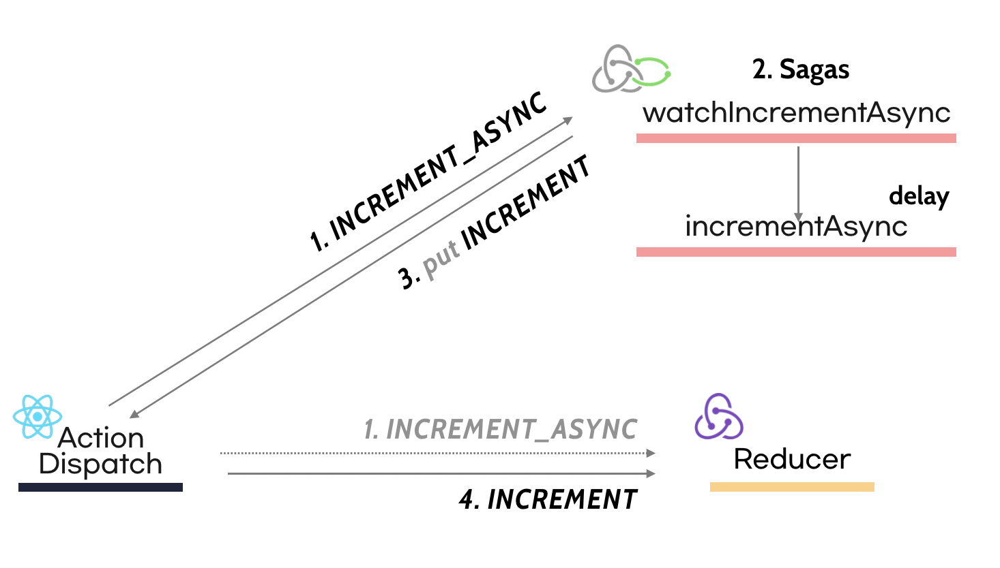

Side Effect를 처리하는 Redux Middleware 중 redux-saga를 많이 사용하고 있습니다.

> The mental model is that a saga is like a separate thread in your application that's solely responsible for side effects. redux-saga is a redux middleware, which means this thread can be started, paused and cancelled from the main application with normal redux actions, it has access to the full redux application state and it can dispatch redux actions as well.

redux-saga는 Side Effect를 별도의 스레드로 분리해서 관리할 수 있고, redux action으로 스레드를 시작, 중지, 취소시킬 수 있으며 store에 접근할 수 있고, redux action을 dispatch할 수 있다고 말하고 있습니다.

이 말을 완전히 이해하려면, redux-saga의 근간이 된 `Saga Pattern`에 대한 이해가 필요합니다.

## Saga

Saga Pattern은 마이크로 서비스의 등장과 함께  각광받기 시작했습니다. Saga Pattern에 대해서는 다양한 해석이 존재하는데, 그 중에서 [MSDN](https://docs.microsoft.com/en-us/previous-versions/msp-n-p/jj591569(v=pandp.10)?redirectedfrom=MSDN)에서는 Saga를 [CQRS](https://justhackem.wordpress.com/2016/09/17/what-is-cqrs/) Pattern의 Prcess Manager로 보고 있습니다. Saga의 기본 개념은 transaction의 필요성을 제거하고, 각 trnasaction마다 보상 transaction을 정의하는 것입니다.

> compensating transaction(보상 transaction): 각 transaction에서 오류가 발생했을 때 수행할 transaction

예를 들어 아래와 같은 서비스가 있다고 가정해 봅시다.


사용자로부터 주문을 받고, 결제, 재고관리, 배달 작업을 처리합니다. 각 단계는 각각의 Service에서 관리합니다.


`Saga`는 각 trasaction이 각 서비스에서 데이터를 업데이트 하는 일련의 local transaction입니다. 첫 번째 transaction은 외부 요청에 의해 시작되고, 다음 단계의 transaction은 이전 작업이 완료되면 시작됩니다.

Saga Transaction을 구현하는 방법에는 많은 방법이 있지만 가장 대표적인 두 가지 방법이 있습니다.

- Events/Choreography: 흐름을 관리하는 매니저가 없고, 각 서비스가 event생성, 구독(listen)하며 동작 여부를 결정하는 형태 입니다.
- Command/Orchestration: 흐름을 관리하는 매니저가 있으며, 이 매니저의 역할은 비즈니스 로직을 집중화 하여 처리해야 할 필요가 있을 때 채택합니다.
- 예시가 보강되어야 겠군..

### Events/Choreography


위 예시에서 Event흐름은 다음과 같습니다.

1. *Order Service* saves a new order, set the state as *pending* and publish an event called ***ORDER_CREATED_EVENT***.
2. The *Payment Service* listens to ***ORDER_CREATED_EVENT***, charge the client and publish the event ***BILLED_ORDER_EVENT***.
3. The *Stock Service* listens to ***BILLED_ORDER_EVENT***, update the stock, prepare the products bought in the order and publish ***ORDER_PREPARED_EVENT***.
4. *Delivery Service* listens to ***ORDER_PREPARED_EVENT*** and then pick up and deliver the product. At the end, it publishes an ***ORDER_DELIVERED_EVENT***
5. Finally, *Order Service* listens to ***ORDER_DELIVERED_EVENT*** and set the state of the order as concluded.
- 나중에 번역하기.

### [Rollback] Events/Choreography


`Event/Choreography`방법에서 Rollback은 다음과 같은 단계로 진행됩니다.

1. *Stock Service*가 ***PRODUCT_OUT_OF_STOCK_EVENT***를  발생 시킵니다.;
2. *Order Service*와 *Payment Servic*e는 두 가지 작업을 진행 합니다:
1. P*ayment Service* 는 환불 작업을 합니다.
2. *Order Service*는 '주문 상태'를 '실패'로 변경합니다.

Note. 각 transaction은 id를 가지고 있어, 모든 리스너가 발생한 transaction을 즉시 알 수 있습니다.

### Command/Orchestration

`Command/Orchestration`방식은 각 서비스가 작업을 수행할 시점과 작업 내용을 관리하는 Orchestrator를 따로 두는 방식입니다. Saga Orchestrator는 `command/reply`형태로 각 서비스와 통신하여 수행할 작업을 전달합니다.

아래 예시를 통해 살펴보겠습니다.


1. *Order Service*는 보류중인 주문을 저장하고, Order Saga Orchestrator (OSO)에게 주문 transaction을 생성하도록 요청합니다.
2. *OSO*는 *Payment Service*에게 ***Execute Payment*** command를 전달하고, Payment Service는 ***Payment Executed*** 메세지를 전송합니다. 
3. 마찬가지로,Stock Service에게 ***Prepare Order*** command를 전달하고, Stock Service는 ***Order Prepared*** 메세지를 회신합니다.
4. 마지막으로, Delivery Service에게 ***Deliver Order*** command를 전달하고 , Delivery Service는 ***Order Delivered*** 메세지를 회신합니다.

Order Saga Orchestrator는 주문을 처리하는 데에 필요한 모든 transaction을 관리합니다. 문제가 발생하면 각 Service에게 command를 전달해서 Rollback을 수행하게 합니다. 

Saga Orchestrator를 구현하는 표준 방법은, 각 command에 해당하는 상태를  관리하는 State Machine으로 구현하는 것입니다.

### [Rollback] Command/Orchestration


1. S*tock Service*는 OSO에게 ***Out-Of-Stock*** 메세지를  회신합니다.
2. OSO는 transaction이 실패했음을 인지하고, Rollback을  수행합니다.
1. 이 경우애는, 실패전에  하나의 command(Payment Executed)가  성공 했으므로  Pyament Service에게  ***Refund Client*** command를 전달합니다. 이후, state의 상태를 '실패'로 변경합니다.

### Command/Orchestration 정리

Orchestration Saga는 다음과 같은 다양한 장점이 있습니다.

- Orchestrator Saga만 다른 Service를 호출할 수 있는 단 방향 구조이므로, Service간에  종속성이 생기는 것을 피할 수 있습니다.
- command/reply 형태로 관리하기 때문에 Service의 복잡성이 줄어듭니다. (Event/Choreography에서는 dispatch/listen 형태)
- 동일한 값을 변경하는 요청이 있을 경우 Orchestrator에서 요청의 우선순위를 판단하여 처리할 수 있습니다.

그러나, 몇 가지 단점도 있습니다.

- Orchestrator에서 너무 많은 로직이 처리됩니다. Orchestrator가 비대해지고 관리가 어려워질 수 있습니다.
- Event/Choreography 모델과 다르게 추가로 Orchestrator 서비스를 관리해야 하므로, 인프라 복잡성이 증가합니다.

### Events/Choreography VS Command/Orchestration

`Command/Orchestration`구조는 서비스 간에 많은 이벤트나 context를 공유하는 경우, Event Routing(하나의 이벤트에 대해 어떤 Service에게 전달되어야 하고, 이후 어떤 이벤트가 진행되어야 하는 지)이 복잡할 경우 용이합니다. 전체 Service의 규모가 작고 Event간의 종속성이 많지 않은 경우 Orchestrator를 따로 관리해야 하는 부담이 없는 `Events/Choreography`를 선택하는 것이 좋습니다. 

## redux-saga

앞서 살펴 본 `Saga`는 redux-saga와 어떻게 이어질까요? 정확히 말하면, redux-saga는 Saga로 부터 영감을 받아 만들어진 라이브러리 인데, 구체적으로 어떤 Flow로 동작할까요? 

아래 예시를 통해 살펴보겠습니다. 

- [redux-saga's Beginner Tutorial](https://redux-saga.js.org/docs/introduction/BeginnerTutorial.html) 코드입니다.

```js
import { put, takeEvery, delay } from 'redux-saga/effects'

// Our worker Saga: will perform the async increment task
export function* incrementAsync() {
  yield delay(1000)
  yield put({ type: 'INCREMENT' })
}

// Our watcher Saga: spawn a new incrementAsync task on each INCREMENT_ASYNC
export function* watchIncrementAsync() {
  yield takeEvery('INCREMENT_ASYNC', incrementAsync)
}
```

redux까지 포함하면 다음과 같은 Flow로 표현할 수 있습니다.



`Saga`는 `INCREMENT_ASYNC` action을 listen하고 delay와 put이라는 effect를 yield합니다. Saga는 Effect를 yield하고, **JavaScript 객체를 return하게 됩니다.** Middleware가 이 Effect를 받아서 처리하게 됩니다. 위 예시 에서는 첫 번째 yield delay가 중단되고, 1초가 지날때  까지 대기하게 됩니다. 

- Note. redux-saga는 blocking effect와 non-blocking effect로 구분됩니다. blocking effect는 처리가 완료될 때까지 기다리도록 하는 것이고, non-blocking effect는 완료를 기다리지 않고 진행하는 것입니다. 대표적인 blocking effect로는 call이 있고, non-blocking effect에는 fork가 있습니다.

### Effect

위에서 언급한 것처럼, **Saga는 Effect를 yield하고 JavaScript객체를 return합니다.** 아래 코드는 redux-saga의 internal effect 코드입니다.

```js{14,20,24}
// redux-saga/internal/effect.js
const makeEffect = (type, payload) => ({
  [IO]: true,
  // this property makes all/race distinguishable in generic manner from other effects
  // currently it's not used at runtime at all but it's here to satisfy type systems
  combinator: false,
  type,
  payload,
})

export function call(fnDescriptor, ...args) {
  // Validate...

  return makeEffect(effectTypes.CALL, getFnCallDescriptor(fnDescriptor, args))
}

export function fork(fnDescriptor, ...args) {
  // Validate...

  return makeEffect(effectTypes.FORK, getFnCallDescriptor(fnDescriptor, args))
}

export function race(effects) {
  const eff = makeEffect(effectTypes.RACE, effects)
  eff.combinator = true
  return eff
}
```

공통적으로, 마치 redux의 action객체처럼 `makeEffect(...)`의 결과로 만들어진 객체를 return하는 것을 확인할 수 있습니다. 이렇게 redux-saga에서 어떤 작업을 수행하는지에 대한 정보를 담고 있는 effect객체를 return하면, 실질적인 logic수행은 middleware에서 이루어지게 됩니다.

### Orchestrator

redux-saga는 직접적인 로직 수행은 하지 않고, Action과 State사이에서 Flow를 관장하는 Orchestrator역할을 수행합니다.

```js{8,9}
function sagaMiddleware({ getState, dispatch }) {
  // Initialize Saga

  return next => action => {
    if (sagaMonitor && sagaMonitor.actionDispatched) {
      sagaMonitor.actionDispatched(action)
    }
    const result = next(action) // Reducer에 dispatch
    channel.put(action) // Saga에게 action이 dispatch되었음을 알리기

    return result
  }
}
```

Saga를 통하는 모든 action은 Reducer에 먼저 dispatch되고, `channel` 이라고 하는 saga의 커뮤니케이션 통로를 통해 action이 dispatch되었음을 Saga에게 알려줍니다.

같은 이벤트가 연속적으로 올 때, Saga는 Event를 어떻게 Orchestration할 수 있을까요? Saga/effect에서는 [takeLatest]([https://redux-saga.js.org/docs/api](https://redux-saga.js.org/docs/api/)#takelatestpattern-saga-args)라는 api를 제공합니다.

```js{9,12,17}
export default function takeLatest(patternOrChannel, worker, ...args) {
  const yTake = { done: false, value: take(patternOrChannel) }
  const yFork = ac => ({ done: false, value: fork(worker, ...args, ac) })
  const yCancel = task => ({ done: false, value: cancel(task) })
	// Set action and task

  return fsmIterator(
  {
    q1() {
      return { nextState: 'q2', effect: yTake, stateUpdater: setAction }
    },
    q2() {
      return task
        ? { nextState: 'q3', effect: yCancel(task) }
        : { nextState: 'q1', effect: yFork(action), stateUpdater: setTask }
    },
    q3() {
      return { nextState: 'q1', effect: yFork(action), stateUpdater: setTask }
    },
  },
  'q1',
  `takeLatest(${safeName(patternOrChannel)}, ${worker.name})`,
  )
}
```

`q1`을 시작으로, 동일한 Event가 발생하면 이전 Event를  Cacel(yCancel)하고 nextState에 fork로 전달합니다. Orchestrator Pattern에서 command를 통해 Rollback을 구현 했던 것처럼, Saga에서는 Cancel을 통해 effect를 관리하고 있습니다.

### Test

redux-saga는 Effect를 통해 Side Effect를 관리하기 때문에  Test Code작성이 용이합니다. 마치 **각 단계를 하나씩 진행해주는 것처럼** Test  Code를 작성할 수 있습니다.

아래의 코드를 예시로 들어 보겠습니다.

```js
export function* fetchHelloWorld() {
  try {
    const helloText = yield select(helloSelector.text);

    const { data } = yield call(
      getHello,
      helloText,
    );

    yield put(helloWorldActions.success(data));
  } catch(error) {

    yield put(helloWorldActions.fail(error.status));
  }
}
```

코드에서 `yield`부분이 있는 곳을 `Step`으로 바라보고, 테스트 코드를 작성하겠습니다.

```js{11}
describe('HelloWorldsaga', () => {
  it('should dispatch success action', async () => {
    // Given
    const testRequest = {};
    const testResult ={
      data: {
        text: 'Mock Text'
      },
    };

    const gen = fetchHelloWorld(); // 0
    // Then
    expect(gen.next().value).toEqual(select(helloSelector.text)); // 1
    expect(gen.next(testRequest).value).toEqual(
      call(getHello, testRequest)
    ); // 2
    expect(gen.next(testResult).value).toEqual(
      put(helloWorldActions.success(testResult.data))
    ); // 3
    expect(gen.next().done).toBeTruthy(); // 4
  });
});
```

- **Step 0.**  `fetchHelloWorld`라는 saga를 `gen`으로 정의했습니다.
- **Step 1.** `select(helloSelector.text)` effect와 gen의 next 단계가 일치하는 지 검사합니다.
- **Step 2.**  다음  yield단계는 `call`을 수행하는 부분입니다. call에는 `fn`과 `args`를 받도록 되어 있으니, `gen.next(call단계)`에 testRequest값을 함께 넘겨줍니다. 그리고 이 결과가 실제로 `call(getHello, testRequest)`와 같은 지 비교합니다.
- **Step 3.** call로 수행된 결과를 success action으로 dispatch하는 부분입니다. 이 부분 역시 미리 mocking해둔 `testResult`를 `gen.next`의 인자로 넘겨줍니다.
- **Step 4.** `fetchHelloWorld` saga에서 더 이상의 yield가 없으므로, 이 단계에서 `next()`의  값은 `done`입니다.

> 더 자세한 내용은 [redux-saga:testing](https://redux-saga.js.org/docs/advanced/Testing.html)과 [Jbee님의 Store와 비즈니스 로직 테스트](https://jbee.io/react/testing-3-react-testing/)글을 참고 해주세요.

## 정리

## Reference

- [https://medium.com/@jeanpan/saga-pattern-redux-saga-e694a31576ab](https://medium.com/@jeanpan/saga-pattern-redux-saga-e694a31576ab)

- [https://blog.couchbase.com/saga-pattern-implement-business-transactions-using-microservices-part/](https://blog.couchbase.com/saga-pattern-implement-business-transactions-using-microservices-part/)

- [https://meetup.toast.com/posts/136](https://meetup.toast.com/posts/136)

- [https://medium.com/@ijayakantha/microservices-the-saga-pattern-for-distributed-transactions-c489d0ac0247](https://medium.com/@ijayakantha/microservices-the-saga-pattern-for-distributed-transactions-c489d0ac0247)

- [https://justhackem.wordpress.com/2016/09/17/what-is-cqrs/](https://justhackem.wordpress.com/2016/09/17/what-is-cqrs/)

- [https://docs.microsoft.com/en-us/previous-versions/msp-n-p/jj591569(v=pandp.10)?redirectedfrom=MSDN](https://docs.microsoft.com/en-us/previous-versions/msp-n-p/jj591569(v=pandp.10)?redirectedfrom=MSDN)

- [https://www.youtube.com/watch?v=UxpREAHZ7Ck&index=5&list=PLZl3coZhX98oeg76bUDTagfySnBJin3FE](https://www.youtube.com/watch?v=UxpREAHZ7Ck&index=5&list=PLZl3coZhX98oeg76bUDTagfySnBJin3FE)
