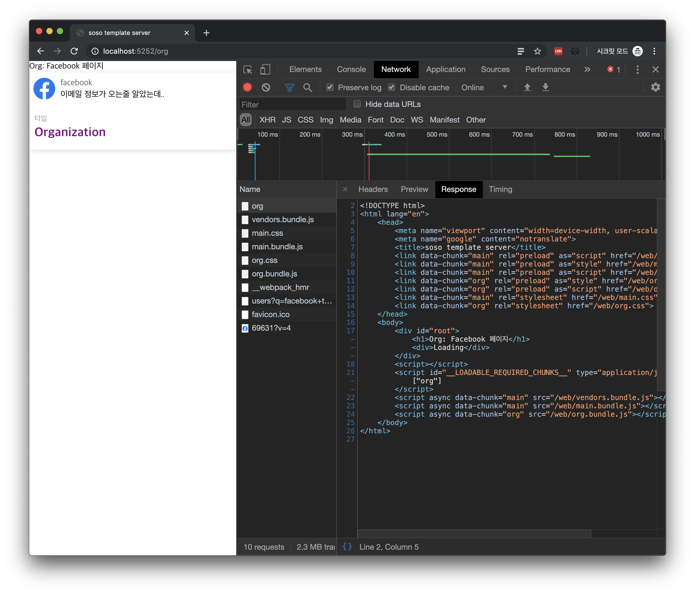

이 튜토리얼에 대한 전체 코드는 [여기](https://github.com/SoYoung210/react-ssr-code-splitting/pull/12)에서 보실 수 있습니다. 

## 들어가기에 앞서
본 글에서는 CSR과 SSR의 차이나 기본 원리에 대해서 자세히 다루지 않습니다. 

총 2개의 Route중에서 `/org 페이지의 헤더 영역`을 ServerSide에서 렌더링하게 됩
니다. 

기본적인 원리는 우리가 사용하고 있는 `express`에서 React코드를 해석하여 컨텐츠를 그리고, 이를 client에게 전달하는 방식입니다. 
> 혹시 이에 대해 더 알고싶으시다면 아래의 참고자료 링크를 확인해주세요.

서버에서 React코드를 해석할 수 있도록 하기 위해서는 어떤 것들이 필요할까요?
* library (react, react-router-dom, etc.)
* webpack loader(html, css, etc.)

앞으로 진행될 튜토리얼에서는 더 많은 장치가 필요하지만, 개념적으로 이 두 가지가 가장 중요한 요소입니다. 

## 구조 정리
먼저, 서버와 클라이언트 모두 공통적인 라이브러리가 필요하니, 두 개의 모듈로 나누어서 관리하던 것을 통합하겠습니다. 

client와 server의 package.json의 내용을 모두 root위치로 옮겨주세요. 
그리고 이 package.json의 `scripts`영역을 수정합니다. 
```json
"scripts": {
    "start": "npm run build:server && npm run build:client && node ./static/server.bundle.js",
    "build:server": "webpack --config ./webpack.server.js",
    "build:client": "webpack --config ./webpack.client.js"
  },
```
 `start` 명령어는 각각의 webpack파일로 build후 node서버를 동작시키는 명령을 수행합니다. 
server와 client에게 각각의 webpack file을 만들어주도록 하겠습니다. 
> 두 개로 나누는 이유는, 하나의 설정파일에서 너무 많은 분기가 들어가는 것이 복잡하다고 생각해서 입니다. 

### webpack.server.js 
`server/webpack.config.js` 의 내용을 그대로 복사해서 `webpack.server.js`로 적어줍니다. 서버쪽에서는 react만 해석할 수 있으면 됩니다. 
### webpack.client.js
이 부분이 기존에 비해 많이 변합니다. 
```js
const webpack = require('webpack');
const LoadablePlugin = require('@loadable/webpack-plugin');
const pathResolve = require('path').resolve;
const nodeExternals = require('webpack-node-externals');
const IS_PRODUCTION = process.env.NODE_ENV === 'production'

const getMode = () => (
  IS_PRODUCTION ? 'production' : 'development'
)

const getOutputConfig = (name) => ({
  filename: '[name].bundle.js',
  chunkFilename: '[name].bundle.js',
  path: pathResolve(__dirname, `static/${name}`),
  publicPath: `/${name}/`,
  libraryTarget: name === 'web' ? 'var' : 'commonjs2'
});

const getResolveConfig = () => ({
  alias: {
    '@': pathResolve('client/src')
  },
  modules: ['node_modules'],
  extensions: ['.ts', '.tsx', '.js', '.json', '.less'],
});

const clientRenderConfig = {
  entry: [hotMiddlewareScript,'./client/src/index.tsx'],
  target: 'web',
  name: 'web',
  mode: getMode(),
  output: getOutputConfig('web'),
  module: {
    rules: moduleRules
  },
  optimization: {
    splitChunks: {
      cacheGroups: {
        commons: {
          test: /[\\/]node_modules[\\/]/,
          name: 'vendors',
          chunks: 'initial',
        },
      },
    },
  },
  plugins: [
    new LoadablePlugin(),
    new MiniCssExtractPlugin({
      filename: '[name].css',
      chunkFilename: '[name].css',
    }),
  ],
  resolve: getResolveConfig(),
};

const nodeRenderConfig = {
  target: 'node',
  name: 'node',
  entry: [pathResolve( './client/src/routes/index.tsx')],
  output: getOutputConfig('node'),
  mode: getMode(),
  externals: ['@loadable/component', nodeExternals()],
  module: {
    rules: moduleRules
  },
  plugins: [
    new LoadablePlugin(),
    new MiniCssExtractPlugin({
      filename: '[name].css',
      chunkFilename: '[name].css',
    }),
  ],
  resolve: getResolveConfig(),
};

module.exports = [clientRenderConfig, nodeRenderConfig]
```
좀 더 중복을 제거할 수 도 있지만, 우선 명시적으로 이렇게 적어보았습니다. 
가장 눈에띄는 점은 mul-compiler방식으로 변했다는 방식입니다. 상황에 맞게 다른 종류의 compiler를 사용할 수 있도록 제공하는 방식입니다. 
rendering이라는 하나의 작업을 client(brwoser), server에서 진행해야하므로, 이렇게 변경하였습니다. 

**target** : ‘web’과 ‘node’를 사용하고 있습니다. [Target | webpack](https://webpack.js.org/configuration/target/)를 보면 알 수 있듯, default option은 web입니다. 주로 브라우저에서 사용한다는 뜻입니다. 
하지만 우리는 node환경에서 rendering하는 옵션이 필요하므로 이 값을 ‘node’로도 지정해준 것입니다. 

**name** : 컴파일된 파일에 이름을 붙이는건데,  @loadable과 앞으로 셋팅할 webpack-hot-middleware(WHM)가 해당 파일의 형식을 알 수 있도록 web 과 node 로 구분해줍니다. 

**getEntryPoint**: SSR에서는 entry파일도 변경해 줍니다. 이제 곧 소개될 내용이지만, `client/src/index.tsx`의 역할은 `server/app.tsx`가 담당하게 됩니다. 

**ouput**: SSR에 필요한 파일과 CSR에 필요한 파일을 나누기 위해 주입되는 `target`에 따라 폴더를 구분해줍니다. 
	- libraryTarget: node일 경우 `commonjs2`로 설정해 줍니다. node.js는 module시스템에서 commonjs방식을 채택했기 때문입니다. web은 default설정인 `var`로 설정하였습니다. 
	
**plugins**: SSR은 node환경에서 실행되므로 `webpack-node-externals`를 추가해주되, Code Splitting된 파일은 읽어야 하므로 `@loadable-component`는 추가해 줍니다. 
> ⚠️ : 이 부분은 아직 잘 이해가 안돼서 추후 내용을 보강해야 함. externals가 뭐람 

## server/app.ts => server/app.tsx 수정
```tsx
import React from 'react';
import { ChunkExtractor } from '@loadable/server';
// import other library

app.get('*',  (req, res) => {
  const nodeStats = path.resolve(__dirname, './node/loadable-stats.json');
  const webStats = path.resolve(__dirname, './web/loadable-stats.json');
  const nodeExtractor = new ChunkExtractor({ statsFile: nodeStats });
  const { default: EntryRoute } = nodeExtractor.requireEntrypoint();
  const webExtractor = new ChunkExtractor({ statsFile: webStats });

  const tsx = webExtractor.collectChunks(
    <StaticRouter location={req.url}>
      <EntryRoute />
    </StaticRouter>
  )
  const html = renderToString(tsx);

  res.set('content-type', 'text/html');
  res.send(renderFullPage(webExtractor, html));
});
```
이 부분이 메인 설정입니다.  
* **ChunkExtractor** :  `@loadable/server`에서 제공하는 SSR용 API입니다.  `collectChunk` 로 splitting 된 컴포넌트 정보를 취합하고 `getLinkTag` ,
`getStyleTag` , `getScriptTag` 로 로드할 파일 정보를 전달합니다.

* **StaticRouter** :  서버에서 BrowserRouter대신 사용하는 router입니다. 사용자가 요청한 url의 router정보를 클라이언트 파일에 전달해주는 역할을 합니다. 

*  **renderToString** : `react-dom`에서 지원하는 SSR용 라이브러리입니다. 이 메소드는 앞으로 client에서 사용할 hydrate와 아주 많은 연관이 있습니다. 밑에서 자세히 설명될 예정입니다. 
> 🍿(스포): renderToString으로 서버에서 렌더링 된 마크업을 클라이언트에게 내려주면, 클라이언트에서는 리렌더링하지 않고 이벤트 핸들러 정도만 연결합니다. 
> `hydrate` : 채워넣는다. 서버의 결과물을 채워넣는 작업이다. 라고 이해하시면 됩니다. 

* **renderFullPage** : 코드를 분할하기 위해 직접 만든 함수입니다. 서버에서 어떤 템플릿으로 내용물을 내려줄지 적어줍니다. 
```tsx
export const renderFullPage = (webExtractor, html) => (`
    <!DOCTYPE html>
      <html lang="ko">
        <head>
          <meta name="viewport" content="width=device-width, user-scalable=no">
          <meta name="google" content="notranslate">
          <title>soso template server</title>
          ${webExtractor.getLinkTags()}
          ${webExtractor.getStyleTags()}
        </head>
        <body>
          <div id="root">${html}</div>
          <script>
          
          </script>
          ${webExtractor.getScriptTags()}
        </body>
      </html>
`)
```

가장 힘든 작업이 끝났습니다. 중간중간 생략한 코드가 많습니다. 상단의 Repository의 코드를 함께 확인하시는것을 추천드립니다. 

## client/src/index.tsx 수정 
기존과 다르게 서버에서 컨텐츠가 그려진 html이 내려옵니다. 
이게 어떤 상황인지 As-is와 To-be로 살펴보겠습니다. 

### As-is (CSR)
```html
<!DOCTYPE html>
<html lang="ko">
    <head>
        <!-- meta tags -->
        <title>soso template</title>
    </head>
    <body>
        <div id="root"></div>
    </body>
</html>
<script type="text/javascript" src="/vendors.bundle.js"></script>
<script type="text/javascript" src="/main.bundle.js"></script>
```
비어있는 `div`가 내려오고 bunlde js parsing을 통해 rendering하는 방식입니다.

### To-be (SSR)
```html
<!DOCTYPE html>
<html lang="en">
    <head>
        <!-- meta tags -->
        <title>soso template server</title>
        <link data-chunk="main" rel="preload" as="script" href="/web/vendors.bundle.js">
         <!-- 더 많은 link tags -->
    </head>
    <body>
        <div id="root">
            <h1>Org: Facebook 페이지</h1>
            <div>Loading</div>
        </div>
        <script id="__LOADABLE_REQUIRED_CHUNKS__" type="application/json">
            ["org"]
        </script>
        <script async data-chunk="main" src="/web/vendors.bundle.js"></script>
        <!-- 더 많은 script tags -->    
	  </body>
</html>
```
비어 있던 `div`가 **컨텐츠로 채워집니다.**
일정부분 서버에서 컨텐츠를 채워서 내려받게 됩니다. 헌데, 이미 그려진 영역은 client에서 다시 그릴필요가 없겠죠? 
**그래서 hydrate가 필요합니다.** client/src/index.tsx의 내용을 변경합니다. 
```tsx
import { loadableReady } from '@loadable/component';
import { hydrate } from 'react-dom';
import EntryRoute from './routes';

loadableReady(() => {
  const root = document.getElementById('root');
  hydrate(
    <BrowserRouter>
      <EntryRoute />
    </BrowserRouter>,
    root
  );
});
```
기존의 `ReactDOM.rendering` 은 사라지고 `hydrate`가 등장했습니다. 
앞서 말했듯, **이미 그려진 영역을  채워주는 역할**을 합니다. 
첫 렌더링에 필요한 string만 html에 삽입시켜주고 client에 필요한 bundle js가 도착하면 html tag에 이벤트를 달아주는 역할을 합니다. 

### 확인
첫번째 SSR + CodeSplitting적용이 완료되었습니다.
`npm start`를 수행하고 `/org`페이지에 접근해보면 이런 결과를 확인할 수 있습니다.

이 글에는 정상작동에 필요한 full code를 담지않았으니, [PR](https://github.com/SoYoung210/react-ssr-code-splitting/pull/12)을 보면서 따라해보세요! 

다음 장에서 server에서 렌더링외에 data fetch를 통한 full contents를 내려주 작업이 연재됩니다!   

## 참고글 
[react-router/StaticRouter.md at master · ReactTraining/react-router · GitHub](https://github.com/ReactTraining/react-router/blob/master/packages/react-router/docs/api/StaticRouter.md)