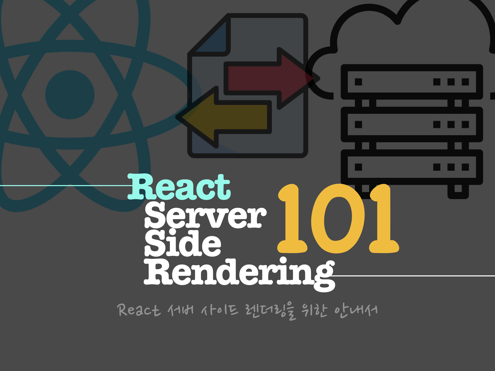

SSR을 이용해서 두 가지 상황을 구현해보았습니다. 두 번째 글이 첫 번째보다 조금 어려웠다고 생각되는데요, 과연 어려운만큼 좋은 UX를 구현한것일까요?

제 대답은 `그렇지 않다.` 입니다.

## 사용자 관점

[SSR - Data Fetch](https://so-so.dev/react/[ssr]-3.-ssr-data-fetch/)의 방법으로 요청했을 때 어떤 일이 벌어지는지 그림으로 살펴봅시다.

사용자의 요청이 express에게 전달되고, api fetch후 contents를 그린 html을 Client에게 내려주기 전까지 **사용자는 흰 화면만 보게 됩니다.**

api call이 오래 걸릴 경우 사용자가 흰 화면을 보는 시간은 그만큼 길어지게 됩니다. 이는 좋은 UX라고 보기 어렵습니다.

> 컨텐츠가 담겨진 html자체를 캐싱처리 할 경우 이 속도가 빨라져 실제로 UX에 긍정적인 영향을 끼칠 가능성이 높습니다.
> 하지만, 이번 튜토리얼에서는 관련 내용에 대해서는 다루지 않습니다.

이 방식을 조금 바꿔서, server에서는 api호출을 수행하지 않고 client의 `Loader` 혹은 `header`영역만 그려서 빠르게 전달해줍니다.

이후 로직 처리는 [client에 위임하는 방식](https://so-so.dev/react/[ssr]-2.-ssr---basic/)으로 변경합니다.

사용자는 빠르게 contents를 볼 수 있게 되었습니다. 그림에는 큰 글씨의 `Loading`으로 표현했지만, 스켈레톤 UI등을 활용하면 조금 더 나은 UX로 나아갈 수 있습니다.

그리고, 웹뷰 상황에서 더 장점을 가집니다.

server에서 api요청을 처리하는 방법으로 구현할 시에는, Client에서 받는 것은 완성된 html이므로 캐싱이 적용되지 않습니다.

두 번째 방식으로 진행 시 client rendering에 필요한 일부 bundle을 받아오는 작업이 캐싱될 수 있습니다. 당연히, express에서 bundle을 받는것보다 빠르게 진행될 수 있습니다.

## 단점만 있는 것은 아니다

하지만, 마냥 단점만 있는것은 아닙니다. 위 상항을 다르게 이야기 해보면, Client에서는 **늘 express의 상황에만 의존하게 된다는 것입니다.** 한번, `Low tier 디바이스`의 상황을 가정해봅시다.

***Full Contents를 내려받는 방식***

모든 요청과 api call이 express에서 이루어지므로, 유저가 컨텐츠를 받는 속도에서 변수는 오직 `네트워크 환경`과 express의 스펙입니다.(서버의 CPU등)  
express의 CPU보다 좋지 않은 CPU를 가진 디바이스에서는 기존의 방식보다 빠르게 컨텐츠가 로드 될 수 있습니다.

***SSR + CSR***

컨텐츠를 내려 받는 속도에서 중요한 요소는 유저가 연결된 네트워크 환경과 디바이스 스펙입니다.  
저사양의 디바이스에서는 두 가지 요소 모두 좋지 않으니 컨텐츠 로딩 속도가 매우 느립니다. 이 경우 express에서 모든 컨텐츠를 내려받는것이 좋습니다.

## 이 튜토리얼을 끝마치며

SSR 튜토리얼이 끝났습니다.  
프레임워크 없이 SSR을 적용하는 과정에서 많은 버그와 어려운 점을 만났는데, 같은 어려움을 겪고 계실 분들께 도움이 되었으면 좋겠습니다.

본 튜토리얼에 사용된 코드는 [여기](https://github.com/SoYoung210/react-ssr-code-splitting)에서 보실 수 있습니다.  
피드백은 댓글이나 깃헙 이슈로 남겨주시면 감사하겠습니다.🙂
