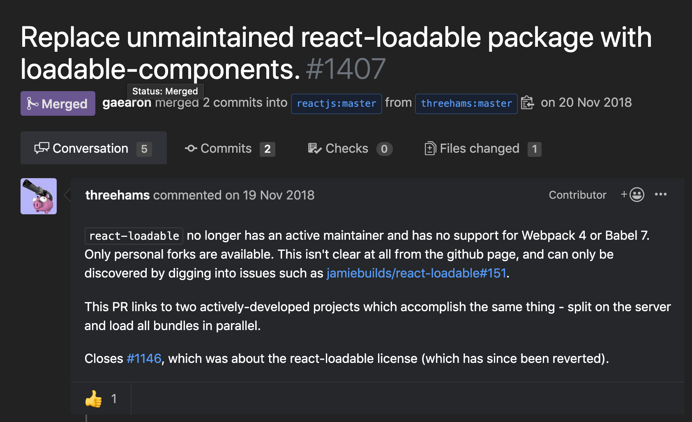

이 튜토리얼은 React와 ServerSideRendering, 그리고 Code Splitting을 적용하는 과정을 순서대로 소개합니다. 

모든 코드는 [GitHub](https://github.com/soYoung210/react-ssr-code-splitting) 에 있으니  **각 단계별 branch에서 코드를 살펴보세요!** 

## 구성 
SSR을 적용하며 만났던 버그들에 대한 Trouble Shooting에 대한 내용과 성능, UX관점에서 SSR을 어떻게 적용하면 좋을 지 개인적인 생각을 포함하고 있습니다.

SSR과 CSR의 차이나, 왜 SSR을 선택했는지에 대한 내용은 따로 다루지 않습니다. 
대신, 아래에 참고할만한 Reference 링크를 걸어두겠습니다. 
 
## ToC
* Code Splitting - SSR을 위한 준비 
* SSR  - Basic 
* SSR - Data Fetch with Store
* UX관점에서의 SSR 

## Code Splitting
### 라이브러리 
코드 스플리팅은 기본적으로 React에서 지원하고 있습니다. 
> [Code-Splitting – React](https://reactjs.org/docs/code-splitting.html)


 **하지만** lazy는 SSR을 지원하고 있지 않다고 하니, 과감히 포기하고 다른 도구를 찾아봅니다. 

SSR용 라이브러리는 크게 두 가지가 있습니다. 

1. react-loadable
많이 사용’했던’ 라이브러리 입니다. SSR관련 아티클을 검색해보면 2번에서 소개할 라이브러리보다 react-loadable로 구성된 아티클이 많습니다. 
하지만, [이런 이슈](https://velog.io/@velopert/nomore-react-loadable)때문인지 react공식문서에서도 사라졌고 저장소는 Issue도 닫고 유지보수도 적극적으로 이루어지고 있지 않습니다. 


1. @loadable/components
[@loadable/components](https://github.com/smooth-code/loadable-components) 역시 SSR을 지원하는 Code Splitting 라이브러리 입니다. 이 튜토리얼에서 사용하는 라이브러리이며, react lazy와의 비교나 SSR에 대한 기본적 Tutorial제공 등, 문서화도 잘 되어있다고 생각합니다. 
3. react-universal component
> TBD

## 들어가기 전에, Template html설정  
실제 Product환경에서는 html이 아닌, pug나 ejs등 template html문법을 사용할 수 도 있습니다. 이 경우 Code Splitting을 어떻게 적용해야 할까요?

그리고 Code Splitting을 한다는 것은 bundle이 나눠진다는 뜻인데, 어떤 페이지에서 어떤 bundle.js가 필요한지 어떻게 작성할 수 있을까요?  

### HtmlWebpackPlugin
[HtmlWebpackPlugin | webpack](https://webpack.js.org/plugins/html-webpack-plugin/)은 번들 된 파일을 `<script>`로 로드한 html 파일을 자동으로 생성해 주는 plugin입니다. 설정의 따라 새로운 html 파일을 생성할 수도, 기존의 html에 번들 된 파일을 `<script />`로 로드한 html 파일을 생성 할 수도 있습니다.
이 프로젝트에서는 `server/views/index.pug` 파일을 기본 template으로 사용하고 있습니다. 
```js
// 🌏 webpack.config.js
new HtmlWebpackPlugin({
  template: pathResolve(__dirname,'../server/views/index.pug'),
  filename: './index.pug'
}),
```
다양한 옵션들이 있지만 지금은 어떤 template을 사용할 것인지, 그리고 ouput파일이 어떤 이름으로 생성될지만 적어주었습니다. 


🎉 client에서의 build결과물로 static폴더내에 index.pug가 생성되었고, 필요한 `main.bundle.js` 가 포함되어있는 것을 확인할 수 있습니다. 

### Let’s Start (feat. Config설정 먼저) 
> ⚠️ 이 내용은 `master` 브랜치 내용에 이어지는 내용입니다. master브랜치의 내용은 따로 설명을 적지 않습니다. 혹시 궁금하신 점이 있으시다면 댓글로 남겨주세요! 

`@loadable/component`를 먼저 설치해줍시다. 
```bash
npm i @loadable/component

// if typescript,
npm i -D @types/loadable__component
```

그리고, 아직 표준이 아닌 dynamic import syntax를 사용하기 위해 [@babel/plugin-syntax-dynamic-import](https://www.npmjs.com/package/@babel/plugin-syntax-dynamic-import)를 설치해주고 `.bablerc` 내용도 수정해 줍니다. 
```bash
npm install --save-dev @babel/plugin-syntax-dynamic-import
```
```js
{
  "presets": [
    //🍱 preset들 
  ],
  "plugins": [
    "@babel/plugin-syntax-dynamic-import",
    //🥟 다른 plugin들
  ]
}
```

그리고, chunk될 bundle JS에 우리가 알아보기 쉬운 이름이 붙으면 좋으니, webpack설정도 살짝 추가해 줍니다. 
```js
// 🌏 webpack.config.js
module.exports = (env, options) => {
  const config = {
    entry: [시작file이름],
    output: {
      filename: '[name].bundle.js',
      chunkFilename: '[name].bundle.js',
      //다른 설정들
    },
	}
}
```

이제 config파일 설정을 완료했으니 실제 Code Splitting을 진행해 봅시다. 
> 매우 간단합니다 🎉

### View 
1. Dynamic import대상이 될 컴포넌트를 `export default` 로 변경합니다. 
```tsx
// As-is
export const OrgComponent = () => {
	// ..
}

// To-be
export default () => {
 // ..
}
```

2. 두 개의 컴포넌트 import 방식을  `loadable` 로 변경합니다. 
```tsx
// As-is
import { OrgComponent } from './Org';

// To-be
const OrgComponent = loadable(() => import(/* webpackChunkName: "org"*/ './Org'))
```

코드 스플리팅 작업이 완료되었습니다. 결과는 bundle Analyzer와 chrome inspector를 통해 확인할 수 있습니다. 


bundle Anaylzyer를 보면, 오른쪽에 `Org.bundle.js`가 생성된것을 확인할 수 있습니다. 

코드스플리팅을 적용한 `/org` 페이지에 접근해보면,  `org.bundle.js`를 요청하도록 되어 있는것을 확인할 수 있습니다. 

### 몇 가지 생각 
::일단 정확한지 모르겠음..:: 
> Slow Network환경에서, 정말 가벼운 Route를 하나 더 만들고 나누었을 때랑 안나누었을 때 비교해보기 
Code Splitting은 항상 좋을까요? 사실은, 그렇지 않을 수도 있습니다. 
이 프로젝트에서 client의 전체 bundle size는 어떨까요?

localhost환경임을 감안하면, 그렇게 크지 않은 것 같습니다. 

위의 방법으로 Route Based Code Splitting을 진행했습니다. 브라우저에서 각 페이지 요청 시 일어날 일들을 표현하면 다음과 같습니다. 

`/org` 에서 `/user` 로 route 이동시 추가적으로 `user.bundle.js`를 요청하는 것을 볼 수 있습니다. 당연히, Code가 분할되었기 때문이고 이로인해 user페이지 접근시 필요한 bundle js를 요청하는 것입니다. 

반대로, splitting을 적용하지 않으면 route변경시에 추가적인 js를 로드하지 않는 것을 볼 수 있습니다.
> 깜빡임은 JS Parsing으로 인한 것입니다. 

Code Splitting에서 이러한 사실을 간과하고 무작정 나누기만 하는 것은 오히려 UX를 안좋게 하는 방향일 수 있습니다. 초기 페이지 load는 빨라질 수 있으나 이후 route변경에서 js를 추가적으로 Load해야하기 때문입니다. 굉장히 작은 컴포넌트를 splitting할 경우 네트워크 요청에 드는 비용(DNS Resolve, SSL handShake, download time, etc.)이 Code Splitting의 장점을 능가할 수 있습니다. 

Silver Bullet은 없습니다. 어떤 것을 분할해야 하는지는 WebpackBundleAnalyzer등의 번들 분석기를 보면서 ‘적절히’ 나누는 것이 필요합니다. 
