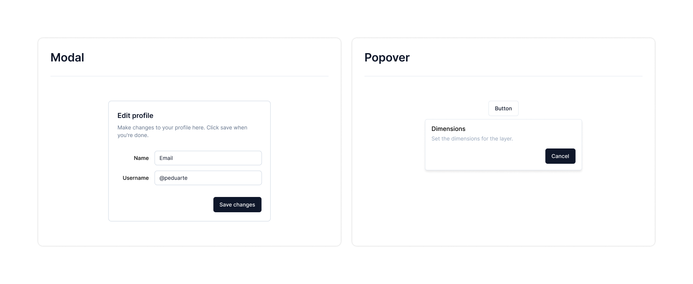
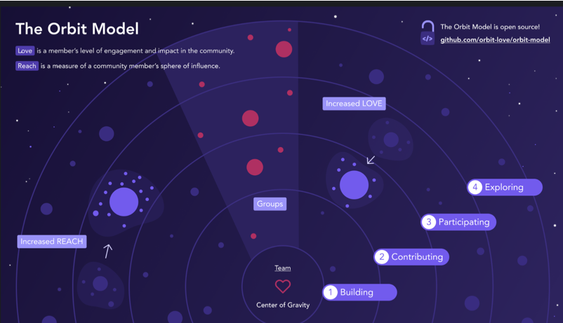
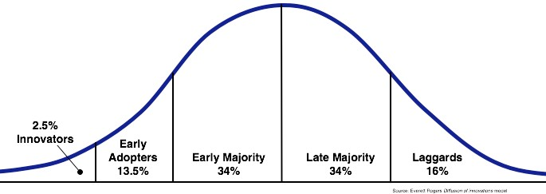

I'm on my third design system now. I built one entirely from scratch, and rebuilt the other two on top of systems that already existed. Across all three, I learned what actually matters and what doesn't, and this post is my attempt to write down the difficulties I ran into along the way.

- [Before You Build](#만들기-전에)
  - [Goals](#목표)
  - [Quality Comes First](#중요한-것은-퀄리티)
  - [Setting Core Principles](#대원칙-만들기)
- [While You Build](#만드는-중에)
  - [Protecting the Core Principles](#대원칙-수호하기)
  - [Code Is the Baseline](#코드는-기본이다)
  - [Definitions Are Everything](#정의가-전부다)
  - [If You Can Only Pick One Thing, Pick Test Code](#하나만-선택해야-한다면-테스트-코드)
  - [Carving Out Slack Time](#여유시간-확보하기)
- [After You've Built It](#만들고-나서)
  - [Get Feedback Fast](#피드백-빨리-받기)
  - [Know What to Do and What Not To](#해야-할-것과-하지-않을-것-구분하기)
- [Appendix](#부록)
  - [So Where Do You Even Start?](#그래서-어떻게-시작해야-할까)
  - [Product Systems](#프로덕트-시스템)
- [Closing Thoughts](#끝으로)

## Before You Build

The very first stage, before you build anything, matters more than any other. Every decision you'll face while building and later running the system rests on the groundwork and direction you set right here.

If someone asked me what to do first when starting a design system, my answer would be: set a goal, and be clear about what you're aiming for and what you're not.

### Goals

A design system exists to deliver two things: consistency and efficiency.

But the specifics should shift depending on the product the system serves. You could tighten the system's enforcement and chase unbreakable consistency and high output, or you could treat the system as raw material and chase extensibility and freedom instead.

Whatever philosophy and goals you pick become the foundation every future **decision** gets built on. Even if you adopt someone else's design system, you still have to figure out what a design system fit for your own team actually means.

#### If You're Chasing Extensibility

A design system built around extensibility and freedom is, by nature, handing part of the responsibility for consistency over to whoever consumes it. That means your target has to reach past the design system layer alone.

- The design system layer
- The product system layer

Think of a product's components as living in at least these two layers, and plan for how you'll help the teams consuming your system build their own product-system layer on top of it.

A design-system team is almost always smaller than the product organization it serves, so trying to drive every layer yourself just isn't realistic, and it can end up slowing product teams down instead. That's exactly why supporting and guiding the community toward building their own product-system layer needs to be one of the design system team's core missions.

### Quality Comes First

Why would a designer or developer outside the system team ever choose to use it?

Users don't just use whatever's put in front of them. Being "well made" isn't enough on its own. A product has to make people feel its value, so they come looking for it themselves.

A design system is a product too. What sets it apart is that it has two kinds of users at once: the people using the product it powers, and the teammates building that product.

For teammates to come looking for the system on their own, **the system itself has to be overwhelmingly satisfying to use.** It has to offer UI and UX good enough that people want it in their product, and it can't get in the way the moment they need to extend it.

Once teammates start reaching for the system on their own, both the system and the product mature faster. And turning users into fans this way pays off again later, when it's time to win over early adopters (more on that below).

### Setting Core Principles

Once your goals and philosophy are set, build your core decision-making principles on top of them.

Spell out, as concretely as you can, what the system will and won't do, and exactly how its code interface should reflect its design constraints, then write it down.

Philosophy on its own is too abstract to solve real problems as they come up. Build your principles on top of your goals and philosophy, then keep sharpening them as you actually solve problems.

## While You Build

### Protecting the Core Principles

Focus too hard on individual trees and it's easy to lose the forest. You'll make a long string of decisions while building a system, and none of them should drift from the direction the team already agreed on.

That means constantly checking things like whether you're keeping a consistent level of abstraction, from how you name interfaces up to how you shape whole components, and whether you're actually covering baseline responsibilities like accessibility.

Deciding this way takes practice. At first it takes real conscious effort, and you'll probably reverse a decision or two along the way. But once the team has practiced this enough, staying inside the principles starts happening almost automatically, without much effort at all. And sometimes breaking a principle is the right call. That's fine, as long as what you get back is worth what it costs.

### Code Is the Baseline

Don't let good code or elegant design eat up too much of your time. A design system is really just one decision after another, and like any product, beautiful code built on top of the wrong decision is worth nothing.

#### Things You Should Already Know

Make a habit of actually using a wide range of services, and study the decisions behind other open-source design systems. Different services will hand you hints for your own component decisions, and digging through open-source systems teaches you a lot about how to classify components, design interfaces, and write good code.

#### Don't Let Feasibility Hold You Back

There's another reason code has to be your baseline: you're constantly deciding whether something is worth building, not just whether it's possible. Good decisions require not letting "can we build this" tie your hands.

A good system can't rest on any one person's judgment. Everyone on the team, regardless of role, needs a sharp design instinct and a stubborn commitment to UX quality.

#### Aim for Sustainability

The moment a system gets adopted, it's going to outlive the product it's built into. That alone means sustainability has to be part of the plan.

If you're building a system, hold both perspectives from [“The Rise of Worse is Better”](https://www.dreamsongs.com/RiseOfWorseIsBetter.html) at once: *the right thing*, and *worse is better*.

Build simple implementations behind a consistent interface. Consistency makes behavior predictable, and a simple implementation means other developers can actually make sense of the system's code, which is what makes contribution possible in the first place. A system has to stay maintainable, stay extensible, and stay open to anyone who wants to contribute.

Aim for simplicity, but weigh every bit of complexity you add for the sake of usability. As a rough gut check: if code complexity goes up by 100, the usability gain needs to be at least 80. Here's what that looks like from the angle of a component's interface and its UI/UX completeness.

- **Interface:** A simple interface matters more than a simple implementation. Chase interface consistency, except in the rare case where doing so would actually make the component behave incorrectly.
- **Completeness:** If a feature's completeness isn't worth the internal complexity it costs, compromise. Treat simplicity itself as a value worth protecting.

Complexity debt and usability debt trade off against each other, constantly, and every new problem forces you to weigh them correctly again. A design system really is just decisions, all the way down. Implementation skill is more like the fitness underneath: the thing that lets you carry whatever actually matters.

### Definitions Are Everything

Just as you set a goal for the whole design system before you started, while you're building you need a goal for each individual component too. The same exercise, drawing a line between what's in scope and what isn't, has to happen at the component level as well.



What actually happens when a component's definition is fuzzy? Here's a situation you might run into while building Modal and Popover, as an example.

#### When the Definition Is Missing

It's easy to mistake a component's design guide for an agreed-upon definition of what it does.

**What the developer has in mind:**

- Modal
  - An overlay that shows up dead center, covering everything else
- Popover
  - An overlay holding a button and some text
  - Lets you put in elements other than a button too
  - The content area is just defined as `children`

**What the designer has in mind:**

- Modal
  - An overlay that shows up dead center, covering everything else
- Popover
  - An overlay with a short description and a cancel button
  - Too much varied content looks messy. Since the mockup only shows text and a cancel button, that's assumed to be all it's for.

Now imagine a request comes in, on top of that mismatch.

> Can we add an option so the Modal opens positioned relative to whatever button triggered it? Right now it's locked to dead-center, and customizing that position takes way too much work.

Since the designer assumed `Popover` could only hold text, they routed this request to the developer as a `Modal` change instead. But Modal has no concept of "relative to the button that triggered it," so supporting the request means bolting on a prop like this.

```jsx
<Modal
  trigger={<Button>Button</Button>}
/>
```

Adding just `trigger` still leaves the modal's positioning ambiguous, so a `mode` prop gets tacked on too, to spell out whether it should sit dead-center or anchor to the trigger.

```jsx
<Modal
  trigger={<Button>Button</Button>}
  mode="trigger"
/>
```

Step back and look at the result: it's just `Popover`'s default behavior, rebuilt inside `Modal`. Worse, bolting it on made the implementation more complicated than it needed to be. Building the same feature twice, in two different components, wastes effort and confuses whoever has to use them.

If someone's first thought is "it covers the screen, and I need to control where it sits," they'll reach for Modal. If it's "the content needs to appear relative to a trigger," they'll reach for Popover.

Both why this request landed in the first place, and why solving it got so tangled, trace back to the same root cause: **the components' responsibilities were never clearly defined.**

#### When the Definition Holds Up

Beyond a design guide covering spacing and color, think through the responsibilities and use cases of similar-looking components first.

- `Modal`
  - Deliberately breaks the user's context
  - Blocks all interaction with the page until it closes
- `Popover & Tooltip`
  - For when you need to stay connected to the trigger's context
  - Supplements the trigger with extra information, and can hold actions related to it
  - Tooltip: short, plain information (text only) / Popover: for extra information or actions (no page navigation inside it)

> Can we add an option so the Modal opens positioned relative to whatever button triggered it? Right now it's locked to dead-center, and customizing that position takes way too much work.

With a solid definition in place, the same request gets routed straight to `Popover`, and the decision that would've saddled a component with pointless complexity never happens.

### If You Can Only Pick One Thing, Pick Test Code

A design system has two jobs: get its core functionality right, and stay that way over time. Test code is the bare-minimum safety net that guarantees both.

The real value of a test isn't catching today's bugs, it's mechanically guaranteeing that what's true today stays true later. A test that breaks exactly when it should is what actually protects a product. Anyone maintaining a design system needs this, obviously, but it's also essential to the direction a design system has to grow in, and that direction is what I actually want to talk about here.

Despite all that, test code often gets pushed down the priority list. In the moment, eyeballing the UI just feels faster than writing a test. And once you can verify something visually in seconds, a test can feel like a waste of time. But I'd argue the opposite: give up something you think matters more, like a beautiful implementation as opposed to a clean interface, before you give up your tests.


<small style="opacity: 0.5;">https://github.com/orbit-love/orbit-model/blob/main/orbit_model_color.png</small>

Your user base keeps growing, while the people maintaining the library stay a tiny fraction of that. A library that never builds an ecosystem hits a ceiling on how far it can grow, so the team behind it has to build an ecosystem where users contribute and grow alongside it. Keep driving the core functionality forward yourself, but pull users into the process too.

That was a long way of getting to the point: without test code, you can forget about getting direct code contributions.

Test code might look like just one more chore in the short run, but it's a cheap way to buy both stability and a lower barrier for anyone who wants to contribute. This post isn't about code specifics, so I won't walk through exactly how to write tests, but here are a few things that helped me.

#### Treat Behavior and Style as Separate Problems

A design system really boils down to behavior and style. I test behavior with [react-testing-library](https://testing-library.com/) (rtl from here on), and style with [playwright's image testing](https://playwright.dev/docs/test-snapshots). ([chromatic](https://www.chromatic.com/) is a good style-testing option too, but environment-setup issues kept me from adopting it.)

Styling is inherently visual. Testing it through rtl makes results hard to predict and bloats the test code. So I split the two apart, on the idea that a visual thing needs a visual check, and I still think that split holds up. Whether playwright's image testing is the best tool for the job, though, I'm still not fully sure.

#### Where to Look

Testing a design system is actually easier than testing a typical product. There's less to account for around user state or outside dependencies like APIs than in a real service. Follow web accessibility properly, and rtl lets you generalize most situations into a test.

Whenever I wasn't sure what or how to test, I found real insight by looking at open-source projects like [primer](https://primer.style/), [ark ui](https://ark-ui.com/), [mui](https://mui.com/), and [react-spectrum](https://react-spectrum.adobe.com/react-spectrum/index.html).

#### Don't Lose Sight of What Tests Are For

Test code is only ever a means to help the product, nothing more. Just like weighing code complexity against UX quality, tests only earn their keep when their value matches what they cost to write.

Tests come in layers too: unit, integration, E2E, and you have to judge how far up that ladder is actually worth the time it costs, then apply it accordingly.

Tests won't save you from every bug. On that note, I'd recommend reading Jbee's post [Misconceptions and Facts About Testing](https://www.jbee.io/articles/developments/%ED%85%8C%EC%8A%A4%ED%8A%B8%EC%97%90%20%EB%8C%80%ED%95%9C%20%EC%98%A4%ED%95%B4%EC%99%80%20%EC%82%AC%EC%8B%A4).

### Carving Out Slack Time

Slack time means stepping off the team's normal cycle for roughly a day to knock out high-priority backlog items, shore up automated tests, and generally pay down technical debt.

Paradoxically, the busier a team gets, the more it needs to protect this time. Giving up a whole day feels expensive when you're already sprinting, but technical debt and backlog pile up exactly as fast as you're moving, and eventually they become unmanageable. The more components and problems a team owns, the more slack time pays off, letting you solve more problems, faster, over the long run.

## After You've Built It

Every product keeps getting improved, and a design system is no different. I called this section "After You've Built It," but what I really mean is "after you've built it **to some degree.**"

Here's what that "some degree" actually looks like, and the problems I ran into (and am still working through) once I reached this stage.

### Get Feedback Fast

Whether you're building a design system from scratch or rebuilding one, you need a bar for when you can actually tell other teams it's ready.

That bar will differ team to team, but it has to be **early.** No matter how much you test and how carefully your team scrutinizes it internally, real-world use is going to surface problems, big and small. The later feedback arrives, the later you catch the problems that actually matter, and the more expensive they get to fix.

It's worth applying the system directly to a simple page or service. Nothing validates a system as well as dogfooding it yourself. If you can't contribute to a service directly, get the system's foundational pieces ready (Button, Checkbox, Dropdown), and the moment you've built other components on top of those, start pushing for real adoption and collecting feedback.

#### 1. Recruit Volunteers

A brand-new system starts out weak. Even armed with great UI/UX and a clean interface, it's an uphill fight against legacy that's already been in use for years.

From a product team's point of view, adopting something new is just a burden. Of course they'll hesitate, and you need to actually understand why, not just push past it.


<small style="opacity: 0.5;">Rogers' Diffusion of Innovation Curve (after Rogers 1995)</small>

Whatever the product, customers hitting the market fall into roughly this distribution. (For simplicity, I'll lump innovators and early adopters together under "early adopters" for the rest of this post.)

Early adopters have real power to spread a product to everyone else on their own. Bring the ones who share your vision into the development process, take their feedback seriously, and you can pull ahead fast, on both product quality and adoption.<br />
<small style="opacity: 0.5;"><a href="https://fromundefined.com/posts/2024-02-uxs-working-culture/" target="_blank">Reference: fromundefined/2024-02-uxs-working-culture/</a></small>

**Spreading a new design system really comes down to one thing: how fast, and how many, early adopters you can win over.**

Don't stop at a Slack announcement or a general nudge. Go pitch people directly and recruit them yourself.

In my own case, whenever someone asked about a legacy component, I'd walk them through what the new system's version improved and suggest switching. A couple of people showed real interest, thankfully, and I set up in-person meetings to sell them on the new system, which is how adoption got its first foothold.

#### 2. Turn Early Adopters Into Fans

Recruiting early adopters isn't just about fast feedback, it's about turning them into fans devoted enough to spread the word themselves and pull in new users.

**A new system is weak, and unfamiliar.** You'll get a flood of questions early on, and this is your chance to help solve problems the way the user actually experiences them, well enough to leave a real impression. Both speed and quality of response need to be overwhelming.

In practice, I treated every question from an early user as an unconditional interrupt, dropping whatever else I was doing. If the issue lived in their service environment, I'd run it myself, dig into it, and hand back a full, detailed picture of what was wrong. (One bug turned out to trace back to the emotion library, and I wrote up the entire surrounding context before sending it over.)

Once that first user shipped the new system in their product and shared it as a win with the team, I started hearing "yeah, this might actually be worth trying" from developers who'd been skeptical of it until then.

#### 3. The Start Is the Hardest, and the Most Important, Part

Once you have your first user, and a few more start trickling in, you hit an "operational support rush" at some point.

Now you're juggling new component work, support requests, and bug fixes, all at once, with the same headcount you had before. Something has to give. Thinking you can just work more hours and keep every plate spinning at full intensity is wishful thinking.

The obvious thing to dial back is new component work. **That early rush of questions is actually an opportunity.** It's the window where a still-young system can grow the fastest, and the stretch where you have to earn the trust of the developers who signed on as your early adopters.

This window doesn't last long. Stay focused and get organized, and the rush usually wraps up inside a week or two. Don't let the flood of questions rattle you, keep deciding under the principles you set at the start, and write things down wherever you can, so solving these problems doesn't end up depending on one person's tribal knowledge.

Most teams start with the Button, probably because it's used everywhere and becomes the raw material for so many other components. It's a reasonable place to start, but that doesn't make it easy. If anything, its plain appearance makes people underestimate how tricky it actually is.

If you're building a system from a blank slate, you can finish out a component set, ship it, and iterate from there. But if you're migrating an existing product onto a new system, the button is exactly the kind of component where pulling one thread drags a whole tangle of others up with it.

A component that everything else is built from is hard, full stop. It looks easy. It never is. That's exactly why the start matters most, and hurts most.

### Know What to Do and What Not To

As the new system spreads and more people adopt it, requests naturally pile up. Beyond the bugs you obviously have to fix, you'll also see growing demand for convenience features and richer documentation. This is the stage where the system moves past its early adopters and starts becoming the default.

Earlier, in "Turn Early Adopters Into Fans," I said both speed and quality of response had to be overwhelming. At this stage, that strategy needs to change. You simply can't respond to every request that comes in, and knocking out even small-looking ones one by one can quietly push back the work that actually matters. Judging priority matters in any situation, but it matters even more right as a design system is starting to take hold.

One approach: pass boldly on anything that's merely nice-to-have, and where a blunt, cheap fix will do, just take it.

Here are a few real requests, and how I handled each one, to walk through what priority and criteria actually looked like in practice.

- (Feature request) "Could the Combobox support highlighting the search term?"
- (Feature request) "Could keyboard item navigation also work inside the search input in Dropdown content?"
- (Feature request) "Could the design handoff be more automated?"
- (Documentation) "Could we get detailed prop descriptions and rich examples, like an open-source library?"

<br/>

**1. (Feature request) "Could the Combobox support highlighting the search term?"**

<span style="border-color: rgb(55, 53, 47);border-bottom: 0.05em solid;">Not doing it.</span>

This goes beyond the core functionality already defined for Combobox. We could consider folding it into the core feature set, but reopening the definition of a component we've already finished, this deep into building out the set, doesn't fit where we are right now.

Anything the system offers has to be broadly useful, and the decision has to weigh both UX and DX. If a feature isn't important enough to justify interrupting whatever the team's currently focused on, we skip it. That's exactly why building with extensibility in mind matters: you can't provide every feature, so whoever needs the extra one should be able to build it themselves on top of what you give them.

**2. (Feature request) "Could keyboard item navigation also work inside the search input in Dropdown content?"**

<span style="border-color: rgb(55, 53, 47);border-bottom: 0.05em solid;">Doing it.</span>

This falls squarely within general functionality, and keyboard accessibility for item navigation is already core to what Dropdown does, so it needs support.

Next question: **when** to actually do it. Since it's already decided, a developer could pick it up whenever they have some slack, but the more people involved, the more inefficiency creeps in. (Context-switching has a cost too.)

For a mid-priority problem like this, one that still needs solving, I'd recommend using the slack time mentioned back in "While You Build."

**3. (Feature request) "Could the design handoff be more automated?"**

<span style="border-color: rgb(55, 53, 47);border-bottom: 0.05em solid;">Not doing it.</span>

Touching an extra feature before the basics are covered is just greed. For a platform team that's supposed to be lifting the product org's productivity, deciding not to do something is a hard call to make. But defining what you won't do is exactly what lets you actually finish what matters, on time.

Sometimes the right call is a blunt, cheap fix instead of a polished, expensive piece of engineering. At this stage, this automation request was exactly that kind of problem, one that needed the blunt fix.

**4. (Documentation) "Could we get detailed prop descriptions and rich examples, like an open-source library?"**

<span style="border-color: rgb(55, 53, 47);border-bottom: 0.05em solid;">Not doing it.</span>

Documentation is a real building block of an ecosystem. It should look good, and it's worth investing in so people can find what they need fast.

But the system's own completeness has to come first. Judge how much the team can actually focus on right now, and if there's no room left for anything beyond protecting that core, solve it bluntly. Right now, we can't invest further in documentation, so we're only shipping it through [Storybook](https://storybook.js.org/) using [control](https://storybook.js.org/docs/api/doc-block-controls).

Deciding not to do something is harder than deciding to do it. Most problems can be solved if you just throw enough time at them, and as an engineer, that temptation is real. But you have to draw a hard line between "we can do it" and "we can do it cheaply." At the team level, the question has to be whether the team can actually take on more scope than it's already carrying.

## Appendix

### So Where Do You Even Start?

I've talked about why setting a goal and defining components matter. So what input actually produces that kind of output?

A solid place to start: study existing design systems, how they split up components, how they handle extensibility, and use that to build the foundation for your own decisions. Here's the list of libraries I reference. Some are headless, some I look at purely for styling, and some just for how a couple of specific components are built.

- [radix-ui](https://www.radix-ui.com/)
- [ark-ui](https://ark-ui.com/)
- [react-spectrum](https://react-spectrum.adobe.com/)
- [ariakit](https://ariakit.org/)
- [primer/react](https://primer.style/react/)
- [mantine](https://mantine.dev/)
- [chakra-ui](https://chakra-ui.com/)
- [next-ui](https://nextui.org/)
- [shadcn/ui](https://ui.shadcn.com/)
- [intergalactic](https://developer.semrush.com/intergalactic/)

### Product Systems

Even if you set your design system's goal toward more uniformity and less extensibility, a product spanning multiple domains just can't be fully served by the design system alone.

Any given domain is going to have its own repeating patterns, and people will disagree on how to turn those into a system. Some will argue that since a domain is still part of the product, it belongs inside the design system. Others will argue the opposite, that a design system has to stay unbound from any single domain to work as common-level raw material.

There's probably no single right answer, but mine is **"the product system."**

#### Product Systems and the Component Hierarchy

The components that make up a product break down into roughly four kinds.

- Components assembled from domain components: **Usability** >>> Extensibility
  - The layer that combines domain components into something ready to use
- Domain components: **Usability** > Extensibility
  - Carries domain context. Can still be reused across multiple services, even while staying aware of that domain.
- Product system components: Usability < **Extensibility**
  - Takes the design system and lowers its abstraction by one notch, to fit the product
- Design system components: Usability <<< **Extensibility**
  - The layer built for maximum extensibility and easy customization

Move toward the domain-composition layer and extensibility drops, while a simpler API delivering consistent UI/UX makes things easier to use. Now imagine treating a commerce-context component, the kind used as an example earlier, as if it belonged at the design-system level: suddenly one system is sending out more than one message at once.

The teammates using that system won't try to untangle a mixed message. They'll just perceive both the highly abstract, common-purpose components and the more specific ones as one and the same system, and walk away assuming the design system can handle absolutely anything.

That assumption creates two big problems.

1. The design system ends up permanently subscribed to every domain change
2. As it takes on more domains, it becomes a bottleneck for product teams

If the team that owns the design system (the "design platform" team, from here on) is big enough to keep up with every change the product and domain systems need, none of this is a problem. But if it's only sized to handle the common-level design system, it can't keep pace with how fast product teams move. Early on, while the org's collective understanding of the system is still thin, the design platform team might end up shaping the product system's design, but that ownership eventually has to move to the product organization itself. The further a component drifts from the product it's meant to reflect, the lower its cohesion gets, and the higher its coupling.

## Closing Thoughts

Across three design systems, I've made some decisions I'm proud of, and plenty I'm not. Every time I look back, I keep landing on the same conclusion: what actually matters in a design system is the decisions you stack up along the way.

This post has been about the process of building your own, but choosing an open-source design system that's already survived countless rounds of trial and error is a perfectly good answer too. I'll leave [Inflearn's write-up](https://tech.inflab.com/20240224-design-system/) here as an example of a team that built on top of one.

I hope this helps anyone out there building a design system of their own.
