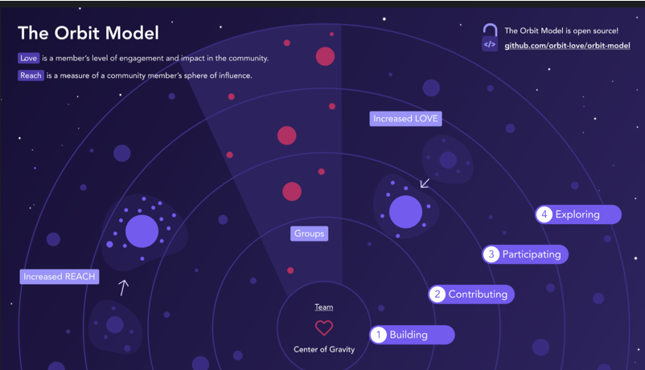
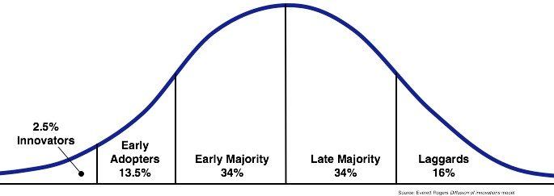

커리어에서 세 번째 디자인 시스템을 만들고 있다. 그중 한 번은 처음부터 만들었고 두 번은 기존 시스템 위에서 재개발했다. 이 세 번의 과정에서 중요한 것과 그렇지 않은 것을 알게 됐고 그 과정 속에서 겪은 여러 어려움을 글로 정리했다.

- [만들기 전에](#만들기-전에)
  - [목표](#목표)
    - [확장성을 추구한다면](#확장성을-추구한다면)
  - [중요한 것은 퀄리티](#중요한-것은-퀄리티)
  - [대원칙 만들기](#대원칙-만들기)
- [만드는 중에](#만드는-중에)
  - [대원칙 수호하기](#대원칙-수호하기)
  - [코드는 기본이다](#코드는-기본이다)
    - [이미 알고 있을 것](#이미-알고-있을-것)
    - [구현 가능성에 발목 잡히지 않을 것](#구현-가능성에-발목-잡히지-않을-것)
    - [지속 가능성을 추구할 것](#지속-가능성을-추구할-것)
  - [정의가 전부다](#정의가-전부다)
    - [정의가 부족하다면](#정의가-부족하다면)
    - [정의가 충분하다면](#정의가-충분하다면)
  - [하나만 선택해야 한다면, 테스트 코드](#하나만-선택해야-한다면-테스트-코드)
    - [동작과 스타일을 따로 접근하기](#동작과-스타일을-따로-접근하기)
    - [참고자료](#참고자료)
    - [테스트 코드의 본질 지키기](#테스트-코드의-본질-지키기)
  - [여유시간 확보하기](#여유시간-확보하기)
- [만들고 나서](#만들고-나서)
  - [피드백 빨리 받기](#피드백-빨리-받기)
    - [1. 지원자 포섭하기](#1-지원자-포섭하기)
    - [2. 얼리어답터를 팬으로 만들기](#2-얼리어답터를-팬으로-만들기)
    - [3. 처음이 가장 중요하고, 힘들다](#3-처음이-가장-중요하고-힘들다)
  - [해야 할 것과 하지 않을 것 구분하기](#해야-할-것과-하지-않을-것-구분하기)
- [부록](#부록)
  - [그래서 어떻게 시작해야 할까?](#그래서-어떻게-시작해야-할까)
  - [프로덕트 시스템](#프로덕트-시스템)
    - [프로덕트 시스템과 컴포넌트 계층](#프로덕트-시스템과-컴포넌트-계층)
- [끝으로](#끝으로)

## 만들기 전에

가장 첫 단계인 ‘만들기 전’ 단계는 전체 과정 중 가장 중요한 단계이다. 만드는 과정과 이후 운영 단계에서 마주하는 의사결정의 토대를 잡고 방향성을 설정해야 하기 때문이다.

디자인 시스템에서 무엇부터 해야 하냐고 질문받는다면 “목표 잡기, 달성할 것과 달성하지 않을 것 명확히 하기”라고 답할 것이다.

### 목표

디자인 시스템은 제품의 일관성, 효율성이라는 가치를 달성하기 위해 만들어진다.

하지만 시스템을 필요로 하는 제품에 따라 세부적인 목표가 달라져야 한다. 시스템의 강제성을 높여 깨질 수 없는 일관성과 높은 생산성을 추구할 수도 있고, 시스템을 재료로 바라보고 높은 확장성과 자유도를 추구할 수도 있다.

만들고자 하는 시스템의 철학과 목표는 앞으로 쌓아나갈 **결정**의 토대가 된다. 외부 디자인 시스템을 사용하더라도 우리 팀에 맞는 디자인 시스템이 무엇인지 정해야 한다.

#### 확장성을 추구한다면

높은 확장성과 자유도를 추구하는 디자인 시스템은 일관성이라는 책임을 사용처에 일부 위임하는 형태이기 때문에 디자인 시스템 레이어 그 이상을 목표로 잡아야 한다.

- 디자인 시스템 계층
- 프로덕트 시스템 계층

위와 같이 제품의 컴포넌트 레이어를 최소 두 가지 이상으로 바라보고, 사용처에서 프로덕트 시스템을 구축하기 위한 지원도 고려해야 한다.

보통 디자인 시스템 팀을 만드는 조직은 제품 조직에 비해 규모가 작기 때문에 모든 레이어를 디자인 시스템 팀에서 주도하기 어렵다. 오히려 제품 개발 속도를 늦출 수 있다. 때문에 디자인 시스템 층은 프로덕트 시스템 계층이 만들어질 수 있도록 커뮤니티를 지원하거나 가이드 하는 것을 중요한 미션 중 하나로 여겨야 한다.

### 중요한 것은 퀄리티

시스템을 만드는 팀 밖의 제품을 만드는 디자이너와 개발자는 디자인 시스템을 왜 사용해야 할까?

사용자는 아무 제품이나 사용하지 않는다. 제품이 ‘잘’ 만들어졌다고 무조건 사용하지 않는다. 제품에서 가치를 느끼고 사용자가 먼저 찾도록 해야 한다.

디자인 시스템도 제품이다. 일반적인 제품과 다른 점은 사용자가 두 그룹이라는 것인데, 하나는 제품을 사용하는 사용자이고 다른 하나는 그 제품을 만드는 팀원이다.

팀원이 먼저 찾는 디자인 시스템이 되려면 **디자인 시스템 자체가 압도적인 만족감**을 주어야 한다. 높은 수준의 UI/UX를 제공해서 제품에 적용하고 싶어야 하고, 시스템을 확장할 때 방해하지 않아야 한다.

팀원이 디자인 시스템을 적극적으로 사용할 때, 시스템과 제품 모두 빠르게 성숙할 수 있다. 이렇게 사용자를 팬으로 만드는 과정은 이후에 다룰 ‘얼리어답터 확보’에서도 유리하다.

### 대원칙 만들기

목표와 철학이 정해졌다면, 이를 바탕으로 시스템 의사결정의 핵심 원칙을 세워야 한다.

디자인 시스템이 무엇을 할 것이고 무엇을 하지 않을 것인지, 코드 인터페이스는 디자인 제약사항을 어떻게 반영할 것인지 가능한 구체적으로 구상하고 문서화해야 한다.

철학이라는 추상 구현체는 다양한 문제 상황을 그대로 해결하기엔 부족하다. 목표와 철학을 기반으로 원칙을 세우고 문제상황을 해결하며 이를 구체화 해나가야 한다.

## 만드는 중에

### 대원칙 수호하기

나무를 신경 쓰다 보면 숲을 놓치기 쉽다. 시스템을 만들면서 여러 결정을 하게 될 텐데, 이 결정들이 팀에서 합의한 방향성에 어긋나지 않아야 한다.

인터페이스 네이밍부터 크게는 컴포넌트 단위에서 일관된 추상화 레벨을 지향하는지, 접근성과 같은 기본 책임을 충분히 수행하고 있는지 등을 고민해야 한다.

대원칙에 기반한 결정도 연습이 필요하다. 처음엔 의식적인 노력이 필요하고, 결정을 번복하는 일이 생길 수도 있다. 하지만, 팀 레벨에서 의사결정에 대한 연습이 충분히 이뤄진다면 이후에는 큰 노력을 들이지 않아도 자연스레 원칙을 깨지 않는 결정을 내릴 수 있을 것이다. 어떤 경우는 원칙을 깨는 것도 필요한데, 그 비용에 가치가 있다면 괜찮다.

### 코드는 기본이다

좋은 코드나 설계에 대해 너무 많은 시간을 뺏기지 않아야 한다. 디자인 시스템은 의사결정의 연속이다. 모든 제품이 그렇듯 잘못된 의사결정 위에 아름다운 코드를 쌓는 것은 무의미하다.

#### 이미 알고 있을 것

좋은 시스템을 위한 의사결정은 개인에게만 기댈 수 없다. 직무에 관계없이 모두가 디자인 감수성이 높아야 하고, 집요하게 ux 퀄리티를 추구해야 한다.

의도적으로 다양한 서비스를 사용해 보고 다양한 오픈소스 디자인 시스템의 결정을 학습해야 한다. 오픈소스 디자인 시스템을 뜯어보는 과정은 가성비가 좋은 학습인데, 컴포넌트 분류 체계나 인터페이스 설계에 대한 직접적인 힌트를 얻을 수 있고 구현을 살펴보며 좋은 코드 작성에 대한 배움도 얻을 수 있다.

#### 구현 가능성에 발목 잡히지 않을 것

코드가 기본인 다른 이유는 구현 가능 여부를 넘어 구현 가치에 대한 의사결정 순간을 계속해서 마주하기 때문이다. 좋은 결정에 대해 고민하기 위해서는 구현 가능성 판단에 손발이 묶이지 않아야 한다.

#### 지속 가능성을 추구할 것

시스템은 선택되는 순간 제품보다 수명이 길어진다. 그렇기 때문에 지속 가능성을 고려해야 한다.

시스템을 만든다면 [“The Rise of Worse is Better”](https://www.dreamsongs.com/RiseOfWorseIsBetter.html)에서 다루는 *the right thing*, *worse is better* 두 가지 관점 모두를 취해야 한다.

일관된 인터페이스에서 단순하게 구현한다. 일관된 인터페이스는 기능을 예측할 수 있게 하며 단순한 구현은 다른 개발자가 시스템 코드를 쉽게 파악할 수 있게 한다. 이것은 시스템에 기여할 수 있는 기반을 만든다. 시스템은 계속 유지 보수되어야 하고 확장 가능해야 하며 누구나 기여할 수 있어야 한다.

단순함을 추구하되 사용성을 위한 복잡도는 취해야 한다. 대략적인 감으로 코드 복잡도가 100만큼 증가한다면 이로 인한 사용성 개선이 80 이상이어야 한다. 컴포넌트의 인터페이스와 ui/ux 완전성 관점에서 예시를 들어보자면 아래와 같다.

- **인터페이스:** 구현의 단순함보다 인터페이스의 단순함이 중요하다. 올바르게 동작하지 않는 경우를 제외하고 인터페이스 일관성을 추구한다
- **완전성:** 내부 구현의 복잡함 대비 얻는 완전성의 가치가 크지 않다면 타협해야 한다. 단순함을 중요한 가치로 바라본다.

복잡도 부채(Code Complexity Debt)와 사용성 부채(Usability Debt)는 트레이드오프 관계다. 끊임없이 주어지는 문제 상황에 올바른 가치판단을 해야 한다. 디자인 시스템은 의사결정이 전부다. 구현 능력은 중요한 것을 지탱하는 기초체력 같은 것이다.

### 정의가 전부다

시작하기 전 디자인 시스템의 목표를 설정한 것처럼 만드는 중에는 각 컴포넌트의 목표를 정의해야 한다. 디자인 시스템에서 목표와 목표가 아닌 것을 구분했듯 컴포넌트에도 동일한 과정이 필요하다.

예를 들어 Modal, Popover 컴포넌트가 존재한다고 가정해 보자.

#### 정의가 부족하다면

컴포넌트 디자인 가이드를 합의된 정의라고 오해한다.

**개발자:**

- `Modal`은 화면 중앙에 다른 요소를 덮으면서 뜨니 개발자는 그렇게 개발한다.
- `Popover`는 버튼과 함께 그려져 있고 텍스트만 있다. 그래도 유연해야 하니 버튼이 아닌 다른 요소를 넣을 수 있게 하고, 컨텐츠 부분은 `children`으로 정의한다.

**디자이너:**

- `Modal`을 그저 화면 정중앙에 그려두었을 뿐이다.
- `Popover`는 간단한 설명만 보여줬으면 좋겠다. 너무 다양한 컨텐츠는 복잡해보인다. 디자인 시안에 텍스트만 넣어두었으니 텍스트만 사용할 수 있다고 생각한다.

이런 상황에서 어느 날 아래와 같은 요구사항이 들어왔다고 생각해보자.

> Modal이 버튼을 눌렀을 때 버튼 기준으로 위치가 설정돼서 뜰 수 있는 옵션을 추가해 주세요. 지금은 무조건 화면 정중앙에 떠서 위치를 커스텀 하려면 비용이 많이 들어요.

디자이너는 `Popover`가 텍스트만 올 수 있다고 생각했기 때문에, 개발자에게 `Modal`에 옵션을 추가해달라고 요청한다. Modal에는 ‘버튼을 눌렀을 때 버튼 기준’으로 판단할 수 있는 정보가 없기 때문에 이 스펙을 대응하기 위해서는 아래와 같은 prop이 추가되어야 한다.

```jsx
<Modal
  trigger={<Button>버튼</Button>}
/>
```

`trigger`만 추가되면 모달의 위치에 대한 의도가 불분명하기 때문에, mode를 추가하여 정중앙인지 trigger기준으로 위치를 잡아야 하는지 의도를 드러낸다.

```jsx
<Modal
  trigger={<Button>버튼</Button>}
  mode="trigger"
/>
```

이 기능은 `Popover`의 기본동작과 동일하다. 심지어 구현은 더 복잡할 수도 있다. 똑같은 기능을 두 가지 컴포넌트에 구현하는 것은 리소스 낭비이고 동시에 사용자에게도 혼란을 줄 수 있다.

사용자는 기능에 대한 최초인지를 ‘화면을 덮으면서 뜨는 것에서 위치를 커스텀 한다.’라고 한다면 Modal을 떠올릴 것이고 ‘Trigger 기준으로 컨텐츠가 표현되어야 한다.’라면 Popover를 떠올릴것이다.

요구사항을 받게 된 이유도, 문제 해결이 복잡해진 이유도 **컴포넌트의 책임이 명확하게 정의되어 있지 않아서다.**

#### 정의가 충분하다면

간격, 컬러 등에 대한 디자인 가이드 외에 비슷해 보이는 컴포넌트들의 책임과 사용례를 먼저 생각한다.

- `Modal`
  - 의도적으로 맥락을 끊어 제공
  - 모달을 닫기 전 까지 페이지와 상호작용 불가
- `Popover & Tooltip`
  - 진입 트리거와 맥락을 이어나가야 하는 경우
  - 트리거의 보충 정보를 제공하며 내용과 관련한 액션 가능
  - Tooltip: 짧고 간결한 정보 전달(텍스트 권장) / Popover: 추가 정보 및 액션 요청 시에 사용 (컴포넌트 내에서 페이지 전환 불가)

> Modal이 버튼을 눌렀을 때 버튼 기준으로 위치가 설정돼서 뜰 수 있는 옵션을 추가해주세요. 지금은 무조건 화면 정중앙에 떠서 위치를 커스텀하려면 비용이 많이 들어요.

정의가 충분하면 위와 같은 요구사항이 들어왔을 때, `Popover` 컴포넌트로 바로 안내할 수 있고 컴포넌트가 불필요한 구현 복잡도를 가지는 결정을 사전에 차단할 수 있다.

### 하나만 선택해야 한다면, 테스트 코드

올바른 정의로 세워진 컴포넌트라고 하더라도, 디자인 시스템의 기본적인 책임은 핵심 기능의 안전한 보장과 장기적인 유지 보수 가능성이다. 그리고 이 두 가지는 테스트 코드라고 하는 최소한의 안전장치로 보장되어야 한다.

테스트 코드의 가장 큰 가치는 ‘지금 당연한 것을 미래에도 기계적으로 당연하게 보장해 주는 것’이다. 깨져야 할 때 깨지는 테스트는 제품을 지켜주는 훌륭한 장치다. 디자인 시스템을 계속 유지 보수 하는 개발자 관점에서는 아주 당연하고, 궁극적으로 디자인 시스템이 발전되어야 하는 방향에서도 꼭 필요한 요소다. 이 글에서는 ‘디자인 시스템이 발전되어야 하는 방향’에서의 중요성에 대해 이야기해보려 한다.

테스트 코드는 그 중요성에도 불구하고, 종종 후순위가 된다. 때로는 테스트 코드 작성은 너무 비효율적이고 스토리북에서 수동으로 검증하는 것이 더 효율적이라고 생각할 수 있다. 그러나 나는 더 중요하다고 생각되는 것 — 인터페이스가 아닌 구현의 아름다움 같은 것 — 을 포기하더라도 테스트 코드만은 지키라고 말하고 싶다.

디자인 시스템을 포함하여 모든 라이브러리는 결국 생태계가 구축되지 않으면 발전의 한계를 마주하게 된다. 앞서 언급한 것처럼 대부분의 조직에서 라이브러리를 유지보수 하는 팀은 사용자에 비해 절대적 소수이기 때문이다.


<small style="opacity: 0.5;">https://github.com/orbit-love/orbit-model/blob/main/orbit_model_color.png</small>

라이브러리를 만드는 팀에서 기대하는 이상적인 상황은 **핵심 기능에 대한 개선을 팀에서 주도하면서 사용자로부터 기여 받으며 함께 성장해 나가는 것이다.**

서두가 길었지만, 결국 핵심은 테스트 코드가 없다면 직접적인 코드 기여는 절대 기대할 수 없다는 말을 하고 싶었다. (테스트 코드 없는 오픈소스에 선뜻 기여할 수 있을까?)

테스트 코드는 단기적으로 일감 하나가 늘어난 것처럼 보일지라도, 시스템의 안정성과 기여에 대한 진입장벽을 낮춰주는 가성비 좋은 장치다. 이 글은 코드에 대해 자세히 다루지 않기 때문에 테스트 코드를 어떻게 작성해야 하는지 구체적으로 언급하지 않겠지만 도움이 되었던 몇 가지를 소개한다.

#### 동작과 스타일을 따로 접근하기

디자인 시스템의 핵심 기능은 동작과 스타일이다. 그중 동작에 관한 부분은 [react-testing-library](https://testing-library.com/)(이하 rtl)를 사용하고, 스타일링에 대한 검증은 [playwright의 이미지 테스트](https://playwright.dev/docs/test-snapshots)를 활용하고 있다. (스타일 테스트 도구로 [chromatic](https://www.chromatic.com/)이라는 도구도 좋을 것 같지만 구축과 관련된 여러 이유로 사용하지 않았다.)

스타일링은 시각적인 요소다. rtl과 같은 도구로 접근하게 되면 결과를 예측하기 어렵고, 테스트 코드가 장황해진다. 시각적인 요소는 시각적인 접근이 필요하다는 생각으로 분리하여 접근했고, 현재는 이 접근이 유효하다고 생각한다. 다만 방법에 있어서 ‘playwright 이미지 테스트가 최선일까’하는 고민은 여전히 가지고 있는데, 좀 더 경험을 쌓고 별도의 글로 다뤄보려고 한다.

#### 참고자료

디자인 시스템 테스트 대한 접근은 유저 서비스에 비해 쉽다. 유저 상태나 api mocking을 고려하지 않아도 되고, 접근성만 잘 준수하면 rtl을 통해 요소를 쉽게 선택하고 검증할 수 있다. 모든 상황을 일반화하여 테스트할 수 있다.

무엇을 어떻게 테스트할지에 대한 접근도 여러 오픈소스의 도움을 받을 수 있다. [primer](https://primer.style/), [ark ui](https://ark-ui.com/), [mui](https://mui.com/), [react-spectrum](https://react-spectrum.adobe.com/react-spectrum/index.html) 등 여러 오픈소스에서 테스트와 구현에 대한 인사이트를 많이 얻었다.

#### 테스트 코드의 본질 지키기

테스트 코드는 어디까지나 제품을 돕는 수단이다. 코드 복잡도와 ux 퀄리티의 가치를 고려하듯, 테스트 코드 역시 들이는 비용 대비 가치가 적절할 때 의미 있는 것이다.

테스트 코드에도 유닛/통합/E2E 테스트 등 여러 단계가 존재하는데, 시간이라는 비용 면에서 가치 있는 수준이 어디까지인지 판단하고 적용해야 한다.

마지막으로, 테스트는 모든 버그로부터 지켜주지 않는다. 관련 글로, Jbee 님의 [테스트에 대한 오해와 사실](https://www.jbee.io/articles/developments/%ED%85%8C%EC%8A%A4%ED%8A%B8%EC%97%90%20%EB%8C%80%ED%95%9C%20%EC%98%A4%ED%95%B4%EC%99%80%20%EC%82%AC%EC%8B%A4) 글을 읽어보는 것을 추천한다.

### 여유시간 확보하기

만드는 과정에서 마지막으로 다룰 부분은 여유시간에 관한 것이다. 여유시간이란 팀 사이클에서 하루 정도 본래의 사이클에서 벗어나 우선순위 높은 백로그를 구현하거나 자동화된 테스트를 보강하는 등, 기술부채를 청산하는 시간을 의미한다.

역설적이게도 팀이 바쁠 수록 이 시간을 지켜야 한다. 빠르게 달려야 하는 상황에서 하루의 시간이 부담될 수 있겠지만, 빠르게 달리는 속도만큼 쌓이는 기술부채와 백로그는 ‘나중에’ 열어보면 감당하기 불가능해진다. 팀에서 관리하게 되는 컴포넌트와 문제가 많아질수록 여유시간을 활용한 해결 방식은 장기적으로 더 빠르게, 많은 문제를 해결해 줄 수 있을 것이다.

## 만들고 나서

디자인 시스템도 하나의 제품이고, 모든 제품이 그렇듯 계속 개선해 나가는 과정에 있다면 ‘다 만들었다.’의 상태는 존재하지 않는다. 이 단락의 제목을 ‘만들고 나서’라고 잡았지만 정확한 의미는 ‘**어느 정도** 만들고 나서’이다.

이 ‘어느 정도’의 수준과 이 단계에 접어들 때 어떤 문제를 마주했고 해결해나가는 중인지 적어봤다.

### 피드백 빨리 받기

디자인 시스템을 새롭게 구축하거나 재개발한다면, 언제 다른 팀에 준비되었다고 말할 수 있을지 기준을 잡아야 한다.

핵심은 **늦지 않아야 한다는 것**이다. 아무리 테스트 코드를 작성하고 팀 내에서 정교하게 테스트하더라도 실제 적용 단계에서 반드시 크고작은 문제를 마주한다. 피드백이 늦어질수록 중요한 문제를 늦게 발견하게 되고 해결 비용이 비싸진다.

서비스 기여가 어렵지 않다면 간단한 로그인 페이지나 서비스에 직접 적용해 본 이후를 잡아도 좋다. 개밥 먹기(Dog fooding)만큼 확실한 검증은 없다.

서비스 기여가 어렵다면 시스템의 핵심이 되는 Button, Checkbox, Dropdown이 준비되고 이 핵심 컴포넌트를 활용한 다른 컴포넌트를 두어 개 만들어본 시점부터 실 서비스 적용을 독려하고 피드백을 받아야 한다.

#### 1. 지원자 포섭하기

처음 만든 시스템은 약하다. 좋은 ui/ux/api 라는 무기를 가지고 있어도 오랫동안 사용되었다는 유산(Legacy)의 존재를 한번에 이길 수 없다.

제품팀에서 새로운 시스템을 적용하는 것은 큰 부담이다. 도입을 꺼려 하는 것이 당연한 현상임을 이해하고 공감해야 한다. (‘고생해서 만들었는데…왜 안쓰지’ 속상해했던 경험이 있는데, 멘탈 관리에 별로 도움이 되지 않았다.)


<small style="opacity: 0.5;">Rogers' Diffusion of Innovation Curve (after Rogers 1995)</small>

어떤 제품이던 시장에 전달될 때 고객은 위와 같은 패턴을 가진다. (이 글에서는 편의상 이노베이터와 얼리어답터를 모두 ‘얼리어답터’라고 칭한다.)

얼리어답터 고객들은 여러분의 제품을 기꺼이 다른 고객(Majority)에게 전파할 힘이 있다. 뜻이 맞는 얼리어답터 고객들을 제품 개발에 참여시키고 그들의 의견을 제품에 적극적으로 반영해야 한다. 제품 개선과 세일즈 영역에서 빠르게 앞서나갈 수 있다.<br />
<small style="opacity: 0.5;"><a href="https://fromundefined.com/posts/2024-02-uxs-working-culture/" target="_blank">참고자료: fromundefined/2024-02-uxs-working-culture/</a></small>

그래서, 새로운 디자인 시스템 전파에서 **얼리어답터를 얼마나 빠르게 많이 확보하는지가 핵심이다.**

단순히 메신저 공지, 독려에서 그치지 말고 계속 권하고 적극적으로 포섭해야 한다.

내 경험을 예시로 들자면, 레거시 시스템 컴포넌트에 대한 문의가 들어왔을 때 새로운 시스템 컴포넌트의 개선점을 같이 전달하고 사용을 권유했다. 감사하게도 한두 분 관심을 보여주셨고 오프라인 미팅을 잡아 새로운 시스템의 장점을 어필하며 작은 부분에서 도입이 시작될 수 있게 했다.

#### 2. 얼리어답터를 팬으로 만들기

얼리어답터를 포섭하는 것의 목적은 단순히 시스템의 빠른 피드백뿐 아니라 스스로 바이럴을 자처할 만큼 팬이되어 더 많은 고객을 유치해 내는 것까지이다.

**새로운 시스템은 약하고, 낯설다.** 사용법이나 버그 제보 등 많은 문의를 받게 될 텐데, 이때 사용자와 같은 시각에서 진정으로 문제 해결을 도와서 감동을 전달해야 한다. 문의 대응의 속도와 퀄리티 모두 압도적이어야 한다.

실제로 첫 사용자의 문의 대응은 업무 중 무조건 인터럽트로 대응했고, 서비스 환경의 문제라면 직접 실행해보고 분석하며 제보된 문제에서 연결되는 개발/디자인 배경을 자세하게 파악하여 전달했다. (어떤 버그 현상의 원인이 emotion 라이브러리와 관련 있었는데, 주변 배경까지 전부 정리해서 전달했다.)

첫 사용자가 제품에 새로운 시스템을 적용하고 성공 사례를 팀에 소개하며 새로운 시스템을 우려하던 개발자들로부터 ’써볼만 하겠다.‘ 라는 이야기를 들을 수 있었다.

#### 3. 처음이 가장 중요하고, 힘들다

첫 사용자가 생기고 유저가 하나 둘 늘어나다 보면 어느 순간 ‘운영 대응 rush’를 마주한다.

신규 컴포넌트 개발과 운영 대응 그리고 버그 픽스까지 감당해야 한다. 해야 하는 일은 늘었고 시간은 절대적이니 무언가의 비중을 줄여야 한다. (시간을 더 써서 모두 다 같은 강도로 잘하겠다는 것은 욕심이다. 팀 규모가 같다면 절대 지속 가능하지 않다.)

이때 무엇의 비중을 낮추어야 하는가 하면, 당연히 신규 컴포넌트 개발이다. **초반 문의 rush는 기회다.** 미성숙한 시스템이 가파른 기울기로 성장할 수 있는 시기이며, 얼리어답터가 되어준 개발자들의 신뢰를 얻어야만 하는 기간이다.

이 기간은 길지 않다. 집중해서 대응하고 체계를 잡는다면 rush는 1 - 2주 내외로 끝낼 수 있다. 쏟아지는 문의에 멘탈을 잃지 말고 처음에 세웠던 원칙하에 의사결정하고 가능하다면 문제 해결이 특정 팀원의 개인기가 되지 않도록 기록을 남기자.

보통 버튼으로 시작한다. 활용도도 가장 높고 여러 컴포넌트의 재료가 되기 때문일 것이다. 버튼이 첫 시작으로 적절하지만 그렇다고 난이도가 쉬운 컴포넌트는 아니다. 난이도에 비해 생김새가 단순한 탓인지 복잡도가 과소평가 된다.

디자인 시스템을 새로 만든 상황이라면 컴포넌트 세트를 완성하고 서비스에 적용해 보면서 ‘지속 개선’의 관점으로 접근할 수 있지만 신규 시스템으로 마이그레이션 해야 하는 상황이라면 여러 컴포넌트에서 쓰이고 있는 그야말로 ‘빽빽한 고구마 줄기를 가진 컴포넌트’다.

재료가 되는 컴포넌트는 어렵다. 쉬워 보이지만 결코 그렇지 않다. 그래서 처음이 가장 중요하고 힘들다.

### 해야 할 것과 하지 않을 것 구분하기

새로운 시스템이 전파되고 사용자가 늘어나기 시작하면 자연스레 요청이 많아진다. 반드시 해결해야 하는 버그 외에도 편의성을 위한 개선이나 더 많은 정보를 담은 문서화 등에 대한 요구도 늘어난다. 얼리어답터만 사용하는 단계를 넘어 시스템이 자리 잡아가는 단계다.

‘얼리어답터를 팬으로 만들기’단락에서 문의 대응의 속도와 퀄리티 모두 압도적이어야 한다고 했지만, 이 단계에서의 전략은 달라야 한다. 쏟아지는 요구사항을 모두 대응할 수 없을뿐더러, 작아 보이는 요구사항이라도 하나씩 대응하다 보면 정작 중요한 일이 뒤처질 수 있기 때문이다. 우선순위 판단은 어느 상황에서나 중요하지만 디자인 시스템이 이제 막 자리잡아 가는 단계에서는 더욱 중요하다.

하면 좋을 일들은 과감히 패스하고, 뭉툭하지만 적은 비용으로 해결할 수 있는 일들은 그렇게 해결하는 것도 하나의 방법이다.

몇 가지 요청의 예시와 각 요청별 내가 대응한 방향을 살펴보자면,

- (기능 요청) “Combobox 컴포넌트에서 검색어 하이라이팅이 지원되었으면 좋겠어요”
- (기능 요청) “Dropdown 컨텐츠 내부에 위치한 검색 인풋에서도 아이템 탐색 키보드 액션이 지원되었으면 좋겠어요”
- (기능 요청) “디자인 handoff가 좀 더 자동화되면 좋겠어요.”
- (문서) “오픈소스 라이브러리처럼 prop에 대한 자세한 설명과 풍부한 예시가 있었으면 좋겠어요”

**1. (기능 요청) Combobox 컴포넌트에서 검색어 하이라이팅이 지원되었으면 좋겠어요**

<span style="style="border-color: rgb(55, 53, 47);border-bottom: 0.05em solid;">하지 않는다.</span>

Combobox 컴포넌트에서 정의한 기본기능 범위를 넘어서는 기능이다. 기본 기능으로의 제공도 고려해 볼 수 있지만, 컴포넌트를 쌓아나가는 단계에서 이미 완료한 컴포넌트의 기본기능 정의를 다시 논의하는 것은 단계에 맞지 않는 일이다.

시스템에서 제공하는 기능은 충분히 일반적이며 ux와 dx 모두를 고려한 의사결정이어야 한다. 팀이 집중하고 있는 작업의 흐름을 깰 만큼 중요한 기능이 아니라고 생각된다면 제공하지 않는다. 확장성을 고려한 개발이 중요한 이유다. 모든 기능을 제공할 수 없다. 부가적인 기능이 필요하다면 사용처에서 만들어 쓸 수 있어야 한다.

**2. (기능 요청) Dropdown 컨텐츠 내부에 위치한 검색 인풋에서도 아이템 탐색 키보드 액션이 지원되었으면 좋겠어요**

<span style="style="border-color: rgb(55, 53, 47);border-bottom: 0.05em solid;">한다.</span>

일반적인 기능 범주이고, 아이템 탐색 키보드 접근성은 Dropdown 컴포넌트의 기본기능이기 때문에 지원해야 한다.

다음으로 이 작업을 **‘언제’**할 지 결정해야 한다. 하기로 결정했으니 개발자가 적당히 여유 있을 때 진행하는 것도 방법이겠지만, 관련된 사람이 많아질수록 달리는 기차에서 바퀴를 개선하는 과정을 알아서 하라고 위임하는 것은 비효율적이다. (컨텍스트 스위칭도 비용이다.)

이렇게 중간 정도의 우선순위를 가지면서 해결해야 하는 문제를 ‘만드는 중에’ 단락에서 언급한 여유시간을 활용해 해결하는 것을 추천한다.

**3. (기능 요청) 디자인 handoff가 좀 더 자동화되면 좋겠어요.**

<span style="style="border-color: rgb(55, 53, 47);border-bottom: 0.05em solid;">하지 않는다.</span>

‘기본’을 다 하지 않은 상태에서 부가기능을 손대는 것은 욕심이다. 제품 조직의 생산성에 기여해야 하는 플랫폼 팀 입장에서 무언가 하지 않는다라는 결정이 어렵겠지만, 하지 않을 일을 정의해야 할 일을 제대로 제시간에 해낼 수 있다.

때로는 훌륭한 엔지니어링과 우아하고 높은 비용의 해결책이 아닌, 투박하고 저렴한 비용의 해결책을 선택한다. 현재 단계에서는 이런 자동화 요청이 투박한 해결책이 필요한 문제였다.

**4. (문서) 오픈소스 라이브러리처럼 prop에 대한 자세한 설명과 풍부한 예시가 있었으면 좋겠어요**

<span style="style="border-color: rgb(55, 53, 47);border-bottom: 0.05em solid;">하지 않는다.</span>

문서는 생태계를 구성하는 매우 중요한 요소이다. 심미적으로 아름다워야 하고, 원하는 정보를 빠르게 얻을 수 있도록 시간을 투자해야 한다.

하지만 컴포넌트 완성도라는 본질이 먼저다. 팀이 현재 어느 영역까지 집중할 수 있는지를 판단하고 본질을 지켜나가는 일 말고 다른 맥락을 다룰 수 없다면 뭉툭하게 해결해야 한다.

현재는 문서화에 추가적인 투자가 어려워 [control](https://storybook.js.org/docs/api/doc-block-controls) 을 사용하여 [스토리북](https://storybook.js.org/)으로만 제공하고 있다.

---

하지 않는다는 결정은 해야 한다는 결정보다 어렵다. 대부분의 문제는 시간을 들이면 해결 가능해서 엔지니어로서 욕심이 날 때도 있다. 그러나 ‘할 수 있다’와 ‘적은 비용으로 할 수 있다’의 차이를 명확히 인지해야 한다. 팀 차원에서도 ‘우리 팀이 다루는 맥락을 지금보다 더 늘릴 수 있는지’ 관점에서 판단해야 한다.

## 부록

### 그래서 어떻게 시작해야 할까?

목표를 설정하고 컴포넌트 정의가 중요하다는 이야기를 했다. 그렇다면 이런 아웃풋(output)을 만들기 위해 어떤 인풋(input)이 필요할까?

이미 만들어진 디자인 시스템들을 살펴보면서 어떤 기준으로 컴포넌트를 나눴는지, 확장성을 어떻게 가져가는지 등을 살펴보며 의사결정의 토대를 잡는 것이 좋은 출발이 될 수 있다. 아래는 내가 참고하는 라이브러리 목록인데, headless 라이브러리도 있고 스타일을 참고하거나 두어 개 컴포넌트를 구현 방식을 참고하기 위한 것도 있다.

- [radix-ui](https://www.radix-ui.com/)
- [ark-ui](https://ark-ui.com/)
- [react-spectrum](https://react-spectrum.adobe.com/)
- [ariakit](https://ariakit.org/)
- [primer/react](https://primer.style/react/)
- [mantine](https://mantine.dev/)
- [chakra-ui](https://chakra-ui.com/)
- [next-ui](https://nextui.org/)
- [shadcn/ui](https://ui.shadcn.com/)
- [intergalactic](https://developer.semrush.com/intergalactic/)

### 프로덕트 시스템

디자인 시스템 목표 설정 단계에서 확장성을 낮추고 통일성을 높이는 것으로 잡았다고 해도, 제품이 여러 도메인을 가지고 있다면 디자인 시스템만으로는 전부 대응할 수 없다.

예를 들어 커머스 도메인에서는 상품을 보여주고 시각적으로 정보를 전달하기 위해 반복되는 패턴이 존재할 것이다. 커머스 맥락에서 통일성이 반드시 필요한데, 이것을 어떻게 시스템화할지는 저마다 의견이 다를 것이다. 특정 도메인 역시 제품의 일부라는 관점에서 디자인 시스템으로 편입해야 한다는 의견도 있을 것이고, 디자인 시스템은 공통 레벨의 재료가 되기 위해 도메인에 묶이지 않아야 한다는 의견도 있을 것이다.

정답은 없겠지만, 내 대답은 **‘프로덕트 시스템’**이다.

#### 프로덕트 시스템과 컴포넌트 계층

제품을 이루는 컴포넌트는 크게 네 가지로 나눌 수 있다.

- 도메인 컴포넌트의 조합으로 구성된 컴포넌트: **사용성** >>> 확장성
  - 도메인 컴포넌트를 조합해서 제공하는 영역
- 도메인 컴포넌트: **사용성** > 확장성
  - 도메인 맥락을 담고 있는 영역. 도메인 맥락을 알고 있더라도 여러 서비스에 사용될 수 있다.
- 프로덕트 시스템 컴포넌트: 사용성 < **확장성**
  - 디자인 시스템을 제품에 맞게 한 단계 추상화를 낮춰서 제공
- 디자인 시스템 컴포넌트: 사용성 <<< **확장성**
  - 확장성을 높여 커스텀에 용이한 레이어

도메인 컴포넌트 조합 레이어로 갈수록 확장성은 낮아지고, 단순한 API를 통해 통일성 및 메이커 사용성이 높아진다. 예시로 들었던 커머스 맥락의 컴포넌트를 디자인 시스템 레벨로 바라본다면, 하나의 시스템에서 두 가지 이상의 메시지를 전달하게 된다.

시스템 사용자인 메이커는 복잡한 메시지를 이해하려고 하지 않는다. 공통 요소를 다루기 위해 높은 추상화를 가진 컴포넌트와 그렇지 않은 컴포넌트를 하나의 시스템으로 인지하고 디자인 시스템이 모든 것을 다룰 수 있다고 이해할 수 있다.

위와 같은 이해에서 크게 두 가지 문제가 발생할 수 있다.

1. 디자인 시스템이 항상 도메인 변경을 구독해야 함
2. 다루는 도메인이 늘어날수록 제품팀의 블로커가 됨

디자인 시스템을 다루는 팀(이하 ‘디자인 플랫폼’)의 규모가 커서 프로덕트 시스템, 도메인 시스템에 필요한 변경을 모두 따라갈 수 있다면 문제가 아니겠지만 공통 레벨의 디자인 시스템을 다룰 수 있는 규모라면 제품팀의 빠른 호흡을 계속 따라갈 수 없다. 시스템에 대한 학습이 부족한 단계에서는 디자인 플랫폼 팀에서 프로덕트 시스템의 설계를 잡아가더라도, 최종적으로 제품 조직에서 더 주도권을 가지고 만들어야 하는 영역이다. 제품과 그것을 반영하는 컴포넌트의 거리가 멀어질수록 응집도는 낮아지고 결합도는 높아진다.

## 끝으로

세 번째 디자인 시스템을 만들면서, 지난날의 결정들은 종종 어리숙하고 아쉬웠음을 인지하게 됐다.

모든 제품이 그렇듯 디자인 시스템도 시스템을 쌓아가는 의사결정이 가장 중요하다. 잘못된 의사결정 위에서는 잘못된 코드가 존재한다.

이 글이 디자인 시스템을 만들어가는 과정을 담았지만, 이미 수많은 시행착오를 거친 오픈소스 디자인 시스템을 선택하는 것도 훌륭한 답이라고 생각한다. 오픈소스 디자인 시스템 위에서 시스템을 만들어간 [인프런의 사례](https://tech.inflab.com/20240224-design-system/)를 소개하며 글을 마무리한다.
