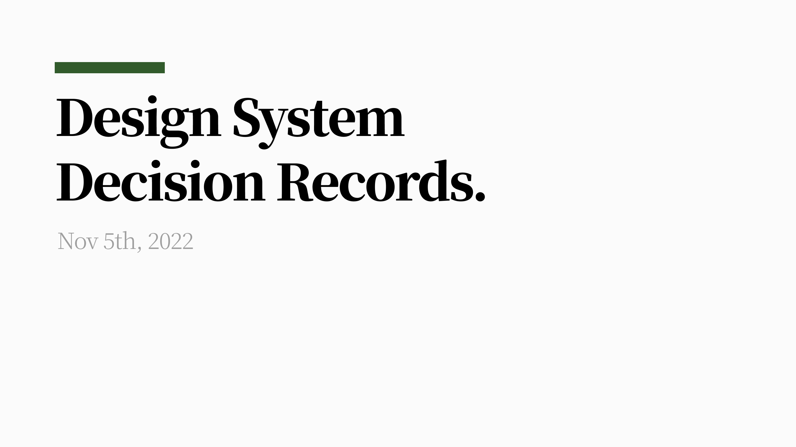
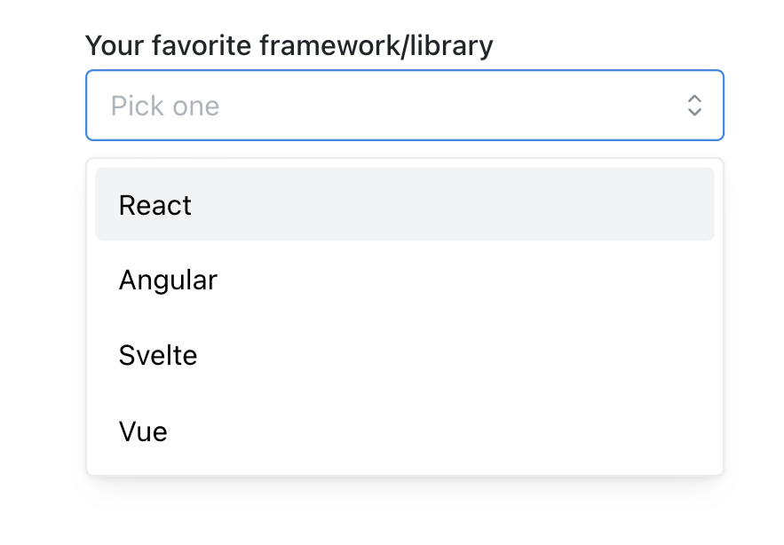
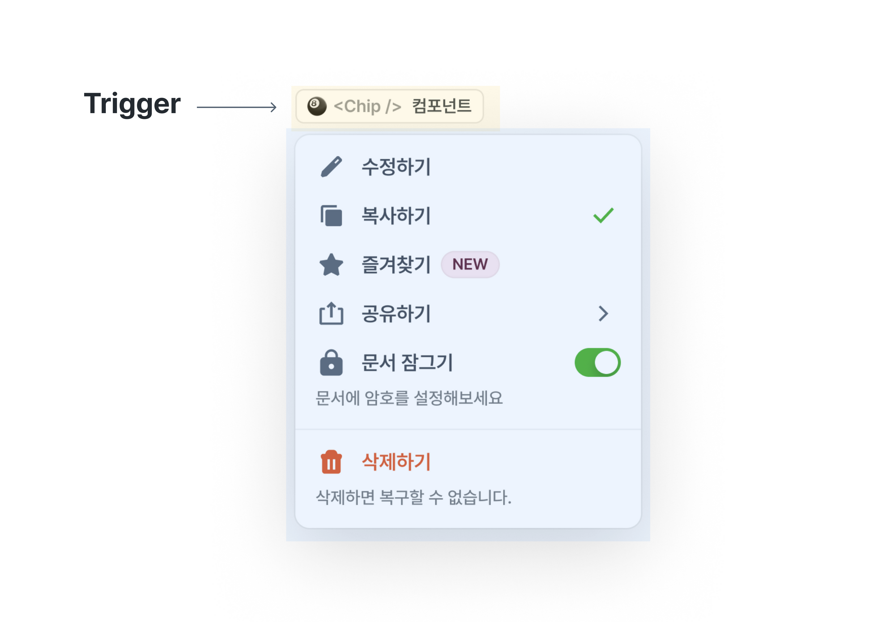
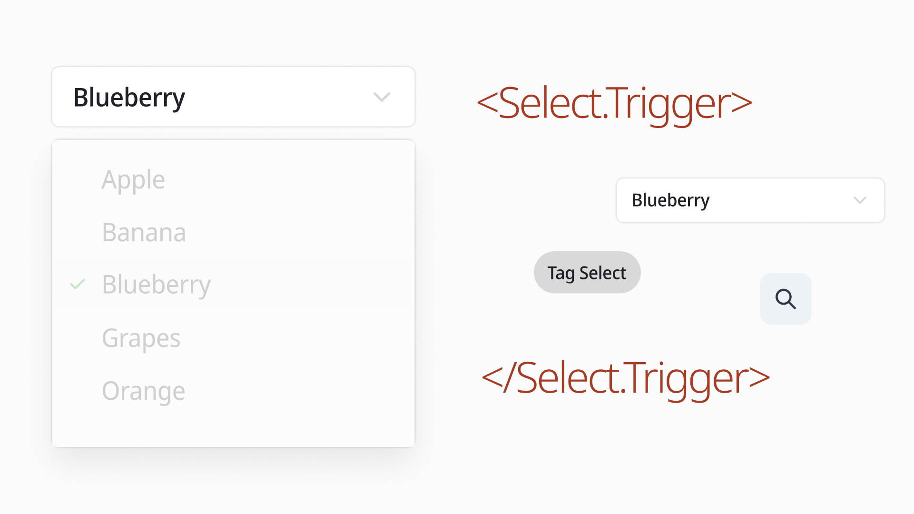
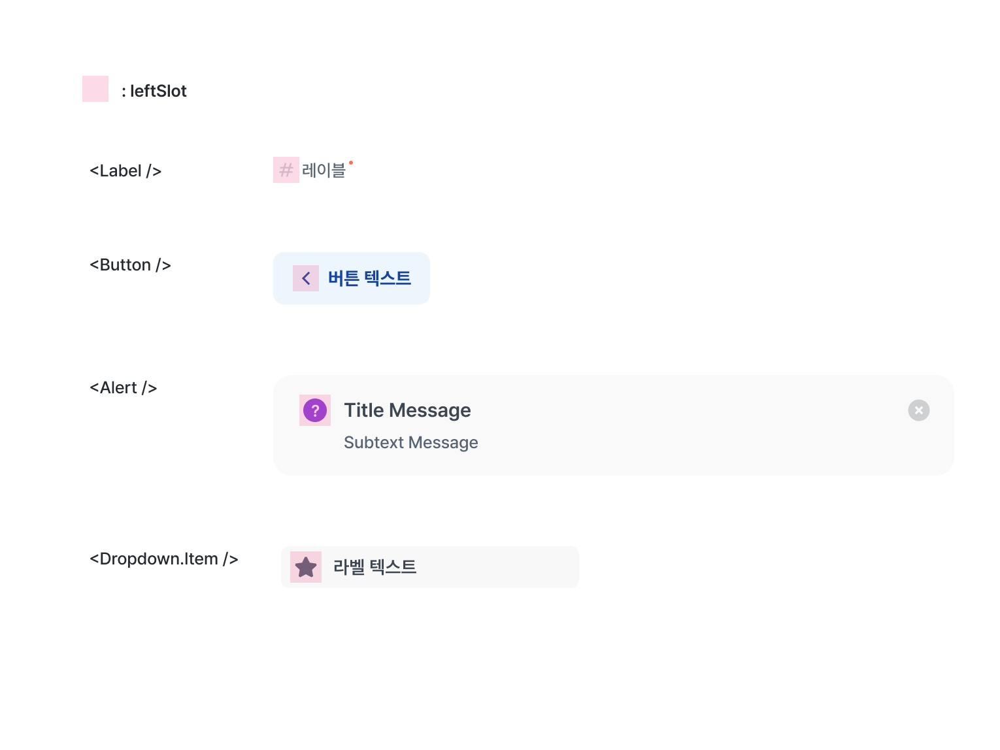
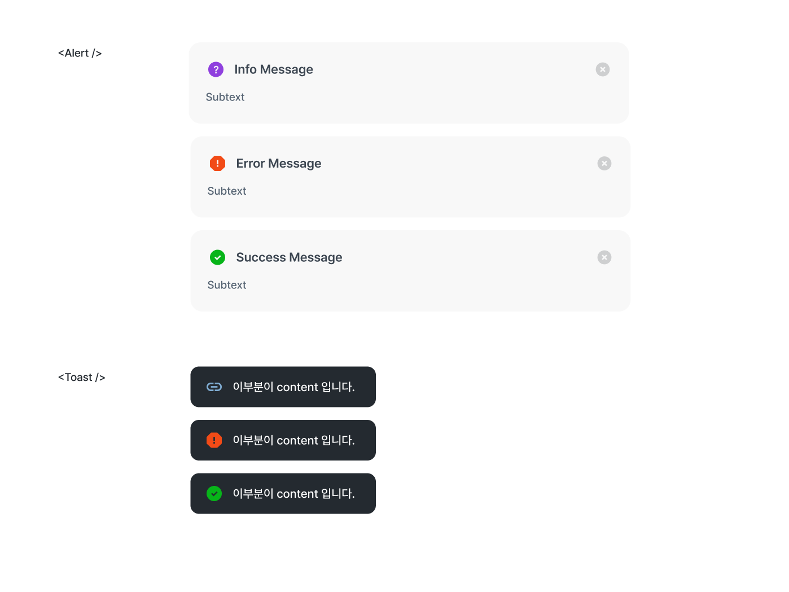
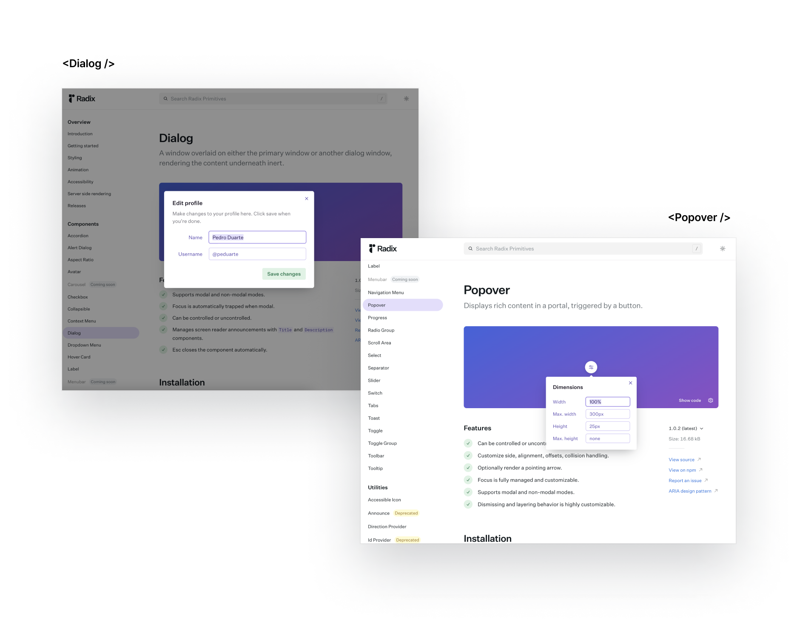
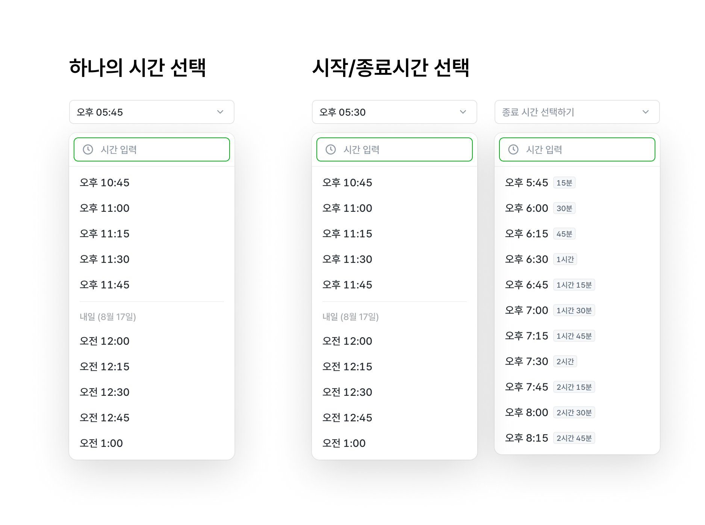
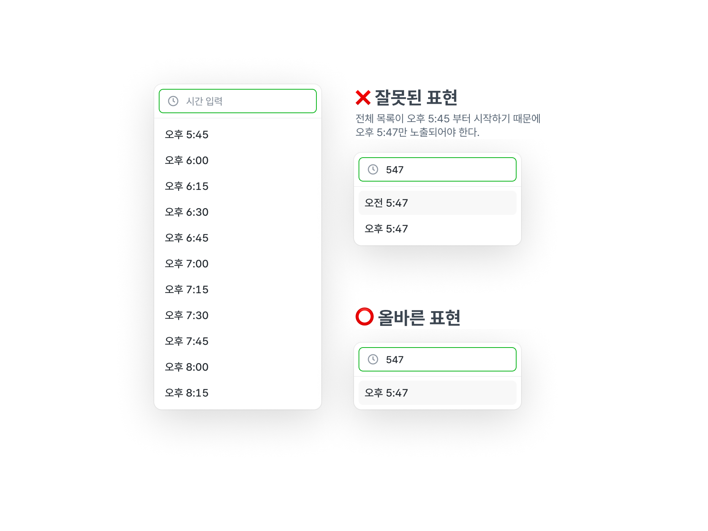
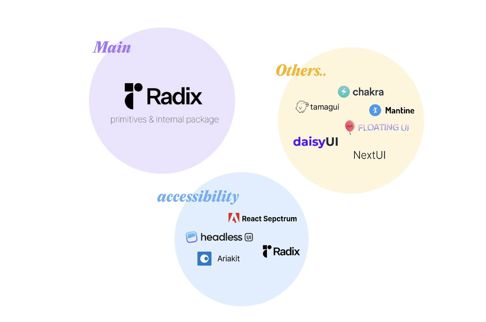

My [FEConf2022 talk, "Design Systems, Beyond Form"](https://speakerdeck.com/soyoung210/dijain-siseutem-hyeongtaereul-neomeoseo), left out a bunch of the thinking behind linear, the design system I built. This post picks up where that talk left off.

## Table of Contents

- [Principle](#principle)
  - [The problem with this principle](#problem-from-principle)
- [Interface](#interface)
  - [Compound Component](#compound-component)
- [Headless](#headless)
  - [Example 1. Trigger](#예시-1-trigger)
  - [Example 2. Other functional components](#예시-2-다양한-기능-컴포넌트)
- [The design system's strangeness budget](#디자인-시스템의-낯섦-예산)
  - [Example 1. Slot](#예시-1-slot)
  - [Example 2. State](#예시-2-state)
  - [Example 3. PortalContainer](#예시-3-portalcontainer)
- [Supporting "don't use this"](#사용하지-않음에-대한-지원)
- [Abstraction](#추상화)
  - [Example: TimePicker](#예시-timepicker)
- [Guarding against the wrong choice](#틀린-선택-막아주기)
- [Accessibility](#접근성)
  - [Example: TextField](#예시-textfield)
- [Closing thoughts](#맺으며)
- [References](#참고자료)

## Principle

***"Do only what's necessary." / "Flexibility isn't optional."***

Flexibility, extensibility, and constraint are the words that tend to come up whenever people talk about design systems.

When a design system is built assuming it'll only ever serve one product, constraint usually gets treated as just as important as flexibility and extensibility — bundled together with the word "consistency."

linear takes a different approach: it guards against mistakes, but it doesn't lean on heavy constraints just to keep things uniform.

That choice wasn't free. It led to some fragmentation, and it left users unsure how far they were allowed to customize things.

Even so, we weight flexibility over constraint for one big reason: a design system is itself a product, and like any product, it has to stay flexible to change.

A product in motion iterates: it absorbs new requirements, reverses old decisions, and lands on different ones instead. A design system is the material that product is built from. It might move on a smaller scale, but of course it still needs to bend when things change.

Consistency bought through constraint tends to produce a system that resists change, and in most cases, that resistance is expensive. Users don't love a product that's constantly changing under them; by the same logic, developers won't love a design system if every change to it is a breaking one.

So we treat every current decision as provisional, and separate what the system absolutely has to guarantee from what it doesn't.

### The problem with this principle

The system has a real shape, but because we chase flexibility, we don't put many constraints in place purely for consistency's sake. Some of that consistency burden shifts onto whoever's using the component, which means it's easy for things to slip through the cracks.

The ideal fix for satisfying flexibility and constraint at once would be predicting every way the system could ever be used — every design case — and defining, up front, exactly what needs room to change and what needs to stay locked down.

But given that products never stop changing and evolving, that's basically unrealistic. And chasing it could turn the team that manages the design system into a blocker for every product improvement.

## Interface

linear settled on a Compound Component interface so responsibility gets split up and a component's behavior stays predictable.



```jsx
<Select
  label="Your favorite framework/library"
  placeholder="Pick one"
  value={value}
  onChange={...}
  data={[
    { value: 'react', label: 'React' },
    { value: 'ng', label: 'Angular' },
    { value: 'svelte', label: 'Svelte' },
    { value: 'vue', label: 'Vue' },
   ]}
  radius={4}
  inputWraper={<input />}
  shouldCreate={true}
  creatable={true}
  allowDeselect={false}
  {...props}
/>
```

Say a Select component used the interface above. Every prop sits at the same flat level, but where each one actually lands ranges anywhere from the top of Select down to an Option, or even an icon. Whoever's using the component has no easy way to predict where a given prop will end up doing its work.

```jsx
<Select value={value} onChange={...}>
  <Select.Label>
    Your favorite framework/library
  </Select.Label>
  <Select.Trigger>
    <Input style={{borderRadius: 4}} placeholder='Pick one' />
  </Select.Trigger>
  <Select.Content creatable>
    <Select.Option value='react'>React</Select.Option>
    <Select.Option value='ng'>Angular</Select.Option>
    <Select.Option value='vue'>Vue</Select.Option>
  </Select.Content>
</Select>
```

So instead, we pass each prop where it's actually used. Because the place you set a value and the place it's consumed are now the same, it's easy to predict what a given value does.

Passing every prop from a single spot is a fairly provider-centric approach. Every value the component's logic needs arrives explicitly, so implementing the behavior you want is straightforward. But not passing everything from one spot doesn't mean the values you need become invisible.

### [Compound Component](https://kentcdodds.com/blog/compound-components-with-react-hooks)

A "Compound Component" is a pattern where two or more components work together to pull off the functionality you actually need. It's built from parent-child components that share state between themselves without exposing that state outside.

State that multiple components need can be shared through a Context sitting one layer up.

```jsx
// linear
function Select({value: valueProp, defaultValue, onChange}) {
  const [value, setValue] = useControllableState({
    prop: valueProp,
    defaultProp: defaultValue,
    onChange,
  });

  return (
    <SelectProvider
      value={value}
      onValueChange={setValue}
    >
    </SelectProvider>
  )
}

// linear
function SelectOption(props) {
  const ctx = useSelectContext();

  return (
    <Prmitive.div
      role='option'
      onKeyDown={composeEventHandlers(props.onKeyDown, () => {
        if (SELECTION_KEYS.includes(event.key)) {
          // call context's onValueChange
          ctx.onValueChange(props.value)
        }
      })}
    />
  )
}
```

The top-level `onChange` prop the caller passes in gets shared through Context and reaches the Option component, where the actual selection event fires. So even when where a prop is passed and where it's needed don't line up, a Context above them both can still carry the value across, and the interface stays intuitive.

## Headless

A design system defines both behavior and style. But if using a piece of behavior forces you into one fixed style every time, that's a lot of constraint baked in at the system level.

More constraint means less room to fragment, so consistency comes easy, but freedom and flexibility take the hit. When you're building a design system, deciding which of these two competing values, constraint or flexibility, matters more is just a call you have to make.

linear leaned toward flexibility, so in a lot of places we split form apart from function.

### Example 1. **Trigger**

The clearest example of headless design here is the Trigger component.



A Trigger is whatever toggles something like a Dropdown or a Select on and off: an element that shows up by covering part of the screen.



Whatever opens and closes a Select's option list should work as long as it acts like a button: a Ghost Button with a ChevronIcon, a Tag styled as a button, whatever.

```jsx
<Select>
  <Select.Trigger>
    <Button />
    {/* or <Tag role='button' /> */}
    {/* or <IconButton icon={<SearchIcon />} /> */}
    {/* or <FieldBox /> */}
  </Select.Trigger>
  <Select.Content />
</Select>
```

This relies on the same Compound Component idea from earlier. I went into more detail in the [talk slides](https://speakerdeck.com/soyoung210/dijain-siseutem-hyeongtaereul-neomeoseo?slide=81), and libraries like [radix-ui](https://www.radix-ui.com/) or [ariakit](https://ariakit.org/) make it easy to build.

### Example 2. Other functional components

We made the same call to split function from form in several other places too, not just Trigger.


First example: the top of MultiSelect, where you'll find a Count area ("0 selected") and a Clear area ("Reset").

Inside `Count`, everything except the `0` — the actual count of selected items — belongs to presentation, not data. The number itself doesn't change, but how you word it can. Right now it reads "0 selected," but at zero it could just as easily say "Nothing selected" or just "-".

The same logic applies to `Clear`: if the wording of "Reset" might ever change, presentation and behavior need to be kept apart here too.

```jsx
<MultiSelect>
  <MultiSelect.Content>
    <MultiSelect.Count>
      {({count}) => `${count} selected`}
    </MultiSelect.Count>
    <MultiSelect.Clear asChild>
      <Button>Reset</Button>
    </MultiSelect.Clear>
  </MultiSelect.Content>
</MultiSelect>
```

Count only hands over the selected-count data through [render props](https://reactjs.org/docs/render-props.html); Clear, like Trigger, only supplies behavior.

That flexibility is nice, but typing it out for every common case gets old fast, so it's worth also shipping a ready-made preset like this:

```jsx
<MultiSelect>
  <MultiSelect.Content>
    {/* renders as "{count} selected" */}
    <MultiSelect.CountText />
    {/* renders as "Reset" */}
    <MultiSelect.ClearButton />
  </MultiSelect.Content>
</MultiSelect>
```

## The design system's strangeness budget

The term "strangeness budget" comes from [The language strangeness budget](https://steveklabnik.com/writing/the-language-strangeness-budget): if a new programming language ships too few new ideas, nobody bothers getting curious about it, and if it ships too many, the barrier to entry gets so high that almost nobody sticks around. Either way, every new choice costs something. (Borrowed from the talk ["Why I Love React," FEConf2021](https://www.youtube.com/watch?v=dJAEWhR83Ug).)

A design system runs the same risk: it bundles a pile of features under one name and still has to stay easy and inviting to use often. Every time we add a component or a feature, the decision has to stay consistent with the system's underlying stance while keeping what users need to learn to a minimum.

In linear, we defined abstract interfaces, and whenever functionality felt similar across components, we reached for a consistent shared interface over one tailor-made for each component.

### Example 1. Slot



A Slot is a prop that renders into a fixed spot. Depending on where it sits, it's named `leftSlot` or `rightSlot`.

Some components might only ever put an icon there, but to keep the interface consistent across positions and keep constraints low, we treat it as a `slot` that can hold anything.

### Example 2. How to express state (error, success, warning)



Plenty of components need a settled shape for states like error or success. That requirement is no different: it still has to reach the user through a comfortable interface, with as little constraint as possible.

```jsx
// Alert
<Alert leftSlot={<InfoIcon />} />
<Alert.Error />
<Alert.Success />

// Toast
const toast = useToast();

toast.show(
  <div>This part is the content.</div>,
  { leftSlot: <ClipIcon /> },
);

toast.error(<div>This part is the content.</div>);
toast.success(<div>This part is the content.</div>);
```

`Alert` and `toast` end up structured the same way. There's a base type for each, `<Alert />` and `toast.show`, that can express any shape you want, and the settled form for a given state is just a property away.

### Example 3. PortalContainer



Floating components like Dialog and Popover render at a separate point in the hierarchy, and `PortalContainer` is how we let you swap their anchor element away from `document.body`.

```jsx
<Dialog>
  <Dialog.PortalContainer asChild>
    <div>It'll show up here.</div>
  </Dialog.PortalContainer>
  <Dialog.Content />
</Dialog>
```

A few individual components had interfaces that fit them a bit better than plain JSX, but to keep the learning curve down, we only expose this one pattern for now.

## Supporting "don't use this"


Say some component ships a `>>` close button (CloseIconButton) as a default feature.

```jsx
// Let's call this example component 'SidePeek'.
<SidePeek
  // The '>>' icon button (CloseIconButton) isn't declared
  toolBar={
    <Toolbar>
      <ExpandIconButton />
      <ModeToggleIconButton />
    </Toolbar>
  }
>
  {...}
</SidePeek>
```

Anywhere you actually want that button, it just works with zero extra typing.


But say a requirement shows up that says the `>>` button shouldn't be there. How would you express that? Since SidePeek made it a default, we now have to build a separate way to opt out.

```jsx
// Let's call this example component 'SidePeek'.
<SidePeek
  // A prop for excluding the '>>' icon button (CloseIconButton)
  notUseCloseButton={true}
  toolBar={
    <Toolbar>
      <ExpandIconButton />
      <ModeToggleIconButton />
    </Toolbar>
  }
>
  {...}
</SidePeek>
```

So we bolt on a `notUseCloseButton` prop. But look at the interface alone, and there's no way to guess which button it's turning off. Now users have to learn every possible outcome of `notUseCloseButton` just to use it.

The most natural way to say you're not using a component isn't a boolean prop. It's to just not use it, meaning CloseIconButton shouldn't have been a default in the first place.

```jsx {7,24}
// When using CloseIconButton
function MySidePeekWithCloseIconButton() {
  return (
    <SidePeek
      toolBar={
        <Toolbar>
          <CloseIconButton />
          <ExpandIconButton />
          <ModeToggleIconButton />
        </Toolbar>
      }
    >
      {...}
    </SidePeek>
  )
}

// When not using CloseIconButton
function MySidePeekWithoutCloseIconButton() {
  return (
      <SidePeek
        toolBar={
          <Toolbar>
            {/*<CloseIconButton />*/}
            <ExpandIconButton />
            <ModeToggleIconButton />
          </Toolbar>
        }
      >
        {...}
      </SidePeek>
  )
}

```

Yes, spelling this out every time it repeats can feel tedious. But a default you can't remove is expensive to deal with later, and it tends to surface in ways nobody predicted, so treat anything you make always-on with real caution.

## Abstraction

Staying flexible to change means a component's spec has to cover general-purpose use cases, which calls for a fairly high level of abstraction.

### Example: TimePicker



Here's a TimePicker that works both as a single-time picker and as a start/end range picker.

There's more than one way to shape an interface around that spec.

- Build SingleTimePicker and RangeTimePicker as two separate components.
- Build FromTimePicker and ToTimePicker, and use only FromTimePicker for a single time.
- Build just TimePicker, and let the call site handle start/end selection itself in controlled mode.

All three left a lot to be desired. Going with the first option and building a `RangeTimePicker` made it hard to land on the compositional interface linear aims for, and neither of the other two felt like good DX.

So we extended the Single/Range idea instead, and built `TimePicker` and `DependentTimePicker`.

DependentTimePicker borrows its idea from [ant.design's Form.Item](https://ant.design/components/form/#components-form-demo-control-ref), which reaches into form values through a `getFieldValue` render prop.

```jsx
// antd Form
<Form>
  <Form.Item name='foo-field' />
  <Form.Item>
    {({ getFieldValue }) => {
      const fooValue = getFieldValue('foo-field');

      return <input />
    }}
  </Form.Item>
</Form>
```

Form.Item instances under a Form can share values with each other. Give TimePicker the same kind of channel between its Select components, and you get single selection, start-end range selection, and really any number of time selections, all for free.

```jsx
function MyRangeTimePicker() {
  return (
    <TimePicker>
      {/* Select the start time */}
      <TimePicker.Select id='from' />
      <TimePicker.DependentSelect>
        {({ getValue }) => {
          // Based on the start time
          const startValue = getValue('from');
          // Generate as many intervals as we want and use them
           const endInterval = getTimeInterval({
              start: addHours(startValue, 1),
              end: addHours(startValue, 24),
              step: 45,
            });

          return (
            <>
              <TimePicker.Trigger />
              <TimePicker.Content />
            </>
          )
        }}
      </TimePicker.DependentSelect>
    </TimePicker>
  )
}

```

Inside DependentSelect's `getValue`, the `id` you gave a Select is what lets you reach into another Select's value.

## Guarding against the wrong choice

Choosing flexibility over constraint doesn't let us off the hook for the developer's mistakes. We can loosen the constraints on how something's expressed, but we still owe it to them to block the wrong expression.

### Example: Creating a new option in TimePicker



TimePicker can generate and show a brand-new option for a time that isn't already in the list, as long as it's a valid input.

Type "547," and which option should actually appear depends on the min and max time. If the range starts at "5:45 PM," then "5:47 AM" is simply the wrong answer.

Handling time input and generating new options is core TimePicker behavior, so it needs a mechanism that keeps this from going wrong.

```jsx
// The call site generates and uses the options it wants
function MyTimePicker() {
  const timeInterval = getTimeInterval({
    start: new Date(),
    end: addHours(new Date(), 24),
    step: 30,
  });

  return (
    <TimePicker>
      <TimePicker.Select>
        {timeInterval.map(time => {
          return (
            <TimePicker.Option key={time} value={time} />
          )
        })}
      </TimePicker.Select>
    </TimePicker>
  );
}
```

Like Select, TimePicker leaves the decision of which Option to render up to the call site, so it can't directly tell what the min and max time are.

Accepting min/max as props isn't a great answer, though. The user already decided which options to render — in the code above, the first value in `timeInterval` already is the minimum. Passing min/max again would just say the same thing twice, and the minimum time would lose any real single source of truth.

That information already exists somewhere, even without the user passing it explicitly, so TimePicker can just work it out internally.

```jsx
// linear
function TimePickerOption(props) {
  return (
    <Collection.ItemSlot value={props.value}>
      <Select.Option value={props.value} />
    </Collection.ItemSlot>
  )
}

function TimePickerNewOptionContent(props) {
  const getItems = useCollection();
  return (...)
}
```

Using the [Collection Context from my FEConf2022 talk](https://speakerdeck.com/soyoung210/dijain-siseutem-hyeongtaereul-neomeoseo?slide=93), TimePicker can find out its own list of options from the inside.

```jsx
// linear
function TimePickerNewOptionContent(props) {
  const getItems = useCollection();
  const [min, setMin] = useState<Timestamp | undefined>(undefined);
  const [max, setMax] = useState<Timestamp | undefined>(undefined);

  useEffect(() => {
    const items = getItems();
    const values = items.map(({ value }) => value);
    const [minTimeValue, maxTimeValue] = [
      Math.min(...values),
      Math.max(...values),
    ];

    setMax(maxTimeValue);
    setMin(minTimeValue);
  }, [getItems]);

  const options = useMemo(() => {
    while (isBefore(baseDate, max)) {
      const value = setHoursMinsFromDate(baseDate, {
        hours: parsedValue.hours,
        mins: parsedValue.mins,
      });
      // ...
      newOptions
        .filter(
          newOption => isAfter(newOption, min) && isBefore(newOption, max)
        )
        .forEach(newOption => baseOptions.push(newOption));

      baseDate = addDays(baseDate, 1);
    }

    return baseOptions;
  }, [formattedSearchValue, max, min]);

  return children({
    hours: parseSearchValue(formattedSearchValue.value).hours,
    mins: parseSearchValue(formattedSearchValue.value).mins,
    options,
  });
}
```

Through the collection, TimePicker knows every time it's already rendered, and it can make sure any new option only shows up if it falls inside that min/max range.

```jsx {9,10,11,12}
function MyTimePickerWithNewOption() {
  return (
    <TimePicker>
      <TimePicker.Select>
        <TimePicker.Content affix={<TimePicker.SearchInput />}>
          <TimePicker.Options />
          {/* Component shown only when there are no search results */}
          <TimePicker.SearchEmpty>
            <TimePicker.NewOptionsContent>
              {({ options }) => {
                return options.map(() => <Select.Option />)
              }}
            </TimePicker.NewOptionsContent>
          </TimePicker.SearchEmpty>
        </TimePicker.Content>
      </TimePicker.Select>
    </TimePicker>
  )
}
```

`NewOptionsContent` computes which options should render for a given input and hands them over as render props, so the call site never has to think about the internals. Just using the component is enough to get a TimePicker with the correct options.

## Accessibility

Since a design system has to guarantee consistent usability, accessibility should be the system's job wherever possible, not something pushed onto every call site.

### Example: TextField

```tsx
// ❌ Avoid defining these attributes directly wherever possible
<TextField
  describeId='my-id'
  helperText={<TextField.HelperText id='my-id' />}
/>

// ⭕️ Structure it so the component figures this out internally
<TextField helperText={<TextField.HelperText />} />
```

To get TextField's role across to a screen reader, the description and label ids need to reach the input as `aria-describedby` and `aria-labelledby`.

```jsx
// linear
function TextField() {
  const [describedBy, setDescribeBy] = useState();

  return (
    <TextFieldProvider
      describedBy={describedBy}
      onDescribeByChange={setDescribeBy}
    >
      {children}
    </TextFieldProvider>
  )
}

// linear
function HelperText(props) {
  const helperTextId = useId(props.id);

  useLayoutEffect(() => {
    onDescribeByChange(helperTextId);
  }, [helperTextId, setDescribedBy]);

  return (...)
}

// linear
function Input() {
  const { describedBy } = useTextFieldContext();

  return (
    <input
      aria-describedby={describedBy}
    />
  )
}
```

So the call site doesn't have to generate and pass an id every single time, TextField generates it internally and threads it down through context, and the input still ends up with the right id.

We applied the same approach beyond TextField too, wherever a component needs to hand a screen reader extra information: Dialog, Dropdown, Select, and more.

## Closing thoughts

This post doesn't cover everything. There were a huge number of decisions behind this design system, big and small. We argued through what needed thinking about and what trade-offs each decision carried, as a team, and we spent a lot of time reading through other open-source implementations, PRs, and issues.



Digging through so many libraries for their interfaces and implementation details is what helped us actually figure out the direction and shape our own system needed.

I can't promise today's decisions are the best ones. But I hope a design system built on this much thought and deliberation stays rust-free for a long time, and keeps growing into good material for the product.

## References

- [https://youtu.be/BcVAq3YFiuc](https://youtu.be/BcVAq3YFiuc)
- [https://kentcdodds.com/blog/compound-components-with-react-hooks](https://kentcdodds.com/blog/compound-components-with-react-hooks)
