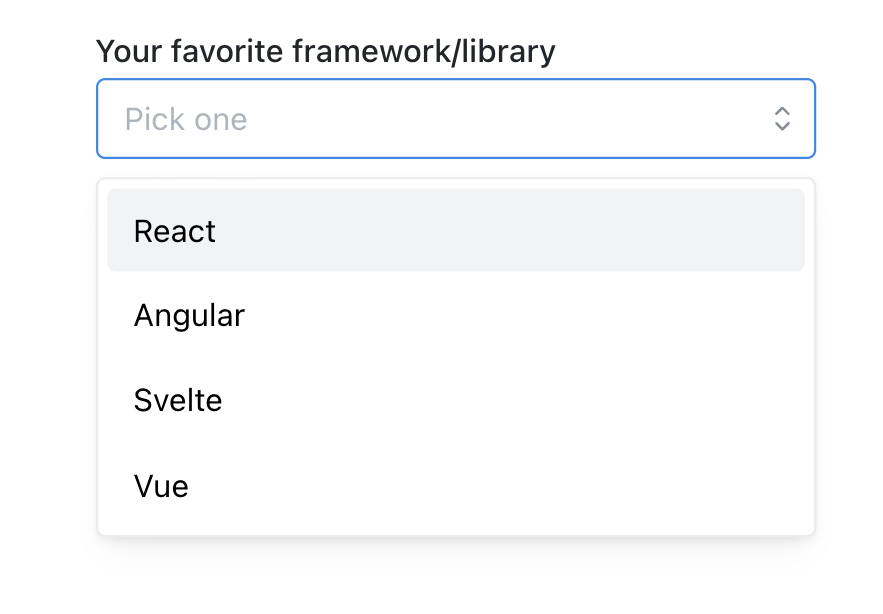
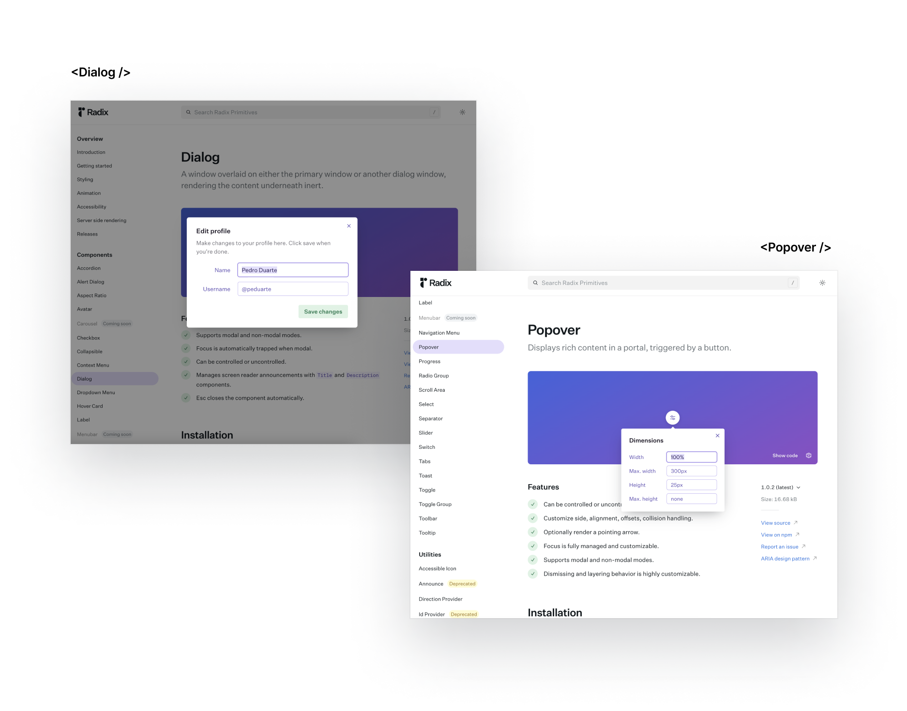
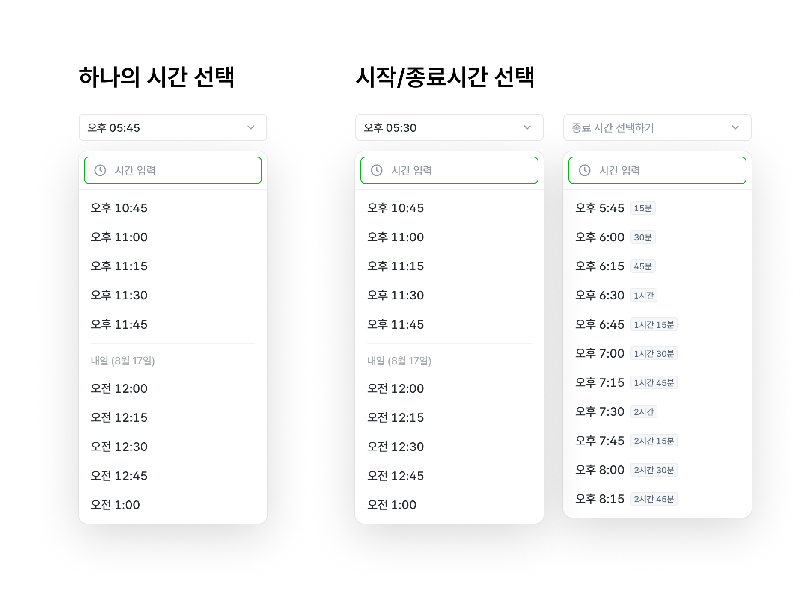

이 글은 [FEConf2022 디자인 시스템, 형태를 넘어서](https://speakerdeck.com/soyoung210/dijain-siseutem-hyeongtaereul-neomeoseo) 발표에서 다루지 않은 linear라는 Design System에 대한 고민과 결정에 대한 글입니다.

## Table of Contents

- [Principle](#principle)
  - [Problem from Principle](#problem-from-principle)
- [Interface](#interface)
  - [Compound Component](#compound-component)
- [Headless](#headless)
  - [예시 1. Trigger](#예시-1-trigger)
  - [예시 2. 다양한 기능 컴포넌트](#예시-2-다양한-기능-컴포넌트)
- [디자인 시스템의 낯섦 예산](#디자인-시스템의-낯섦-예산)
  - [예시 1. Slot](#예시-1-slot)
  - [예시 2. state](#예시-2-state)
  - [예시 3. PortalContainer](#예시-3-portalcontainer)
- [사용하지 않음에 대한 지원](#사용하지-않음에-대한-지원)
- [추상화](#추상화)
  - [예시: TimePicker](#예시-timepicker)
- [틀린 선택 막아주기](#틀린-선택-막아주기)
- [접근성](#접근성)
  - [예시. TextField](#예시-textfield)
- [맺으며](#맺으며)
- [참고자료](#참고자료)

## Principle

***“필요한 일만 한다.” / “유연함은 의무이다.”***

흔히 디자인 시스템과 같이 거론되는 단어는 유연함, 확장성 그리고 제약이다.

하나의 제품에서 사용될 것을 가정하고 만들어지는 디자인 시스템에서 제약은 통일성이라는 단어와 함께 유연함과 확장성만큼 중요하게 여겨진다.

하지만, linear에서는 사용자의 실수는 막아주지만 통일성을 지키기 위해 강한 제약을 많이 두지 않았다.

제약을 많이 두지 않는다는 결정에 단점이 없었던 것은 아니다. 파편화를 낳기도 했고, 사용자에게 커스텀 범위에 대한 혼란을 주기도 했다.

그럼에도 불구하고 제약보다 유연함을 중요하게 가져가는 큰 이유는 디자인 시스템도 변경에 유연해야 하는 제품이라고 생각하기 때문이다.

변화하는 제품은 Iteration을 거치며 고객의 요구사항을 반영하거나 기존의 결정을 번복하고 다른 결정을 내리기도 한다. 변화하는 제품의 재료가 되는 디자인 시스템 역시 상대적으로 변화의 폭이 작을 수는 있지만 당연히 변경에 유연하게 대응할 수 있어야 한다.

제약에 의해 달성되는 통일성은 변경에 대응하기 어려운 시스템을 만들고, 많은 경우 변경에 큰 비용이 필요하다. 사용자가 크게 변하기만 하는 제품을 사랑하지 않듯, 디자인 시스템에서 변경에 대응하는 방법이 항상 Breaking Change라면 시스템의 사용자인 개발자들은 디자인 시스템을 사랑하지 않을 것이다.

그렇기 때문에 현재 결정은 변할 수 있다는 전제로 바라보면서 시스템에서 보장해야 하는 부분과 그렇지 않은 부분을 나누어 생각해야 한다.

### Problem from Principle

형태를 가지지만 유연함을 추구하기 때문에 일관성을 위한 제약은 많지 않다. 일관성에 대한 책임을 일부 사용처에 위임하다 보니 쉽게 놓쳐지는 상황이 발생할 수 있다.

유연함과 제약이라는 상반된 목적을 모두 달성하는 이상적인 방법은 시스템이 사용되는 방법, 즉 디자인 케이스를 모두 예측하여 변화가 필요한 부분과 통제되어야 하는 부분을 전부 정의하는 것이다.

하지만 제품이 계속 변하고 발전된다는 점을 생각해보면 이 방법은 실현 가능성이 매우 낮다고 볼 수 있다. 그리고 이런 방식은 디자인 시스템을 관리하는 팀이 모든 제품 개선의 블로커(blocker)로도 작용할 수 있다.

## Interface

linear에서는 책임을 나누고 컴포넌트의 동작을 예측할 수 있도록  Compound Component 인터페이스를 선택했다.



```jsx
<Select
  label="Your favorite framework/library"
  placeholder="Pick one"
  value={value}
  onChange={...}
  data={[
    { value: 'react', label: 'React' },
    { value: 'ng', label: 'Angular' },
    { value: 'svelte', label: 'Svelte' },
    { value: 'vue', label: 'Vue' },
   ]}
  radius={4}
  inputWraper={<input />}
  shouldCreate={true}
  creatable={true}
  allowDeselect={false}
  {...props}
/>
```

예를 들어 Select컴포넌트에서 위와 같은 인터페이스를 사용한다고 생각해보자. 모든 prop은 하나의 컴포넌트에서 같은 위계를 가지고 있지만, 실제로 적용되는 위치는 Select 최상단 영역부터 Option, 그리고 아이콘까지 다양하다. 컴포넌트 사용자는 설정하는 prop이 어떤 위치에서 어떻게 사용될지 쉽게 예측할 수 없다.

```jsx
<Select value={value} onChange={...}>
  <Select.Label>
    Your favorite framework/library
  </Select.Label>
  <Select.Trigger>
    <Input style={{borderRadius: 4}} placeholder='Pick one' />
  </Select.Trigger>
  <Select.Content creatable>
    <Select.Option value='react'>React</Select.Option>
    <Select.Option value='ng'>Angular</Select.Option>
    <Select.Option value='vue'>Vue</Select.Option>
  </Select.Content>
</Select>
```

prop이 실제 사용되는 곳에 전달되도록 변경했다. 값을 전달하는 위치와 사용되는 위치가 일치하기 때문에 사용처에서 설정하는 값이 어떻게 사용될지 예측하기 쉽다.

prop을 한 곳에서 전부 넘기는 방식은 다소 공급자 중심이다. 컴포넌트 로직에 필요한 값이 모두 명확하게 전달되니 원하는 기능을 쉽게 구현할 수 있었다. 하지만, prop이 한 곳에서 전달되지 않는다고 필요한 값을 알 수 없는 것은 아니다.

### [Compound Component](https://kentcdodds.com/blog/compound-components-with-react-hooks)

“Compound Component”란 요구되는 기능을 수행하기 위해 두 개 이상의 컴포넌트가 협력하는 형태를 의미한다. 부모-자식 컴포넌트로 구성되고, 컴포넌트 간에 외부로 드러나지 않는 상태공유가 존재한다.

여러 컴포넌트에서 필요한 상태는 상위 레이어의 Context를 통해 공유할 수 있다.

```jsx
// linear
function Select({value: valueProp, defaultValue, onChange}) {
  const [value, setValue] = useControllableState({
    prop: valueProp,
    defaultProp: defaultValue,
    onChange,
  });

  return (
    <SelectProvider
      value={value}
      onValueChange={setValue}
    >
    </SelectProvider>
  )
}

// linear
function SelectOption(props) {
  const ctx = useSelectContext();

  return (
    <Prmitive.div
      role='option'
      onKeyDown={composeEventHandlers(props.onKeyDown, () => {
        if (SELECTION_KEYS.includes(event.key)) {
          // context onValueChange호출
          ctx.onValueChange(props.value)
        }
      })}
    />
  )
}
```

사용처에서 전달한 최상위 `onChange` prop을 Context를 통해 공유하여 실제 선택 이벤트가 발생하는 Option컴포넌트에 전달해주었다. 이처럼 같이 사용처에서 prop을 전달하는 곳과 필요한 곳이 일치하지 않아도 상위 Context를 통해 필요한 값을 사용할 수 있으면서 인터페이스를 직관적으로 유지할 수 있다.

## Headless

디자인 시스템은 기능과 스타일을 정의한다. 하지만 기능을 사용할 때 반드시 정해진 스타일로만 사용해야 한다면 시스템 수준에서부터 제약이 많다고 할 수 있다.

제약이 많다는 것은 파편화의 여지가 적다는 것을 의미하기 때문에 추구하는 통일성을 쉽게 달성할 수 있지만, 자유도와 유연성은 떨어지게 된다. 디자인 시스템을 구성할 때 제약과 유연성이라는 상반되는 두 가지 가치 중 무엇을 더 중요하게 바라볼지는 선택의 영역이다.

linear는 유연성을 더 중요하게 바라봤기 때문에 많은 부분 형태와 기능을 분리하여 구성했다.

### 예시 1. **Trigger**

Headless영역에서 가장 대표적인 예시는 Trigger컴포넌트이다.


Trigger컴포넌트란 Dropdown이나 Select같이 일정 영역 화면을 덮으면서 나타나는 요소를 켜고/끌 수 있는 컴포넌트를 의미한다.


Select의 옵션 목록을 여닫을 수 있는 역할은 ChevronIcon을 가진 Ghost Button, Tag형태의 Button등 button의 역할을 가진다면 무엇이든 가능해야 한다.

```jsx
<Select>
  <Select.Trigger>
    <Button />
    {/* or <Tag role='button' /> */}
    {/* or <IconButton icon={<SearchIcon />} /> */}
    {/* or <FieldBox /> */}
  </Select.Trigger>
  <Select.Content />
</Select>
```

이 개념 역시 앞서 언급했던 Compound Component를 사용한다. 자세한 내용은 [발표 자료](https://speakerdeck.com/soyoung210/dijain-siseutem-hyeongtaereul-neomeoseo?slide=81)를 통해 다루었고, [radix-ui](https://www.radix-ui.com/), [ariakit](https://ariakit.org/) 등의 library를 사용한다면 쉽게 구현할 수 있다.

### 예시 2. 다양한 기능 컴포넌트

Trigger컴포넌트를 통해 기능과 형태를 분리한 것과 비슷한 선택이 여러 곳에 존재한다.


첫 번째 예시는 MultiSelect의 상단, “총 0개 선택”(Count)영역과 “초기화”(Clear) 영역이다.

`Count` 영역에서 선택된 아이템의 개수를 의미하는 `0` 이외의 영역은 Count가 가지는 표현의 영역이다. 아이템의 개수 데이터는 변하지 않지만, 이를 어떻게 표현할지는 달라질 수 있다. 예를 들어 현재는 “총 0개 선택”으로 표현되었지만 0개일 경우 “선택값 없음”, “-”등으로 표현할 수도 있을 것이다.

`Clear`역시 “초기화”의 표현이 변경될 수 있다고 바라본다면, 표현 방식과 기능이 분리될 필요가 있는 영역이다.

```jsx
<MultiSelect>
  <MultiSelect.Content>
    <MultiSelect.Count>
      {({count}) => `총 ${count}개 선택`}
    </MultiSelect.Count>
    <MultiSelect.Clear asChild>
      <Button>초기화</Button>
    </MultiSelect.Clear>
  </MultiSelect.Content>
</MultiSelect>
```

Count컴포넌트는 [render props](https://reactjs.org/docs/render-props.html)로 선택된 개수 데이터만 제공하고, Clear컴포넌트는 Trigger처럼 기능만 제공한다.

유연함을 위한 장치이지만 빈번하게 사용되는 용례에 대한 피로도가 존재할 수 있기 때문에 다음과 같이 완성된 preset도 제공할 필요가 있다.

```jsx
<MultiSelect>
  <MultiSelect.Content>
    {/* "{count}개 선택"으로 렌더링 */}
    <MultiSelect.CountText />
    {/* "초기화"로 렌더링 */}
    <MultiSelect.ClearButton />
  </MultiSelect.Content>
</MultiSelect>
```

## 디자인 시스템의 낯섦 예산

‘낯섦 예산’이라는 단어는 [The language strangeness budget](https://steveklabnik.com/writing/the-language-strangeness-budget) 글에서 사용된 단어로, 새로운 프로그래밍 언어에 포함된 새 기능의 수가 너무 적으면 사람들이 그 언어에 굳이 관심을 가지지 않고, 반대로 새로운 내용이 너무 많다면 진입장벽이 너무 높아 사용하는 사람이 적기 때문에 새로운 선택이 비용을 지불하는 것임을 설명하는 단어이다. ([FEConf2021 “왜 나는 React를 사랑하는가” 발표](https://www.youtube.com/watch?v=dJAEWhR83Ug) 인용)

디자인 시스템도 하나의 이름으로 여러 기능을 구성하고 사용자가 쉽게, 많이 사용할 수 있도록 지원해야 한다는 점에서 다르지 않다. 컴포넌트나 기능을 추가될 때 모든 결정이 기본 기조에 위배되지 않으면서 사용자가 학습할 요소를 적게 유지하는 노력이 수반되어야 한다.

linear에서는 추상적인 인터페이스를 정의하였고, 비슷한 기능이라고 여겨지는 기능에는 컴포넌트 각각에 어울리는 인터페이스보다는 통일성 있는 인터페이스를 추구했다.

### 예시 1. Slot


Slot은 고정된 영역에 표현될 수 있는 prop을 의미한다. 위치에 따라 `leftSlot` 혹은 `rightSlot` 이라는 이름을 가진다.

어떤 컴포넌트에서는 slot 위치에 아이콘만 사용하는 것으로 특정되는 경우도 있을 수 있지만, 위치에 대한 인터페이스 통일성을 유지하는 것과 제약을 줄인다는 측면에서 무엇이든 올 수 있는 `slot`으로 바라본다.

### 예시 2. 상태(error, success, warning)를 표현하는 방법


많은 컴포넌트에서 error, success등 상태에 따른 약속된 형태가 필요하다. 이 요구사항도 제약을 최소화하면서 사용자에게 편한 인터페이스로 전달해야 한다는 것은 동일하다.

```jsx
// Alert
<Alert leftSlot={<InfoIcon />} />
<Alert.Error />
<Alert.Success />

// Toast
const toast = useToast();

toast.show(
  <div>이 부분이 content입니다.</div>,
  { leftSlot: <ClipIcon /> },
);

toast.error(<div>이 부분이 content입니다.</div>);
toast.success(<div>이 부분이 content입니다.</div>);
```

`Alert`과 `toast`의 인터페이스는 유사한 구성을 가지고 있다. 다양한 형태를 표현할 수 있는 `<Alert />`과 `toast.show`라는 기본 타입이 존재하며, 상태에 따른 약속된 형태는 Property를 참조하여 사용할 수 있다.

### 예시 3. PortalContainer



분리된 위계로 표현되는 Dialog, Popover등의 floating 컴포넌트에서 기준 element를 `document.body`가 아닌 다른 것으로 변경하는 기능을 `PortalContainer`로 제공하고 있다.

```jsx
<Dialog>
  <Dialog.PortalContainer asChild>
    <div>여기서 보여질거에요.</div>
  </Dialog.PortalContainer>
  <Dialog.Content />
</Dialog>
```

개별 컴포넌트 단위에서는 JSX보다 조금 더 어울리는 인터페이스가 존재했지만, 기능에 대한 학습 피로도를 낮추기 위해 현재는 하나의 방식만 제공하고 있다.

## 사용하지 않음에 대한 지원


어떤 컴포넌트에서 닫기 동작을 수행하는  `>>` 버튼(CloseIconButton)을 기본 기능으로 정의해주었다고 가정해보자.

```jsx
// 위 예시 컴포넌트 이름을 'SidePeek'이라고 정해봤다.
<SidePeek
  // '>>' 아이콘 버튼(CloseIconButton)은 선언하지 않음
  toolBar={
    <Toolbar>
      <ExpandIconButton />
      <ModeToggleIconButton />
    </Toolbar>
  }
>
  {...}
</SidePeek>
```

버튼이 필요한 곳에서는 별다른 타이핑 없이 사용할 수 있을 것이다.


만약 `>>` 버튼을 사용하지 않아야 하는 요구사항이 생긴다면, 어떻게 표현할 수 있을까? SidePeek컴포넌트에서 기본 기능으로 정의했기 때문에 제외할 수 있는 추가 수단을 제공해야 한다.

```jsx
// 위 예시 컴포넌트 이름을 'SidePeek'이라고 정해봤다.
<SidePeek
  // '>>' 아이콘 버튼(CloseIconButton)을 제외하기 위한 prop
  notUseCloseButton={true}
  toolBar={
    <Toolbar>
      <ExpandIconButton />
      <ModeToggleIconButton />
    </Toolbar>
  }
>
  {...}
</SidePeek>
```

‘사용하지 않음’을 `notUseCloseButton` prop으로 추가했다. 하지만, 인터페이스만 봤을 때는 이 prop이 어떤 형태의 버튼을 사용하지 않겠다고 선언하는 것인지 예측할 수 없다. 사용자에게 `notUseCloseButton`  값으로 가능한 모든 결과에 대해 학습을 요구하게 된다.

컴포넌트를 사용하지 않겠다고 선언하는 가장 자연스러운 방법은 boolean prop이 아니라 실제로 사용하지 않는 것이다. 즉, CloseIconButton을 기본 기능으로 정의하지 않는 것이다.

```jsx{7,24}
// CloseIconButton을 사용하는 경우
function MySidePeekWithCloseIconButton() {
  return (
    <SidePeek
      toolBar={
        <Toolbar>
          <CloseIconButton />
          <ExpandIconButton />
          <ModeToggleIconButton />
        </Toolbar>
      }
    >
      {...}
    </SidePeek>
  )
}

// CloseIconButton을 사용하지 않는 경우
function MySidePeekWithoutCloseIconButton() {
  return (
      <SidePeek
        toolBar={
          <Toolbar>
            {/*<CloseIconButton />*/}
            <ExpandIconButton />
            <ModeToggleIconButton />
          </Toolbar>
        }
      >
        {...}
      </SidePeek>
  )
}

```

반복되는 용례에 대한 선언은 다소 피로하게 느껴질 수도 있지만, 제외할 수 없는 기본기능에 대한 대응 비용이 많이 들고 대부분 예측이 어려운 방식으로 표현되므로 항상 포함되는 기능은 보수적으로 판단할 필요가 있다.

## 추상화

변경에 유연하려면 컴포넌트의 스펙이 범용적인 용례를 지원할 수 있어야 하므로 높은 수준의 추상화가 필요하다.

### 예시: TimePicker



하나의 시간을 선택할 수도 있고 시작/종료 시간 선택으로도 사용할 수 있는 TimePicker이다.

이 스펙에 대한 인터페이스는 다양한 방법으로 구성할 수 있다.

- SingleTimePicker와 RangeTimePicker를 분리해서 구현한다.
- FromTimePicker, ToTimePicker를 만들고 하나의 시간을 선택할 때는 FromTimePicker만 사용하게한다.
- TimePicker만 만들고 시작/종료시간 선택은 사용처에서 controlled로 사용하게 한다.

세 가지 방법 모두 아쉬운 점이 컸다. 첫 번째 방법을 선택해서 `RangeTimePicker` 를 만들 경우 linear가 지향하는 합성형 인터페이스로 만들기 어려웠고, 나머지 두 가지 방법은 DX가 좋다고 생각되지 않았다.

Single/Range에 대한 개념을 확장해 `TimePicker`와 `DependentTimePicker` 로 만들기로 했다.

DependentTimePicker는 [ant.design의 Form.Item](https://ant.design/components/form/#components-form-demo-control-ref) 에서 render props로 `getFieldValue` 를 사용해서 form값에 접근하는 방식에서 아이디어를 얻었다.

```jsx
// antd Form
<Form>
  <Form.Item name='foo-field' />
  <Form.Item>
    {({ getFieldValue }) => {
      const fooValue = getFieldValue('foo-field');

      return <input />
    }}
  </Form.Item>
</Form>
```

Form컴포넌트 하위의 Form.Item간에 값을 공유할 수 있다. TimePicker 역시 Select컴포넌트간에 값을 공유할 수 있는 수단이 있다면 단일선택, 시작–종료 시간 선택 기능을 포함하여 N가지 시간 선택도 가능하다.

```jsx
function MyRangeTimePicker() {
  return (
    <TimePicker>
      {/* 시작 시간 선택 */}
      <TimePicker.Select id='from' />
      <TimePicker.DependentSelect>
        {({ getValue }) => {
          // 시작 시간을 기준으로
          const startValue = getValue('from');
          // 원하는 만큼 interval생성해서 사용
           const endInterval = getTimeInterval({
              start: addHours(startValue, 1),
              end: addHours(startValue, 24),
              step: 45,
            });

          return (
            <>
              <TimePicker.Trigger />
              <TimePicker.Content />
            </>
          )
        }}
      </TimePicker.DependentSelect>
    </TimePicker>
  )
}

```

DependentSelect의 `getValue`에서 Select에 전달하는 `id`를 통해 다른 Select값에 접근할 수 있다.

## 틀린 선택 막아주기

제약보다는 유연함을 추구하는 것이 사용자(개발자)의 실수에 책임지지 않아도 된다는 뜻은 아니다. 표현의 제약은 줄이되, 틀린 표현을 하지 않도록 막아줄 책임은 있다.

### 예시. TimePicker에서 새로운 옵션 생성하기


TimePicker에는 옵션에 없는 시간이더라도 유효한 입력이라면 새로운 옵션을 생성해서 보여주는 기능이 존재한다.

사용자가 “547”을 입력했을 때 최소 시간, 최대시간에 따라 보여줘야 하는 옵션이 달라질 수 있다. 시작 시간이 “오후 5:45”부터라면 “오전 5:47”은 틀린 선택지이다.

시간 입력 처리와 새로운 옵션 생성은 TimePicker가 담당해야 할 기본기능이므로 이 기능을 정확하게 사용할 수 있는 장치가 필요하다.

```jsx
// 사용처에서 원하는 옵션을 생성해서 사용함
function MyTimePicker() {
  const timeInterval = getTimeInterval({
    start: new Date(),
    end: addHours(new Date(), 24),
    step: 30,
  });

  return (
    <TimePicker>
      <TimePicker.Select>
        {timeInterval.map(time => {
          return (
            <TimePicker.Option key={time} value={time} />
          )
        })}
      </TimePicker.Select>
    </TimePicker>
  );
}
```

TimePicker 역시 Select와 마찬가지로 어떤 Option을 렌더링할지는 사용처에서 결정되기 때문에 최소, 최대시간에 대한 정보를 바로 알아내기 어렵다.

하지만 최소, 최대시간 prop을 받는 것은 좋은 선택지가 아니다. 사용자 관점에서 이미 어떤 옵션들을 렌더링할지 결정하고 있고, 위 코드에서는 `timeInterval` 의 첫 번째 값이 최소 시간 값이다. 최소, 최대 시간 prop을 넘겨야 한다면 같은 표현을 두 번 하는 것이며, 최소 시간에 대한 정보는 Single Source of Truth가 보장되지 않는다.

사용자가 직접적으로 전달하지 않더라도 이미 표현되고 있는 정보가 있으니 TimePicker내부에서 알아내면 된다.

```jsx
// linear
function TimePickerOption(props) {
  return (
    <Collection.ItemSlot value={props.value}>
      <Select.Option value={props.value} />
    </Collection.ItemSlot>
  )
}

function TimePickerNewOptionContent(props) {
  const getItems = useCollection();
  return (...)
}
```

[FEConf2022발표에서 언급한 Collection](https://speakerdeck.com/soyoung210/dijain-siseutem-hyeongtaereul-neomeoseo?slide=93) Context를 사용해서 TimePicker내부에서 옵션 목록을 알 수 있다.

```jsx
// linear
function TimePickerNewOptionContent(props) {
  const getItems = useCollection();
  const [min, setMin] = useState<Timestamp | undefined>(undefined);
  const [max, setMax] = useState<Timestamp | undefined>(undefined);

  useEffect(() => {
    const items = getItems();
    const values = items.map(({ value }) => value);
    const [minTimeValue, maxTimeValue] = [
      Math.min(...values),
      Math.max(...values),
    ];

    setMax(maxTimeValue);
    setMin(minTimeValue);
  }, [getItems]);

  const options = useMemo(() => {
    while (isBefore(baseDate, max)) {
      const value = setHoursMinsFromDate(baseDate, {
        hours: parsedValue.hours,
        mins: parsedValue.mins,
      });
      // ...
      newOptions
        .filter(
          newOption => isAfter(newOption, min) && isBefore(newOption, max)
        )
        .forEach(newOption => baseOptions.push(newOption));

      baseDate = addDays(baseDate, 1);
    }

    return baseOptions;
  }, [formattedSearchValue, max, min]);

  return children({
    hours: parseSearchValue(formattedSearchValue.value).hours,
    mins: parseSearchValue(formattedSearchValue.value).mins,
    options,
  });
}
```

collection을 통해 TimePicker에서 렌더링한 전체 시간 목록을 알 수 있고, 새로운 옵션을 보여줄 때 최소/최대 시간 범위내의 시간만 렌더링할 수 있도록 처리해줄 수 있다.

```jsx{9,10,11,12}
function MyTimePickerWithNewOption() {
  return (
    <TimePicker>
      <TimePicker.Select>
        <TimePicker.Content affix={<TimePicker.SearchInput />}>
          <TimePicker.Options />
          {/* 검색 결과가 없을 때만 보이는 컴포넌트*/}
          <TimePicker.SearchEmpty>
            <TimePicker.NewOptionsContent>
              {({ options }) => {
                return options.map(() => <Select.Option />)
              }}
            </TimePicker.NewOptionsContent>
          </TimePicker.SearchEmpty>
        </TimePicker.Content>
      </TimePicker.Select>
    </TimePicker>
  )
}
```

입력값에 따라 렌더링 해야하는 옵션은 `NewOptionsContent`에서 계산되어 render props로 제공되기 때문에 사용처에서는 내부 구현디테일을 고려할 필요 없이 컴포넌트를 사용하는 것으로 올바른 선택옵션을 가진 TimePicker를 사용할 수 있다.

## 접근성

디자인 시스템이 일관된 사용성을 보장해야 한다는 점에서 접근성을 지원은 가능한 사용처가 아니라 디자인 시스템의 책임이 되어야 한다.

### 예시. TextField

```tsx
// ❌ 가능한 직접 속성을 정의하지 않고
<TextField
  describeId='my-id'
  helperText={<TextField.HelperText id='my-id' />}
/>

// ⭕️ 내부에서 판단하도록 구성
<TextField helperText={<TextField.HelperText />} />
```

TextField의 역할을 스크린 리더기에 전달하기 위해 description, label의 id를 input컴포넌트의 `aria-describedby` , `aria-labelledby` 로 지원해야 한다.

```jsx
// linear
function TextField() {
  const [describedBy, setDescribeBy] = useState();

  return (
    <TextFieldProvider
      describedBy={describedBy}
      onDescribeByChange={setDescribeBy}
    >
      {children}
    </TextFieldProvider>
  )
}

// linear
function HelperText(props) {
  const helperTextId = useId(props.id);

  useLayoutEffect(() => {
    onDescribeByChange(helperTextId);
  }, [helperTextId, setDescribedBy]);

  return (...)
}

// linear
function Input() {
  const { describedBy } = useTextFieldContext();

  return (
    <input
      aria-describedby={describedBy}
    />
  )
}
```

사용처에서 매번 id를 생성하고 넘겨주지 않아도 적절한 id를 input에 전달할 수 있도록, id를 내부에서 생성하고 context를 통해 전달한다.

TextField 외에도 Dialog, Dropdown, Select등 스크린 리더기에 추가 정보를 전달해야 하는 컴포넌트에 동일한 방식으로 적용했다.

## 맺으며

글에서 모두 다루지 않았지만, 디자인 시스템에 크고 작은 결정이 매우 많았다. 어떤 고민이 필요한지, 결정에 어떤 trade-off가 있는지 팀과도 많이 논의 했었고 여러 오픈소스들의 구현체나 PR, issue를 살펴보기도 했다.


인터페이스와 구현 디테일을 참고하기 위해 많은 라이브러리를 살펴보면서 디자인 시스템에 필요한 방향성, 구성에 대해 생각해볼 수 있었다.

지금의 결정들이 최고의 선택인지는 아직 장담할 수 없지만, 많은 고민과 결정을 기반으로 만든 디자인 시스템이 오랜 기간 녹슬지 않고 제품의 좋은 재료로 발전해 나가길 바란다.

## 참고자료

- [https://youtu.be/BcVAq3YFiuc](https://youtu.be/BcVAq3YFiuc)
- [https://kentcdodds.com/blog/compound-components-with-react-hooks](https://kentcdodds.com/blog/compound-components-with-react-hooks)
