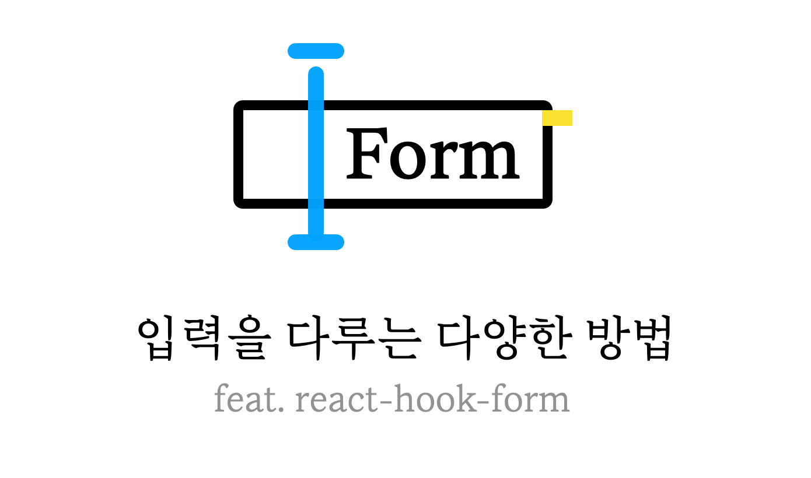
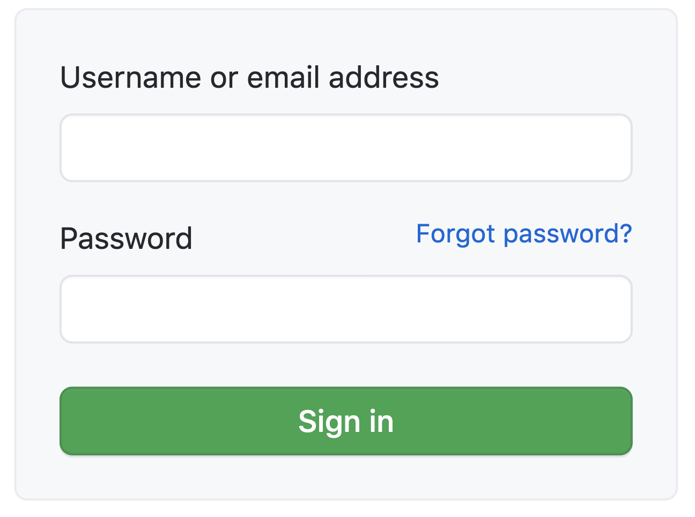
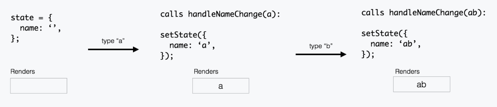
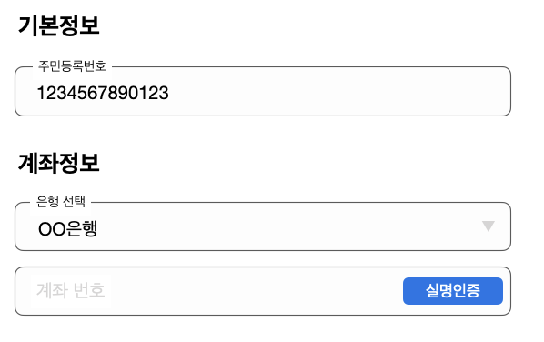

Forms, taking in what a user types and doing something with it, are one of the trickier problems in web development. Here I'll walk through a few ways to handle them, along with [react-hook-form](https://react-hook-form.com/), one of the most popular form libraries out there.

## A Simple Form

The simplest form anyone pictures is a login form asking for an email and a password.



You can build this by giving each input its own state and handler for `value`, then passing them down.

```jsx
const EasyLoginForm = () => {
  const [email, setEmail] = useState('');
  const [password, setPassword] = useState('');

  const handleSubmit = () => {
    console.log('email', email, 'password', password);
  }

  return (
    <form onSubmit={handleSubmit}>
      <label>
        email
        <input
          type="text"
          value={id}
          onChange={(e) => setEmail(e.target.value)}
        />
      </label>
      <label>
        Password
        <input
          type="password"
          value={password}
          onChange={(e) => setPassword(e.target.value)}
        />
      </label>
    </form>
  )
}
```

The `input`s in that example are **Controlled** **Components**.

### Controlled Component

In a Controlled Component, form data lives in the component's own state.


<small>https://goshakkk.name/controlled-vs-uncontrolled-inputs-react/</small>

- It starts out as an empty string, `''`.
- Type `a`, and `handleNameChange` picks it up; the input re-renders with `a` as its value.
- Type `b` next, and `handleNameChange` grabs `ab` and stores it as state; the input re-renders again, now showing `ab`.

Because every value change gets **pushed** this way, the data (state) and the UI (input) never fall out of sync, so you can read the input's value directly, any time.

## When Forms Grow

Add more forms and more complexity, and the code piles up fast, along with all the [state lifting](https://reactjs.org/docs/lifting-state-up.html) needed to share state around. The parent ends up holding all the state, and child components inevitably need handlers and state injected into them, which makes reusing any one of them on its own pretty hard.

```jsx
const HardRegisterForm = () => {
  const [email, setEmail] = useState('');
  const [password, setPassword] = useState('');
  const [address, setAddress] = useState('');
  const [phoneNumber, setPhoneNumber] = useState('');
  const [job, setJob] = useState('');
  const [aboutMe, setAboutMe] = useState('');

  return (
    <>
      <Input name='Email' value={email} onChange={setEmail} />
      <Input name='Password' value={password} onChange={setPassword} />
      <Input name='Home Address' value={address} onChange={setAddress} />
    </>
  )
};
```

All the responsibility has piled onto `HardRegisterForm`. Add validation or any other logic on top of just handling values, and this component only gets more bloated. React's [useImperativeHandle](https://reactjs.org/docs/hooks-reference.html#useimperativehandle) hook offers a way out: split the form up and let each piece manage its own state in isolation.

```jsx
const BasicInformationFormGroup = (
  _,
  ref: Ref<{ values: BasicInfoFields }>
) => {
  const [name, setName] = useState('');
  const [aboutMe, setAboutMe] = useState('');
  const [phoneNumber, setPhoneNumber] = useState('');

  useImperativeHandle(
    ref,
    () => ({
      values: {
        name,
        aboutMe,
        phoneNumber,
      },
    }),
    [name, aboutMe, phoneNumber]
  );

  return (
    <>
      <Input name="Name" value={name} onChange={setName} />
      <Input name="About Me" value={aboutMe} onChange={setAboutMe} />
      <Input name="Phone Number" value={phoneNumber} onChange={setPhoneNumber} />
    </>
  );
};
```

Splitting the form apart and exposing **only each input's value** through `useImperativeHandle` means the parent can reach those values through the `ref` it hands to `BasicInformationFormGroup`. Isolating the data like this spreads responsibility across components the way it should be.

It also pays off any time a nested component needs to react to a computed value: you can keep **all that related logic in one cohesive place.** Take a case where selecting a bank name needs to pull up that bank's full details.

```tsx
const 은행Form = () => {
  const bankList = useBankList();
  const [selectedBankName, setSelectedBankName] = useState('');
  const selectedBank = useMemo(() => {
    return bankList.data.find(({ name }) => name === selectedBankName);
  }, [bankList, selectedBankName]);

  const { handleBankAccountValidation } = useBankAccountValidation();

  return (
    <>
      <Select>
        {bankList.map(bank => (
          <Option key={bank.id} onChange={onchange(bank)}>
            {bank.name}
          </Option>
        ))}
      </Select>
      <계좌번호>
        <button onClick={handleBankAccountValidation} />
      </계좌번호>
    </>
  );
};
```

`은행Form` (BankForm) is juggling two separate things: **picking a bank** and **entering an account number.** The longer this code gets, the harder it is to keep track of the context behind each piece.

```tsx
const 은행Form = () => {
  const selectedBankRef = useRef(null);
  const { handleBankAccountValidation } = useBankAccountValidation();

  return (
    <>
      <은행_선택 ref={selectedBankRef} />
      <계좌번호>
        <button
          onClick={() => {
            handleBankAccountValidation(selectedBankRef.current.selectedBank);
          }}
        />
      </계좌번호>
    </>
  );
};

const 은행_선택 = (_, ref: Ref) => {
  const bankList = useBankList();
  const [selectedBankName, setSelectedBankName] = useState('');
  const selectedBank = useMemo(() => {
    return bankList.data.find(({ name }) => name === selectedBankName);
  }, [bankList, selectedBankName]);

  useImperativeHandle(ref, () => ({ selectedBank }), [selectedBank]);

  return (
    <Select>
      {bankList.map(bank => (
        <Option key={bank.id} onChange={onchange(bank)}>
          {bank.name}
        </Option>
      ))}
    </Select>
  );
};
```

Splitting off a `은행_선택` (BankSelect) component pulls out the logic that looks up a bank by its selected name. It hands the 'selected bank' back to the parent through a ref, so the parent always knows what's picked.

## Rethinking the Controlled Component

Even with that improvement, you're still declaring a handler for every single input, and as the form grows, re-renders can start costing you real performance.


Manage every input as state, and changing just one of them re-renders the whole thing. Before reaching for memoization to patch that, let's ask a more basic question.

### Do We Need to Watch Every Piece of State?

Think about what a form is actually for. **By default, all it needs to do is submit what the user typed once they hit the submit button.** Sure, some inputs might need logic on every `onChange`, but that's not really part of the form's core job.

So how do you stop a re-render from firing over an input value you don't even care about? How do you keep every input isolated from the rest?

The moment those questions come up, it's worth considering an Uncontrolled Component instead.

### Uncontrolled Component

With an Uncontrolled Component, each input's value **lives in the DOM.** Instead of defining state and writing handlers, you reach the DOM through a `ref` and handle events from there.

```jsx
const NameForm = () => {
  const inputRef = useRef<HTMLInputElement>(null);

  function handleSubmit(event) {
    alert('A name was submitted: ' + inputRef.current.value);
  }

  return (
    <form onSubmit={handleSubmit}>
      <label>
        Name:
        <input type="text" ref={inputRef} />
      </label>
      <input type="submit" value="Submit" />
    </form>
  )
}
```

Rather than subscribing to every value change, it **pulls** the value through that ref only when you actually need it.

### Switching It to an Uncontrolled Component

Here's the `BasicInformationFormGroup` from before, rebuilt as an Uncontrolled Component.

```jsx
const BasicInformationFormGroup = (
  _,
  ref: Ref<{ values: BasicInfoFields }>
) => {
  const nameRef = useRef<HTMLInputElement | null>(null);
  const aboutMeRef = useRef<HTMLInputElement | null>(null);
  const phoneNumberRef = useRef<HTMLInputElement | null>(null);

  useImperativeHandle(
    ref,
    () => ({
      get values() {
        return {
          name: nameRef.current?.value,
          aboutMe: nameRef.current?.value,
          phoneNumber: phoneNumberRef.current?.value,
        };
      },
    }),
    []
  );

  return (
    <>
      <Input ref={nameRef} name="Name" />
      <Input ref={aboutMeRef} name="About Me" />
      <Input ref={phoneNumberRef} name="Phone Number" />
    </>
  );
};
```

None of the inputs need `value` or `handler` passed in as props anymore.

What's changed is the [getter](https://developer.mozilla.org/ko/docs/Web/JavaScript/Reference/Functions/get). `useImperativeHandle`'s second argument is a function, and calling it creates a closure that captures whatever values existed at that moment. Return a `getter` instead, and the getter only actually runs once `values` gets referenced, which sidesteps that stale-capture bug entirely.

## Where Uncontrolled Components Get Awkward

Since an Uncontrolled Component never subscribes to every value change and just pulls what it needs, it can feel clumsy in situations like these.

- Running specific logic based on a validation result at the moment of onChange
- A bunch of forms that all depend on each other's values

Not fully controlling the state does make these awkward, but I didn't want to give up what Uncontrolled Components bring to the table (performance, leaner code, and so on), so I worked around those downsides using react-hook-form's [watch](https://react-hook-form.com/api#watch) and [useFormContext](https://react-hook-form.com/api#useFormContext).

> No technology has a 'perfect answer,' and yes, this part of Uncontrolled Components is admittedly hard. But I still didn't want to give them up. Just solving the verbosity and wasted performance that come with handling forms felt like advantage enough on its own.

## [react-hook-form](https://react-hook-form.com/)

react-hook-form makes handling forms the Uncontrolled way painless. Let's walk through it with a few examples.

### When Inputs Get Added Dynamically

Sometimes the number of inputs isn't fixed, it grows on the fly. Access values through a passed-in `ref`, and you'd need a fresh ref for every new field, which is impossible if you don't know the count ahead of time.

Every time a form gets added, you'd have to assign it an ID and manage the whole thing as a Map.

```jsx
// https://github.com/fitzmode/use-dynamic-refs/blob/master/src/index.tsx
const map = new Map<string, React.RefObject<unknown>>();

function useDynamicRefs<T>(): [
  (key: string) => void | React.RefObject<T>,
  (key: string) => void | React.RefObject<T>
] {
  return [getRef, setRef];
}

const Example = () =>  {
  const foo = ['random_id_1', 'random_id_2'];
  const [getRef, setRef] =  useDynamicRefs();

  return (
    <>
      { foo.map((eachId, idx) => (
        <input ref={setRef(eachId)} />))
      }
    </>
  )
}
```

You could roll your own version of this, but why reinvent a perfectly good wheel? [useFieldArray](https://react-hook-form.com/api#useFieldArray) solves it in a couple lines.

```jsx
const FIELD_NAME = 'test';
const ArrayForm = () => {
  const { control, register } = useForm();
  const { fields, append, prepend, remove, swap, move, insert } = useFieldArray(
    {
      control,
      name: FIELD_NAME,
    }
  );

  return (
    <>
      {fields.map((field, index) => (
        <input
          key={field.id}
          name={`${FIELD_NAME}[${index}].value`}
          ref={register()}
          defaultValue={field.value}
        />
      ))}
    </>
  );
};
```

### Running Logic Off the onChange Value

```tsx
const WatchedInput = () =>  {
  const { register, watch, errors, handleSubmit } = useForm();
  const watchShowAge = watch("showAge", false); // false: defaultValue

  const onSubmit = data => console.log(data);

  return (
    <form onSubmit={handleSubmit(onSubmit)}>
      <input type="checkbox" name="showAge" ref={register} />

      {watchShowAge && <input type="number" name="age" ref={register({ min: 50 })} />}
      <input type="submit" />
    </form>
  );
}
```

Every time `showAge` changes, `WatchedInput` re-renders and shows the `age input` when it's true. `watch` subscribes to changes through an event listener and triggers a re-render off the field's value. This struck me as a solid answer to one of the hard parts of Uncontrolled Components, so I got curious about how it actually works, and wrote up the internals separately in [A Closer Look at react-hook-form](https://github.com/SoYoung210/soso-tip/issues/53).

### When Forms Depend on Each Other's Values



Say you've split 'Basic Info' (`기본정보`) and 'Account Info' (`계좌정보`) into separate components, but verifying the account (`계좌 실명인증`) needs the bank name, account number, and a **resident registration number** (Korea's national ID number).

Once forms depend on each other's values like this, splitting them into separate components gets hard, and cramming it all into one file piles up responsibility and makes props drilling worse. It's a single reference right now, so it's manageable, but the deeper components get nested, the harder that becomes. [FormContext](https://react-hook-form.com/api#useFormContext) makes this whole problem go away.

```tsx
const ParentForm = () => {
  const methods = useForm({
    mode: 'onBlur',
    defaultValues,
  });

  return (
    <FormProvider {...methods}>
      <기본정보 />
      <급여정보 />
    </FormProvider>
  )
}

const 계좌정보 = () => {
  const { getValues } = useFormContext();

  return (
    <급여계좌번호>
      <계좌실명인증
        onClick={() => {
          validateAccount(은행명, 계좌번호, getValues('주민등록번호'));
        }}
      />
    </급여계좌번호>
  );
};
```

From `계좌정보` (AccountInfo)'s point of view, **the resident registration number is an outside value,** so I built a separate component wired to FormContext to inject it in.

```tsx
export const ConnectRTHValue = ({
  children,
}: {
  children: (params: FormContextParamsType) => JSX.Element;
}) => {
  const methods = useFormContext();

  return children({ ...methods });
};

const ParentForm = () => {
  const methods = useForm();

  return (
    <FormProvider {...methods}>
      <기본정보 />
      <ConnectRTHValue>
        {({ getValues }) => (
          <급여정보 getSsnValue={() => getValues('주민등록번호')} />
        )}
      </ConnectRTHValue>
    </FormProvider>
  );
};

```

The [renderProps](https://reactjs.org/docs/render-props.html) pattern here means the child form component works whether or not it's paired with react-hook-form, and since tests don't need to mock the Provider, testing gets a lot easier too.

## Wrapping Up

There's no single best practice that fits every form. I mainly covered handling forms as Uncontrolled Components with react-hook-form here, but when specific logic has to fire on every change event, or a large form has a tangle of value dependencies, pairing Controlled Components with the Context API might serve you better.

## Reference

- [https://reactjs.org/docs/uncontrolled-components.html](https://ko.reactjs.org/docs/uncontrolled-components.html)
- [https://react-hook-form.com/](https://react-hook-form.com/)
- [https://github.com/fitzmode/use-dynamic-refs](https://github.com/fitzmode/use-dynamic-refs/blob/master/src/index.tsx)
