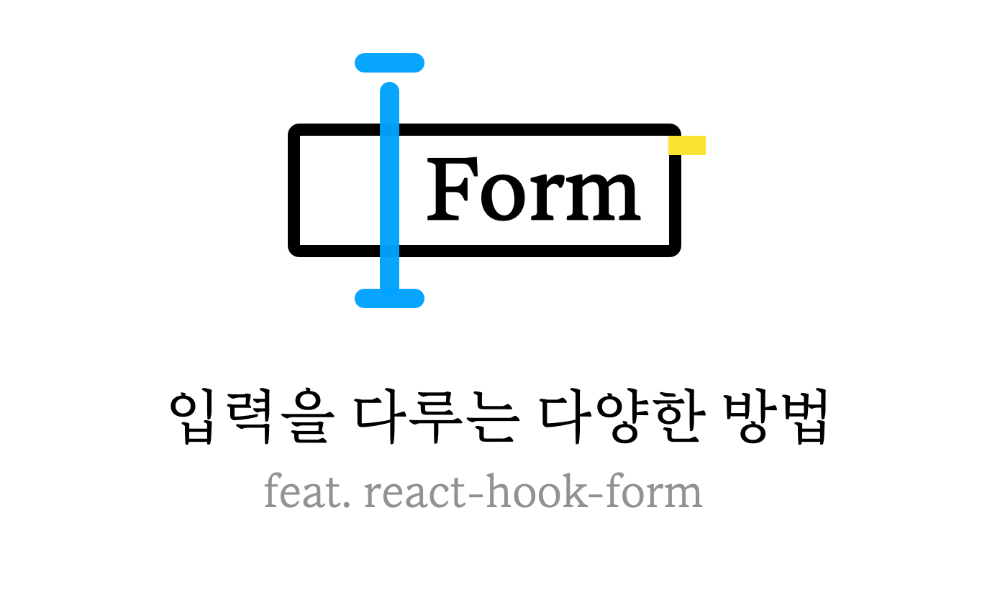
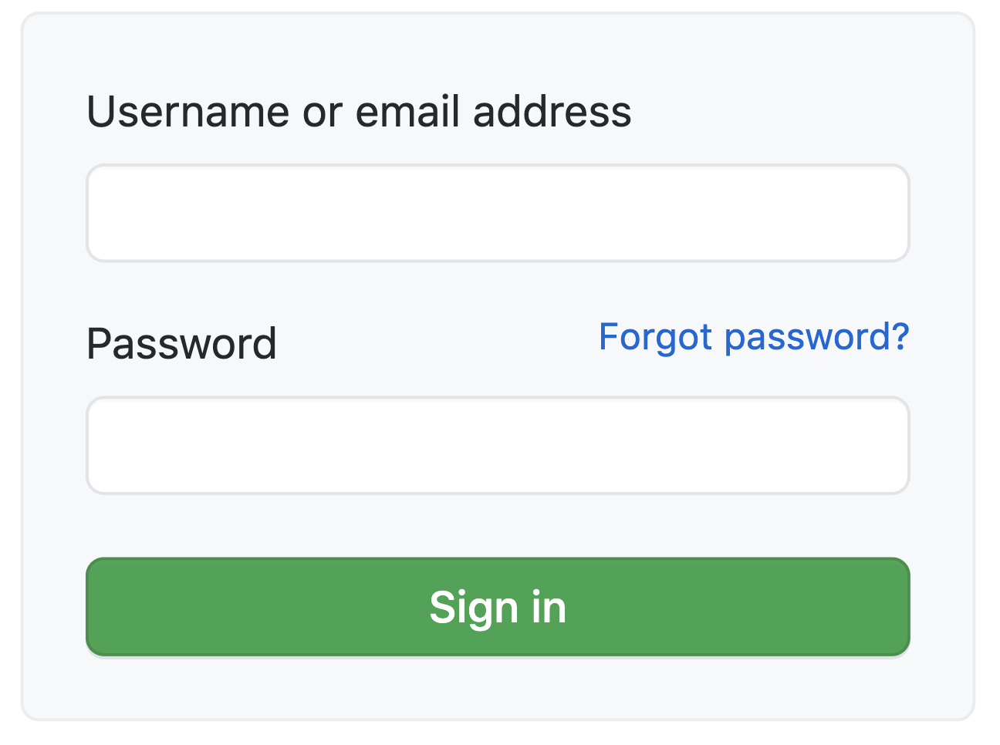
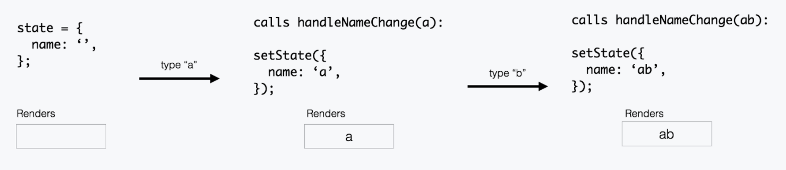
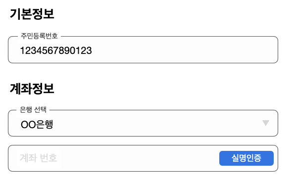

웹 애플리케이션에서 복잡한 문제 중 하나는 사용자의 입력 데이터를 받아 처리하는 Form입니다. 이 글에서는 Form을 다루는 여러 방법과 대표적 form 라이브러리 중 하나인 [react-hook-form](https://react-hook-form.com/)에 대해 소개합니다.

## 간단한 Form

Form에서 떠올릴 수 있는 단순한 예시는 Email과 Password를 받는 Login Form이다.



이 경우 각 input의 `value`를 다룰 state와 handler를 정의하고 넘겨주는 방식으로 구현할 수 있다.

```jsx
const EasyLoginForm = () => {
  const [email, setEmail] = useState('');
  const [password, setPassword] = useState('');

  const handleSubmit = () => {
    console.log('email', email, 'password', password);
  }

  return (
    <form onSubmit={handleSubmit}>
      <label>
        email
        <input
          type="text"
          value={id}
          onChange={(e) => setEmail(e.target.value)}
        />
      </label>
      <label>
        Password
        <input
          type="password"
          value={password}
          onChange={(e) => setPassword(e.target.value)}
        />
      </label>
    </form>
  )
}
```

위 예제에서 사용된 `input`들은 **Controlled** **Component**이다.

### Controlled Component

Controlled Component에서 form데이터는 컴포넌트의 상태로 관리된다.


<small>https://goshakkk.name/controlled-vs-uncontrolled-inputs-react/</small>

- 처음 상태는 빈 문자열이다. `''`
- `a`를 입력하면 `handleNameChange` 가 `a`를 가져오고, input은 a 값을 value로 가지도록 리렌더된다.
- `b`를 입력하면 `handleNameChange`는 `ab` 값을 가져와서 상태로 저장한다. input은 `ab`값을 가지도록 리렌더된다.

input의 value 변경을 항상 **push 하는 방식이기 때문에** data(state)와 UI(input)가 항상 동기화되고, 이로 인해 input의 value 값을 바로 참조할 수 있다.

## 복잡해지는 Form

form 개수가 늘어나고 복잡해질수록 필요한 코드 양이 늘어나며 상태를 공유하기 위한 [state lifting](https://reactjs.org/docs/lifting-state-up.html)이 많아진다. 이 경우 상위 컴포넌트에 상태가 집중되며 하위 컴포넌트들은 필연적으로 handler와 state를 주입받아야 하는 형태가 되기 때문에 컴포넌트 단위 재사용이 어려워진다.

```jsx
const HardRegisterForm = () => {
  const [email, setEmail] = useState('');
  const [password, setPassword] = useState('');
  const [address, setAddress] = useState('');
  const [phoneNumber, setPhoneNumber] = useState('');
  const [job, setJob] = useState('');
  const [aboutMe, setAboutMe] = useState('');

  return (
    <>
      <Input name='이메일' value={email} onChange={setEmail} />
      <Input name='비밀번호' value={password} onChange={setPassword} />
      <Input name='집주소' value={address} onChange={setAddress} />
    </>
  )
};
```

책임이 `HardRegisterForm`로 집중되었다. 값을 다루는 것 외에 유효성 검사 등의 로직이 추가되면 이 컴포넌트는 더 장황해질 것이다. 이 문제를 해결하기 위해 react의 [useImperativeHandle](https://reactjs.org/docs/hooks-reference.html#useimperativehandle) hooks를 사용하여 form을 나누고 각자의 상태를 관리하도록 격리시킬 수 있다.

```jsx
const BasicInformationFormGroup = (
  _,
  ref: Ref<{ values: BasicInfoFields }>
) => {
  const [name, setName] = useState('');
  const [aboutMe, setAboutMe] = useState('');
  const [phoneNumber, setPhoneNumber] = useState('');

  useImperativeHandle(
    ref,
    () => ({
      values: {
        name,
        aboutMe,
        phoneNumber,
      },
    }),
    [name, aboutMe, phoneNumber]
  );

  return (
    <>
      <Input name="이름" value={name} onChange={setName} />
      <Input name="내소개" value={aboutMe} onChange={setAboutMe} />
      <Input name="전화번호" value={phoneNumber} onChange={setPhoneNumber} />
    </>
  );
};
```

form을 분리하고 `useImperativeHandle` 을 통해 **각 input의 value만** 외부에 노출시켰다. 부모 컴포넌트에서는 `BasicInformationFormGroup`에 넘긴 `ref` 를 통해 값에 접근할 수 있다. 정보를 격리시킴으로써 각 컴포넌트의 책임을 적절히 분산시킬 수 있다.

이 외에도, 중첩된 컴포넌트 내부에서 값의 계산에 따른 처리가 필요할 때 **관련 로직을 응집도 있게** 처리할 수 있게 된다. 예를 들어, 선택된 은행 이름에 따라 해당 은행의 전체 정보가 필요한 경우를 생각해 보자.

```tsx
const 은행Form = () => {
  const bankList = useBankList();
  const [selectedBankName, setSelectedBankName] = useState('');
  const selectedBank = useMemo(() => {
    return bankList.data.find(({ name }) => name === selectedBankName);
  }, [bankList, selectedBankName]);

  const { handleBankAccountValidation } = useBankAccountValidation();

  return (
    <>
      <Select>
        {bankList.map(bank => (
          <Option key={bank.id} onChange={onchange(bank)}>
            {bank.name}
          </Option>
        ))}
      </Select>
      <계좌번호>
        <button onClick={handleBankAccountValidation} />
      </계좌번호>
    </>
  );
};
```

`은행Form` 이 **은행 선택**과 **계좌번호 입력**이라는 두 가지 정보를 관리하고 있다. 코드가 더 길어지면 각 정보에 대한 context를 파악하는 것이 어려워진다.

```tsx
const 은행Form = () => {
  const selectedBankRef = useRef(null);
  const { handleBankAccountValidation } = useBankAccountValidation();

  return (
    <>
      <은행_선택 ref={selectedBankRef} />
      <계좌번호>
        <button
          onClick={() => {
            handleBankAccountValidation(selectedBankRef.current.selectedBank);
          }}
        />
      </계좌번호>
    </>
  );
};

const 은행_선택 = (_, ref: Ref) => {
  const bankList = useBankList();
  const [selectedBankName, setSelectedBankName] = useState('');
  const selectedBank = useMemo(() => {
    return bankList.data.find(({ name }) => name === selectedBankName);
  }, [bankList, selectedBankName]);

  useImperativeHandle(ref, () => ({ selectedBank }), [selectedBank]);

  return (
    <Select>
      {bankList.map(bank => (
        <Option key={bank.id} onChange={onchange(bank)}>
          {bank.name}
        </Option>
      ))}
    </Select>
  );
};
```

`은행_선택` 컴포넌트를 만들고 선택된 은행 이름에 따라 은행 정보를 찾는 로직을 분리시켰다. 부모 컴포넌트에서 '선택된 은행'에 관한 정보를 알 수 있도록 ref를 통해 값을 반환하고 있다.

## Controlled Component에 대해 다시 생각해보기

Controlled Component 사용 방식을 개선했지만, 여전히 각 input마다 핸들러를 선언해 주어야 하고 form이 커질수록 리렌더링에 의한 성능 이슈를 겪을 수 있다.


모든 input 값을 state로 관리하면서, 특정 input 값만 변경해도 전체가 리렌더링 되고 있다. 최적화를 위해 memoization을 생각하기 전에 근본적인 질문을 던져보자.

### 모든 상태를 observing해야할까?

Form의 목적을 생각해 보자. Form은 사용자가 입력한 정보를 **제출 버튼을 눌렀을 때 submit 하는 것이 기본 동작이다.** 일부 input 들에 대해서 `onChange`마다 어떤 로직을 수행해야 할 수도 있지만, 이것이 기본 동작의 범위에 포함된다고 보기는 어렵다.

몰라도 되는 input 값의 변경 때문에 리렌더링이 발생하는 상황을 어떻게 해결하면 좋을까? 각각의 input을 isolate 하게 유지하려면 어떻게 해야 할까?

이 고민이 드는 순간 Uncontrolled Component로 다루는 방식을 고려해보면 좋다.

### Uncontrolled Component

Uncontrolled Component는 각 input의 value가 **DOM에 저장된다.** 상태 정의와 핸들러를 만드는 대신, `ref`를 이용해 DOM에 접근하여 이벤트를 핸들링한다.

```jsx
const NameForm = () => {
  const inputRef = useRef<HTMLInputElement>(null);

  function handleSubmit(event) {
    alert('A name was submitted: ' + inputRef.current.value);
  }

  return (
    <form onSubmit={handleSubmit}>
      <label>
        Name:
        <input type="text" ref={inputRef} />
      </label>
      <input type="submit" value="Submit" />
    </form>
  )
}
```

input의 value 변경을 구독하지 않고, 필요할 때 input에 전달한 ref를 통해 값을 **pull 하는 방식이다.**

### Uncontrolled Component로 변경해보기

위에서 만들었던 `BasicInformationFormGroup` 컴포넌트는 다음과 같이 Uncontrolled Component로 변경할 수 있다.

```jsx
const BasicInformationFormGroup = (
  _,
  ref: Ref<{ values: BasicInfoFields }>
) => {
  const nameRef = useRef<HTMLInputElement | null>(null);
  const aboutMeRef = useRef<HTMLInputElement | null>(null);
  const phoneNumberRef = useRef<HTMLInputElement | null>(null);

  useImperativeHandle(
    ref,
    () => ({
      get values() {
        return {
          name: nameRef.current?.value,
          aboutMe: nameRef.current?.value,
          phoneNumber: phoneNumberRef.current?.value,
        };
      },
    }),
    []
  );

  return (
    <>
      <Input ref={nameRef} name="이름" />
      <Input ref={aboutMeRef} name="내소개" />
      <Input ref={phoneNumberRef} name="전화번호" />
    </>
  );
};
```

각 input은 `value`와 `handler`를 prop으로 전달받을 필요 없게 되었다.

아까와 달라진 점은 [getter](https://developer.mozilla.org/ko/docs/Web/JavaScript/Reference/Functions/get)가 사용되었다는 것이다. `useImperativeHandle`의 두 번째 인자는 함수인데, 이때 Closure가 생성되며 값이 캡쳐링 된다. `getter`를 통해서 함수 반환되도록 하고, `values`를 참조하는 시점에 getter 함수가 호출되도록 하여 캡쳐링으로 인한 오류를 방지할 수 있다.

## Uncontrolled Component를 고려하기 어려운 상황들

Uncontrolled Component는 input value의 모든 변경을 구독하지 않고, 필요할 때 값을 pull 하는 방식이기 때문에 아래와 같은 상황에서 다루기 어렵다고 느낄 수 있다.

- onChange 시점의 유효성 검사 결과에 따라 특정 로직을 수행해야 하는 경우
- 많은 form이 서로의 값에 의존적인 경우

상태 값을 온전히 제어하지 않기 때문에, 어려울 수 있는 부분이지만 Uncontrolled Component에서 얻을 수 있는 여러 장점들(performance, 간결한 코드 등)을 포기하고 싶지 않았기 때문에 위 단점들은 react-hook-form의 [watch](https://react-hook-form.com/api#watch)와 [useFormContext](https://react-hook-form.com/api#useFormContext)를 활용하여 해결했다.

> 모든 기술에 '완벽한 정답'이 없듯, 이 부분이 Uncontrolled Component에서 여려운 부분이긴 하나 그럼에도 Uncontrolled Component를 포기하고 싶지 않았다. form을 다룰 때 신경 쓰이는 verbose함과 performance낭비를 해결해준다는 것만으로도 충분한 장점이 있다고 생각했다.

## [react-hook-form](https://react-hook-form.com/)

react-hook-form은 form을 Uncontrolled방식으로 쉽게 다룰 수 있도록 지원하는 라이브러리이다. 사용 예시와 함께 react-hook-form에 대해 살펴보자.

### input이 동적으로 추가되는 경우

입력할 수 있는 input이 동적으로 늘어나는 경우도 있다. `ref`를 전달하여 값에 접근한다면 field의 개수가 늘어날 때마다 ref를 생성해 주어야 하는데, 늘어날 값이 정해져 있지 않다면 불가능하다.

form의 개수가 늘어날 때마다 ID를 부여하고 데이터를 Map 구조로 다뤄야한다.

```jsx
// https://github.com/fitzmode/use-dynamic-refs/blob/master/src/index.tsx
const map = new Map<string, React.RefObject<unknown>>();

function useDynamicRefs<T>(): [
  (key: string) => void | React.RefObject<T>,
  (key: string) => void | React.RefObject<T>
] {
  return [getRef, setRef];
}

const Example = () =>  {
  const foo = ['random_id_1', 'random_id_2'];
  const [getRef, setRef] =  useDynamicRefs();

  return (
    <>
      { foo.map((eachId, idx) => (
        <input ref={setRef(eachId)} />))
      }
    </>
  )
}
```

위와 같이 직접 구현해서 사용해도 되지만, 이미 좋은 바퀴가 발명되어 있다. [useFieldArray](https://react-hook-form.com/api#useFieldArray)를 사용해서 간단하게 해결할 수 있다.

```jsx
const FIELD_NAME = 'test';
const ArrayForm = () => {
  const { control, register } = useForm();
  const { fields, append, prepend, remove, swap, move, insert } = useFieldArray(
    {
      control,
      name: FIELD_NAME,
    }
  );

  return (
    <>
      {fields.map((field, index) => (
        <input
          key={field.id}
          name={`${FIELD_NAME}[${index}].value`}
          ref={register()}
          defaultValue={field.value}
        />
      ))}
    </>
  );
};
```

### onChange 시점의 값에 따라 특정 로직을 수행해야 하는 경우

```tsx
const WatchedInput = () =>  {
  const { register, watch, errors, handleSubmit } = useForm();
  const watchShowAge = watch("showAge", false); // false: defaultValue

  const onSubmit = data => console.log(data);

  return (
    <form onSubmit={handleSubmit(onSubmit)}>
      <input type="checkbox" name="showAge" ref={register} />

      {watchShowAge && <input type="number" name="age" ref={register({ min: 50 })} />}
      <input type="submit" />
    </form>
  );
}
```

`showAge`의 값이 변경될 때마다 `WatchedInput` 은 리렌더링되고 true일 경우 `age input`을 렌더링 한다. `watch`는 Event Listener를 통해 변경을 구독하고 필드 값에 따라 리렌더링을 발생시킨다. Uncontrolled Component의 어려운 부분을 잘 해결한 부분이라고 생각하여 내부 원리가 궁금해졌고, 자세한 내용은 따로 정리해둔 [react-hook-form 톺아보기](https://github.com/SoYoung210/soso-tip/issues/53)에 정리했다.

### 많은 form이 서로의 값에 의존적인 경우



'기본정보'와 '계좌정보'를 각각 컴포넌트로 분리했는데, `계좌 실명인증` 시 은행명/계좌번호/**주민등록번호**가 필요한 상황을 생각해 보자.

이처럼 각 form이 서로의 값에 의존적인 경우 Component를 나누기 어렵고 이를 하나의 파일에서 처리하면 책임이 집중되고 props drilling이 심해진다. 지금은 하나의 참조여서 간단하게 해결할 수도 있지만, 컴포넌트가 깊게 중첩되어야 할수록 관리가 어렵다. 이런 상황은 [FormContext](https://react-hook-form.com/api#useFormContext)를 사용하면 쉽게 해결할 수 있다.

```tsx
const ParentForm = () => {
  const methods = useForm({
    mode: 'onBlur',
    defaultValues,
  });

  return (
    <FormProvider {...methods}>
      <기본정보 />
      <급여정보 />
    </FormProvider>
  )
}

const 계좌정보 = () => {
  const { getValues } = useFormContext();

  return (
    <급여계좌번호>
      <계좌실명인증
        onClick={() => {
          validateAccount(은행명, 계좌번호, getValues('주민등록번호'));
        }}
      />
    </급여계좌번호>
  );
};
```

`계좌정보` 컴포넌트 입장에서는 **주민등록번호가 외부 값이니,** FormContext와 연결되는 별도 컴포넌트를 만들어 값을 주입받도록 했다.

```tsx
export const ConnectRTHValue = ({
  children,
}: {
  children: (params: FormContextParamsType) => JSX.Element;
}) => {
  const methods = useFormContext();

  return children({ ...methods });
};

const ParentForm = () => {
  const methods = useForm();

  return (
    <FormProvider {...methods}>
      <기본정보 />
      <ConnectRTHValue>
        {({ getValues }) => (
          <급여정보 getSsnValue={() => getValues('주민등록번호')} />
        )}
      </ConnectRTHValue>
    </FormProvider>
  );
};

```

이렇게 [renderProps](https://reactjs.org/docs/render-props.html) 패턴으로 사용하면 하위 Form 컴포넌트를 react-hook-form과 같이 사용하는 경우와 그렇지 않은 경우 모두 활용할 수 있게 되고, Provider mocking 없이 테스트를 작성할 수 있기 때문에 테스트가 쉬워진다.

## 결론

모든 form에 잘 맞는 Best Practice는 없다. 이 글에서는 react-hook-form을 활용한 Uncontrolled Component로 다루는 방법을 주로 소개했지만, change event마다 특정 로직이 수행되어야 한다거나, 큰 규모의 form에서 값 의존 범위가 많을 때는 Controlled와 Context API조합으로 다루는 것이 더 좋은 선택지 일수 있다.

## Reference

- [https://reactjs.org/docs/uncontrolled-components.html](https://ko.reactjs.org/docs/uncontrolled-components.html)
- [https://react-hook-form.com/](https://react-hook-form.com/)
- [https://github.com/fitzmode/use-dynamic-refs](https://github.com/fitzmode/use-dynamic-refs/blob/master/src/index.tsx)
