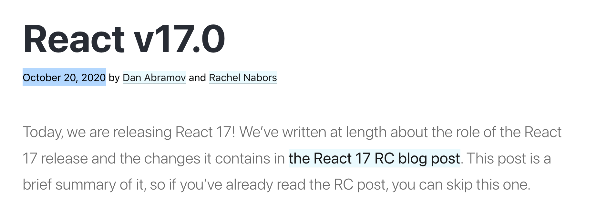
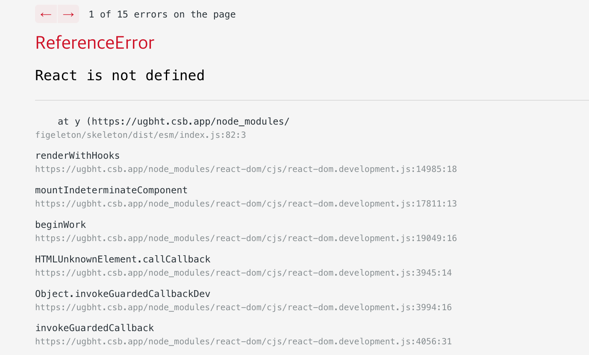

[React 17](https://reactjs.org/blog/2020/10/20/react-v17.html) shipped a new JSX Transform, and this post digs into the RFC behind it to work out what that change actually means.

> I've thrown in my own commentary and some guesswork along the way. If you've got feedback on any of it, a comment would be very welcome.

## The Trigger



React 17 came out on October 20, 2020. I'm writing this about a year and a half later because I recently hit a **React is not defined** error while using [esbuild](https://esbuild.github.io/), and it turned out to trace straight back to the JSX Transform change that shipped in React 17.



I had this vague memory in my head: **"you don't need `import React from ‘react’` anymore, starting with React 17."** Sure enough, my code had no React-import errors. But once I looked at the build output, the error made total sense.

```jsx {5}
// built js output
// references React but there's no React import
function y(V) {
	// ...
	return React.createElement($, ...)
}
```

Looking at just this much, you can piece together two things:

- making the React import optional isn't something React does on its own, and
- since it's not purely a React feature, something else has to be involved at build time — but that something isn't esbuild, at least not without extra setup.

That caveat, _'without extra setup,'_ is the giveaway: esbuild does document a separate configuration step for React.

## [esbuild auto-import for JSX](https://esbuild.github.io/content-types/#auto-import-for-jsx)

Since React code compiles down to `React.createElement`, esbuild's docs tell you to either add `import * as React from ‘React’` to every single file, or use [esbuild's inject](https://esbuild.github.io/api/#inject) to handle it all in one shot at build time.

> esbuild's inject feature is basically a polyfill mechanism: it swaps out references to a global variable for an export from the injected file. You can use it to make every reference to `React` resolve to the `react` package.

```jsx
// react-shim.js
import * as React from 'react'
export { React }
```

```bash
esbuild app.jsx --bundle --inject:./react-shim.js --outfile=out.js
```

## So Then...

But I'd never needed this kind of setup anywhere else I'd used React. Or more precisely, anywhere with [babel](https://babeljs.io/) already in the pipeline, it just worked without any extra config.

> Although [React 17 doesn’t contain new features](https://reactjs.org/blog/2020/08/10/react-v17-rc.html), it will provide support for a new version of the JSX transform. In this post, we will describe what it is and how to try it.

[The New JSX Transform doc](https://reactjs.org/blog/2020/09/22/introducing-the-new-jsx-transform.html) that came with React 17 spells this out. [A new JSX transform was built together with babel](https://babeljs.io/blog/2020/03/16/7.9.0#a-new-jsx-transform-11154httpsgithubcombabelbabelpull11154), and skipping the React import turned out to be one of its side effects.

## A New Transform?

Before React 17, JSX compiled down to `React.createElement`.

> Technically you need React 17+ and babel 7.9.0+, but babel 7.9.0 was deliberately released ahead of React 17, so chronologically, 'after React 17' is the more accurate framing.

```jsx
import React from 'react';

function App() {
  return <h1>Hello World</h1>;
}

// 👇👇👇👇👇👇
import React from 'react';

function App() {
  return React.createElement('h1', null, 'Hello world');
}
```

The `JSX → React.createElement` approach had two big problems:

- Since it references React directly, every file needs an `import React from ‘react’` line, no exceptions.
- It came loaded with performance and technical-debt baggage. (More on that in the RFC section below.)

The new transform compiles JSX to the `jsx` function from `react/jsx-runtime` instead. And you don't even have to reference `react/jsx-runtime` yourself — babel injects it for you at build time.

```jsx
function App() {
  return <h1>Hello World</h1>;
}

// 👇👇👇👇👇👇
import {jsx as _jsx} from 'react/jsx-runtime';

function App() {
  return _jsx('h1', { children: 'Hello world' });
}
```

> Flip `@babel/preset-react`'s `runtime` between `automatic` and `classic` on [babel/repl](https://babeljs.io/repl/#?browsers=defaults%2C%20not%20ie%2011%2C%20not%20ie_mob%2011&build=&builtIns=false&corejs=3.6&spec=false&loose=false&code_lz=JYWwDg9gTgLgBAbwGbQO4EMoBMBKBTJAXziSghDgHIo90BjGSgKCaQFcA7B4CDuAMQgQAFAEpETAJA0YbKH2FM4yuJIA8ACwCMAPiUqD6rMABuOjcDUB6Y2f0HlR0-eAAma7b2Hr2ncvtwokyELOxcMDx8ghCuYhLSeLLycIrevgHenhYezgHqVr7-BkEhQA&debug=false&forceAllTransforms=false&shippedProposals=false&circleciRepo=&evaluate=false&fileSize=false&timeTravel=false&sourceType=module&lineWrap=true&presets=env%2Creact%2Cstage-2&prettier=false&targets=&version=7.17.5&externalPlugins=&assumptions=%7B%7D) and you can watch the build output change accordingly.

## [RFC] A Proposal for a New JSX Transform Approach ( [PR1](https://github.com/facebook/react/pull/15141) / [PR2](https://github.com/facebook/react/pull/16432) )

Back in 2019, [Sebastian Markbåge](https://github.com/sebmarkbage) wrote [an RFC](https://github.com/reactjs/rfcs/blob/createlement-rfc/text/0000-create-element-changes.md) arguing that `createElement` needed to change. It proposes simplifying how `React.createElement` behaves, with the eventual goal of removing the need for forwardRef entirely.

> What follows trims and edits parts of the original RFC.

### History

React 0.12 changed how `key`, `ref`, and `defaultProps` behave in a big way. All three now get evaluated before `React.createElement(...)` is even called.

- If I had to guess what the RFC means by that _"big change"_ in React 0.12...
  - (1) [breaking change key and ref removed from this.props](https://ko.reactjs.org/blog/2014/10/16/react-v0.12-rc1.html#breaking-change-key-and-ref-removed-from-thisprops): 
    key and ref stopped counting as component props. The idea being that key and ref exist so something outside the component can control it, not something the component itself needs to know about. (There were reportedly performance concerns behind this too.)
      - `someElement.props.key` → `someElement.key` 
  - (2) [breaking change default props resolution](https://ko.reactjs.org/blog/2014/10/16/react-v0.12-rc1.html#breaking-change-default-props-resolution): `defaultProps` now resolves at mount time instead of when the ReactElement gets created, meaning it's evaluated earlier than the rest of the props.

`React.createElement` made perfect sense back when class components dominated. Once function components took over, it became something worth reconsidering.

Here are some of its bigger downsides:

- A component with `defaultProps` forces a pile of dynamic checks, since `defaultProps` can hold basically anything, and that makes it hard to optimize around.
- `defaultProps` doesn't work with `React.lazy`, so you always have to check whether it even exists, even during the render phase.
- `children` gets passed to `React.createElement` as variadic arguments, which then have to get dynamically patched back onto props.
    - Passed as variadic arguments looks like this:
        
        ```jsx
        <Foo bar="bar">
        	<div>hi</div>
        	<div>hi2</div>
        </Foo>
        
        // 👇👇👇👇👇👇
        React.createElement(
        	Foo,
        	{ bar: 'bar' },
        	React.createElement('div', null, 'hi'),
           // no argument at all if <div>hi2</div> isn't present
        	React.createElement('div', null, 'hi2'),
        )
        ```
        
- Anything built on `React.createElement` needs a dynamic property lookup.
- There's no guarantee the props you receive are immutable, so you always have to clone them before touching them internally.
- `key` and `ref` have to be stripped out of props, so if they somehow end up in there, something has to delete them.
- A pattern like `<div {...props} />` means checking, every single time, whether key or ref snuck in.
- Since the output takes the shape of `React.createElement`, that output always has to carry a `React` import. Ideally, using JSX shouldn't require importing anything at all.

Performance aside, the new JSX Transform also exists to lower the bar for actually understanding React. Cutting the need for things like `defaultProps` and `forwardRef`, and pushing JSX toward being more **standardized**, both mean shaking off React's more arcane legacy behavior.

### Proposal 1. Auto-import

First on the list: get rid of the rule that **"React has to be declared somewhere in scope for JSX to work."**

Ideally, element creation would just be part of the transpiler's own runtime. But that raises a couple of concerns.

First, React splits into a DEV mode and a PROD mode, and DEV mode is far more complex and far more tightly coupled to React than PROD mode is.

Second, it's simply easier for users to adopt a change through a new react package release than through updating their build tooling.

For both reasons, the actual implementation still has to live in the react package. Here's the shape the RFC proposes:

```jsx
function Foo() {
  return <div />;
}

// 👇👇👇👇👇👇
import {jsx} from "react";
function Foo() {
  return jsx('div', ...);
}
```

### Proposal 2. Split `key` Out of Props

Before, `key` was excluded from `this.props`, but `React.createElement` still bundled it in with the rest of the props as just another argument. The new `jsx` approach separates it out into its own argument instead of passing it alongside props.

```jsx
jsx('div', props, key)
```

> The RFC doesn't spell out its exact reasoning here, but it reads like a mix of easier maintenance and a general push to keep props and key more clearly separated.

### Proposal 3. Always Pass `children` as a Prop

`createElement` passed `children` as variadic arguments. The new approach just always tucks it into props instead.

The old variadic style existed so DEV mode could tell static children apart from dynamic ones.

> (Speculation) "So DEV can tell them apart"?  
  What the RFC author probably means by "distinguishing static children from dynamic children in DEV" is the warning DEV mode throws when dynamic children — array-type children, that is — don't have unique keys. Look at [L462 ~ L479](https://github.com/facebook/react/blob/40eaa22d9af685c239f9d8d42b454d031791e76d/packages/react/src/ReactElementValidator.js#L462-L479) of [createElementWithValidation](https://github.com/facebook/react/blob/main/packages/react/src/ReactElementValidator.js#L413) and you'll find logic that validates key based on the type of `arguments` it received.
    

The new proposal looks like this:

```jsx
<div>{a}{b}</div>
// 👇👇👇👇👇👇
jsx('div', { children: [a, b] })

<div>{a}</div>
// 👇👇👇👇👇👇
jsx('div', { children:a })
```

### Proposal 4. A DEV-only Transformer

In DEV, attributes like `__source` and `__self` skip props entirely and get passed as their own separate arguments. The fix here is just splitting off a dedicated DEV function.

```jsx
// function used only in DEV
jsxDEV(type, props, key, isStaticChildren, source, self)
```

### Proposal 5. Deprecate `defaultProps` on Function Components

Honestly, function components never actually needed it in the first place.

### Proposal 6. Deprecate `key` Spread

```jsx
let randomObj = {key: 'foo'};
let element = <div {...randomObj} />;
element.key; // 'foo' 
```

There's no static way to tell whether `key` got passed in, so it always needed a dynamic lookup. Since it can't be analyzed statically and that lookup isn't cheap, key spreading is no longer supported.

### Proposal 7. Move `ref` Extraction to Class, forwardRef Render Time

This changes how `ref` gets handled under the hood. A minor release starts warning on any access to `element.ref`. The next major release copies ref onto both `props` and `element.ref`, but React then switches to treating `props.ref` as the single source of truth for `forwardRef`.

## Wrapping Up

Writing this up, what stuck with me wasn't just the technical content itself. It was watching how much thought went into shaping a change the ecosystem could actually absorb, and how it landed without asking React's end users, meaning the developers actually using it, to pay any cost at all.

A few other things I found interesting while going through the RFC and its related updates, to close this out.

- Passing `children` as dynamic positional arguments existed purely to support a DEV warning check.
    - Question I had: the new proposal switches the data type based on the shape of children (object or array) — wouldn't it be simpler, for the sake of lower complexity, to just always keep it as an array and check the length?
- The DEV-only transformer
    - Paying a big cost for a DEV-only feature seemed like it should matter less than paying for something in PROD — but given that developers are React's end users, treating it as just as important as PROD mode is actually the right call.
- How much thought went into keeping the cost of the change as low as possible
    - The RFC shows concerns about the JSX Transform go back a long way, but tooling support apparently couldn't keep pace, which seems to be what slowed things down.
    - The RFC's author originally wanted something more clearly set apart from a regular prop, something like `@key`... but didn't go with it, since it would have inflated the change unnecessarily. (Probably judged the benefit wasn't worth the extra size.)
- "Ideally, element creation would just be the transpiler's own runtime"
    - Propagating a change through a react release beats propagating it through a toolchain update, so this settles for the next-best option to handle DEV/PROD mode.
