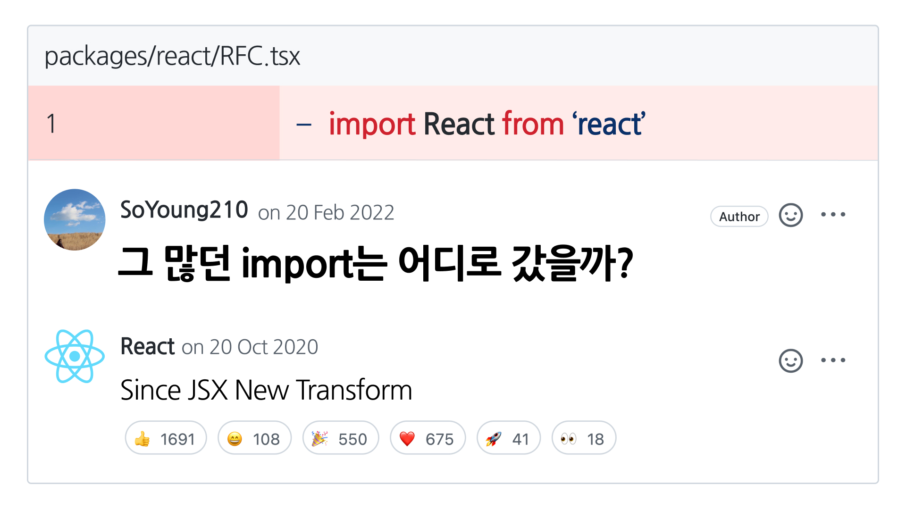

이 글에서는 [React 17릴리즈](https://reactjs.org/blog/2020/10/20/react-v17.html)에 포함되었던 JSX Transform의 RFC문서를 살펴보며 이 변경사항이 어떤 의미를 가지고 있는지 정리해 보았습니다.

> 중간중간 내용에 대한 첨언과 약간의 추측을 덧붙였습니다. 관련하여 피드백이 있으시다면 댓글로 남겨 주시면  감사하겠습니다.

## 발단


React17은 2020년 10월 20일에 릴리즈되었다. 이 글이 릴리즈 이후 약 1년 반 뒤인 지금 작성되는 이유는 최근 [esbuild](https://esbuild.github.io/)를 사용하며 **React is not defined** 에러를 마주했고, 이 오류는 React17릴리즈에 포함되었던 JSX Transform변경사항과 관련있기 때문이다.


**“React17부터는 `import React from ‘react’` 를 안 해도 된다.”**라는 막연한 기억이 있었고, 작성한 코드에서도 React import관련 에러는 없었다. 하지만 빌드 결과물을 보면 에러는 당연한 결과이다.

```jsx{5}
// 빌드된 js
// React를 참조하지만 React import는 없음
function y(V) {
	// ...
	return React.createElement($, ...)
}
```

여기까지의 현상을 본다면

- React를 import하지 않아도 되도록 처리해주는 것은 React 단독의 기능이 아니며
- React의 기능이 아니라는 것은 빌드시점에 관여하는 ‘무언가’이지만 그것이 (다른 설정이 추가되지 않은)esbuild는 아니다.

라는 점을 추측할 수 있다. _'다른 설정이 추가되지 않은'_ 이라고 언급한 부분에서 알 수 있듯, esbuild는 React를 위한 별도의 설정을 안내한다.

## [esbuild auto-import for JSX](https://esbuild.github.io/content-types/#auto-import-for-jsx)

esbuild문서에서는 React코드가 `React.createElement` 로 변환되니 파일마다 `import * as React from ‘React’`코드를 추가하거나 [esbuild의 inject](https://esbuild.github.io/api/#inject)를 사용하여 빌드과정에서 한 번에 처리하는 방법을 안내하고 있다.

> esbuild inject기능은 전역변수에 대한 참조를 inject된 파일의 export로 대체하는 일종의 폴리필 기능이며,  `React`에 대한 참조를 `react`패키지를 참조할 수 있도록 설정해 줄 수 있다.

```jsx
// react-shim.js
import * as React from 'react'
export { React }
```

```bash
esbuild app.jsx --bundle --inject:./react-shim.js --outfile=out.js
```

## 그렇다면...

React를 다른 곳에서 사용할 때에는 이런 설정이 필요하지 않았다. 정확히 말하면 [babel](https://babeljs.io/)이 함께 있는 곳에서는 별다른 설정 없이 사용할 수 있었다.

> Although [React 17 doesn’t contain new features](https://reactjs.org/blog/2020/08/10/react-v17-rc.html), it will provide support for a new version of the JSX transform. In this post, we will describe what it is and how to try it.

React17에 포함되었던 [the New JSX Transform문서](https://reactjs.org/blog/2020/09/22/introducing-the-new-jsx-transform.html)를 읽어보면 관련 내용이 자세히 설명되어있다. [babel과 함께 새로운 JSX transform](https://babeljs.io/blog/2020/03/16/7.9.0#a-new-jsx-transform-11154httpsgithubcombabelbabelpull11154)을 개발했고, 이로 인한 부수효과 중 하나가 React를 import하지 않아도 되는 것이다.

## 새로운 Transform?

React17이전의 방식은 JSX를 `React.createElement`로 변환하는 것이다.

> React17버전 이상이면서 babel 7.9.0이상이어야 하지만, babel 7.9.0버전이 의도적으로 React17보다 먼저 릴리즈 되었으므로 시점상은 ‘React17이후’가 맞다.

```jsx
import React from 'react';

function App() {
  return <h1>Hello World</h1>;
}

// 👇👇👇👇👇👇
import React from 'react';

function App() {
  return React.createElement('h1', null, 'Hello world');
}
```

`JSX → React.createElement` 방식은 크게 두 가지 문제가 있었는데,

- React를 참조하기 때문에 작성하는 코드에 `import React from ‘react’` 구문이 반드시 있어야 한다.
- 성능과 기술부채 등 많은 제약이 있다. (이에 대해서는 관련 RFC문서 소개 부분에서 다룬다.)

새로운 방식은 JSX를 `react/jsx-runtime`의 `jsx`함수로 변환하는 것이다. 더불어, 개발자가 직접 `react/jsx-runtime`참조를 명시할 필요 없이, 빌드시점에 babel이 inject하는 방식으로 변경되었다.

```jsx
function App() {
  return <h1>Hello World</h1>;
}

// 👇👇👇👇👇👇
import {jsx as _jsx} from 'react/jsx-runtime';

function App() {
  return _jsx('h1', { children: 'Hello world' });
}
```

> [babel/repl](https://babeljs.io/repl/#?browsers=defaults%2C%20not%20ie%2011%2C%20not%20ie_mob%2011&build=&builtIns=false&corejs=3.6&spec=false&loose=false&code_lz=JYWwDg9gTgLgBAbwGbQO4EMoBMBKBTJAXziSghDgHIo90BjGSgKCaQFcA7B4CDuAMQgQAFAEpETAJA0YbKH2FM4yuJIA8ACwCMAPiUqD6rMABuOjcDUB6Y2f0HlR0-eAAma7b2Hr2ncvtwokyELOxcMDx8ghCuYhLSeLLycIrevgHenhYezgHqVr7-BkEhQA&debug=false&forceAllTransforms=false&shippedProposals=false&circleciRepo=&evaluate=false&fileSize=false&timeTravel=false&sourceType=module&lineWrap=true&presets=env%2Creact%2Cstage-2&prettier=false&targets=&version=7.17.5&externalPlugins=&assumptions=%7B%7D)에서 `@babel/preset-react`의 `runtime`을 각각 `automatic`, `classic`으로 바꾸어보면 빌드 결과물이 상이한 것을 확인할 수 있다.

## [RFC] JSX의 Transform방식에 대한 제안( [PR1](https://github.com/facebook/react/pull/15141) / [PR2](https://github.com/facebook/react/pull/16432) )

2019년 [Sebastian Markbåge](https://github.com/sebmarkbage)에 의해  `createElement`방식을 변경해야 한다는 [RFC](https://github.com/reactjs/rfcs/blob/createlement-rfc/text/0000-create-element-changes.md)가 작성되었다. `React.createElement` 의 동작방식을 단순화하고 궁극적으로는 forwardRef의 필요성을 제거할 방안을 제안하고 있다.

> 아래 내용은 원문 RFC의 내용 중 일부를 생략하거나 편집한 내용이다.

### History

React 0.12에서 `key` `ref` `defaultProps` 동작방식에 큰 변화가 있었다. 세 가지 속성은 `React.createElement(...)` 이 호출되기 전에 미리 평가된다.

- RFC에서 언급한 React 0.12버전의 _"큰 변화"_ 를 추측해보자면...
  - (1) [breaking change key and ref removed from this.props](https://ko.reactjs.org/blog/2014/10/16/react-v0.12-rc1.html#breaking-change-key-and-ref-removed-from-thisprops): 
    key, ref는 컴포넌트의 prop으로 보지 않는다는 내용이다. key와 ref는 컴포넌트를 외부에서 컨트롤하기 위한 값이지 내부에서 알 필요가 있는 값은 아니라는 것이다. (관련 성능 이슈도 있었다고 한다.)
      - `someElement.props.key` → `someElement.key` 
  - (2) [breaking change default props resolution](https://ko.reactjs.org/blog/2014/10/16/react-v0.12-rc1.html#breaking-change-default-props-resolution): `defaultProps`는 ReactElement생성 시점이 아니라 마운트 시점에 resolve된다. 즉 다른 속성들보다 빨리 평가된다는 뜻이다.

`React.createElement`는 클래스 컴포넌트를 주로 사용하던 시기에는 합리적인 방식이었으나 함수형 컴포넌트를 적극적으로 사용하면서부터는 재고의 여지가 있는 방식이 되었다.

대표적인 단점들을 몇 가지 소개하면

- 컴포넌트가 `defaultProps`를 가질 경우 다양한 동적 테스트를 추가해야 한다. `defaultProps`는 다양한 값을 가질 수 있기 때문에 최적화가 어렵다.
- `defaultProps` 는 `React.lazy` 와 함께 사용할 수 없기 때문에 render phase에서도 `defaultProps`존재여부를 항상 체크해야 한다.
- `children`은 `React.createElement`에 가변 인자로 전달되는데, props에 동적으로 패치해줘야 한다.
    - `React.createElement`에 가변 인자로 전달한다는 것은 아래와 같은 형태를 의미한다.
        
        ```jsx
        <Foo bar="bar">
        	<div>hi</div>
        	<div>hi2</div>
        </Foo>
        
        // 👇👇👇👇👇👇
        React.createElement(
        	Foo,
        	{ bar: 'bar' },
        	React.createElement('div', null, 'hi'),
           // <div>hi2</div>가 없다면 인자 없음
        	React.createElement('div', null, 'hi2'),
        )
        ```
        
- `React.createElement` 를 사용하는 구현은 dynamic property lookup이 필요하다.
- 전달된 props의 불변성을 보장할 수 없으므로 내부에서 항상 clone 후 사용해야한다.
- `key`와 `ref`는 prop에서 제외되어야 하므로 만약 prop에 포함되었을 경우, 해당 prop을 삭제해줄 필요가 있다.
- `<div {...props} />` 와 같은 패턴에서 key와 ref가 포함되었는지 여부를 매번 판단해야 한다.
- 변환후 결과가 `React.createElement`형태이기 때문에 변환된 결과에 `React`import가 반드시 포함되어 있어야 한다. 이상적으로는 JSX를 사용하기 위해 아무것도 import할 필요가 없어야 한다.

새로운 JSX Transform이 필요한 이유는 성능적인 이슈 외에도, React를 사용하는 데에 있어 필요한 지식의 허들을 낮추는 목적도 있다. `defaultProps`나 `forwardRef` 의 필요성, 그리고 더 나아가 JSX가 좀 더 **표준화**되려면 React의 난해한 레거시 동작에서 벗어날 필요가 있다.

### 제안 1. Auto-import

가장 첫 번째로, **“JSX범위에 React가 선언되어 있어야 한다.”**는 제약사항을 제거해야 한다.

이상적으로는 element를 생성하는 시점이 transpiler 자체의 런타임이 되어야 하지만, 이 방식에는 몇 가지 우려 사항이 있다.

첫 번째는, React는 DEV모드와 PROD모드가 나누어져 있다는 것인데, DEV모드는 PROD모드에 비해 훨씬 더 복잡하고 React에 의존적이다.

두 번째는, 사용자들이 새로운 변경사항을 받아들이는 데에 있어 build tool의 업데이트보다는 react패키지에서 새 버전을 배포하는 것이 더 쉽다.

위 이유로 실제 구현은 여전히 react패키지에서 관리될 필요가 있고, 아래와 같은 방식을 제안한다.

```jsx
function Foo() {
  return <div />;
}

// 👇👇👇👇👇👇
import {jsx} from "react";
function Foo() {
  return jsx('div', ...);
}
```

### 제안 2. props에서 `key`분리

기존에는 `key`가 `this.props`참조에서는 제외되더라도 `React.createElement`에서는 다른 props들과 동일한 인자로 다뤄졌다. 새로운 방식인 `jsx`에서는 key를 prop과 함께 전달하지 않고 분리된 인자로 전달되도록 다뤄야 한다.

```jsx
jsx('div', props, key)
```

> RFC문서에서는 자세한 이유가 언급되지 않았지만, 관리 용이성과 함께 props와 key를 좀 더 분리하고자 했던 시각에 기인한 것으로 보인다. 

### 제안 3. children은 항상 prop으로 넘기도록

`createElement`에서 `children`은 가변 인자로 전달되었던 것에 반해 새로운 방식에서는 항상 props에 추가한다.

기존에 가변 인자로 전달했던 이유는 DEV에서 정적인 children과 동적인 children을 구별하기 위해서였다.

> (추측) “DEV에서 구별하기 위해”?  
  RFC작성자가 말한 “DEV에서의 정적인 children과 동적인 children을 구별"하는 상황은 DEV에서 동적인 children, 그러니가 배열 타입의 children에 대해 key가 유니크하지 않을 시 경고를 주는 것을 말하는 것 같다. [createElementWithValidation](https://github.com/facebook/react/blob/main/packages/react/src/ReactElementValidator.js#L413)의 [L462 ~ L479](https://github.com/facebook/react/blob/40eaa22d9af685c239f9d8d42b454d031791e76d/packages/react/src/ReactElementValidator.js#L462-L479)을 살펴보면 `arguments` 타입에 따라 key를 검증하는 로직이 있는 것을 볼 수 있다.
    

새로운 제안은 아래와 같은 형식이다.

```jsx
<div>{a}{b}</div>
// 👇👇👇👇👇👇
jsx('div', { children: [a, b] })

<div>{a}</div>
// 👇👇👇👇👇👇
jsx('div', { children:a })
```

### 제안 4. DEV only transformer

DEV에서는 `__source` 나 `__self` 같은 속성은 prop으로 전달하지 않고 별도의 인자로 전달한다. 이는 DEV용 함수를 분리하는 것으로 해결한다.

```jsx
// DEV에서만 사용하는 함수
jsxDEV(type, props, key, isStaticChildren, source, self)
```

### 제안 5. 함수형 컴포넌트에서 `defaultProps` deprecated

사실 원래부터 함수형 컴포넌트에서는 필요하지 않았다.

### 제안 6. `key` spread deprecated

```jsx
let randomObj = {key: 'foo'};
let element = <div {...randomObj} />;
element.key; // 'foo' 
```

`key`가 전달되었는지 여부를 정적으로 알 수 없으므로 항상 dynamic lookup이 필요했다. 정적으로는 분석할 수 없고, 연산의 비용이 비싸기 때문에 key는 spread 문법으로 지원하지 않는다.

### 제안 7. `ref` 추출을 class, forwardRef render time으로 변경

내부적으로 `ref`를 다루는 방식을 변경한다. minor업데이트에서는 `element.ref` 접근에 대해 경고를 표시하고, 다음 major 업데이트에서는 `props`와 `element.ref`모두에 ref를 복사하지만, React는 `props.ref` 를 `forwardRef`에 대한 싱글 소스로 사용하는 변경을 적용한다.

## 맺으며

이번 내용을 정리하면서 흥미로웠던 것은 기술적인 내용 그 자체도 있었지만, 변경사항을 생태계가 수용 가능한 형태가 무엇일지에 대한 고민과 변경을 적용하는 데에 있어 React의 End user, 즉 React를 사용하는 개발자들이 부담 할 지불은 하나도 없는 상태로 적용했다는 것이었습니다.

그 외에 RFC문서와 관련 업데이트를 살펴보며 개인적으로 재미있었던 포인트 몇 가지를 정리하며 이 글을 마무리 합니다.

- `children`을 동적인 포지셔널 인자로 넘겼던 것이 DEV에서의 warning체크를 위해서였다.
    - 의문점: 새로운 제안에서는 children형태에 따라 자료형을 바꾸는 선택을 했는데(object or array) 복잡도를 낮추는 측면에서는 항상 배열로 두고 length체크가 더 간편하지 않나?
- DEV only transformer
    - DEV only기능을 위해 큰 비용을 지불하는 것이 PROD의 기능들보다는 덜 가치있지 않나? 라는 생각이 들었지만, React의 End user는 개발자라는 점을 생각해볼 때 PROD모드 만큼의 중요성을 가지는 것은 합당한 결정이다.
- 문제해결에 있어 가능한 변경cost를 낮추면서 진행하기 위한 고민들
    - RFC를 살펴보면 JSX Transform에 대한 고민은 꽤 예전부터 있었지만, 도구의 지원이 따라주지 않아 더 빠르게 진행하기 어려웠던 것으로 보인다.
    - RFC원작자는 `key` 라는 prop을 `@key` 등... 기존과 더 구분되는 방식을 원했지만 이는 변경사항을 불필요하게 크게 늘리는 방향이라 선택하지 않았다. (변경대비 이점이 적다고 판단하지 않았을까)
- “이상적으로는 element를 생성하는 시점이 transpiler 자체의 런타임이 되어야 하지만”
    - toolchain에 대한 업데이트보다 react의 업데이트를 통한 전파가 더 쉽고, DEV/PROD 모드에 대한 핸들링을 위해 차선을 선택한다.
