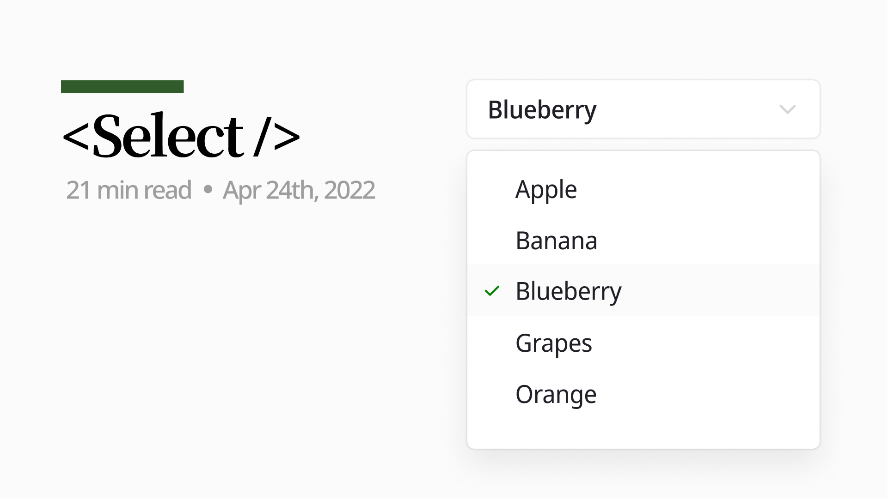
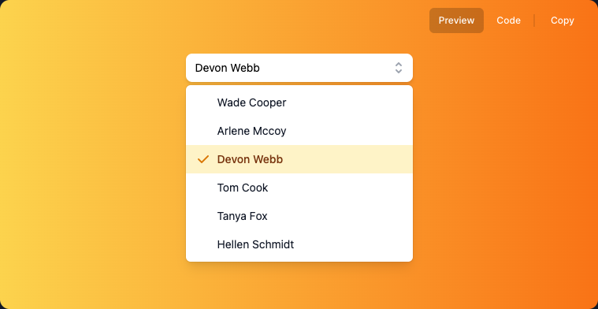
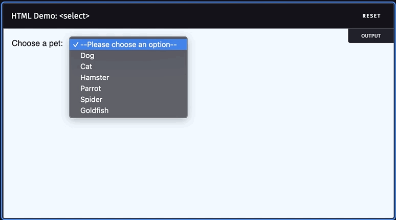
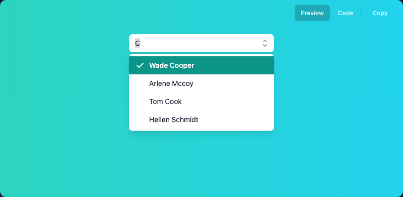
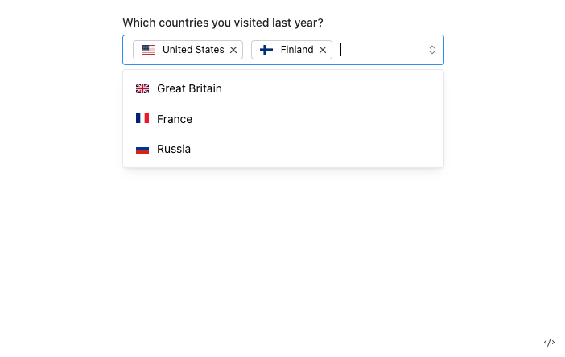

## Intro

What do you expect from a `Select` component when a design system provides one?

Here I'll go through the features I want out of a Select, how to build them, and example code along the way.

> ⚠️ Every snippet here is **pseudo code**, meant to explain the idea rather than to actually run.

## Table of Contents

- [Why](#why)
- [What: the functionality](#what-기능-정의)
- [How: building it](#how-구현)
- [Extra 1) Autocomplete Select](#번외-1-자동완성-select)
- [Extra 2) A Multi Select decoupled from any UI](#번외-2-multi-select이되-ui와-결합-되지-않는)
- [Extra 3) The native element still matters](#번외-3-기본-element는-중요하다)
- [Wrapping up](#맺으며)

## Why



<div style="opacity: 0.5" align="right">
    <sup><a href="https://headlessui.dev/react/listbox" target="_blank">https://headlessui.dev/react/listbox</a></sup>
</div>

Say **"I'm using the Select component from our design system."** What you're picturing is probably something with a polished UI, like the screenshot above. Select gets this much attention here because pairing a plain `<select>` element with that kind of UI, and good UX on top, is a lot harder than it is for most other elements.

A Button component, for instance, is usually just a `<button>` with CSS **applied** directly on top. Select isn't so forgiving: [the CSS it accepts is limited](https://developer.mozilla.org/ko/docs/Web/HTML/Element/select#css_%EC%8A%A4%ED%83%80%EC%9D%BC%EB%A7%81), so "just style it" doesn't really work.

So how do you build something that keeps `<select>`'s behavior, lets you customize the UI, and still holds up on accessibility? Let's dig in.

### An interface close to the native element

Before writing any implementation, let's pin down the interface first. Here's what `<select>` looks like:

```html
<label for="pet-select">Choose a pet:</label>

<select name="pets" id="pet-select">
  <option value="">--Please choose an option--</option>
  <option value="dog">Dog</option>
  <option value="cat">Cat</option>
  <option value="hamster">Hamster</option>
</select>
```

It'd be tempting to dodge the hard parts by taking `value` as an array and rendering the `option`s internally, but that leaves you with something rigid and hard to extend. So the component we're building here keeps `<select>`'s exact interface and behavior.

## What: the functionality

Working from what `<select>` already does natively, here's what we need:

- Keyboard or mouse can open and close the option list.
- While the list is open, the selected option is focused, and you can navigate between options with the keyboard.
- You can search within the options.
- You can select an option with the keyboard.

## How: building it

What approach, and what data (state), actually gets us those requirements? Let's go through them again, this time from an implementation angle.

- Keyboard or mouse can open and close the option list.
  - Needs an `open` state that decides whether the options render at all.
- While the list is open, the selected option is focused, and you can navigate between options with the keyboard.
  - Each option's "selected" status is derived from the `Select` component's `value` prop.
  - We need each option's [ref](https://reactjs.org/docs/refs-and-the-dom.html) and its value.
- You can search within the options.
  - Same requirement as above.
- You can select an option with the keyboard.
  - Pressing Enter on an option needs to update Select's "selected value" state to that option's value.

### Compound Component API

With the requirements more concrete, the interface needs to get more concrete too. Splitting up all that responsibility cleanly calls for `Select` and `Option` working together, and the [Compound Component](https://kentcdodds.com/blog/compound-components-with-react-hooks) pattern is exactly the tool for that.

A **"Compound Component"** is just two or more components working together to deliver one piece of functionality. It's typically a parent and its children, sharing state behind the scenes that never leaks out to the consumer.

```html
<select>
  <option value="value1">key1</option>
  <option value="value2">key2</option>
  <option value="value3">key3</option>
</select>
```

Look at how `<select>` and `<option>` relate to each other: each is its own element, but neither does anything on its own.

And yet that's the best possible interface for it. If we fixated only on "these can't stand alone," we might end up writing something like this instead:

```html
<select options="key1:value1;key2:value2;key3:value3"></select>
```

That looks simple enough if all you need is `value`, but once you factor in things like `disabled`, it stops being a good API.

So `Select` ends up with the interface below, quietly sharing `open` and `value` between `<Select>` and `<Select.Option>`.

```jsx
<Select open={open} defaultValue="value">
  <Select.Trigger>open select</Select.Trigger>
  <Select.OptionList>
    <Select.Option value="value1">value1</Select.Option>
    <Select.Option value="value2">value2</Select.Option>
    <Select.Option value="value3">value3</Select.Option>
  </Select.OptionList>
</Select>
```

Compared to plain `<select>`, we've added `Trigger` and `OptionList`.

`Trigger` handles opening the options, something `<select>` doesn't even need since browsers do it natively. `OptionList` gives consumers a place to customize styling and pass whatever props a list needs, while internally it's also where `Select` manages things like `value`. (More on that below.)

### Context

`OptionList` has to decide whether to render its children based on `Select`'s `open` state, so `Select` and its children need a way to share state.

The [Context API](https://reactjs.org/docs/context.html#gatsby-focus-wrapper) exists for exactly this: sharing state between components that are otherwise independent. We put a Provider on the top-level component, and `OptionList` reads `open` off context to decide what to render.

```jsx
function Select() {
 const [open = false, setOpen] = useControllableState({
    prop: openProp,
    defaultProp: defaultOpen,
    onChange: onOpenChange,
  });

 return (
  <SelectContext.Provider
    value={{ open, onOpenChange: setOpen }}
  >
    {children}
  </SelectContext.Provider>
 )
}

function OptionList() {
 const context = useSelectContext()

 return (
  <Ul role="listbox" onInteractOutside={context.onOpenChange}>
    {context.open ? children : null}
  </Ul>
 )
}
```

Whether an Option counts as "selected" can be worked out the same way.

```tsx
// omitted: duplicate code from above

function Select() {
  // ✅ declare the hook that manages the 'currently selected value'
 const [value = '', setValue] = useControllableState({
    prop: valueProp,
    defaultProp: defaultValue,
    onChange: onValueChange,
  });

 return (
  <SelectContext.Provider
    value={{ value, onValueChange: setValue }}
  >
    {children}
  </SelectContext.Provider>
 )
}

function OptionList() {
 const context = useSelectContext()

 return (
  <Ul role="listbox" onItemSelect={context.onValueChange}>
    {context.open ? children : null}
  </Ul>
 )
}

function Options() {
 const context = useSelectContext()

 return (
  <li role="option">
    {children}
    {/* ✅ if context's 'value' matches the prop's value, treat it as selected */}
    {context.value === props.value ? 'selected' : ''}
  </li>
}
```

That covers the core implementation and design direction. I won't dig into it here, but item selection, keyboard handling, and the rest all build on Context the same way.

### Giving screen readers what they need

Here's roughly what the finished component's DOM looks like:

```html
<button type="button">
  <span>Devon Webb</span>
</button>
<ul>
  <li>Wade Cooper</li>
  <li>Arlene Mccoy</li>
  <li>Tom Cook</li>
  <li>Tanya Fox</li>
</ul>
```

Clicking the button opens the list, and you can navigate it and pick a value with the keyboard — none of which this markup explains to a screen reader.

```html
<button
  type="button"
  id="select-box-1"
  aria-haspopup="true"
  aria-expanded="true"
  aria-controls="select-list"
>
 <span>Devon Webb</span>
</button>
<ul aria-labelledby="select-box-1" id="select-list" role="listbox">
  <li>Wade Cooper</li>
  <li>Arlene Mccoy</li>
  <li>Tom Cook</li>
  <li>Tanya Fox</li>
</ul>
```

`id`, `aria-controls`, and `aria-labelledby` describe how the elements relate to each other; `role`, `aria-haspopup`, and `aria-expanded` describe their role and state.

1. [aria-controls](https://developer.mozilla.org/en-US/docs/Web/Accessibility/ARIA/Attributes/aria-controls)

    Marks which element a given element controls. In `Select`, the button controls the `ul`, so the `ul`'s id has to show up as the button's `aria-controls`.

    ```jsx
    <button aria-controls="custom-select-1">Button</button>
    <ul id="custom-select-1">...</ul>
    ```

2. [aria-expanded](https://developer.mozilla.org/en-US/docs/Web/Accessibility/ARIA/Attributes/aria-expanded)

    Signals whether a child is visible, or whether the element named in `aria-controls` is expanded or collapsed.

3. [aria-haspopup](https://developer.mozilla.org/en-US/docs/Web/Accessibility/ARIA/Attributes/aria-haspopup)

### Keyboard Navigation



One of the standout things `<select>` supports natively is keyboard navigation between options. To match that UX, `Select` needs to handle keyboard navigation on its own.

Navigating anything means knowing what there is to navigate. When `onKeyDown` fires, we need **the full list of option values** and **each option's [ref](https://reactjs.org/docs/refs-and-the-dom.html)** so we can work out the next focus target relative to whatever's currently focused.

#### Collection

Let's look again at the interface we defined earlier.

```jsx
<Select open={open} defaultValue="value1">
  <Select.Trigger>open select</Select.Trigger>
  <Select.OptionList>
    <Select.Option value="value1">value1</Select.Option>
    <Select.Option value="value2">value2</Select.Option>
    <Select.Option value="value3">value3</Select.Option>
  </Select.OptionList>
</Select>
```

To figure out its full set of options, `Select` could use the [React Children API](https://reactjs.org/docs/react-api.html#reactchildren), or the options could be declared explicitly somewhere. Neither is great.

- Children API: nothing guarantees Option is a direct child of Select, so you'd have to walk the entire children tree.
- Explicit declaration: something like `<Select options={['value1', 'value2']}>`. The catch is that "what Select's options are" now lives in two places at once. That's one more thing to keep in sync, and from the caller's side, it's an API whose intent isn't obvious.

Let's find a way for the top-level component to know all its options without touching the existing interface.

The answer's already sitting right there. **The information already exists; we just have to reach it.** `value` is declared as a prop on `Select.Option`, so all `Select` has to do is go find out what it is.

To pull that off, we'll build a Context-managing component called Collection. (Both the idea and the implementation borrow from [radix-ui/collection](https://github.com/radix-ui/primitives/blob/main/packages/react/collection/src/Collection.tsx).)

```jsx
function Select() {
 return (
  <SelectContext.Provider
    value={{ open, onOpenChange: setOpen }}
  >
    <Collection.Provider>
      {children}
    </Collection.Provider>
  </SelectContext.Provider>
 )
}

function SelectOption() {
 return (
  <Collection.Item value={value}>
    <li>{children}</li>
  </Collection.Item>
 )
}
```

The Collection context holds an `itemMap`, storing each option's value and ref.

```tsx
type ContextValue = {
  itemMap: Map<RefObject<ItemElement>, { ref: React.RefObject<ItemElement> } & ItemData>
}

function CollectionProvider() {
  const itemMap = React.useRef<ContextValue['itemMap']>(new Map()).current;

  return (
    <Collection.Provider value={{ itemMap }}>
      {children}
    </Collection.Provider>
 )
}

const ITEM_DATA_ATTR = 'data-radix-collection-item';
function CollectionItem(props) {
  const context = useCollectionContext();

  useEffect(() => {
    context.itemMap.set(ref, { ref, value: props.value })
  }, [])
 
  return <Slot {...{ [ITEM_DATA_ATTR]: '' }} ref={ref}>{children}</Slot>
}

function useCollection() {
  const context = useCollectionContext();
 
  const getItems = useCallback(() => {
    const collectionNode = context.collectionRef.current;
    const orderedNodes = Array.from(collectionNode.querySelectorAll(`[${ITEM_DATA_ATTR}]`));

    return orderedItems;
  }, [])

  return getItems;
}

Collection.Provider = CollectionProvider;
Collection.Item = CollectionItem;
```

`CollectionProvider` creates the context, and `CollectionItem` is what adds each element's ref and value into it.

The `useCollection` hook hands back `getItems`, a function that reads context and returns the full list of option values along with each one's ref.

#### Handling the event

With `useCollection` in place, "keyboard navigation for `<select>`" boils down to one thing: **on a keyboard action, find the next item and call `focus` on it.**

Inside `onKeyDown`, an arrow-key press triggers `getItems` to pull the full option list, then, depending on the direction pressed, finds and activates the previous or next element.

```jsx
function OptionList() {
  const context = useSelectContext()
  const getItems = useCollection();

 return (
  <Ul
    role="listbox"
    onKeyDown={event => {
      const items = getItems().filter((item) => !item.disabled);
      const candidateNodes = items.map((item) => item.ref.current!);

      isUpArrowPressed ? focusPrev(candidateNodes) : focusNext(candidateNodes);
    }}>
    {context.open ? children : null}
  </Ul>
 )
}
```

That's a stripped-down pseudocode version just to show the idea. For a real working flow, [radix-ui's menu/onKeyDown](https://github.com/radix-ui/primitives/blob/6da75e0dbb2d1aebd2dae5a044c595bca39a2347/packages/react/menu/src/Menu.tsx#L606) is worth reading.

## Extra 1) Autocomplete Select

### There Can Be Only One Focus



Take a requirement like the one in the [Combobox example](https://headlessui.dev/react/combobox): **"search and keyboard movement need to work at the same time."**

We're all used to Select just "working that way," but from an implementation angle it's actually a strange ask: you can't build it by simply calling the `focus` function.

> You can see "you can't have two focuses" demonstrated in this [CodeSandbox](https://codesandbox.io/s/elated-glitter-3jci7h?file=/src/App.tsx).
>

A Combobox doesn't actually hold two focuses at once. It fakes it, applying a focus effect (a style) as you navigate with the keyboard.

Building this on a focus effect means also figuring out how to tell a screen reader what's happening. Since the actual focused element never changes, a screen reader gets nothing when the arrow keys move.

**Giving screen readers what they need**

The right aria attributes fix this.

1. [role="combobox"](https://developer.mozilla.org/en-US/docs/Web/Accessibility/ARIA/Roles/combobox_role)

    Marks the input as an autocomplete Select.

2. [aria-activedescendant](https://developer.mozilla.org/en-US/docs/Web/Accessibility/ARIA/Attributes/aria-activedescendant)

    The user's real focus stays on the input (or whatever's focusable), but when you want the UI to act as though a different element also has focus, this attribute holds that element's id.

    In the screenshot above, for instance, that'd be `aria-activedescendant="the Wade Cooper element's id"`.

### KeyDown Event

The requirement is more concrete now: **"while the input in an autocomplete Select has focus, an arrow-key press should apply the focus style to the right element."**

> Since this post sticks to pseudocode, grab [floating-ui/useListNavigation](https://floating-ui.com/docs/useListNavigation) if you need something that actually runs.
>

```jsx
function useListNavigation() {
  const setFocusStyle = useCallback(() => {
    const presentListItems = getPresentListItems(listRef);
  
    // ✅ apply the focus style
    presentListItems[nextIndex].current?.classList.add(focusClassName);

    // ✅ remove the style from the item that previously had the focus style
    if (shouldRemovePreviousStyle) {
      presentListItems[currentIndex].current?.classList.remove(focusClassName);
    }
  }, [focusClassName]);

  const handleActiveIndex = useCallback((event: KeyboardEvent) => {
    const elementListRef = getListRef().map(item => item.ref);

    const minIndex = getMinIndex(elementListRef);
    const maxIndex = getMaxIndex(elementListRef);

    if (isDownArrowPressed) {
      /**
       * handle nextIndex
       */
    }
    /*...*/

    setFocusStyle(elementListRef, { currentIndex, nextIndex });
    setActivedescendantId(elementListRef[nextIndex].current?.id);
  }, []);

  return [activeIndex, { onKeyDown, 'aria-activedescendant': activedescendantId];
}
```

Attaching `focusClassName` to the next item as you navigate is what produces the focus effect, and the hook wrapping this logic returns:

- **activeIndex:** the index that's currently active (carrying the focus style)
- **onKeyDown:** the keyDown handler that moves between the previous/next item
- **aria-activedescendant:** the id of whatever's currently active

This hook is enough of a building block to layer on more requirements too, like "select the item on Enter."

## Extra 2) A Multi Select decoupled from any UI



<div style="opacity: 0.5" align="right">
    <sup><a>https://mantine.dev/core/multi-select/</a></sup>
</div>

Plenty of open-source design systems' `MultiSelect` components take selected values as a `string[]`, and take the whole option set as `data` (an array of label/string pairs).

```jsx
// https://mantine.dev/core/multi-select/
<MultiSelect
  data={countriesData}
  valueComponent={Value}
  defaultValue={['US', 'FI']}
/>
```

There's a `valueComponent` prop for rendering the selected values, sure, but since it can only render them in one predetermined spot, it's still bolted to the MultiSelect's own UI.

The `Context` and Collection API from earlier fix that, giving us an interface like this:

```jsx
<>
<div>selected: {value.join()}</div>
<MultiSelect defaultValue={values} onValueChange={setValue}>
  <MutliSelect.Trigger>trigger</MutliSelect.Trigger>
  <MutliSelect.Content>
    <MutliSelect.Option>Korea</MutliSelect.Option>
    <MutliSelect.Option>France</MutliSelect.Option>
    <MutliSelect.Option>United states</MutliSelect.Option>
  </MutliSelect.Content>
</MultiSelect>
</>
```

The one concrete change from the Select we built earlier is that `value` becomes a `string[]`.

All `MultiSelect` has to do is track what options exist, handle selecting them, and keep tabs on which ones are selected. Staying out of the actual UI is exactly what makes it usable in any implementation, without being boxed in.

## Extra 3) The native element still matters

<video controls style="width: 100%;" src="/media/react/images/make-select/select_autofill.mp4" type="video/mp4" poster="/media/react/images/make-select/select_autofill.png">
   Sorry, your browser doesn't support embedded videos,
</video>

Watch what happens when login info autofills: the Select's value autofills right along with it, jumping from Student to Developer. (Save 1Password's section > label against the select's name and value, and you can try this yourself at this [CodeSandbox link](https://codesandbox.io/s/autocomplete-example-bvqnwp?file=/src/App.tsx:189-229).)

<details style="margin-bottom: 10px;"><summary>1Password saved info</summary>
  
</details>

For a custom-UI Select to support that same autofill, it needs a real select element sitting underneath, even if nobody ever sees it.

```jsx
function Select() {
  return (
    <SelectContext.Provider>
      {/* omitted: code in between */}
      <VisuallyHidden>
        <select name='job'>
          <option value="student">Student</option>
          <option value="developer">Developer</option>
          <option value="designer">Designer</option>
        </select>
      </VisuallyHidden>
    </SelectContext.Provider>
  )
}
```

### Visually Hidden

That's what `VisuallyHidden` is for. The first instinct for styling something like this is usually to set `display` to `none`.

```jsx
const VisuallyHidden = styled('div', { display: 'none' })
```

That handles the visual side, but screen reader users get nothing out of it, and the autofill behavior from before stops working too.

A "clip pattern" gets you the same visual result as `display: none` without sacrificing accessibility.

```tsx
const VisullayHidden = styled('div', {
  clip: 'rect(0 0 0 0)',
  clipPath: 'inset(50%)',
  height: '1px',
  overflow: 'hidden',
  position: 'absolute',
  whiteSpace: 'nowrap',
  width: '1px',
})
```

## Wrapping up

Select is a component I think most web apps end up needing at some point.

Since overriding the native select's styles is such a losing battle, most implementations build a custom element from scratch and bolt on the behavior themselves. Doing that while still covering everything the native element already does, and keeping the result extensible, turned out to be nowhere near simple.

The ideas and implementations here draw on several headless UI libraries. For working code and a deeper look at how it's actually built, check out [radix-ui](https://www.radix-ui.com/) and [headlessui](https://headlessui.dev/), both linked under References.

## Reference

- [https://kentcdodds.com/blog/compound-components-with-react-hooks](https://kentcdodds.com/blog/compound-components-with-react-hooks)
- [https://floating-ui.com/docs/useListNavigation](https://floating-ui.com/docs/useListNavigation)
- <https://github.com/radix-ui/primitives>
- <https://github.com/tailwindlabs/headlessui>
- [https://www.a11yproject.com/posts/how-to-hide-content/](https://www.a11yproject.com/posts/how-to-hide-content/)
