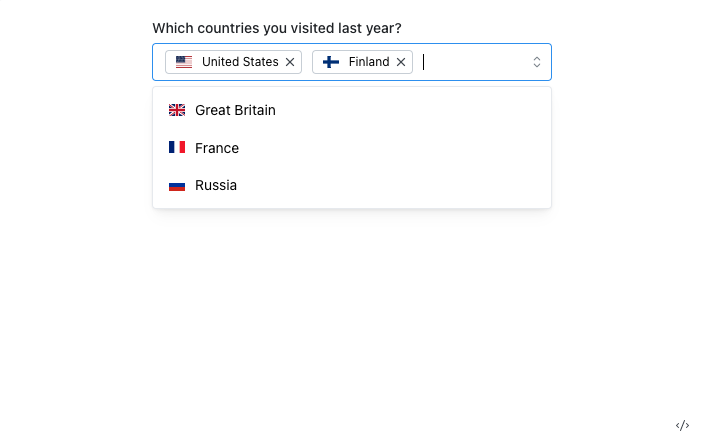

## Intro

어떤 디자인 시스템에서 `Select` 컴포넌트를 제공한다면, 어떤 기능들을 기대하시나요?

이 글에서는 Select컴포넌트에게 바라는 기능을 중심으로 구현 방법과 예제 코드를 설명합니다.

> ⚠️ 이 글에서 소개되는 코드는 모두 수도코드**(pseudo code)**입니다. 동작여부보다는 소개하고자하는 맥락을 중심으로 작성되었습니다.

## Why


<div style="opacity: 0.5" align="right">
    <sup><a>https://headlessui.dev/react/listbox</a></sup>
</div>

**“디자인 시스템의 Select컴포넌트를 사용한다”**라는 문장에서 기대하는 바는 위 사진과 같이 유려한 ui를 가진 Select일것이다. 이 글에서 Select의 구현방법에 대해 자세히 다루는 이유는 기본 `<select>`요소를 위와 같이 유려한 ui와 함께 좋은 ux를 지원하는것이 다른 요소에 비해 간단하지 않기 때문이다.

예를 들어, Button컴포넌트는 대부분 `<button>`요소에 스타일(css)을 **적용**하는 방식으로 구현한다. 하지만, select는 [지원하는 CSS 스타일이 한정적이](https://developer.mozilla.org/ko/docs/Web/HTML/Element/select#css_%EC%8A%A4%ED%83%80%EC%9D%BC%EB%A7%81)기 때문에 ‘스타일을 적용'하기 어렵다.

`<select>`의 기능을 가지면서 ui는 커스텀 가능해야하며 더불어 접근성도 지키기 위해서는 어떤 방법으로 구현해야 하는지 알아보자.

### Native Element와 유사한 인터페이스

본격적인 구현에 앞서, 인터페이스를 먼저 정해보자. `<select>` 요소는 다음과 같은 인터페이스를 가지고 있다.

```html
<label for="pet-select">Choose a pet:</label>

<select name="pets" id="pet-select">
  <option value="">--Please choose an option--</option>
  <option value="dog">Dog</option>
  <option value="cat">Cat</option>
  <option value="hamster">Hamster</option>
</select>
```

Select컴포넌트에서 요구사항을 구현하기 어렵다는 이유로 `value`를 배열로 받고 `option`을 내부적으로 렌더링하는 선택을 한다면, 확장이 어려워 변경에 취약해진다. 따라서 우리가 만들어나갈 컴포넌트는 `<select>`와 같은 인터페이스, 같은 기능을 가지도록 한다.

## What. (기능 정의)

`<select>` 요소의 기본 기능을 중심으로 정리해본 요구사항들은 다음과 같다.

- 키보드, 마우스 액션으로 옵션 리스트 영역을 열고 닫을 수 있다.
- 리스트가 열려있는 상태일 때 선택 된 옵션에 포커스 되어있어야 하고 키보드로 옵션 탐색이 가능해야한다.
- 옵션 검색이 가능해야한다.
- 키보드 액션을 통해 선택가능해야 한다.

## How. (구현)

앞서 정의한 요구사항은 어떤 방법으로, 어떤 데이터(상태)로 구성할 수 있을까? 요구사항을 구현 관점에서 다시 한번 정리해보자.

- 키보드, 마우스 액션으로 옵션 리스트 영역을 열고 닫을 수 있다.
  - 옵션 렌더링 여부를 결정할 `open` 상태 필요
- 리스트가 열려있는 상태일 때 선택 된 옵션에 포커스 되어있어야 하고 키보드로 옵션 탐색이 가능해야한다.
  - 각 옵션은 ‘선택 되었는 지’에 대한 상태를 알아야 하고, 이 때 선택 되었는 지 여부는 `Select`컴포넌트의 `value` prop에따라 결정
  - 각 옵션의 [ref](https://reactjs.org/docs/refs-and-the-dom.html)와 value를 알 수 있어야 한다.
- 옵션 검색이 가능해야한다.
  - 위와 동일
- 키보드 액션을 통해 선택가능해야 한다.
  - ‘Select의 선택된 value’를 Enter액션이 발생하는 옵션의 value로 변경해

### Compound Component API

요구사항을 구체화와 함께, 앞서 정의한 컴포넌트 인터페이스도 구체화가 필요하다. 복잡한 요구사항의 책임을 적절히 분담하기 위해 `Select-Option`컴포넌트가 협력하는 방향이 필요하고, 이 방향을 위해 [Compound Component](https://kentcdodds.com/blog/compound-components-with-react-hooks) 방식을 사용할 것이다.

**“Compound Component”**란 요구되는 기능을 수행하기 위해 두 개 이상의 컴포넌트가 협력하는 형태를 말한다. 보통 부모 - 자식 컴포넌트로 구성되며, 컴포넌트 간에 외부로 드러나지 않는 상태공유가 존재한다.

```html
<select>
  <option value="value1">key1</option>
  <option value="value2">key2</option>
  <option value="value3">key3</option>
</select>
```

`<select>-<option>`요소의 관계를 생각해보자. 두 요소는 독립적으로 존재하지만 단독으로는 사용할 수 없다.

하지만 위와 같은 표현은 인터페이스 측면에서는 가장 좋은 표현이다. 예를 들어, `select-option`요소를 ‘독립적으로 존재할 수 없다' 에만 초점을 맞추면 다음과 같이 표현될것이다.

```html
<select options="key1:value1;key2:value2;key3:value3"></select>
```

`value`만 표현한다면 간단해보일 수 있어도, `disabled` 등 다른 속성도 필요하다는 것을 고려하면, 이는 좋은 API가 아니다.

따라서 `Select`컴포넌트는 아래와 같은 인터페이스를 가지면서 `open`, `value`를 `<Select>` 컴포넌트와 `<Select.Option>` 컴포넌트에서 암묵적으로 공유하는 형태가 될것이다.

```jsx
<Select open={open} defaultValue="value">
  <Select.Trigger>open select</Select.Trigger>
  <Select.OptionList>
    <Select.Option value="value1">value1</Select.Option>
    <Select.Option value="value2">value2</Select.Option>
    <Select.Option value="value3">value3</Select.Option>
  </Select.OptionList>
</Select>
```

`<select>`요소와의 차이점으로 `Trigger` , `OptionList` 컴포넌트가 추가되었다.

`Trigger`컴포넌트는 `<select>`요소에서는 없던 ‘옵션을 여는 동작’에 대한 제어를 위한 것이고 `OptionList` 는 사용처에서는 스타일 커스텀 및 list컴포넌트가 가질 수 있는 prop을 정의할 수 있고, `Select`컴포넌트 내부에서는 `value` control 등을 다루게 된다. (이는 밑에서 자세히 설명한다.)

### Context

`OptionList` 컴포넌트에서는 `Select` 에 전달된 `open`상태에 따라 children렌더링 여부를 결정해야 하는 등,`Select`와 하위 자식컴포넌트간에는 상태 공유가 필요하다.

이 처럼 독립적으로 사용하는 컴포넌트에서 상태를 공유하기 위한 수단으로 [Context API](https://reactjs.org/docs/context.html#gatsby-focus-wrapper) 가 있다. 최상위 컴포넌트에 Provider를 선언하고 OptionList컴포넌트에서는 context의 open 값으로 렌더링 여부를 결정한다.

```jsx
function Select() {
 const [open = false, setOpen] = useControllableState({
    prop: openProp,
    defaultProp: defaultOpen,
    onChange: onOpenChange,
  });

 return (
  <SelectContext.Provider
    value={{ open, onOpenChange: setOpen }}
  >
    {children}
  </SelectContext.Provider>
 )
}

function OptionList() {
 const context = useSelectContext()

 return (
  <Ul role="listbox" onInteractOutside={context.onOpenChange}>
    {context.open ? children : null}
  </Ul>
 )
}
```

Option컴포넌트에서 ‘선택되었는 지’에 대한 판단도 비슷한 방식으로 구현할 수 있다.

```tsx
// 위와 중복된 코드 생략

function Select() {
  // ✅ '현재 선택된 값'을 관리하는 hooks선언
 const [value = '', setValue] = useControllableState({
    prop: valueProp,
    defaultProp: defaultValue,
    onChange: onValueChange,
  });

 return (
  <SelectContext.Provider
    value={{ value, onValueChange: setValue }}
  >
    {children}
  </SelectContext.Provider>
 )
}

function OptionList() {
 const context = useSelectContext()

 return (
  <Ul role="listbox" onItemSelect={context.onValueChange}>
    {context.open ? children : null}
  </Ul>
 )
}

function Options() {
 const context = useSelectContext()

 return (
  <li role="option">
    {children}
    {/* ✅ context의 'value'와 prop의 value가 같다면 선택되었다고 판단 */}
    {context.value === props.value ? 'selected' : ''}
  </li>
}
```

기본적인 구현과 설계방향이 정리되었다. 이 글에서는 자세히 다루지 않지만 아이템 선택, 키보드 액션 등도 마찬가지로 Context를 활용하여 구현할 수 있다.

### 스크린 리더기에게 필요한 정보 제공

완성할 Component의 DOM구조는 대략 아래와 같은 모습이다.

```html
<button type="button">
  <span>Devon Webb</span>
</button>
<ul>
  <li>Wade Cooper</li>
  <li>Arlene Mccoy</li>
  <li>Tom Cook</li>
  <li>Tanya Fox</li>
</ul>
```

버튼을 클릭하면 리스트가 열리고, 키보드 액션에 의해 리스트를 탐색하고 값을 선택하는 동작을 할 수 있지만 위 마크업만으로는 해당 기능을 스크린 리더에게 설명할 수 없다.

```html
<button
  type="button"
  id="select-box-1"
  aria-haspopup="true"
  aria-expanded="true"
  aria-controls="select-list"
>
 <span>Devon Webb</span>
</button>
<ul aria-labelledby="select-box-1" id="select-list" role="listbox">
  <li>Wade Cooper</li>
  <li>Arlene Mccoy</li>
  <li>Tom Cook</li>
  <li>Tanya Fox</li>
</ul>
```

`id`, `aria-controls` ,`aria-labelledby` 속성을 통해 요소간의 관계를 명시했고 `role` , `aria-haspopup`, `aria-expanded` 속성을 통해 역할과 상태를 명시했다.

1. [aria-controls](https://developer.mozilla.org/en-US/docs/Web/Accessibility/ARIA/Attributes/aria-controls)

    특정 요소가 다른 요소를 제어하는 경우 제어 대상 요소를 나타내기 위해 명시한다. `Select`컴포넌트에서는 button이 ul요소를 제어하기 때문에 ul의 id를 button의 aria-controls속성으로 명시해야 한다.

    ```jsx
    <button aria-controls="custom-select-1">버튼</button>
    <ul id="custom-select-1">...</ul>
    ```

2. [aria-expanded](https://developer.mozilla.org/en-US/docs/Web/Accessibility/ARIA/Attributes/aria-expanded)

    하위 요소의 표시여부나  `aria-controls` 에 해당하는 요소가 확장/축소 되었는지를 나타내기 위해 사용한다.

3. [aria-haspopup](https://developer.mozilla.org/en-US/docs/Web/Accessibility/ARIA/Attributes/aria-haspopup)

### Keyboard Navigation


`<select>`요소에서 지원되는 중요한 기능 중 하나는 키보드로 옵션 탐색이 가능하다는 점이다. 같은 UX를 제공하기 위해 `Select`에서도 키보드 탐색을 위한 처리가 필요하다.

“탐색”을 하기 위해서는 탐색 대상이 무엇인지 알아야 한다. `onKeyDown`이벤트가 발생할때 **전체 옵션(value) 목록**과 **각 옵션의 [ref](https://reactjs.org/docs/refs-and-the-dom.html)** 정보를 알아야 현재 포커스 된 요소 기준으로 다음 포커스 요소를 결정할 수 있다.

#### Collection

앞서 정의한 컴포넌트 인터페이스를 다시 살펴보자.

```jsx
<Select open={open} defaultValue="value1">
 <Select.Trigger>open select</Select.Trigger>
 <Select.OptionList>
  <Select.Option value="value1">value1</Select.Option>
  <Select.Option value="value2">value2</Select.Option>
  <Select.Option value="value3">value3</Select.Option>
 </Select.OptionList>
</Select>
```

Select컴포넌트에서 전체 옵션이 무엇인지 알기 위해서는 [React Children API](https://reactjs.org/docs/react-api.html#reactchildren)를 사용하거나 직접 명시하는 방법이 있다. 하지만 두 방법 모두 불편한 점이 있다.

- Children API: Option컴포넌트가 Select의 one-depth child일것이라는 보장이 없기때문에 전체 depth children을 순회해야한다.
- 직접 명시: `<Select options={[’value1’, ‘value2’ ]}>` 와 같이 직접 명시하는 방법이다. 여기서 문제점은 “Select의 Option이 무엇인지”에 관한 표현이 두 곳에 존재한다는 것이다. 표현이 두 곳에 존재한다는 것은 불필요한 관리포인트가 존재한다는것을 의미하며, 사용하는 관점에서 생각해보면 의도를 알 수 없는 API이다.

기존 인터페이스는 수정하지 않으면서 최상위 컴포넌트에서 전체 옵션 목록을 알 수 있는 방법을 고민해보자.

이미 답이 있다. **정보가 이미 존재하기 때문에 사용하면 된다.** `Select.Option`의 prop으로 value를 선언했으니  이 값이 무엇인지 최상위 컴포넌트에서 알아내면 되는것이다.

이에 대한 구현체로 Collection이라는 Context관리 컴포넌트를 생성한다. (Collection에 대한 아이디어와 구현은 [radix-ui/collection](https://github.com/radix-ui/primitives/blob/main/packages/react/collection/src/Collection.tsx) 을 참고했다.)

```jsx
function Select() {
 return (
  <SelectContext.Provider
    value={{ open, onOpenChange: setOpen }}
  >
    <Collection.Provider>
      {children}
    </Collection.Provider>
  </SelectContext.Provider>
 )
}

function SelectOption() {
 return (
  <Collection.Item value={value}>
    <li>{children}</li>
  </Collection.Item>
 )
}
```

Collection Context는 itemMap자료구조를 가지며, 옵션의 value와 ref를 가지고 있다.

```tsx
type ContextValue = {
  itemMap: Map<RefObject<ItemElement>, { ref: React.RefObject<ItemElement> } & ItemData>
}

function CollectionProvider() {
  const itemMap = React.useRef<ContextValue['itemMap']>(new Map()).current;

  return (
    <Collection.Provider value={{ itemMap }}>
      {children}
    </Collection.Provider>
 )
}

const ITEM_DATA_ATTR = 'data-radix-collection-item';
function CollectionItem(props) {
  const context = useCollectionContext();

  useEffect(() => {
    context.itemMap.set(ref, { ref, value: props.value })
  }, [])
 
  return <Slot {...{ [ITEM_DATA_ATTR]: '' }} ref={ref}>{children}</Slot>
}

function useCollection() {
  const context = useCollectionContext();
 
  const getItems = useCallback(() => {
    const collectionNode = context.collectionRef.current;
    const orderedNodes = Array.from(collectionNode.querySelectorAll(`[${ITEM_DATA_ATTR}]`));

    return orderedItems;
  }, [])

  return getItems;
}

Collection.Provider = CollectionProvider;
Collection.Item = CollectionItem;
```

`CollectionProvider` 컴포넌트에서 context를 생성하고, `CollectionItem` 컴포넌트에서는 context에 element의 ref, value를 추가한다.

`useCollection` hook에서는 context값을 반환하는 함수인 `getItems`를 반환하여 사용처에 전체 옵션(value) 목록과 각 옵션의 ref 정보를 제공한다.

#### 이벤트 처리

“\<select>요소의 키보드 탐색”은 `useCollection` 훅을 사용하여 **키보드 액션이 발생할 때 다음 아이템을 찾아 `focus` 처리**로 구현할 수 있게 되었다.

`onKeyDown`핸들러에서 방향키 이동 액션이 일어날 때, `getItems` 함수를  사용해서 전체 옵션 목록을 조회하고 방향키 종류에 따라 이전/다음 요소를 찾아 활성화 시킨다.

```jsx
function OptionList() {
  const context = useSelectContext()
  const getItems = useCollection();

 return (
  <Ul
    role="listbox"
    onKeyDown={event => {
      const items = getItems().filter((item) => !item.disabled);
      const candidateNodes = items.map((item) => item.ref.current!);

      위_방향키_이동인가 ? focusPrev(candidateNodes) : focusNext(candidateNodes);
    }}>
    {context.open ? children : null}
  </Ul>
 )
}
```

위 코드는 개념을 설명하기 위한 간단한 수도코드이다. 실제 동작하는 flow는 [radix-ui의 menu/onKeyDown](https://github.com/radix-ui/primitives/blob/6da75e0dbb2d1aebd2dae5a044c595bca39a2347/packages/react/menu/src/Menu.tsx#L606) 를 참고하는 것을 추천한다.

## 번외 1) 자동완성 Select

### 하늘아래 두 개의 focus는 없다


[Combobox예시](https://headlessui.dev/react/combobox)처럼 **“검색과 키보드 이동이 동시에 가능해야 한다.”**라는 요구사항을 생각해보자.

우리는 이미 ‘그렇게 구현되어 있는' Select에 익숙해져 있지만, 구현 관점에서 생각 해본다면 `focus` 함수를 사용하는 방식으로는 구현할 수 없다는 점에서 이질적인 기능이다.

> “focus를 두 개 가질수 없다.”에 대한 예시는 [코드샌드박스](https://codesandbox.io/s/elated-glitter-3jci7h?file=/src/App.tsx)에서 확인할 수 있다.
>

Combobox컴포넌트는 실제로 focus를 동시에 두 개 가지는 것이 아니라, 키보드 탐색 시 focus 효과(스타일)를 적용하는 방식으로 구현해야 한다.

‘focus 효과(스타일)’로 기능을 구현한다는 것은 곧 스크린 리더기에게 어떻게 이 기능을 알려줄지도 생각해봐야 한다는 뜻이다. 실제로는 focus된 요소가 변화하지 않으니, 방향키 키보드 액션이 일어나도 스크린 리더기는 탐색 에 대한 아무정보도 얻을 수 없다.

**스크린 리더기에게 필요한 정보 제공**

적절한 aria요소 사용으로 문제를 해결할 수 있다.

1. [role=”combobox”](https://developer.mozilla.org/en-US/docs/Web/Accessibility/ARIA/Roles/combobox_role)

    자동완성 Select input의 역할을 지정해준다.

2. [aria-activedescendant](https://developer.mozilla.org/en-US/docs/Web/Accessibility/ARIA/Attributes/aria-activedescendant)

    사용자의 실제 focus는 input(혹은 focus가능한 다른 요소)에 위치하고 있지만 다른 요소에도 focus되어 있는 것과 같은 ui를 구현할 때, 해당 요소의 id를 가진다.

    예를 들어 위 사진의 예시에서는 `aria-activedescendant=”Wade Cooper요소의 id”` 가 된다.

### KeyDown Event

요구사항이 좀더 구체화 되었다. 요구사항은 **“자동완성 Select에서 input이 focus를 가지고 있을 때 방향키 액션 발생 시 필요한 요소에 focus스타일을 적용"**하는 것이다.

> 이 글에서는 수도코드만을 다루니 동작하는 코드가 필요한 경우 [floating-ui/useListNavigation](https://floating-ui.com/docs/useListNavigation)을 사용하는 것을 추천한다.
>

```jsx
function useListNavigation() {
  const setFocusStyle = useCallback(() => {
    const presentListItems = getPresentListItems(listRef);
  
    // ✅ focus스타일 적용
    presentListItems[nextIndex].current?.classList.add(focusClassName);

    // ✅ 이전에 focus스타일 적용된 아이템에서 스타일 제거
    if (이전_스타일_제거해야하는가) {
      presentListItems[currentIndex].current?.classList.remove(focusClassName);
    }
  }, [focusClassName]);

  const handleActiveIndex = useCallback((event: KeyboardEvent) => {
    const elementListRef = getListRef().map(item => item.ref);

    const minIndex = getMinIndex(elementListRef);
    const maxIndex = getMaxIndex(elementListRef);

    if (아래방향_입력인가) {
      /**
       * nextIndex처리
       */
    }
    /*...*/

    setFocusStyle(elementListRef, { currentIndex, nextIndex });
    setActivedescendantId(elementListRef[nextIndex].current?.id);
  }, []);

  return [activeIndex, { onKeyDown, 'aria-activedescendant': activedescendantId];
}
```

방향키 탐색 시 다음 아이템에 `focusClassName` 을 부여하는 것으로 focus효과를 부여하고, 이 로직을 가진 hook은 아래 값들을 반환한다.

- **activeIndex:** 현재 활성화 된(focus스타일을 가진) index
- **onKeyDown:** 이전/다음 아이템을 탐색하는 keyDown Handler
- **aria-activedescendant:** 현재 활성화 된 요소의 id

이 hook을 재료로 “Enter시 아이템 선택”등의 추가 요구사항도 구현할 수 있다.

## 번외 2) Multi Select이되 UI와 결합 되지 않는



<div style="opacity: 0.5" align="right">
    <sup><a>https://mantine.dev/core/multi-select/</a></sup>
</div>

여러 오픈소스 디자인 시스템의 `MultiSelect` 인터페이스는 선택된 값을 `string[]` 으로 받고, 전체 목록을 `data(label / string 배열)` 로 받는 형태가 많다.

```jsx
// https://mantine.dev/core/multi-select/
<MultiSelect
  data={countriesData}
  valueComponent={Value}
  defaultValue={['US', 'FI']}
/>
```

선택된 값을 렌더링하는 컴포넌트로 `valueComponent` prop을 받고 있긴 하지만, 값을 렌더링하는 위치가 제한적이라는 점에서 MultiSelect UI에 종속적이다.

이는 앞서 구현한 `Context` 와 Collection API를 사용하면 아래와 같은 인터페이스로 구성하여 해결할 수 있다.

```jsx
<>
<div>selected: {value.join()}</div>
<MultiSelect defaultValue={values} onValueChange={setValue}>
  <MutliSelect.Trigger>trigger</MutliSelect.Trigger>
  <MutliSelect.Content>
    <MutliSelect.Option>Korea</MutliSelect.Option>
    <MutliSelect.Option>France</MutliSelect.Option>
    <MutliSelect.Option>United states</MutliSelect.Option>
  </MutliSelect.Content>
</MultiSelect>
</>
```

구체적인 구현체에서 앞서 구현한 Select와 다른 점은 value의 type이 `string[]`형태로 변경되었다는 것이다.

`MultiSelect` 컴포넌트의 역할은 어떤 옵션들이 있는지 파악하는것, 값을 선택하는 것, 선택된 값들이 어떤 것인지 관리하는 것이며 구체적인 UI에는 관여하지 않음으로서 구현에 제약받지 않는 MultiSelect를 사용할 수 있다.

## 번외 3) 기본 element는 중요하다

<video controls style="width: 100%;" src="./images/make-select/select_autofill.mp4" type="video/mp4" poster="./images/make-select/select_autofill.png">
   Sorry, your browser doesn't support embedded videos,
</video>

로그인 정보를 autofill했을 때 select의 값이 Student에서 Developer로 autoFill되고 있다. (1password의 섹션 > 라벨을 select의 name과 값을 저장한 후 [코드샌드박스 링크](https://codesandbox.io/s/autocomplete-example-bvqnwp?file=/src/App.tsx:189-229)에서 직접 테스트 해볼수 있다.)

<details style="margin-bottom: 10px;"><summary>1password 저장정보</summary>
  
</details>

이러한 autoFill을 커스텀 UI로 구현된 Select에서도 지원하려면 화면에서는 보여지지 않더라도 기본 select element요소를 가지고 있어야 한다.

```jsx
function Select() {
  return (
    <SelectContext.Provider>
      {/* 중간 코드 생략 */}
      <VisuallyHidden>
        <select name='job'>
          <option value="student">Student</option>
          <option value="developer">Developer</option>
          <option value="designer">Designer</option>
        </select>
      </VisuallyHidden>
    </SelectContext.Provider>
  )
}
```

### Visually Hidden

화면에서 보여지지 않도록 `VisuallyHidden`컴포넌트를 사용했다. 이 컴포넌트의 스타일을 정의한다면 가장 먼저 떠오르는 방법은 아마도 `display`속성을 `none`으로 설정하는 방법일것이다.

```jsx
const VisuallyHidden = styled('div', { display: 'none' })
```

시각적으로는 목적한 바를 달성할 수 있지만 스크린 리더를 사용자들에게는 정보를 전달할 수 없고, 앞서 언급한 autoFill기능도 동작하지 않는다.

시각적으로 `display: none`과 동일한 효과를 가지면서 접근성을 준수하는 목적으로 “clip pattern”을 사용할 수 있다.

```tsx
const VisullayHidden = styled('div', {
  clip: 'rect(0 0 0 0)',
  clipPath: 'inset(50%)',
  height: '1px',
  overflow: 'hidden',
  position: 'absolute',
  whiteSpace: 'nowrap',
  width: '1px',
})
```

## 맺으며

Select는 많은 웹앱에서 커스텀 컴포넌트로 필요성이 있는 컴포넌트라고 생각합니다.

하지만 이를 구현하는 과정을 생각해보면 native select element의 스타일을 오버라이드 하는 방식으로 구현하는 것이 어렵다보니 custom element를 생성하고 동작을 붙이는 방식으로 구현되는데, 이 과정에서 기존 select element가 가지고 있는 기능들을 포함하며 확장성 있는 컴포넌트로 고려하는 것은 결코 간단하다고 생각되지 않았습니다.

이 글에서 소개한 개념과 구현체는 다수의 headless ui library들을 기반으로 합니다. 동작하는 코드와 더 자세한 구현원리가 궁금하신 분들은 Reference로 추가한 [radix-ui](https://www.radix-ui.com/), [headlessui](https://headlessui.dev/) 의 코드를 참고해보세요.

## Reference

- [https://kentcdodds.com/blog/compound-components-with-react-hooks](https://kentcdodds.com/blog/compound-components-with-react-hooks)
- [https://floating-ui.com/docs/useListNavigation](https://floating-ui.com/docs/useListNavigation)
- <https://github.com/radix-ui/primitives>
- <https://github.com/tailwindlabs/headlessui>
- [https://www.a11yproject.com/posts/how-to-hide-content/](https://www.a11yproject.com/posts/how-to-hide-content/)
