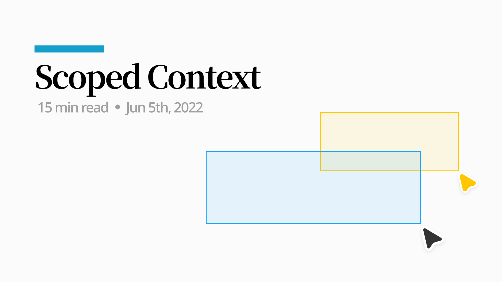
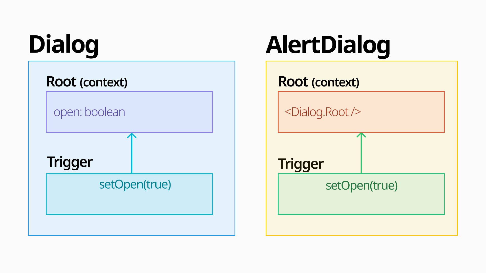

The [React Context API](https://reactjs.org/docs/context.html) is a way to share global data across a React component tree. Based on the component where a Provider is declared, its descendant components can use that Context's value.

The fact that a Context can be used in a Provider's descendant components is the same as saying, **"a Consumer works based on its nearest Provider."**

> `useContext()`
 always looks for the closest provider *above*
 the component that calls it. It searches upwards and **does not**
 consider providers in the component from which you're calling `useContext()` .  
[https://react.dev/reference/react/useContext#passing-data-deeply-into-the-tree](https://react.dev/reference/react/useContext#passing-data-deeply-into-the-tree)

```tsx
<ThemeContext.Provider value="dark">
  <Body />
  <ThemeContext.Provider value="light">
    <Footer />
  </ThemeContext.Provider>
  ...
</ThemeContext.Provider>
```

In `<Body />`, the value of ThemeContext is dark, and in `<Footer />` it's light. In this case, you could say the value of ThemeContext has been reassigned depending on scope.

This behavior of React Context can feel obvious, but there are use cases it doesn't satisfy.

## Case: A Composition Component that extends a Context

> The content below is organized based on **[RFC: Context scoping for compound components](https://github.com/facebook/react/issues/23287)**.



```tsx

/*  1. AlertDialog uses the Dialog component internally.                                            */
/*  2. It uses the Dialog Context API, and Dialog.Trigger and Content use that Dialog Context.       */
/*  3. AlertDialog.Trigger and Dialog.Trigger each change the open value of the Context they reference to true. */

{/* 🐯 AlertDialog Provider */}
<AlertDialog.Root>
  {/* 🦁 Dialog Provider */}
  <Dialog.Root>
    {/* 🦁 Opens Dialog */}
    <Dialog.Trigger />
    <Dialog.Content>
      {/* 🐯 Opens AlertDialog */}
      <AlertDialog.Trigger />
    </Dialog.Content>
  </Dialog.Root>

  <AlertDialog.Content />
</AlertDialog.Root>
```

`AlertDialog` is a component built by extending `Dialog`, and `AlertDialog.Root` is structured so that it holds `Dialog.Root` inside it.

When you click `AlertDialog.Trigger`, the expected behavior is that `AlertDialog`'s Context value changes, but by the rule that **"a Consumer works based on its nearest Provider,"** it ends up changing Dialog's Context value instead.

It might look like the problem is solved if Dialog and AlertDialog sever their relationship and each create their own Context, but if you think about using this component to build yet another Dialog, you'll find the problem still isn't solved.

```tsx
// Create a Dialog Context
const FeedbackDialog = Dialog;
// Create a Dialog Context
const AnotherDialog = Dialog;

<FeedbackDialog.Root>
  <AnotherDialog.Root>
    <AnotherDialog.Trigger />
    <AnotherDialog.Content>
      {/* 💥 Opens AnotherDialog */}
      <FeedbackDialog.Trigger />
    </AnotherDialog.Content>
  </AnotherDialog.Root>
  <FeedbackDialog.Content />
</FeedbackDialog.Root>
```

<div style="opacity: 0.5; position: relative; top: -0.8em; left: -1em;" align="left">
  <sup>Creating a separate Context for each one isn't really solving the problem — it's just relocating it.</sup>
</div>

Here are two libraries that solved the problem of needing scope between Contexts, along with each one's solution. (There's still no official definition of whether this is actually a problem, or how to solve it if it is.)

## Solution 1: [@radix-ui/context](https://github.com/radix-ui/primitives/tree/main/packages/react/context)

The core idea of this implementation is to directly pass, as a prop on the component that creates the Context, which Context should be referenced. It can be implemented as simply as this:

```tsx {6,11,22}
/* -------------------------------------------------------------------------- */
/*                                 Dialog                                     */
/* -------------------------------------------------------------------------- */
const DialogContext = createContext("DialogContext");

export const Root = ({ context: Context = DialogContext, children, name }) => {
  return <Context.Provider value={name}>{children}</Context.Provider>;
};

export const Trigger = ({ context: Context = DialogContext }) => {
  const contextValue = useContext(Context);
  return <div>DialogContext: {contextValue}</div>;
};

/* -------------------------------------------------------------------------- */
/*                                 AlertDialog                                */
/* -------------------------------------------------------------------------- */
const AlertDialogContext = createContext("AlertDialogContext");

export const Root = ({ children, name }) => {
  return (
    <Dialog.Root name={name} context={AlertDialogContext}>
      {children}
    </Dialog.Root>
  );
};

export const Trigger = () => {
  return <Dialog.Trigger context={AlertDialogContext} />;
};

/* -------------------------------------------------------------------------- */
/*                                     App                                    */
/* -------------------------------------------------------------------------- */
function App() {
  return (
    <AlertDialog.Root name="MyAlertDialog">
      <Dialog.Root name="MyDialog">
         {/* DialogContext: MyDialog */}
        <Dialog.Trigger />
        <Dialog.Content>
          {/* DialogContext: MyAlertDialog */}
          <AlertDialog.Trigger />
        </Dialog.Content>
      </Dialog.Root>

      <AlertDialog.Content />
    </AlertDialog.Root>
  );
}
```

<div style="opacity: 0.5; position: relative; top: -0.8em; left: -1em;" align="left">
  <sup><a href="https://codesandbox.io/s/stupefied-zhukovsky-etk9m" target="_blank">https://codesandbox.io/s/stupefied-zhukovsky-etk9m</a></sup>
</div>

`Dialog`'s `Root` doesn't always create a brand-new Context — it can receive a different Context injected as a prop, and when referencing a Context it also refers to the one passed in as a prop.

In `AlertDialog`, we create `AlertDialogContext` and pass it to DialogRoot, which lets it reference a different Context than the Dialog components do.

A more formalized version of this implementation is radix-ui's [createContextScope](https://github.com/radix-ui/primitives/blob/285aa0837f2405a05e983fc8fffd55f4cc368b5e/packages/react/context/src/createContext.tsx#L30).

### createContextScope

Let's look through radix-ui's [AlertDialog](https://github.com/radix-ui/primitives/blob/285aa0837f2405a05e983fc8fffd55f4cc368b5e/packages/react/alert-dialog/src/AlertDialog.tsx#L19) and [Dialog implementation](https://github.com/radix-ui/primitives/blob/285aa0837f2405a05e983fc8fffd55f4cc368b5e/packages/react/dialog/src/Dialog.tsx#L27) and work out how it operates.

```tsx {10,24,27}
// Dialog
const [createDialogContext, createDialogScope] = createContextScope('Dialog');
const [DialogProvider, useDialogContext] = createDialogContext('Dialog');

const DialogRoot = (props) => {
  const { __scopeDialog } = props;

  // 1️⃣
  return (
    <DialogProvider scope={__scopeDialog}>...</DialogProvider>
  )
}

// AlertDialog
const [createAlertDialogContext, createAlertDialogScope] = createContextScope(
  'AlertDialog',
  [createDialogScope]
);
const useDialogScope = createDialogScope();

const AlertDialogRoot = (props) => {
  const { __scopeAlertDialog } = props
  // 2️⃣
  const dialogScope = useDialogScope(__scopeAlertDialog);

  return (
    <DialogRoot __scopeDialog={dialogScope.__scopeDialog}>...</DialogRoot>
  )
}
```

- 1️⃣ DialogProvider is set up so that if a `scope` prop is present, it references that scope's Context, and if it's undefined, it references a newly created Context.
- 2️⃣ AlertDialog uses the `useDialogScope` hook to **create a new Dialog Context and pass it down to Dialog under the name `__scopeDialog`.**
- Regardless of the component hierarchy, the descendant components of AlertDialog and Dialog can each reference the correct context.

The function that composes a Context capable of receiving a scope (_createContext_) and the function that creates a new Context and injects it (_createScope_) are both functions returned from **createContextScope**.

```tsx
function createContextScope(scopeName: string, createContextScopeDeps: CreateScope[] = []) {
  /* -----------------------------------------------------------------------------------------------
   * createContext
   * ---------------------------------------------------------------------------------------------*/

  function createContext(
    rootComponentName: string,
    defaultContext?: ContextValueType
  ) {
    return [Provider, useContext] as const;
  }

  /* -----------------------------------------------------------------------------------------------
   * createScope
   * ---------------------------------------------------------------------------------------------*/

  const createScope: CreateScope = () => {...};

  return [createContext, composeContextScopes(createScope, ...createContextScopeDeps)] as const;
}
```

The internal implementation can be split into a `createContext` part, which returns Provider and useContext, and a `createScope / composeContextScopes` part, which merges the scope dependencies with the newly created scope.

#### 1. createContext

```tsx {11,17}
function createContext<ContextValueType extends object | null>(
  rootComponentName: string,
  defaultContext?: ContextValueType
) {
  const BaseContext = React.createContext(defaultContext);
  const index = defaultContexts.length;
  defaultContexts = [...defaultContexts, defaultContext];

  function Provider(props) {
    const { scope, children, ...context } = props;
    const Context = scope?.[scopeName][index] || BaseContext;

    return <Context.Provider value={value}>{children}</Context.Provider>;
  }

  function useContext(consumerName: string, scope: Scope<ContextValueType>) {
    const Context = scope?.[scopeName][index] || BaseContext;
    const context = React.useContext(Context);

    return context ?? defaultContext;
  }

  return [Provider, useContext] as const;
}
```

In Provider and useContext, whenever the value of `scope?.[scopeName]` is valid, that value is used as the Context.

```tsx
const [createDialogContext, createDialogScope] = createContextScope('Dialog');

const DialogRoot = (props) => {
  const { __scopeDialog } = props;

  return (
    <DialogProvider scope={__scopeDialog}>...</DialogProvider>
  )
}

const [createAlertDialogContext, createAlertDialogScope] = createContextScope(
  'AlertDialog',
  [createDialogScope]
);

const AlertDialogRoot = (props) => {
  const dialogScope = useDialogScope(__scopeAlertDialog);

  return (
    <DialogRoot __scopeDialog={dialogScope.__scopeDialog}>...</DialogRoot>
  )
}
```

If we summarize the `scope` and scopeName passed into the Dialog Context in the code we just looked at:

**Dialog**
  - scope: `__scopeDialog`, received as a prop
  - scopeName: Dialog

**AlertDialog**
  - scope: `dialogScope.__scopeDialog`, the return value of `useDialogScope`
  - scopeName: Dialog

When you use `Dialog`, the `scope` value is undefined, and when you use `AlertDialog`, it isn't.

#### 2. createScope / composeContextScopes

```tsx {3,11,34}
function createContextScope(scopeName: string, createContextScopeDeps: CreateScope[] = []) {
  /* ... */
  return [createContext, composeContextScopes(createScope, ...createContextScopeDeps)] as const;
}

const createScope: CreateScope = () => {
  return function useScope(scope: Scope) {
    const contexts = scope?.[scopeName] || scopeContexts;

    return React.useMemo(
      () => ({ [`__scope${scopeName}`]: { ...scope, [scopeName]: contexts } }),
      [scope, contexts]
    );
  };
};

function composeContextScopes(...scopes: CreateScope[]) {
  const createScope: CreateScope = () => {
    const scopeHooks = scopes.map((createScope) => {
      return {
        useScope: createScope(),
        scopeName: createScope.scopeName,
      }
    });

    return function useComposedScopes(overrideScopes) {
      const nextScopes = scopeHooks.reduce((nextScopes, { useScope, scopeName }) => {
        const scopeProps = useScope(overrideScopes);
        const currentScope = scopeProps[`__scope${scopeName}`];

        return { ...nextScopes, ...currentScope };
      }, {});

      return React.useMemo(() => ({ [`__scope${baseScope.scopeName}`]: nextScopes }), [nextScopes]);
    };
  };

  createScope.scopeName = baseScope.scopeName;
  return createScope;
}
```

The `createScope` function contains the series of steps that build the `__scope${scopeName}` variable we just looked at.

`composeContextScopes(createScope, ...createContextScopeDeps)` builds a Context, based on the current scope, from the values of the other scopes that scope depends on, and returns it.

```tsx
// AlertDialog.tsx
const [
  createAlertDialogContext,
  createAlertDialogScope,
] = createContextScope('AlertDialog', [createDialogScope]);
```

Here, the value passed in as `createContextScopeDeps` is `createDialogScope` — because the components created and used via `createAlertDialogContext` use the Dialog Context internally, the dialog scope is declared as a scope dependency.

Without this handling, code that uses `createAlertDialogScope` would throw an error saying it can't correctly reference the Dialog Context.

Dialog and AlertDialog are a simple enough example that ScopedContext might not feel necessary, but the more broadly a single component gets reused across places, the harder the Context-scope problem caused by composition becomes to manage.

## Solution 2: [Jotai](https://jotai.org/docs/api/core#provider)

Jotai, a state management library, lets you pass a `scope` prop as an optional argument when creating a Provider.

> A Provider accepts an optional prop `scope`
 that you can use for a scoped Provider. When using atoms with a scope, the provider with the same scope is used. The recommendation for the scope value is a unique symbol. The primary use case of scope is for library usage.  
[https://jotai.org/docs/api/core#provider](https://jotai.org/docs/api/core#provider)

```tsx
const myScope = Symbol('scope')

const anAtom = atom('')

const LibraryComponent = () => {
  const [value, setValue] = useAtom(anAtom, myScope)
  // ...
}

const LibraryRoot = ({ children }) => (
  <Provider scope={myScope}>{children}</Provider>
)
```

The mechanism is similar to the first example.

```tsx {4,18}
// https://github.com/pmndrs/jotai/blob/main/src/core/Provider.ts

export const Provider = () => {
  const ScopeContainerContext = getScopeContext(scope)
  return createElement(
    ScopeContainerContext.Provider,
    {
      value: scopeContainerRef.current,
    },
    children
  )
}

const ScopeContextMap = new Map<Scope | undefined, ScopeContext>()

export const getScopeContext = (scope?: Scope) => {
  if (!ScopeContextMap.has(scope)) {
    ScopeContextMap.set(scope, createContext(createScopeContainer()))
  }
  return ScopeContextMap.get(scope) as ScopeContext
}

export function useAtomValue<Value>(
  atom: Atom<Value>,
  scope?: Scope
): Awaited<Value> {
  const ScopeContext = getScopeContext(scope)
  const { s: store } = useContext(ScopeContext)
  // ...
}
```

It creates a new Context based on the scope value, and when `useAtomValue` accesses the context, if the scope value is valid it references the Context matching that scope.

## Wrapping Up

When I first encountered the concept of Scoped Context in radix-ui, I thought it simply didn't fit React Context's basic design and was being used against its intent.

But I've come to think the concept of scope is necessary once every component is offered in composable form. For example, if a Dropdown Item is used as the Trigger for a Popover or a ContextMenu, and you have no way to set the Context Scope of the commonly shared [react-popover](https://github.com/radix-ui/primitives/tree/main/packages/react/popover) or [react-menu](https://github.com/radix-ui/primitives/tree/main/packages/react/menu), you'd need some hierarchy concept at the library level — like z-index — to decide which component gets declared as the top-level Provider.

It doesn't seem like many places have implemented this concept yet, and even the implementations that exist only really agree on the broad direction, so I hope React offers something more formalized for this in the near future.

## Reference

- [https://github.com/radix-ui/primitives/discussions/1091](https://github.com/radix-ui/primitives/discussions/1091)
- [https://github.com/facebook/react/issues/23287](https://github.com/facebook/react/issues/23287)
- [https://jotai.org/docs/api/core](https://jotai.org/docs/api/core#type-script)
  - [https://github.com/pmndrs/jotai/blob/main/src/core/Provider.ts](https://github.com/pmndrs/jotai/blob/main/src/core/Provider.ts)
  - [https://github.com/pmndrs/jotai/blob/main/src/core/useAtom.ts](https://github.com/pmndrs/jotai/blob/main/src/core/useAtom.ts)
