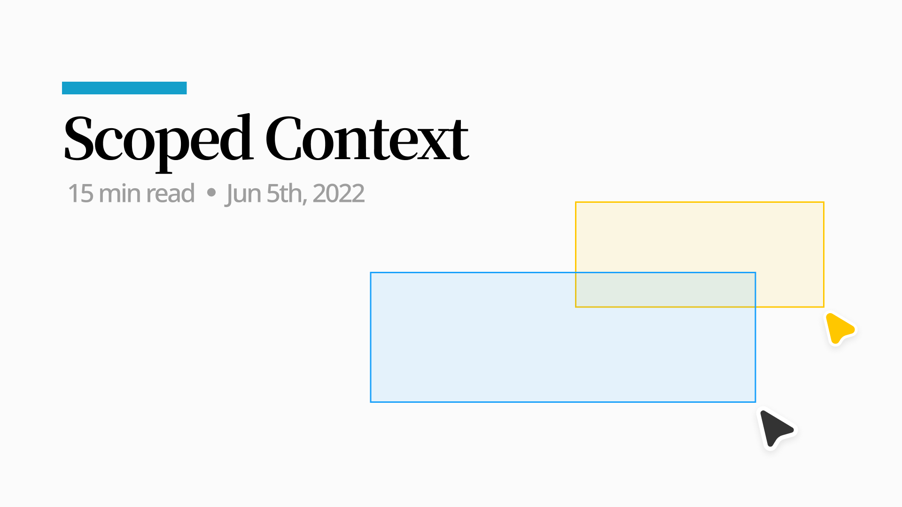
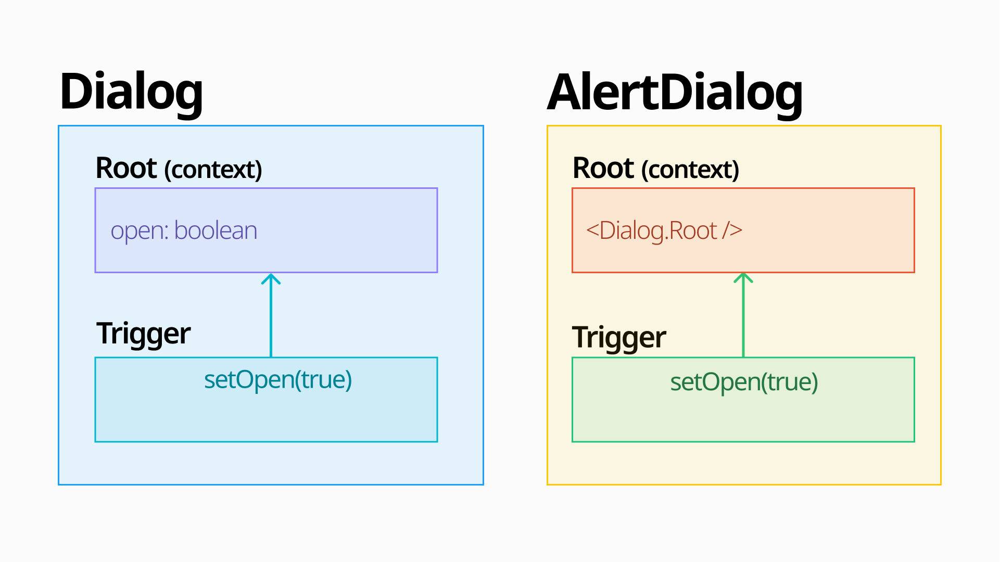

[React Context API](https://reactjs.org/docs/context.html)는 React 컴포넌트 트리 내의 전역적(global)인 데이터를 공유할 수 있는 방법이다. Provider가 선언된 컴포넌트 기준으로 하위 컴포넌트에서는 해당 Context의 값을 사용할 수 있다.

Provider 하위컴포넌트에서 Context를 사용할 수 있다는 것은, **“Consumer는 가장 가까운 Provider기준으로 동작한다”는 것과 동일한 말이다.**

> `useContext()`
 always looks for the closest provider *above*
 the component that calls it. It searches upwards and **does not**
 consider providers in the component from which you’re calling `useContext()` .  
[https://react.dev/reference/react/useContext#passing-data-deeply-into-the-tree](https://react.dev/reference/react/useContext#passing-data-deeply-into-the-tree)

```tsx
<ThemeContext.Provider value="dark">
  <Body />
  <ThemeContext.Provider value="light">
    <Footer />
  </ThemeContext.Provider>
  ...
</ThemeContext.Provider>
```

`<Body />`에서는 ThemeContext의 값이 dark이고 `<Footer />`에서는 light이다. 이 경우는 ThemeContext의 값을 범위에 따라 재할당 했다고 볼 수 있다.

이러한 React Context의 동작 방식은 어쩌면 당연하게 느껴지지만, 이 방식이 충족시키지 못하는 사용례가 존재한다.

## Case: Context를 확장한 Composition Component

> 아래 내용은 **[RFC: Context scoping for compound components](https://github.com/facebook/react/issues/23287)**내용을 기반으로 정리한 것이다.



```tsx

/*  1. AlertDialog는 내부에서 Dialog 컴포넌트를 사용한다.                                            */
/*  2. Dialog Context API를 사용하고 있고 Dialog.Trigger, Content에서 Dialog Context를 사용한다.     */
/*  3. AlertDialog.Trigger와 Dialog.Trigger는 각 컴포넌트가 참조하는 Context의 open값을 true로 변경한다. */

{/* 🐯 AlertDialog Provider */}
<AlertDialog.Root>
  {/* 🦁 Dialog Provider */}
  <Dialog.Root>
    {/* 🦁 Dialog를 Open하는 역할 */}
    <Dialog.Trigger />
    <Dialog.Content>
      {/* 🐯 AlertDialog를 Open하는 역할 */}
      <AlertDialog.Trigger />
    </Dialog.Content>
  </Dialog.Root>

  <AlertDialog.Content />
</AlertDialog.Root>
```

`AlertDialog`는 `Dialog`를 확장하여 만든 컴포넌트이고, `AlertDialog.Root`에서 `Dialog.Root`를 가지고 있는 구조다.

`AlertDialog.Trigger` 를 클릭했을 때 기대하는 동작은 `AlertDialog` 의 Context값이 변경되는 것이지만, **“Consumer는 가장 가까운 Provider기준으로 동작한다”**는 법칙에 의해 Dialog의 Context값을 변경하게 된다.

Dialog와 AlertDialog가 관계를 끊고 각각 Context를 생성하게 되면 문제가 해결된 것처럼 보이지만, 이 컴포넌트를 사용하여 또 다른 Dialog를 만드는 경우를 생각해보면 여전히 문제가 해결되지 않았음을 확인할 수 있다.

```tsx
// Dialog Context생성
const FeedbackDialog = Dialog;
// Dialog Context생성
const AnotherDialog = Dialog;

<FeedbackDialog.Root>
  <AnotherDialog.Root>
    <AnotherDialog.Trigger />
    <AnotherDialog.Content>
      {/* 💥 AnotherDialog open */}
      <FeedbackDialog.Trigger />
    </AnotherDialog.Content>
  </AnotherDialog.Root>
  <FeedbackDialog.Content />
</FeedbackDialog.Root>
```

<div style="opacity: 0.5; position: relative; top: -0.8em; left: -1em;" align="left">
  <sup>Context를 각각 생성하는 것은 문제 해결이 아니라 문제 전이라고 볼 수 있겠다.</sup>
</div>

Context간에 Scope가 필요하다는 문제를 해결한 두 가지 라이브러리와 각 해결책을 소개한다. (아직 이 현상이 문제인지, 문제라면 어떻게 해결할지 공식적으로 정의된 부분은 없다)

## Solution 1: [@radix-ui/context](https://github.com/radix-ui/primitives/tree/main/packages/react/context)

구현의 컨셉은 Context를 생성하는 컴포넌트의 prop으로 어떤 Context를 참조해야 하는지 직접 전달하는 것이다. 단순하게 아래와 같이 구현할 수도 있다.

```tsx{6,11,22}
/* -------------------------------------------------------------------------- */
/*                                 Dialog                                     */
/* -------------------------------------------------------------------------- */
const DialogContext = createContext("DialogContext");

export const Root = ({ context: Context = DialogContext, children, name }) => {
  return <Context.Provider value={name}>{children}</Context.Provider>;
};

export const Trigger = ({ context: Context = DialogContext }) => {
  const contextValue = useContext(Context);
  return <div>DialogContext: {contextValue}</div>;
};

/* -------------------------------------------------------------------------- */
/*                                 AlertDialog                                */
/* -------------------------------------------------------------------------- */
const AlertDialogContext = createContext("AlertDialogContext");

export const Root = ({ children, name }) => {
  return (
    <Dialog.Root name={name} context={AlertDialogContext}>
      {children}
    </Dialog.Root>
  );
};

export const Trigger = () => {
  return <Dialog.Trigger context={AlertDialogContext} />;
};

/* -------------------------------------------------------------------------- */
/*                                     App                                    */
/* -------------------------------------------------------------------------- */
function App() {
  return (
    <AlertDialog.Root name="MyAlertDialog">
      <Dialog.Root name="MyDialog">
         {/* DialogContext: MyDialog */}
        <Dialog.Trigger />
        <Dialog.Content>
          {/* DialogContext: MyAlertDialog */}
          <AlertDialog.Trigger />
        </Dialog.Content>
      </Dialog.Root>

      <AlertDialog.Content />
    </AlertDialog.Root>
  );
}
```

<div style="opacity: 0.5; position: relative; top: -0.8em; left: -1em;" align="left">
  <sup><a href="https://codesandbox.io/s/stupefied-zhukovsky-etk9m" target="_blank">https://codesandbox.io/s/stupefied-zhukovsky-etk9m</a></sup>
</div>

`Dialog`의 `Root`는 항상 Context를 새로 생성하는 것이 아니라 prop으로 다른 Context를 주입받을 수 있고 Context를 참조할 때도 prop으로 전달받은 Context를 참조한다.

`AlertDialog`에서는 `AlertDialogContext`를 생성하여 DialogRoot에 전달함으로써 Dialog구성요소와는 다른 Context를 참조할 수 있게 되었다.

이 구현을 조금 더 정형화 한 것이 radix-ui의 [createContextScope](https://github.com/radix-ui/primitives/blob/285aa0837f2405a05e983fc8fffd55f4cc368b5e/packages/react/context/src/createContext.tsx#L30)이다.

### createContextScope

radix-ui의 [AlertDialog](https://github.com/radix-ui/primitives/blob/285aa0837f2405a05e983fc8fffd55f4cc368b5e/packages/react/alert-dialog/src/AlertDialog.tsx#L19)와 [Dialog구현](https://github.com/radix-ui/primitives/blob/285aa0837f2405a05e983fc8fffd55f4cc368b5e/packages/react/dialog/src/Dialog.tsx#L27)을 살펴보면서 동작 방식을 정리해보자.

```tsx{10,24,27}
// Dialog
const [createDialogContext, createDialogScope] = createContextScope('Dialog');
const [DialogProvider, useDialogContext] = createDialogContext('Dialog');

const DialogRoot = (props) => {
  const { __scopeDialog } = props;

  // 1️⃣
  return (
    <DialogProvider scope={__scopeDialog}>...</DialogProvider>
  )
}

// AlertDialog
const [createAlertDialogContext, createAlertDialogScope] = createContextScope(
  'AlertDialog',
  [createDialogScope]
);
const useDialogScope = createDialogScope();

const AlertDialogRoot = (props) => {
  const { __scopeAlertDialog } = props
  // 2️⃣
  const dialogScope = useDialogScope(__scopeAlertDialog);

  return (
    <DialogRoot __scopeDialog={dialogScope.__scopeDialog}>...</DialogRoot>
  )
}
```

- 1️⃣ DialogProvider는 scope라는 prop이 존재하면 해당 scope의 Context를 참조하고, undefined라면 새로 생성한 Context를 참조하도록 구성되어 있다.
- 2️⃣ AlertDialog에서는 useDialogScope hook을 사용해서 **Dialog Context를 새로 생성하고 이를 __scopeDialog라는 이름으로 Dialog에 전달한다.**
- 컴포넌트 위계에 관계없이 AlertDialog와 Dialog 하위 컴포넌트에서 각각 알맞은 context를 참조할 수 있다.

scope를 전달 받을 수 있도록 Context를 구성하는 함수(_createContext_)와 새로운 Context를 만들어 주입할 수 있는 함수(_createScope_)는 모두 **createContextScope**에서 반환하는 함수이다.

```tsx
function createContextScope(scopeName: string, createContextScopeDeps: CreateScope[] = []) {
  /* -----------------------------------------------------------------------------------------------
   * createContext
   * ---------------------------------------------------------------------------------------------*/

  function createContext(
    rootComponentName: string,
    defaultContext?: ContextValueType
  ) {
    return [Provider, useContext] as const;
  }

  /* -----------------------------------------------------------------------------------------------
   * createScope
   * ---------------------------------------------------------------------------------------------*/

  const createScope: CreateScope = () => {...};

  return [createContext, composeContextScopes(createScope, ...createContextScopeDeps)] as const;
}
```

내부 구현은 Provider와 useContext를 반환하는 `createContext`부분과 scope dependency와 새로 생성한 scope를 합쳐주는 `createScope / composeContextScopes`부분으로 나눌 수 있다.

#### 1. createContext

```tsx{11,17}
function createContext<ContextValueType extends object | null>(
  rootComponentName: string,
  defaultContext?: ContextValueType
) {
  const BaseContext = React.createContext(defaultContext);
  const index = defaultContexts.length;
  defaultContexts = [...defaultContexts, defaultContext];

  function Provider(props) {
    const { scope, children, ...context } = props;
    const Context = scope?.[scopeName][index] || BaseContext;

    return <Context.Provider value={value}>{children}</Context.Provider>;
  }

  function useContext(consumerName: string, scope: Scope<ContextValueType>) {
    const Context = scope?.[scopeName][index] || BaseContext;
    const context = React.useContext(Context);

    return context ?? defaultContext;
  }

  return [Provider, useContext] as const;
}
```

Provider와 useContext에서 `scope?.[scopeName]` 값이 유효할 경우 해당 값을 Context로 사용하고 있다.

```tsx
const [createDialogContext, createDialogScope] = createContextScope('Dialog');

const DialogRoot = (props) => {
  const { __scopeDialog } = props;

  return (
    <DialogProvider scope={__scopeDialog}>...</DialogProvider>
  )
}

const [createAlertDialogContext, createAlertDialogScope] = createContextScope(
  'AlertDialog',
  [createDialogScope]
);

const AlertDialogRoot = (props) => {
  const dialogScope = useDialogScope(__scopeAlertDialog);

  return (
    <DialogRoot __scopeDialog={dialogScope.__scopeDialog}>...</DialogRoot>
  )
}
```

앞서 살펴본 코드에서 Dialog Context에 전달되는 `scope`와 scopeName을 정리해보면

**Dialog**
  - scope: prop으로 전달받은 `__scopeDialog`
  - scopeName: Dialog

**AlertDialog**
  - scope: `useDialogScope`의 반환값 `dialogScope.__scopeDialog`
  - scopeName: Dialog

`Dialog`를 사용했을 때는 `scope`값이 undefined이고 `AlertDialog`를 사용했을 때는 undefined가 아니다.

#### 2. createScope / composeContextScopes

```tsx{3,11,34}
function createContextScope(scopeName: string, createContextScopeDeps: CreateScope[] = []) {
  /* ... */
  return [createContext, composeContextScopes(createScope, ...createContextScopeDeps)] as const;
}

const createScope: CreateScope = () => {
  return function useScope(scope: Scope) {
    const contexts = scope?.[scopeName] || scopeContexts;

    return React.useMemo(
      () => ({ [`__scope${scopeName}`]: { ...scope, [scopeName]: contexts } }),
      [scope, contexts]
    );
  };
};

function composeContextScopes(...scopes: CreateScope[]) {
  const createScope: CreateScope = () => {
    const scopeHooks = scopes.map((createScope) => {
      return {
        useScope: createScope(),
        scopeName: createScope.scopeName,
      }
    });

    return function useComposedScopes(overrideScopes) {
      const nextScopes = scopeHooks.reduce((nextScopes, { useScope, scopeName }) => {
        const scopeProps = useScope(overrideScopes);
        const currentScope = scopeProps[`__scope${scopeName}`];

        return { ...nextScopes, ...currentScope };
      }, {});

      return React.useMemo(() => ({ [`__scope${baseScope.scopeName}`]: nextScopes }), [nextScopes]);
    };
  };

  createScope.scopeName = baseScope.scopeName;
  return createScope;
}
```

`createScope`함수는 위에서 살펴봤던 `__scope${scopeName}`변수를 만드는 일련의 과정을 담고 있다.

`composeContextScopes(createScope, ...createContextScopeDeps)`에서 scope가 의존하는 다른 scope의 값을 현재 scope기준으로 context를 생성한 후 반환한다.

```tsx
// AlertDialog.tsx
const [
  createAlertDialogContext,
  createAlertDialogScope,
] = createContextScope('AlertDialog', [createDialogScope]);
```

여기서 `createContextScopeDeps`로 전달되는 값은 `createDialogScope`인데, `createAlertDialogContext`로 생성하고 사용하는 컴포넌트 안쪽에서 Dialog Context를 사용하고 있어서 dialog scope를 scopeDependency로 선언해준 것이다.

이런 처리가 없다면 `createAlertDialogScope`를 사용하는 쪽에서 Dialog Context를 올바르게 참조할 수 없다는 에러가 발생할 것이다.

Dialog와 AlertDialog라는 간단한 예시이기 때문에 ScopedContext가 필요하지 않다고 느껴질 수 있으나, 하나의 컴포넌트가 더 많은 곳에서 공통으로 사용될수록 조합에 의한 Context 범위 문제는 다루기 어려워진다.

## Solution 2: [Jotai](https://jotai.org/docs/api/core#provider)

상태관리 라이브러리인 Jotai에서는 Provider를 생성할 때 optional 인자로 scope prop을 넘길 수 있다.

> A Provider accepts an optional prop `scope`
 that you can use for a scoped Provider. When using atoms with a scope, the provider with the same scope is used. The recommendation for the scope value is a unique symbol. The primary use case of scope is for library usage.  
[https://jotai.org/docs/api/core#provider](https://jotai.org/docs/api/core#provider)

```tsx
const myScope = Symbol('scope')

const anAtom = atom('')

const LibraryComponent = () => {
  const [value, setValue] = useAtom(anAtom, myScope)
  // ...
}

const LibraryRoot = ({ children }) => (
  <Provider scope={myScope}>{children}</Provider>
)
```

동작 방식은 첫 번째 예시와 유사하다.

```tsx{4,18}
// https://github.com/pmndrs/jotai/blob/main/src/core/Provider.ts

export const Provider = () => {
  const ScopeContainerContext = getScopeContext(scope)
  return createElement(
    ScopeContainerContext.Provider,
    {
      value: scopeContainerRef.current,
    },
    children
  )
}

const ScopeContextMap = new Map<Scope | undefined, ScopeContext>()

export const getScopeContext = (scope?: Scope) => {
  if (!ScopeContextMap.has(scope)) {
    ScopeContextMap.set(scope, createContext(createScopeContainer()))
  }
  return ScopeContextMap.get(scope) as ScopeContext
}

export function useAtomValue<Value>(
  atom: Atom<Value>,
  scope?: Scope
): Awaited<Value> {
  const ScopeContext = getScopeContext(scope)
  const { s: store } = useContext(ScopeContext)
  // ...
}
```

scope값을 기준으로 새로운 Context를 생성하고, `useAtomValue`로 context에 접근할 때 scope값이 유효하다면 해당 scope에 맞는 Context를 참조하는 방식이다.

## 마무리

radix-ui에서 처음 Scoped Context라는 개념을 접했을 때는 React의 Context의 기본 디자인과 맞지 않고, 의도와 다르게 사용한다고만 생각했다.

하지만 모든 컴포넌트를 조합형으로 제공하는 상황에서는 Scope개념이 필요하다고 생각됐다. 예를 들어 Dropdown Item이 Popover혹은 ContextMenu의 Trigger로 쓰이는 경우에서 공통으로 사용되는 [react-popover](https://github.com/radix-ui/primitives/tree/main/packages/react/popover)나 [react-menu](https://github.com/radix-ui/primitives/tree/main/packages/react/menu)의 Context Scope을 지정해 줄 수 없다면 어떤 컴포넌트를 최상위 Provider로 선언할지 라이브러리 레벨에서 제공하는 z-index와 같은 위계 개념이 필요할 것이다.

아직 개념을 구현한 곳도 많지 않은 것 같고, 구현체도 큰 기조만 같은 상황이라 가까운 미래에 React에서 조금 더 정형화된 형태로 제공되면 좋을 것 같다.

## Reference

- [https://github.com/radix-ui/primitives/discussions/1091](https://github.com/radix-ui/primitives/discussions/1091)
- [https://github.com/facebook/react/issues/23287](https://github.com/facebook/react/issues/23287)
- [https://jotai.org/docs/api/core](https://jotai.org/docs/api/core#type-script)
  - [https://github.com/pmndrs/jotai/blob/main/src/core/Provider.ts](https://github.com/pmndrs/jotai/blob/main/src/core/Provider.ts)
  - [https://github.com/pmndrs/jotai/blob/main/src/core/useAtom.ts](https://github.com/pmndrs/jotai/blob/main/src/core/useAtom.ts)
