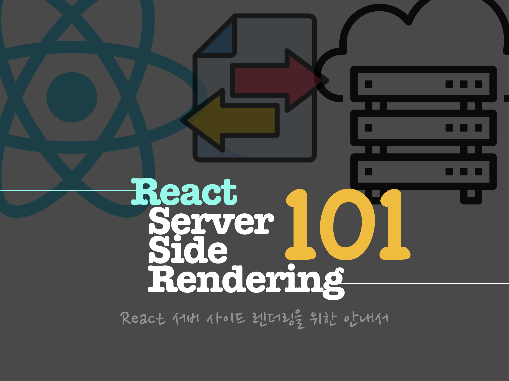

이 튜토리얼은 React에 ServerSideRendering, 그리고 Code Splitting을 적용하는 과정을 소개합니다.

> 모든 코드는 [GitHub](https://github.com/soYoung210/react-ssr-code-splitting) 에 있으니 **각 단계별 branch에서 코드를 살펴보세요!**

React에 SSR을 도입한다면, [Next.js](https://nextjs.org/)도 좋은 선택일 수 있습니다. 하지만, 이 글은 프레임워크가 아닌 순수하게 React에 CodeSplitting과 SSR을 얹어가는 과정을 다룹니다.

이 시리즈는 다음 버전을 기반으로 작성되었습니다.

```json
{
  "typescript": "3.6.2",
  "@loadable/component": "5.10.3",
  "@loadable/server": "5.10.3",
  "react": "16.8.6",
  "react-router-config": "5.1.1",
  "react-router-dom": "5.0.1",
  "redux": "4.0.4",
  "redux-observable": "1.1.0"
}
```

## Table of Contents

### [1. Code Splitting](https://so-so.dev/react/ssr-1-codesplitting/)

- 라이브러리 선택
- Template HTML설정
- Config설정
- View코드 작성
- 몇 가지 생각

### [2. SSR - Basic](https://so-so.dev/react/ssr-2-ssr---basic/)

- 구조 정리
- server에서 Rendering
- 확인

### [3. SSR - Data Fetch](https://so-so.dev/react/ssr-3-ssr-data-fetch/)

- react-router-config로의 변경
- server/app.tsx 수정
- Client에 초기 store값 전달
- Server에서 받아온 데이터를 이용해서 Store초기화 하기

### [4. UX관점에서의 SSR](https://so-so.dev/react/ssr-4-ux-ssr/)

- 사용자 관점
- 단점만 있는 것은 아니다.
- 이 튜토리얼을 끝마치며
