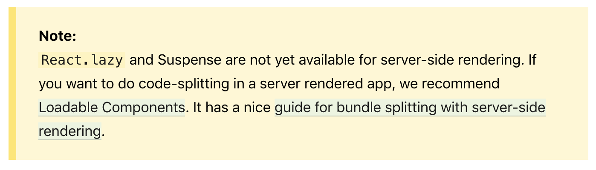
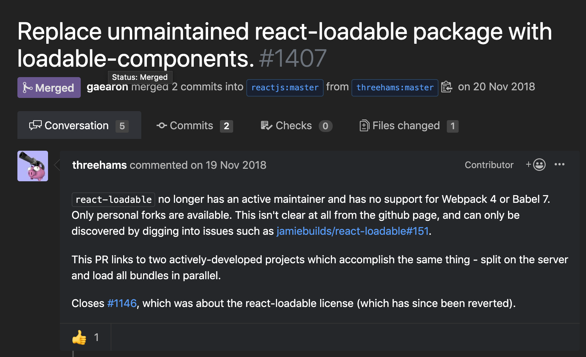
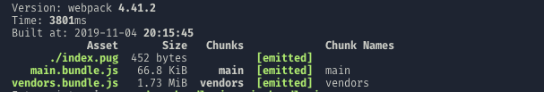
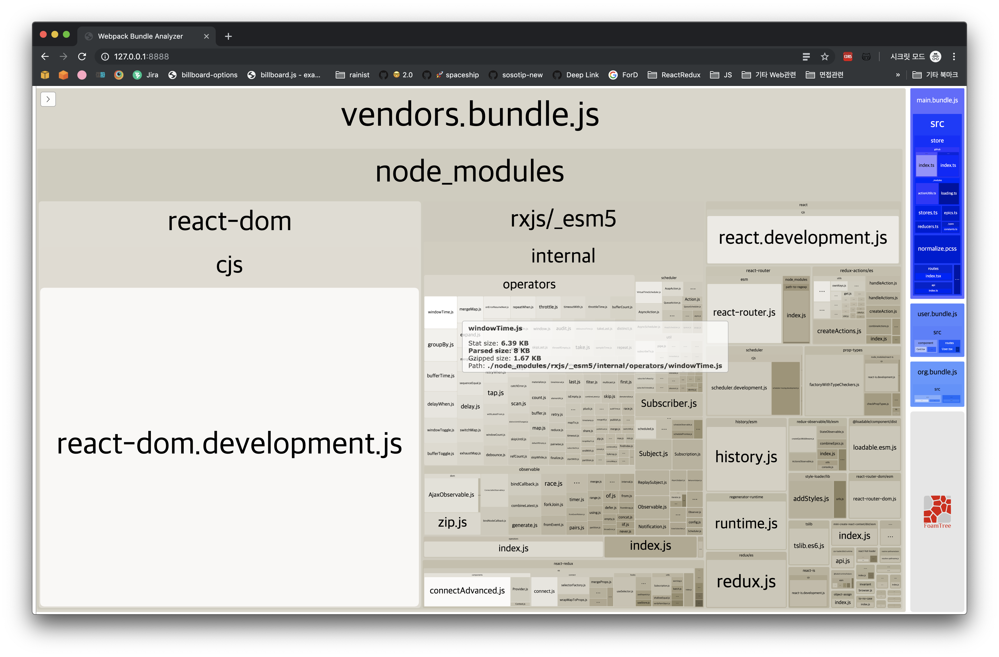
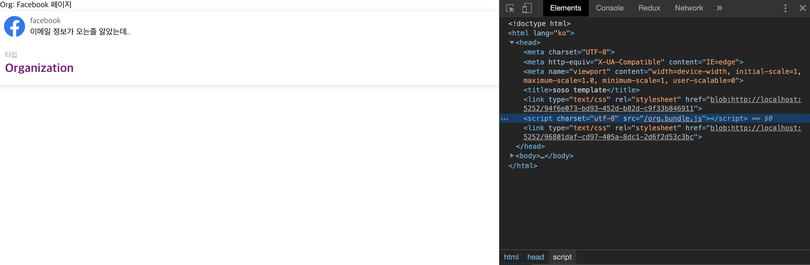
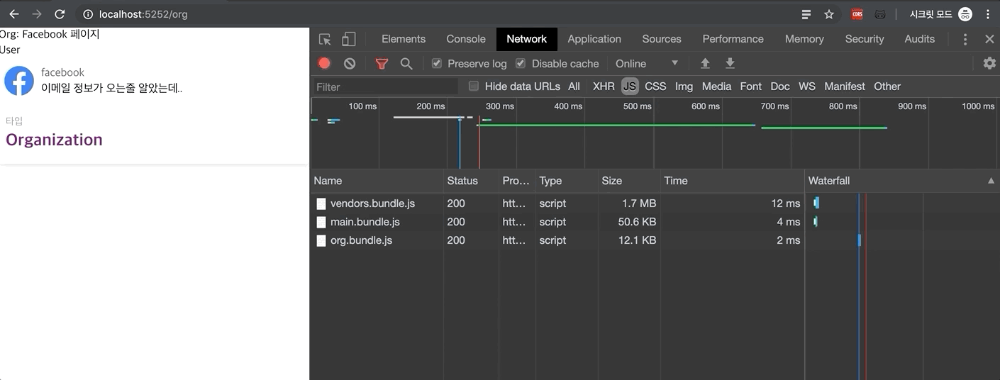
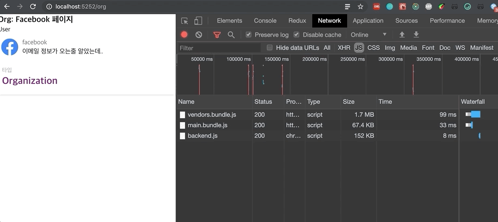
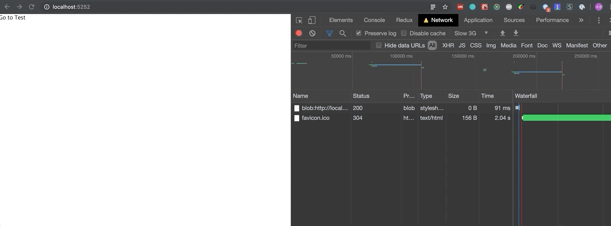
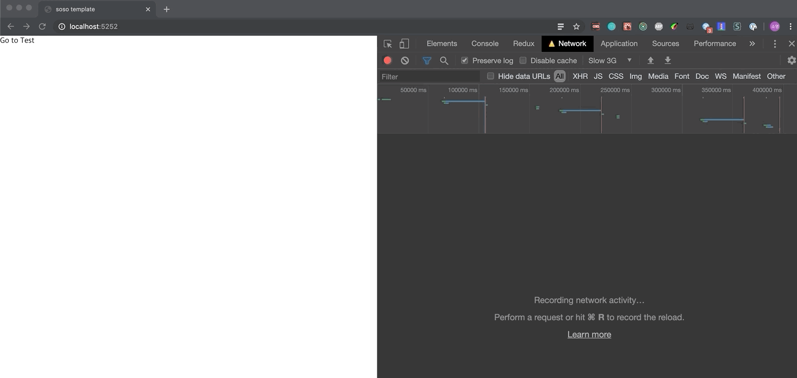

> ⚠️ This picks up right where the [master branch](https://github.com/soYoung210/react-ssr-code-splitting) leaves off, so I won't re-explain anything already covered there. Got questions? Drop them in the comments!

React [supports](https://reactjs.org/docs/code-splitting.html) code splitting right out of the box.


 **But** the built-in `lazy` reportedly doesn't play well with SSR, so let's drop it without much ceremony and go find something else.

## 📝 Choosing a library

A handful of libraries handle this for SSR.

### 1. [react-loadable](https://github.com/jamiebuilds/react-loadable)

This one used to be everywhere. Search for SSR articles and you'll still find more built around react-loadable than around the library I'll cover next.
But, apparently over [an issue like this](https://velog.io/@velopert/nomore-react-loadable), it's since dropped out of React's official docs, and the repo has its issues closed and isn't seeing much active maintenance.


### 2. [@loadable/components](https://github.com/smooth-code/loadable-components)

This is what stepped in once react-loadable dropped off React's official docs.
Its [documentation](https://www.smooth-code.com/open-source/loadable-components/docs/getting-started/) does a really good job.
> This is the library this tutorial actually uses.

### 3. [react-universal component](https://github.com/faceyspacey/react-universal-component)

Another library that shows up a lot in React SSR setups. It covers a lot of ground feature-wise, but I didn't go with it here.

## 🕸 Setting up a template html

A real project might use a templating engine like pug or ejs instead of plain html. So how does Code Splitting fit into that picture?

Splitting code means the bundle itself gets split, so how do you actually tell each page which bundle.js it needs?  

### HtmlWebpackPlugin
[HtmlWebpackPlugin](https://webpack.js.org/plugins/html-webpack-plugin/) auto-generates an html file wired up with your bundled js. Depending on how it's configured, it can spit out a brand-new html file, or take an existing one as a template and layer new content on top.
Here, `server/views/index.pug` is the base template.
```js {3,6}
// 🌏 webpack.config.js
new HtmlWebpackPlugin({
  template: pathResolve(__dirname,'../server/views/index.pug'),
  filename: './index.pug'
}),
new HtmlWebpackPugPlugin()
```
There's a lot more it can do, but for now I've only set which template to use and what the output file gets named.

I also threw in [html-webpack-pug-plugin](https://www.npmjs.com/package/html-webpack-pug-plugin), which handles the conversion into `pug` syntax automatically.


The client build now drops `index.pug` into the static folder. Whenever a split route gets requested, its bundle gets injected into that pug file as a script tag.

### ♻️ Setting up the config


First up: install what the project needs, and get webpack and babel configured.

#### 1. Install `@loadable/component`.
```bash
npm i @loadable/component

// if typescript,
npm i -D @types/loadable__component
```

#### 2. Set up the dynamic import loader
Dynamic import syntax isn't standardized yet, so we need [@babel/plugin-syntax-dynamic-import](https://www.npmjs.com/package/@babel/plugin-syntax-dynamic-import) installed, plus a small edit to `.babelrc`.
```bash
npm install --save-dev @babel/plugin-syntax-dynamic-import
```
```js {6}
{
  "presets": [
    //🍱 presets
  ],
  "plugins": [
    "@babel/plugin-syntax-dynamic-import",
    //🥟 other plugins
  ]
}
```

#### 3. Set up chunk names
It helps to give the chunks Code Splitting produces names we can actually recognize, so let's tweak the webpack config a bit.
```js {7}
// 🌏 webpack.config.js
module.exports = (env, options) => {
  const config = {
    entry: [startFileName],
    output: {
      filename: '[name].bundle.js',
      chunkFilename: '[name].bundle.js',
      //other settings
    },
	}
}
```

### View 
Config's done. Time to actually split some code.

#### 1. Switch the component being split over to `export default`. 
```tsx
// As-is
export const OrgComponent = () => {
	// ..
}

// To-be
export default () => {
 // ..
}
```

#### 2. Switch how it's imported over to `loadable`. 
```tsx
// As-is
import { OrgComponent } from './Org';

// To-be
const OrgComponent = loadable(() => import(/* webpackChunkName: "org"*/ './Org'))
```

That's the split done. You can confirm it with `bundle Analyzer` or the chrome inspector.


Pop open the bundle Analyzer, and there's `org.bundle.js` sitting on the right, freshly generated.

 

Hit the `/org` page with splitting applied, and sure enough, it's requesting `org.bundle.js`.

### 🤔 A few thoughts 
Is Code Splitting always a win? Honestly, not necessarily.
So what does this project's total client bundle size even look like?

For a localhost setup, it's not bad at all.

The approach above gives us Route Based Code Splitting. Here's what actually happens in the browser as each page gets requested:

Navigate from `/org` to `/user`, and there's an extra request for `user.bundle.js`. Makes sense: the code is split, so visiting the user page pulls in exactly the bundle it needs.

Without splitting, on the other hand, changing routes doesn't trigger any extra js load at all.
> That flicker you see is just JS parsing. 


Ignore this trade-off and split everything just because you can, and you can actually end up hurting UX. The first page load gets faster, sure, but now every route change afterward has to fetch more js. 

Split something small enough, and the cost of the network request itself (DNS resolution, the SSL handshake, download time, and so on) can outweigh whatever Code Splitting was supposed to buy you. 

As a worst-case test, here's a page containing nothing but the text `Hello I'm TEST`, loaded with Code Splitting on, then off.

#### With Code Splitting applied

Measured on Slow 3G. The bundle needed to render `/Test` wasn't there on first load, so it had to go fetch `test.bundle.js` separately, and that takes a noticeably long time.

#### Without Code Splitting

Even on Slow 3G, `/Test` renders almost instantly here. The bundle it needs already came down with the first page load, so there's no extra network request standing in the way. 

#### Takeaways
There's no silver bullet here. Figuring out what to split means actually looking at a bundle analyzer like WebpackBundleAnalyzer and splitting things where it makes sense, not everywhere.

The full code for this tutorial is up [here](https://github.com/SoYoung210/react-ssr-code-splitting/pull/1).

## References 
[The oddly (?) entertaining story of react-loadable disappearing from the React manual](https://velog.io/@velopert/nomore-react-loadable)
https://itnext.io/tips-tricks-for-smaller-bundles-in-react-apps-58d1b20c9c0
