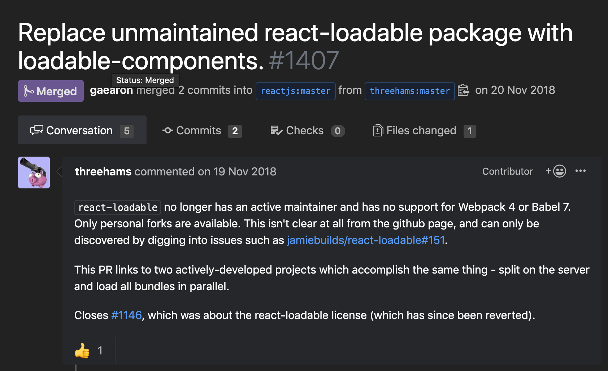
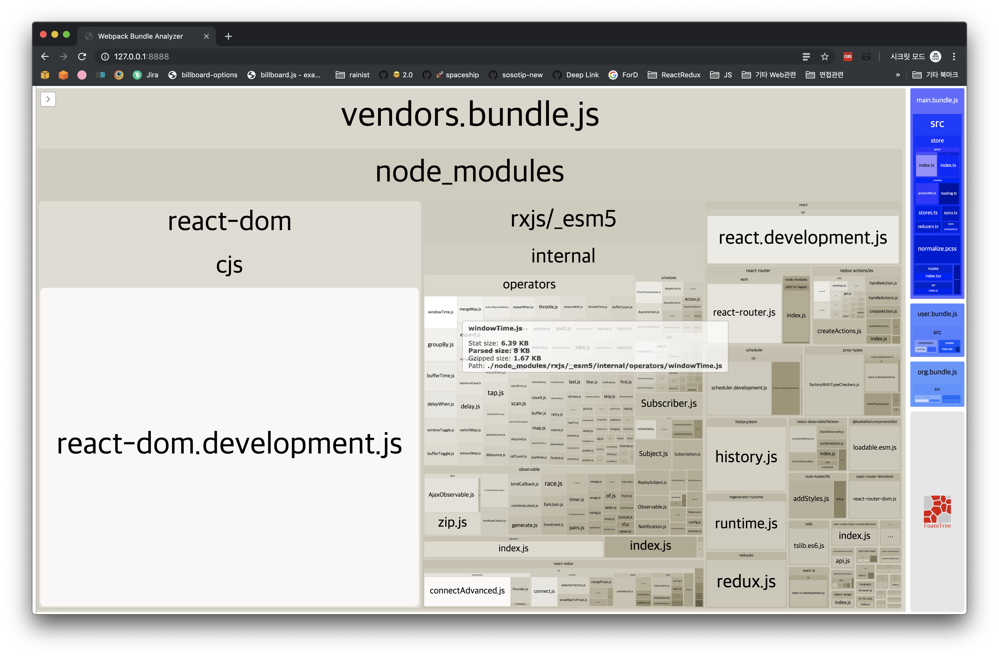
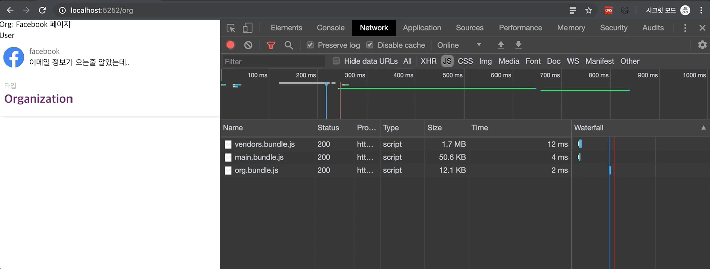
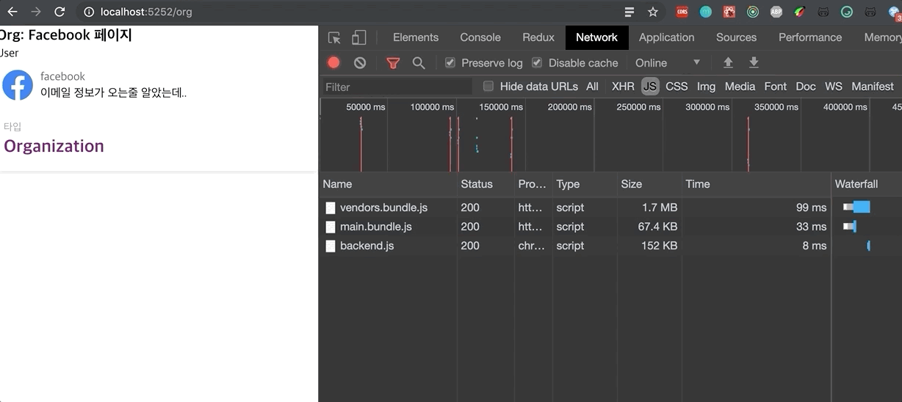
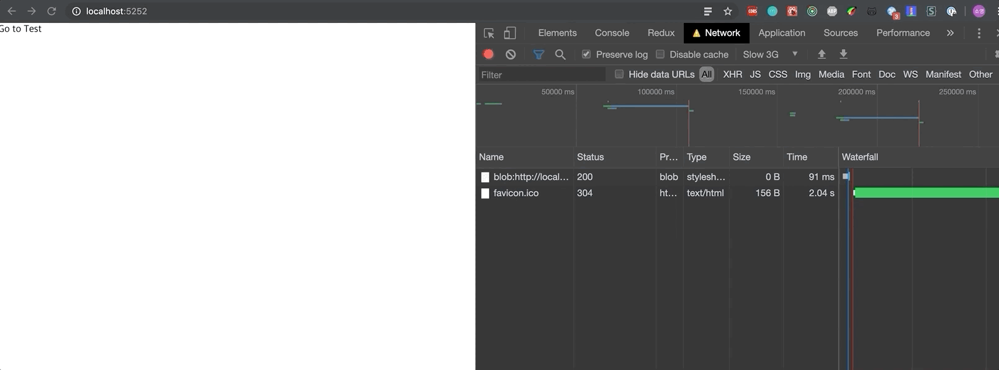

> ⚠️ 이 내용은 [master 브랜치](https://github.com/soYoung210/react-ssr-code-splitting)에서 이어지는 내용입니다. master브랜치의 내용은 따로 설명을 적지 않습니다. 혹시 궁금하신 점이 있으시다면 댓글로 남겨주세요! 

Code Splitting은 기본적으로 React에서 [지원](https://reactjs.org/docs/code-splitting.html)하고 있습니다.


 **하지만** 기본적으로 제공하는 lazy는 SSR을 지원하고 있지 않다고 하니, 과감히 포기하고 다른 도구를 찾아봅니다. 

## 📝 라이브러리 선택

선택할 수 있는 SSR용 라이브러리는 몇 가지 있습니다.

### 1. [react-loadable](https://github.com/jamiebuilds/react-loadable)

과거에 많이 사용했던 라이브러리가 되었습니다. SSR관련 아티클을 검색해보면 2번에서 소개할 라이브러리보다 react-loadable로 구성된 아티클이 많습니다. 
하지만, [이런 이슈](https://velog.io/@velopert/nomore-react-loadable)때문인지 react공식문서에서도 사라졌고 저장소는 Issue도 닫고 유지보수도 적극적으로 이루어지고 있지 않습니다. 


### 2. [@loadable/components](https://github.com/smooth-code/loadable-components)

react-loadable이 React공식문서에서 빠질 때, 그 자리를 대체하게 된 라이브러리입니다.
[공식문서](https://www.smooth-code.com/open-source/loadable-components/docs/getting-started/)가 굉장히 잘 지원되어 있습니다.
> 이 튜토리얼에서 사용하는 라이브러리입니다.

### 3. [react-universal component](https://github.com/faceyspacey/react-universal-component)

react ssr에서 많이 사용되는 또 하나의 라이브러리입니다. 다양한 기능을 지원하고 있으나 본 튜토리얼에서는 선택하지 않았습니다. 

## 🕸 Template html설정

실제 프로젝트에서는 html이 아닌, pug나 ejs등 template html을 사용할 수 도 있습니다. 이 경우 Code Splitting을 어떻게 적용해야 할까요?

Code Splitting을 한다는 것은 bundle이 나눠진다는 뜻인데, 어떤 페이지에서 어떤 bundle.js가 필요한지 어떻게 작성할 수 있을까요?  

### HtmlWebpackPlugin
[HtmlWebpackPlugin](https://webpack.js.org/plugins/html-webpack-plugin/)은 번들 js파일을 가지고 있는 html 파일을 자동으로 생성해 주는 plugin입니다. 설정에 따라 새로운 html 파일을 생성할 수도 있고 기존의 html을 템플릿으로 하여 내용이 추가 된 html 파일을 생성 할 수도 있습니다.
이 프로젝트에서는 `server/views/index.pug` 파일을 기본 template으로 사용하고 있습니다. 
```js{3,6}
// 🌏 webpack.config.js
new HtmlWebpackPlugin({
  template: pathResolve(__dirname,'../server/views/index.pug'),
  filename: './index.pug'
}),
new HtmlWebpackPugPlugin()
```
다양한 옵션들이 있지만 지금은 어떤 template을 사용할 것인지, 그리고 output파일이 어떤 이름으로 생성될지만 적어주었습니다.

`pug`문법으로 자동으로 변환해주는 [html-webpack-pug-plugin](https://www.npmjs.com/package/html-webpack-pug-plugin)도 추가해주었습니다.


client에서의 build결과물로 static폴더내에 `index.pug`가 생성되었습니다. Splitting된 Route요청 시 해당 bundle이 pug에 script tag로 추가됩니다. 

### ♻️ Config 설정


먼저, 프로젝트에 필요한 디펜던시를 설치하고, webpack과 babel설정을 먼저 잡아줍니다.

#### 1. `@loadable/component`를 설치해줍시다. 
```bash
npm i @loadable/component

// if typescript,
npm i -D @types/loadable__component
```

#### 2. dynamic import 로더 설정 
아직 표준이 아닌 dynamic import syntax를 사용하기 위해 [@babel/plugin-syntax-dynamic-import](https://www.npmjs.com/package/@babel/plugin-syntax-dynamic-import)를 설치해주고 `.bablerc` 내용도 수정해 줍니다. 
```bash
npm install --save-dev @babel/plugin-syntax-dynamic-import
```
```js{6}
{
  "presets": [
    //🍱 preset들 
  ],
  "plugins": [
    "@babel/plugin-syntax-dynamic-import",
    //🥟 다른 plugin들
  ]
}
```

#### 3. Chunk Name 설정하기
CodeSplitting으로 chunk될 bundle JS에 우리가 알아보기 쉬운 이름이 붙으면 좋으니, webpack설정도 살짝 추가해 줍니다. 
```js{7}
// 🌏 webpack.config.js
module.exports = (env, options) => {
  const config = {
    entry: [시작file이름],
    output: {
      filename: '[name].bundle.js',
      chunkFilename: '[name].bundle.js',
      //다른 설정들
    },
	}
}
```

### View 
이제 기본 설정을 완료했으니 실제 Code Splitting을 진행해 봅시다.

#### 1. CodeSplitting으로 나눠질 컴포넌트를 `export default` 로 변경합니다. 
```tsx
// As-is
export const OrgComponent = () => {
	// ..
}

// To-be
export default () => {
 // ..
}
```

#### 2. 컴포넌트 import 방식을  `loadable` 로 변경합니다. 
```tsx
// As-is
import { OrgComponent } from './Org';

// To-be
const OrgComponent = loadable(() => import(/* webpackChunkName: "org"*/ './Org'))
```

코드 스플리팅 작업이 완료되었습니다. 결과는 `bundle Analyzer`와 chrome inspector를 통해 확인할 수 있습니다. 


bundle Anaylzyer를 보면, 오른쪽에 `org.bundle.js`가 생성된것을 확인할 수 있습니다. 

 

코드스플리팅을 적용한 `/org` 페이지에 접근해보면,  `org.bundle.js`를 요청하도록 되어 있는것을 확인할 수 있습니다. 

### 🤔 몇 가지 생각 
Code Splitting은 항상 좋을까요? 사실은, 그렇지 않을 수도 있습니다. 
이 프로젝트에서 client의 전체 bundle size는 어떨까요?

localhost환경임을 감안하면, 그렇게 크지 않은 것 같습니다. 

위의 방법으로 Route Based Code Splitting을 진행했습니다. 브라우저에서 각 페이지 요청 시 일어날 일들을 표현하면 다음과 같습니다. 

`/org` 에서 `/user` 로 route 이동시 추가적으로 `user.bundle.js`를 요청하는 것을 볼 수 있습니다. 당연히, Code가 분할되었기 때문이고 이로인해 user페이지 접근시 필요한 bundle js를 요청하는 것입니다. 

반대로, splitting을 적용하지 않으면 route변경시에 추가적인 js를 로드하지 않는 것을 볼 수 있습니다.
> 깜빡임은 JS Parsing으로 인한 것입니다. 


Code Splitting에서 이러한 사실을 간과하고 무작정 나누기만 하는 것은 오히려 UX를 안좋게 하는 방향일 수 있습니다. 초기 페이지 load는 빨라질 수 있으나 이후 route변경에서 js를 추가적으로 Load해야하기 때문입니다. 

굉장히 작은 컴포넌트를 splitting할 경우 네트워크 요청에 드는 비용(DNS Resolve, SSL handShake, download time, etc.)이 Code Splitting의 장점을 능가할 수 있습니다. 

극단적으로, `Hello I'm TEST`라는 글자만 포함하고 있는 페이지를 로드하는 상황을 Code Splitting을 적용한 경우와 그렇지 않은 경우로 나누어 보았습니다.

#### Code Splitting 적용

Slow3G환경에서 측정했습니다. 첫 페이지 로드 시 `/Test`를 그리는데에 필요한 번들을 받아오지 않았으므로 `test.bundle.js`를 추가적으로 요청했고, 시간이 굉장히 오래 걸리는 것을 볼 수 있습니다.

#### Code Splitting 적용 X

Slow3G를 적용했음에도 `/Test`페이지가 빠르게 렌더되는 것을 볼 수 있습니다. 첫 페이지 로드시에 Test페이지를 그리는데에 필요한 번들까지 가져온 상태이므로, 추가적인 네트워크 요청 없이 페이지를 보여줄 수 있는 것입니다. 

#### 정리
Silver Bullet은 없습니다. 어떤 것을 분할해야 하는지는 WebpackBundleAnalyzer등의 번들 분석기를 보면서 ‘적절히’ 나누는 것이 필요합니다.

이 튜토리얼에 대한 전체 코드는 [여기](https://github.com/SoYoung210/react-ssr-code-splitting/pull/1)에서 확인하실 수 있습니다.

## 참고글 
[꽤 재밌었다고 (?) 느꼈던 react-loadable 이 리액트 매뉴얼에서 사라진 이야기](https://velog.io/@velopert/nomore-react-loadable)
https://itnext.io/tips-tricks-for-smaller-bundles-in-react-apps-58d1b20c9c0
